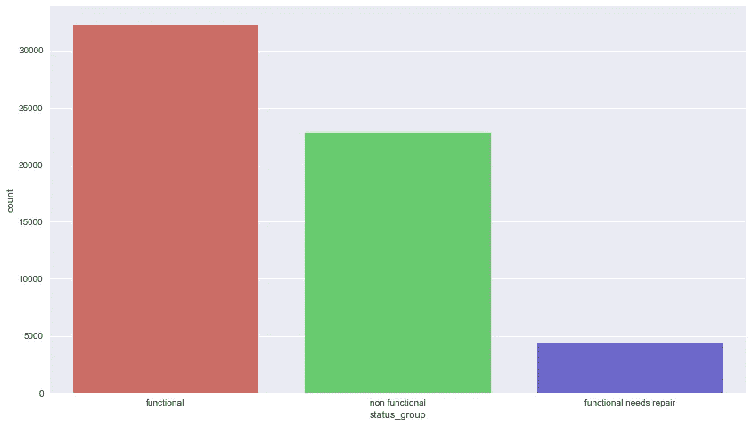

# 黑暗之心:逻辑回归与随机森林

> 原文：<https://towardsdatascience.com/heart-of-darkness-logistic-regression-vs-random-forest-1db7b0aa1711?source=collection_archive---------10----------------------->


从 Lambda 学校开始学习数据科学已经 9 周了。本周的挑战涉及一个多类分类问题，以卡格竞赛的形式呈现，只涉及我们班的学生:DS-1。

我们的任务是结合数字和分类变量来预测坦桑尼亚的哪些水泵有故障:

# 坦桑尼亚水点挑战:


**目标变量:'状态 _ 组'**

1.  功能的

2.功能需求修复

3.无功能

**特征变量**

***数字*** :

身份证明（identification）

金额 _tsh

日期 _ 记录

gps _ 高度

经度

纬度

区域代码

建造年份

建造年份

人口

*:*

*量*

*投资者*

*安装程序*

*wpt_name*

*数量 _ 私有*

*盆地*

*子村*

*地区*

*大于胎龄儿*

*病房*

*公开会议*

*录制者*

*方案 _ 管理*

*方案名称*

*许可证*

*提取类型*

*提取类型组*

*提取类型类*

*管理*

*管理 _ 集团*

*支付*

*付款类型*

*水质*

*质量 _ 组*

*数量 _ 组*

*来源*

*来源类型*

*来源 _ 类别*

*水点类型*

*水点类型组*

*如果有读者想接受挑战，你可以在这里找到所有相关数据:*

1.  *[训练集](https://raw.githubusercontent.com/Captmoonshot/kaggle_waterpumps_2/master/train_features.csv)*

*2.[培训标签](https://raw.githubusercontent.com/Captmoonshot/kaggle_waterpumps_2/master/train_labels.csv)*

*3.[测试设置](https://raw.githubusercontent.com/Captmoonshot/kaggle_waterpumps_2/master/test_features.csv)*

*训练集有 59400 行和 40 列——在数据科学世界中，这是一个相对较小的数据集，但对于初学者来说仍然是相当大的(在维度方面)。*

*让我们启动 Jupyter 笔记本并加载数据:*

```
*# Our usual trio of importsimport numpy as np
import pandas as pd
import matplotlib.pyplot as plt
%matplotlib inlinedf_train = pd.read_csv('train_features.csv')
df_test = pd.read_csv('test_features.csv')
train_labels = pd.read_csv('train_labels.csv')df_train.head()*
```

**

*作为 Kaggle 挑战赛的参赛者，需要记住和做的最重要的事情之一是清理包括训练集和测试集在内的数据集。主要流程如下:*

1.  *使用我们的一个奇怪的技巧连接训练集和测试集。*
2.  *清理数据:丢弃 NaNs、插值、创建新变量等。*
3.  *拆分训练集和测试集*
4.  *在训练集上训练你选择的机器学习模型*
5.  *对您之前分离出来的测试集进行预测*

*现在我们的**一招**:*

```
*df_train['training_set'] = True
df_test['training_set'] = Falsedf_full = pd.concat([df_train, df_test])df_full.shape*
```

*组合数据集(df_full)应该有 73758 行和 41 列，其中包括我们刚刚创建的“training_set”列。我们这样做的原因是为了确保模型被训练的数据在**形式**中与测试集相同。否则，如果测试集在某些方面与训练集不同，例如逻辑的系数就没有意义，更不用说预测了。由于很难跟踪我们对训练集所做的一切，我们不妨一石二鸟，从而保证它们的相同性质。*

*我将在这个集合上使用逻辑回归和随机森林分类器，但在此之前，我们还需要考虑其他一些事情。*

> *我并不惊讶…*

*内特·迪亚兹*

*有时生活给你正确的彩票号码，有时给你柠檬。但是当生活感觉像虐待狂时，它会给你坦桑尼亚水点挑战。让这一挑战变得格外严峻的是不平衡的数据:*

```
*train_labels['status_group'].value_counts(normalize=True)*
```

**

```
*import seaborn as snsfig, ax = plt.subplots(figsize=(14, 8))
sns.countplot(x='status_group', data=train_labels, palette='hls')*
```

**

*目标变量的“功能性需求修复”类别仅占整个集合的 7%左右。这意味着无论你最终使用什么算法，它都可能比这个算法更好地学习其他两个平衡类。这就是数据科学:斗争是真实的。*

## *回到正题*

**

*meme sponsored by fakedoors.com*

*我们要做的第一件事是为 waterpoints 创建一个“年龄”变量，因为这似乎非常相关。*

```
*df_full['date_recorded'] = pd.to_datetime(df_full['date_recorded'])df_full['date_recorded'] = df_full['date_recorded'].dt.year# Replacing the NaN value with the mode - this would turn out to be 
# less effective than I thoughtdf_full['construction_year'] = df_full['construction_year'].replace(0, 1986)df_full['age'] = np.abs(df_full['date_recorded'] - df_full['construction_year'])# We now have an 'age' column indicating the age of the waterpoint #relative to its 'construction_year'*
```

*“人口”变量也具有高度右偏的分布，因此我们也要改变这种情况:*

```
*df_full['population'] = df_full['population'].replace(0, 1)
df_full['population_logged'] = np.log(df_full['population'])*
```

*“amount_tsh”中的零也可能是 NaNs，因此我们将做一些极端的事情，将其简化为 0 和 1:*

```
*amount_tsh_encoded = []for row in df_full['amount_tsh']:
    if row == 0:
        amount_tsh_encoded.append(0)
    else:
        amount_tsh_encoded.append(1)

df_full['amount_tsh_encoded'] = amount_tsh_encoded# And drop the old variables:df_full.drop(['date_recorded', 'construction_year', 'population',
             'amount_tsh', 'num_private'], axis=1, inplace=True)*
```

*此时，您可以只分离出 df_full 数据帧的数字特征，并通过以下方式对其运行分类器:*

```
*df_full_num = df_full.select_dtypes(include=['number']).copy()*
```

*我们从上周学到的最重要的一点，也是让我记忆犹新的一点，就是尽可能快地提出一个基线模型的想法。我们需要某种参考点来迭代我们的模型性能。因此，对于像我们这样的分类问题，我们可以使用我们的主要类别“功能”作为我们的基线。*

*重要的是要记住，只有当机器学习模型能够在预测方面击败多数分类器时，它才能开始提供优于人类学习的好处。*

*如果我们在 df_full_num 上运行逻辑回归，我们应该得到大约 54%的准确率，这是多数类给我们的。*

*此时对我来说最重要的是不要气馁。*

*接下来，我们将只研究分类变量。对于大多数分类特征，我们将采取极端简化的步骤，将它们转换成二进制变量。因为它们中的许多包含一个占主导地位的类别，其余的只占总数的一小部分…本质上是一种长尾分布。*

```
*df_full['funder'] = df_full['funder'].fillna(df_full['funder'].mode()[0])
df_full['subvillage'] = df_full['subvillage'].fillna(df_full['subvillage'].mode()[0])
df_full['public_meeting'] = df_full['public_meeting'].fillna(df_full['public_meeting'].mode()[0])
df_full['permit'].fillna(df_full['permit'].describe().top, inplace=True)*
```

*简化分类变量的例子:*

```
*funder_cleaned = []for row in df_full['funder']:
    if row == 'Government Of Tanzania':
        funder_cleaned.append('Tanzania')
    else:
        funder_cleaned.append('Other')

df_full['funder_cleaned'] = funder_cleaned*
```

*我们对几乎每一个分类特征都做同样的事情。*

```
*installer_cleaned = []for row in df_full['installer']:
    if row == 'DWE':
        installer_cleaned.append('DWE')
    else:
        installer_cleaned.append('Other')

df_full['installer_cleaned'] = installer_cleanedscheme_management_cleaned = []for row in df_full['scheme_management']:
    if row == 'VWC':
        scheme_management_cleaned.append('VWC')
    else:
        scheme_management_cleaned.append('Other')

df_full['scheme_management_cleaned'] = scheme_management_cleanedextraction_type_cleaned = []for row in df_full['extraction_type']:
    if row == 'gravity':
        extraction_type_cleaned.append('gravity')
    else:
        extraction_type_cleaned.append('other')

df_full['extraction_type_cleaned'] = extraction_type_cleanedmanagement_cleaned = []for row in df_full['management']:
    if row == 'vwc':
        management_cleaned.append('vwc')
    else:
        management_cleaned.append('other')

df_full['management_cleaned'] = management_cleanedmanagement_group_cleaned = []for row in df_full['management_group']:
    if row == 'user-group':
        management_group_cleaned.append('user-group')
    else:
        management_group_cleaned.append('other')

df_full['management_group_cleaned'] = management_group_cleanedpayment_cleaned = []for row in df_full['payment']:
    if row == 'never pay':
        payment_cleaned.append('never pay')
    else:
        payment_cleaned.append('other')

df_full['payment_cleaned'] = payment_cleaned # I'm going to skip the other variables for the sake of staying #awake*
```

*在这个漫长过程的最后，我们必须放弃我们的旧变量:*

```
*drop_list = ['wpt_name', 'basin', 'subvillage', 'funder',
             'installer', 'scheme_management', 'permit', 'public_meeting',
             'lga', 'ward', 'recorded_by', 'region', 'scheme_name', 'extraction_type',
             'extraction_type_group', 'extraction_type_class', 'management',
             'management_group','payment', 'payment_type', 'water_quality',
             'quality_group', 'quantity', 'quantity_group','source', 'source_class',
             'source_type', 'waterpoint_type', 'waterpoint_type_group']df_full.drop(drop_list, axis=1, inplace=True)*
```

*现在我们可以把它们变成虚拟变量。虽然大多数其他人可能会选择使用某种类别编码器，但这些变量不是有序的——这意味着，例如，重力的“提取类型”和其他类型的提取之间没有内在的可测量的距离。虽然它可能不会在预测方面产生很大的差异，但我相信如果我们出于分析原因使用逻辑回归，它会产生很大的差异。换句话说，从序数拟合中学习到的系数可能是不同的。*

*我们用熊猫做假人:*

```
*dummy_columns=['funder_cleaned', 'installer_cleaned', 'scheme_management_cleaned', 'extraction_type_cleaned',
        'management_cleaned', 'management_group_cleaned', 'payment_cleaned', 'water_quality_cleaned',
        'quality_group_cleaned', 'quantity_cleaned', 'source_cleaned', 'source_class_cleaned',
        'waterpoint_type_cleaned']print("Original Features:\n", list(df_full.columns), "\n")
df_full_dummies = pd.get_dummies(df_full, columns=dummy_columns)
print("Features after get_dummies: \n", list(df_full_dummies.columns))*
```

**

*既然已经对数据进行了预处理，让我们使用之前创建的“training_set”布尔列来分离训练集和测试集。然后，我们可以在训练集上训练模型，并在测试集上进行预测。*

```
*df_train = df_full_dummies[df_full_dummies['training_set'] == True]df_train = df_train.drop('training_set', axis=1)df_test = df_full_dummies[df_full_dummies['training_set'] == False]df_test = df_test.drop('training_set', axis=1)*
```

*在这一点上我感觉很好。我觉得很有成就感。我觉得自己像终结者。事实上，我想走到杂货店里的某个陌生人面前，问他:*

**

*Globo Gym wins again*

*在所有这些工作之后，我只能取得大约 10%的进步:*

```
*from sklearn.linear_model import LogisticRegression
from sklearn.model_selection import train_test_split
from sklearn.model_selection import cross_val_scoreX = df_train.drop(['id', 'status_group'], axis=1)
y = df_train['status_group']X_train, X_test, y_train, y_test = train_test_split(X, y, random_state=42)lr = LogisticRegression(C=100).fit(X_train, y_train)
scores = cross_val_score(lr, X, y, cv=5) # Cross-validating the model on the whole datasety_pred = lr.predict(X_test)print("CV scores: {}".format(scores))
print("CV scores mean: {}".format(scores.mean()))CV scores: [0.66315967 0.65970878 0.66271044 0.67020202 0.66635797]
CV scores mean: 0.6644277752104382*
```

*然而，随机森林分类器做得更好，这是我最终用来对测试集进行预测的:*

```
*from sklearn.ensemble import RandomForestClassifier
from sklearn.model_selection import train_test_split
from sklearn.model_selection import cross_val_scoreX = df_train.drop(['id', 'status_group'], axis=1)
y = df_train['status_group']X_train, X_test, y_train, y_test = train_test_split(X, y, random_state=42)rf = RandomForestClassifier(n_estimators=100, min_samples_leaf=3).fit(X_train, y_train)
scores = cross_val_score(rf, X, y, cv=5)scores = [0.78444575 0.78318323 0.78265993 0.7787037  0.7797609 ]*
```

*Kaggle 竞赛需要记住的另一件事是，您的提交材料必须采用正确的格式:*

```
*X_test = df_test.drop('id', axis=1)final_preds = rf.predict(X_test)kaggle_baseline_submission_7 = pd.DataFrame({'id': df_test.id, 'status_group': final_preds})kaggle_baseline_submission_7.head()*
```

*现在你知道了。通过一些工作，我能够在数据上训练两个分类器，对变量进行特征工程，进行预测并提交准确性评分。然而，对整个过程有一种根深蒂固的不满(因此有了过于戏剧性的“黑暗之心”的标题)。*

*虽然随机森林在预测什么可能是错误的水点方面比逻辑回归“更好”，但我们仍然没有比我们在机器学习模型之前开始的时候更好地理解这个人为问题。*

*例如，我们可以找出拟合的随机森林模型的特征重要性，并将其绘制如下:*

```
*plt.style.use('seaborn')
#fig, ax = plt.subplot(figsize=(12, 8))
feats = {}
for feature, importance in zip(feature_names, rf.feature_importances_):
    feats[feature] = importance

importances = pd.DataFrame.from_dict(feats, orient='index').rename(columns={0: 'Gini-importance'})importances.sort_values(by='Gini-importance').plot(kind='bar', rot=90, figsize=(20, 20))*
```

**

*但是这些特征的重要性并不一定被解释为有助于做出预测或者允许我们分析问题。这些特征的重要性只在模型中是重要的，因为它们是如何对作为一个整体的决策树的决策起作用的。如果我们观察这个图，绝对没有理由相信错误的供水点的问题与“经度”和“纬度”有任何关系。*

*此外，我仍然坚信，如果我们以正确的方式对数据进行特征设计，逻辑回归仍然是更好预测的关键。*

*然而，逻辑回归的可取之处在于，它允许我们查看系数，并计算出它们实际上如何影响功能和非功能水点:*

**

```
*Red = Non-Functional
Blue = Functional
Green = Functional Needs Repair*
```

*上面的图是通过训练一个模型得到的，该模型具有一组修改过的标签，这些标签仅由两类组成:功能性和非功能性，而不是三类。我用这种方法来解决不平衡数据的问题。此外，特征 coord_cluster_1、coord_cluster_2 和 coor_cluster_3 是通过用 n=3 的 KMeans 聚类拟合纬度和经度数字来创建的，以便尝试提取某种更有意义的信息:*

```
*# extract the longitude and latitude values
long_lat = df_full[['longitude', 'latitude']].valuesfrom sklearn.cluster import KMeanskmeans = KMeans(n_clusters=3)
kmeans.fit(long_lat)print("cluster memberships:\n{}".format(kmeans.labels_[:25]))coord_cluster = kmeans.labels_
df_full['coord_cluster'] = coord_cluster*
```

*输出:*

```
*cluster memberships:
[2 0 0 2 0 2 0 0 0 0 2 2 0 0 0 2 2 2 0 2 2 1 2 0 0]*
```

*虽然 k 均值聚类确实提供了比之前的逻辑回归中的纬度或经度更多的信息，但它仍然没有产生足够的信息来制作顶部系数。*

***功能用水点相对于非功能用水点的前四大影响因素**:*

```
*1\. waterpoint_type: **handpump**
2\. water_source: **spring**
3\. quantity: **enough**
4\. extraction_type: **gravity***
```

*这些系数的重要之处在于，它们几乎与[专家](https://www.theguardian.com/society/katineblog/2008/feb/25/waterdebatedoboreholeswork)在非洲讨论这个问题时所说的完全一致。*

*例如，供水点故障的一个根本原因是社区缺乏修理供水点故障的机制。从设计上来说，手泵比许多其他类型的供水点更简单，并且不需要机械的持续维护。因此，手泵抽取类型在模型中具有单一的最高系数。同样的事情也可以说是关于引力的提取。因为它们不需要电动泵之类的东西，所以显然需要更少的维护。另一个看似显而易见的解释变量是水量:水量越大，我们就越有可能拥有一个正常运作的供水点。*

*总之，尽管我没有赢得 Kaggle 挑战赛，尽管随机森林表现得更好，但我仍然相信，解决这类问题的合适的机器学习算法是逻辑回归。逻辑回归给了我们随机森林永远无法提供的东西:对企业和政府管理人员的解释，他们可以回头尝试实施解决方案。*

***吸取教训**:*

1.  *寻求帮助:在 Lambda，我们有一个 20 分钟的规则，如果我们自己仍然不能解决问题，我们会寻求帮助。我打破了这个规则，决定耍流氓，并为此付出了大量浪费时间清理没有任何有价值信息的数据。*
2.  *数据科学是我做过的最难的事情之一。虽然结果可能令人沮丧，但大多数情况下，这是一个通过实践和失败反复学习的过程。我很高兴能成为 Lambda 学校的一员。*

*你可以在这里找到 Jupyter 笔记本版本。*