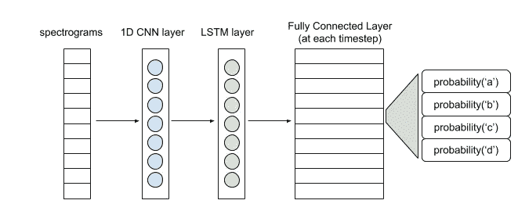
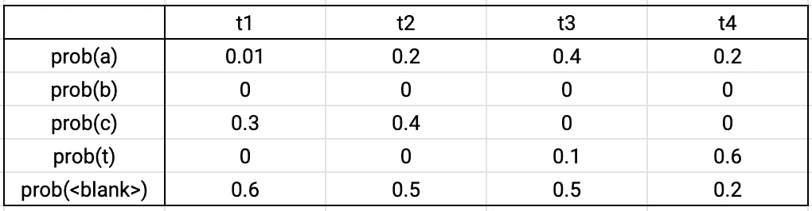

# 语音识别中的 Hello World

> 原文：<https://towardsdatascience.com/hello-world-in-speech-recognition-b2f43b6c5871?source=collection_archive---------14----------------------->

## Tensorflow 中的端到端 ASR 分解

本博客将帮助您使用 Tensorflow 编写一个基本的端到端 ASR 系统。我将检查一个最小的神经网络和一个前缀束搜索解码器的每个组件，它需要从音频生成一个可读的抄本。我遇到了很多关于围绕计算机视觉和自然语言处理任务构建基本机器学习系统的资源，但在语音识别方面却很少。这是一个尝试，以填补这一空白，并使这一领域不那么令人生畏的初学者。

## 先决条件

熟悉:

*   神经网络的组件
*   训练神经网络
*   使用语言模型获得单词序列的概率

## **概述**

*   **音频预处理:**将原始音频转换成数字特征，作为神经网络的输入
*   **神经网络:**一个简单的架构，用于将音频特征转换成抄本中可能字符的概率分布
*   **CTC 损失:**计算损失，而不用相应的字符标注音频的每个时间步长
*   **解码:**使用前缀束搜索和语言模型从每个时间步长的概率分布创建抄本

我将重点介绍神经网络、CTC 损失和解码部分。

## **音频预处理**

你需要把你的音频转换成一个特征矩阵，然后输入到你的神经网络中。一个简单的方法是创建光谱图。

这个函数计算音频信号的短时傅立叶变换，然后计算功率谱。输出是一个称为声谱图的矩阵。你可以直接用这个作为你的输入。其他替代方法是滤波器组和 MFCCs。音频预处理本身就是一个完整的话题。你可以在这里详细了解[。](https://haythamfayek.com/2016/04/21/speech-processing-for-machine-learning.html)

## **神经网络**

这是一个简单的架构。

Hello World Architecture for Speech Recognition

谱图输入可以被认为是每个时间戳的向量。1D 卷积层从这些向量中提取特征，给你一个特征向量序列，供 LSTM 层处理。对于每个时间步长,(双)LSTM 层的输出被传递到完全连接的层，该层使用 softmax 激活给出该时间步长的角色的概率分布。该网络将用 CTC(连接主义时间分类)损失函数进行训练。在了解整个管道之后，可以随意试验更复杂的模型。

**为什么选择 CTC？**该网络试图预测每个时间步的字符。然而，我们的标签并不是每个时间步的字符，而只是音频的转录。请记住，转录中的每个字符可能跨越多个时间步长。如果你以某种方式标记音频中的每个时间步长，单词 C-A-T 会被理解为 C-C-C-A-A-T-T。每 10 毫秒注释一次音频数据集是不可行的。CTC 解决了这个问题，因为它不需要我们标记每个时间步长。它将上述神经网络的整个输出概率矩阵和相应的文本作为输入，忽略抄本中每个字符的位置和实际偏移量。

## **CTC 损失计算**

Example of the output matrix

假设地面真相标签是猫。在这四个时间步中，像 C-C-A-T，C-A-A-T，C-A-T-T，_-C-A-T，C-A-T-_ 这样的序列都对应于我们的基本真理。我们将通过对所有这些序列的概率求和来计算我们的地面真实的概率。根据输出概率矩阵，通过乘以其字符的概率来计算单个序列的概率。对于上述序列，总概率为 0.0288+0.0144+0.0036+0.0576+0.0012 = 0.1056。损失是这个概率的负对数。损失函数已经在 TensorFlow 中实现。你可以在这里阅读[文件](https://www.tensorflow.org/versions/r2.0/api_docs/python/tf/nn/ctc_loss)。

## **解码**

你从上面的神经网络得到的输出就是 CTC 矩阵。CTC 矩阵给出了每个时间步中字符集中每个字符的概率。我们使用前缀束搜索从这个矩阵中产生有意义的文本。

CTC 矩阵中的字符集除了字母和空格字符之外，还有两个特殊的符号。这些是空白标记和字符串结束标记。

**空白令牌的用途:**CTC 矩阵中的时间步长通常很小。(~10 毫秒)所以口语句子的每个字符跨越多个时间步长。例如，C-A-T 变成了 C-C-C-A-A-T-T。因此，我们折叠了在 CTC 矩阵中突出的所有可能的候选字符串。像搞笑这种 N 应该重复的词呢？两个 Ns 之间的空白标记防止它们折叠成一个，而不在文本中添加任何内容。所以，F-F-U-N-[blank]-N-N - Y 崩成滑稽。

**End-token 的用途:** End-of-string 表示口语句子的结尾。在字符串结束标记之后的时间步长解码不会向候选字符串添加任何内容。

## **程序:**

**初始化**:

*   我们最初有一份候选人名单。它由一个空白字符串组成。该列表还包含在每个时间步中以空白标记结束和以非空白标记结束的候选的概率。空白字符串在时间 0 以空白标记结尾的概率是 1。以非空标记结尾的概率为 0。

**迭代次数:**

*   我们把这个字符串一个接一个地加上每个字符。我们获取形成的每个扩展字符串，并计算其在时间=1 时以空白和非空白标记结束的概率。然后，我们将这些扩展字符串和它们的概率一起存储在我们的列表中。我们把这些新的候选人放入我们的列表，并在下一个时间步重复这个过程。
*   **案例 A:** 如果添加的字符是一个空白标记，我们不改变候选字符。
*   **案例 B:** 如果添加的字符是一个空格，我们按照语言模型用一个与候选概率成比例的数乘以概率。这可以防止不正确的拼写成为最佳候选。所以酷在最终输出中不会被拼写成 KUL。
*   **情况 C:** 如果添加的字符与候选字符的最后一个字符相同。(候选人=好玩。我们创建了两个新的候选人，FUNN 和 FUN。乐趣的概率是根据以空白代币结束的乐趣的概率来计算的。FUNN 的概率是使用非空令牌中 FUN 结束的概率来计算的。因此，如果乐趣不以空白令牌结束，我们就丢弃额外的 N，而不是追加它。

**输出:** 所有时间步长后的最佳候选就是输出。

我们做了两处修改来加快这个过程。

1.  在每个时间步长之后，我们丢弃除了最佳 K 个候选项之外的所有候选项。候选项按其以空白和非空白标记结尾的概率总和排序。
2.  我们不考虑在矩阵中概率低于某个阈值(~0.001)的字符。

查看下面的代码，了解实现细节。

这就完成了一个基本的语音识别系统。你可以引入一些复杂的东西来获得更好的输出。更大的网络和音频预处理技巧很有帮助。这里是完整的[代码](https://github.com/apoorvnandan/speech-recognition-primer)。

备注:
1。上面的代码使用 TensorFlow 2.0，样本音频文件取自 [LibriSpeech](http://www.openslr.org/12) 数据集。
2。您需要编写自己的批处理发生器来训练音频数据集。这些实现细节不包括在代码中。
3。您将需要为解码部分编写自己的语言模型函数。最简单的实现之一是基于一些文本语料库创建二元模型及其概率的字典。

参考文献:
【1】a . y . Hannun 等人，[前缀搜索解码](https://arxiv.org/pdf/1408.2873v2.pdf) (2014)，arXiv 预印本 arXiv:1408.2873，2014
【2】a . Graves 等人， [CTC 丢失](https://www.cs.toronto.edu/~graves/icml_2006.pdf) (2006)，ICML 2006
【3】l . Borgholt，[前缀波束搜索](https://medium.com/corti-ai/ctc-networks-and-language-models-prefix-beam-search-explained-c11d1ee23306) (2018)，中