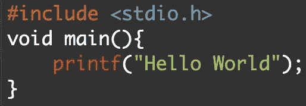
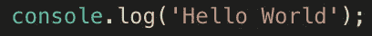
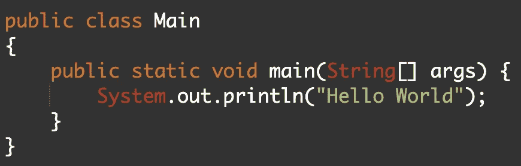
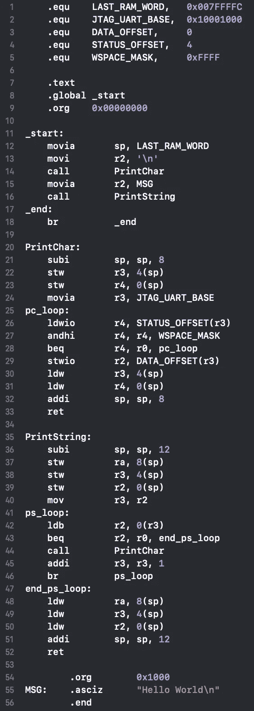

# 你好，世界…组装起来不容易

> 原文：<https://towardsdatascience.com/hello-world-not-so-easy-in-assembly-23da6644ff0d?source=collection_archive---------12----------------------->

# 介绍

在这篇博文中，我将介绍一个汇编语言的 Hello World 程序(RISC 风格的 Nios II 架构)。虽然我不会详细介绍 Nios II 体系结构的含义，但有一点很重要，即为了运行 Hello World 程序，需要支持 Nios II 体系结构的计算机主板或模拟器。我在这里推荐使用模拟器找到*。*

# *其他语言的 Hello World*

*Hello World 通常是新程序员编写的第一个程序，因为它非常简单。我将用 C、Ruby、JavaScript 和 Java 演示 Hello World 程序，以强调这个程序的简单性。*

## *C 语言的 Hello World*

**

*Figure 1: Hello World in C*

## *Ruby 的 Hello World*

**

*Figure 2: Hello World in Ruby*

## *JavaScript 中的 Hello World*

**

*Figure 3: Hello World in JavaScript*

## *Java 的 Hello World*

**

*Figure 4: Hello World in Java*

## *组装中的 Hello World*

*在我揭开 Hello World 的组装版之前，我必须给你一个警告，它相当长，很吓人，但我会在之后尽我所能解释一切。事不宜迟，我们一直在等待的时刻到了，你好，世界在集合:*

**

*是的，我知道，这看起来很吓人。希望你还没有点击关闭博客。在图 5 中，第 1–5 行是初始化常数。例如，第一行将 LAST_RAM_WORD 设置为 0x007FFFFC，这是一个十六进制的内存位置。第 8 行允许链接器知道程序从哪里开始。在这种情况下，程序从第 11 行开始。第 9 行让汇编程序知道下一行的内存位置。在图 5 中，第 9 行告诉汇编器 _start:位于 0x00000000 位置。*

*现在，我将解释 _start:标签中发生的事情，从图 5 中的第 11 行开始。_start:内的第一行，第 12 行，将 LAST_RAM_WORD 的值移动到堆栈指针(sp)。该行实际上启动了 sp 以包含存储器地址 0x007FFFFC。下面一行将' \n '或下一行字符移入寄存器 2，它是 CPU 上的一个内部寄存器。第 14 行调用 PrintChar。这意味着程序将从第 20 行开始执行 PrintChar: label 后面的代码。为了简单起见，从现在开始我将把 _start:，_end:，PrintChar:和 PrintString:称为函数或例程，即使它们是标签。*

*PrintChar:函数负责将字符打印到屏幕上。为了澄清，这个程序实际上打印新的行字符，后跟 hello world 字符串。我选择插入新行字符的原因是为了在解释 PrintString: function 之前解释 PrintChar: function，print string:function 只是多次调用 PrintChar: function。为了解释这个功能，我将定义字可寻址存储器。一个**字**可以被认为是一个可以存储信息的记忆单元。在 Nios II 架构中，一个字是 4 字节或 32 位。这个 PrintChar:函数从 sp 中减去 8 个字节开始，实质上为两个字生成了空间。第 22 和 23 行将寄存器三和四的当前值存储到生成的空间中。这一点很重要，因为 CPU 包含的可用寄存器数量有限，所以存储这些寄存器的值允许函数使用这些寄存器，并在函数完成时恢复它们的值。第 24 行将寄存器 3 的值设置为 0x10001000，这是输入/输出位置。第 25 行是一个标签(pc_loop:)。在定义了接下来的三行之后，这个标签的相关性将变得显而易见。第 26 行将输入/输出位置的状态载入寄存器 4。第 27 行对寄存器 4 的值的高位和 WSPACE_MASK (0xFFFF)进行逻辑与运算，然后将结果存储在寄存器 4 中。第 28 行中的“beq”代表“分支等于”本质上，如果寄存器 4 的值等于寄存器 0 的值，第 28 行使程序循环回到“pc_loop”标签(第 25 行)。澄清一下，寄存器 0 是一个特殊的寄存器，它的值总是为零。第 25 到 28 行代表了一个高级语言中的 while 循环。while 循环使程序等待，直到输出设备准备好打印字符。第 29 行将寄存器 2 的内容输出到控制台。换句话说，第 29 行是负责让字母出现在屏幕上的行。第 30 行和第 31 行将寄存器三和四的值恢复为进入 PrintChar:函数之前的值。值恢复后，堆栈指针(sp)不再需要存储数据，因此第 32 行向堆栈指针添加 8 个字节，以将 sp 返回到其原始状态。最后，在第 33 行点击“ret”后，程序返回到调用 PrintChar 后的那一行或第 15 行。*

*一旦我们返回到第 15 行，register 就获得了我们要打印的字符串的地址，“Hello World\n”。然后，在第 16 行，调用 PrintString:方法。为了保持简洁，这个方法遍历字符串，将每个字母发送给 PrintChar:方法。所以最初，“Hello World\n”中的“H”被发送给 PrintChar:方法。然后，将“e”发送给 PrintChar:方法。这个过程(循环)将继续，直到“\n”字符。*

*在 PrintString:例程终止时，程序返回到第 17 行，或者 _end:标签。然后，在第 18 行，程序无限次分支回到第 17 行，这实质上导致程序终止，因为它陷入了无限循环。*

*对于任何想知道的人，第 54 和 55 行让程序知道“Hello World\n”字符串从内存位置 0x1000 开始。*

# *结论*

*汇编是一种非常有趣的语言，学习起来要困难得多，因为它需要你所使用的硬件知识。如前所述，这个汇编程序是用 RISC 风格的 Nios II 架构(汇编的一个版本)编写的。Hello World 程序在汇编中比任何高级编程语言都难，因为它要求程序员完全定义程序，例如指定内存位置。此外，在汇编语言中，程序员必须指定屏幕上显示的内容和时间，这就是程序循环遍历字符串并一次打印一个字符的原因。然而，汇编允许程序员通过利用硬件特性来优化程序和算法，否则这是不可能的。*