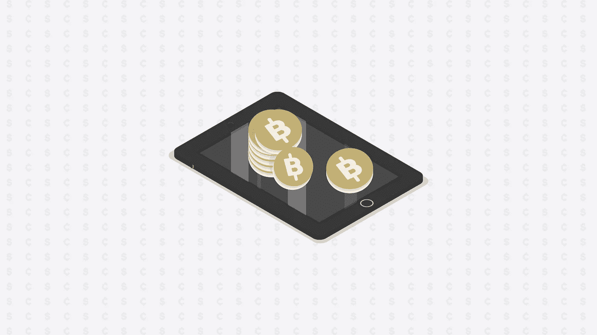

# 以下是比特币获得其价值的方式

> 原文：<https://towardsdatascience.com/heres-how-bitcoin-gets-its-value-a1f09dba0735?source=collection_archive---------2----------------------->

## 为什么比特币毫无意义，以及对其未来的猜测



Image courtesy of the author

大约在 1661 年瑞典发行第一张欧洲纸币[的 700 年前，中国曾为如何减轻随身携带铜币的人的负担而绞尽脑汁。这些硬币使生活变得困难:它很重，而且会使旅行变得危险。随后，商人们决定将这些硬币存放在一起，](https://www.riksbank.se/en-gb/about-the-riksbank/history/1600-1699/first-banknotes-in-europe/)[为硬币的价值发行纸质凭证](http://content.time.com/time/specials/packages/article/0,28804,1914560_1914558_1914593,00.html)。

私人发行导致通货膨胀和货币贬值:政府随后介入，发行他们自己的由黄金储备支持的纸币，可以说是成为了世界上第一种法定货币。

在过去的几个世纪里，各国开始采用“金本位制”，用金银等商品铸造一定重量的硬币。这代表了一定数量的价值，直到硬币被篡改，这导致了代表性货币的兴起。

银行发行“黄金券”——一张分母为 50 的纸币意味着你可以用这张纸币兑换价值 50 美元的黄金。

然后，在 1944 年，布雷顿森林体系决定，出席会议的 44 个国家将保持他们的货币与美元挂钩，因为美元有黄金储备支持。这实质上意味着美元可以随时兑换成黄金。

> 这实质上意味着美元可以随时兑换成黄金。

这种方法效果不错，但时间不长。不断增长的公共债务、通货膨胀和国际收支逆差意味着美元面临更大的压力。作为回应，一些欧洲国家甚至退出该体系，用美元兑换黄金。那时，他们储备中的美元比黄金还多。

这种情况在 1971 年发生了变化，当时美国前总统理查德·尼克松(Richard Nixon)关闭了黄金窗口:外国政府持有太多美元，美国很容易挤兑黄金。他们与其他 15 名顾问一起宣布了新的经济计划，以避免通货膨胀，降低失业率，并将美元转化为法定货币——本质上依赖于货币使用者的同意，而不是商品和标准。

> 因此，你指望政党是否会接受你的货币，这完全是出于信任。

比特币也是如此，这种加密货币一度创下 19783.06 美元的历史新高。是什么赋予了比特币价值？声称它是通过供求来实现的似乎并没有涵盖整个画面:它没有任何东西作为后盾，也没有任何人来控制。

> 至少，你可以依靠合法的管理机构来维持一种货币的价值。

比特币被创造出来时就带有菲亚特的特征。然而，在治理意义上，没有人“拥有”比特币。它的运作方式似乎也与菲亚特现金相同，但本质上不同的生态系统让经济学家和金融专家思考:到底是谁给了它价格？

```
class CInputCoin {
public:    
CInputCoin(const CTransactionRef& tx, unsigned int i) {        
if (!tx)            
throw std::invalid_argument("tx should not be null");
```

你现在看到的是比特币中[百万行代码](https://github.com/bitcoin/bitcoin)的五行。最初只有几千行代码，比特币是由[中本聪](https://www.investopedia.com/terms/s/satoshi-nakamoto.asp)在 2008 年开发的，并于 2009 年初发布。中本聪在著名的[白皮书](https://bitcoin.org/bitcoin.pdf)中详述了比特币的概念，该白皮书题为*比特币:一种点对点电子现金系统。*

> 最初的设想是创造一种不需要通过金融机构的现金形式，因为它具有加密的性质。

最大的创新是它对区块链技术的利用。每个区块代表比特币网络中的一次交易——区块越多，时间越长。因此，它形成了一个“链”，因此得名。

为了让一个区块出现，矿工需要使用原始的计算机处理能力和大量的电力来验证人 A 和人 B 之间存在 X 值和 Y 时间的交易。当它得到确认，块出现，交易通过。矿工会得到比特币作为奖励。

然而，这种数字货币没有内在价值，不能作为商品使用。比特币的怀疑者通常会说，要让它可行，它必须首先被接受并用于其他商品用途。慢慢地，随着时间的推移，它会变成钱。例如，人们囤积黄金来储存价值，因为黄金被用于珠宝和电子产品。

在奥地利经济学家卡尔·门格尔的一部开创性著作中，他开始将货币描述为“某些商品成为普遍接受的交换媒介的事实”。同为经济学家的路德维希·冯·米塞斯[在门格尔的工作](https://mises-media.s3.amazonaws.com/Theory%20of%20Money%20and%20Credit.pdf)基础上，将商品货币归因于“同时是一种商业商品”的货币。法定货币是由“具有特殊法律资格的东西”组成的货币。

> “……法定货币的名称是由具有特殊法律资格的事物组成的货币……”—路德维希·冯·米塞斯，《货币与信用理论》

内在价值的观念在人类中一直存在:甚至亚里斯多德也写过为什么钱需要是[内在有用的](http://classics.mit.edu/Aristotle/politics.1.one.html)。从本质上说，无论是什么货币，它的价值都必须来自于它本身的有用性。这一论点不攻自破，因为历史表明，任何东西要成为货币都不需要商品价值。

在非洲和北美的部分地区，玻璃珠被用于货币目的，尽管事实证明它们作为商品几乎没有什么用处。太平洋上的雅浦人使用石灰石硬币作为货币。

比特币怀疑论者经常使用内在价值论点来谴责比特币的生存能力。不幸的是，比特币是一种纯粹的数字存在，因此它不受物理世界的限制。它不需要像黄金一样具有内在价值，也不需要其他人授予的特殊权利才能成为法定货币。虽然这看起来像是一种解释——比特币是一种不受人类规则约束的全新实体——但它仍然没有完全说得通。

> 可以这么想:比特币和菲亚特都是不同的金融生态系统。

法币属于物理世界，因此会带来其他货币约束。权力掌握在控制货币的人手中，央行总是可以印更多的钞票来推动通货膨胀和流通。然而，没有人能告诉你到底有多少实物美元在世界上流通。

黄金供应有限，但可能会受到通货膨胀的影响。如果有人在当前供应之外发现了大量黄金，所有权可能会被彻底稀释。材料科学的创新也可能减少电子产品和消费产品对黄金的需求。

比特币的数字本质需要新的理论基础。经济学家早就意识到贵金属和法币的约束。因此，比特币的引入催生了一套新的规则，被许多人戏称为暴发户金融生态系统。

问题在于，法定货币和加密货币生态系统无法真正共存，比特币最大化主义者会告诉你这一点。由于比特币没有作为金融工具、投资产品或证券的内在价值，因此最大的赌注是让它成为一种全球货币。

今天，全球货币供应量( [M1](https://www.investopedia.com/terms/m/m1.asp) )，达到[7.6 万亿美元](http://money.visualcapitalist.com/worlds-money-markets-one-visualization-2017/)。如果加上支票存款、短期债券、定期存款和其他金融工具，总额高达 90 万亿美元。要成为一种全球货币，比特币需要至少相当于*全球货币供应量的*——事实并非如此，因为在撰写本文时，比特币的市值仅为 1300 亿美元。

然而，迅速增长的主权债务和外债可能会刺激投资者开始寻找比黄金更容易获得和替代的通货再膨胀对冲工具。这可能会推高比特币的估值，因为它具有价值储存的效用。为了对抗通货膨胀，许多人满足于在他们的投资组合中持有美元、欧元或日元——阿根廷人和委内瑞拉人用相对稳定的美元做到了这一点。

> 要成为一种全球货币，比特币需要至少相当于全球货币供应量，但事实并非如此，因为在撰写本文时，比特币的市值仅为 1300 亿美元。

这可能赋予它实用价值:比特币可以充当价值储存手段。

让我们把它看作一种资产。如果是，那么比特币本质上是反通胀的。为了刺激网络增长，区块链每创造一个新街区，就铸造 50 个新比特币。每 [21 万块](https://www.bitcoinblockhalf.com/)后奖励减半(现在每块给 12.5，2020 年 5 月 14 日减半至 6.25)。除了供应上限为 2100 万比特币的内在稀缺性，难怪人们和金融机构会将比特币视为硬通货。

这意味着内在的货币政策正在推动比特币的购买力——但决定其价格的是什么？

如果你看看[古典经济学派](https://www.investopedia.com/terms/c/classicaleconomics.asp)，你可以认为比特币的价格是由其生产成本决定的。这意味着硬件和电力。随着比特币继续经历通货紧缩，矿工的数量将逐渐减少，因为开采成本太高。尽管如此，仍有矿商愿意亏本经营，这可能表明，有人在对冲比特币未来再次上涨的风险:价格不仅仅取决于生产成本，尽管这是一个因素。

[新古典经济学派](https://www.investopedia.com/terms/n/neoclassical.asp)扩展了这一理论，增加了另一个客观因素:供给和需求。由于比特币的供应有上限，被开采的比特币数量将随着时间的推移而减少，对更多比特币的需求可能会上升。更多的需求意味着更高的价格。

仅仅依靠客观因素似乎也不能描绘出全貌。如果生产成本是一个主要原因，那么比特币的价值应该接近美国广义货币供应量(M3)的水平。

尽管如此，矿工们还是无所适从，尽管开采比特币的成本更高。

如果需求和供应的平衡很重要，那么比特币的明确规定和经审计的供应上限应该会决定持续的需求。然而，比特币仍然容易出现极端波动，有可能在同一天内暴跌和暴涨。

进入[奥地利经济学院](https://www.investopedia.com/articles/economics/09/austrian-school-of-economics.asp)，这里的比特币支持者非常喜欢。奥地利经济学家认为，任何东西的价格都是由主观因素决定的，甚至是生产成本。供需由个人喜好决定。因此，它可以解释比特币的价值——感知价值和主观因素在这里可能是一个更大的因素。

可以看出，没有明确的解释为什么加密货币——甚至是货币——有价值。在这种情况下，比特币的价格似乎是由经典经济模型、情绪和内在货币政策共同驱动的。

然而，无论采用何种经济理论，加密货币仍将引发一场金融革命。如果它能演变成另一种形式的全球货币，世界金融生态系统将被颠覆(是好是坏，我们不得而知)。

最终，比特币是金融实验的发射台。利用区块链技术引领了 2016 年至 2017 年的加密货币热潮，这带来了区块链创新的全新世界。今天，我们正在研究[实际稳定的加密货币](https://medium.com/altcoin-magazine/you-need-to-stop-wiring-money-c7cbeabcd468)，它们可以保持 1 美元的稳定价格，使用资产挂钩和储备银行概念的组合。

> 与其把比特币看作一种货币形式，不如把它看作一种支付系统。

因此，比特币的真正价值在于它的网络。参与的人越多越好。本质上，这意味着比特币的价值取决于谁拥有它。如今，随着比特币的普及(不是为了日常使用，而是为了投资和交易)，越来越多好奇的人开始加入这项新技术。这意味着更多的分配。

然而，为了让比特币真正按照预期的方式发挥作用，它需要通过转向利益证明(PoS)系统来摆脱矿工和采矿池。比特币的工作证明系统使交易变得异常昂贵——矿工们正在燃烧数百万美元，以利用电力和原始计算机处理能力来验证网络上的比特币交易。有了 PoS 系统，比特币将因其网络而被估价。大多数利益相关者将放弃他们的一部分股份，以允许网络增长，从而相应地增加他们的股份。

这听起来很简单，但如今大多数比特币都是由中国矿工开采的。例如，如果它能取代美国的广义货币供应，那么政府有什么理由采用一种由来自一个对立超级大国的矿商控制的全球货币呢？

如果超级大国不愿意，为什么小国会跟随？全球货币目标似乎是一个白日梦，但最终，比特币是否会起作用将取决于你从谁那里听到它，就像它从哪里获得价值一样。