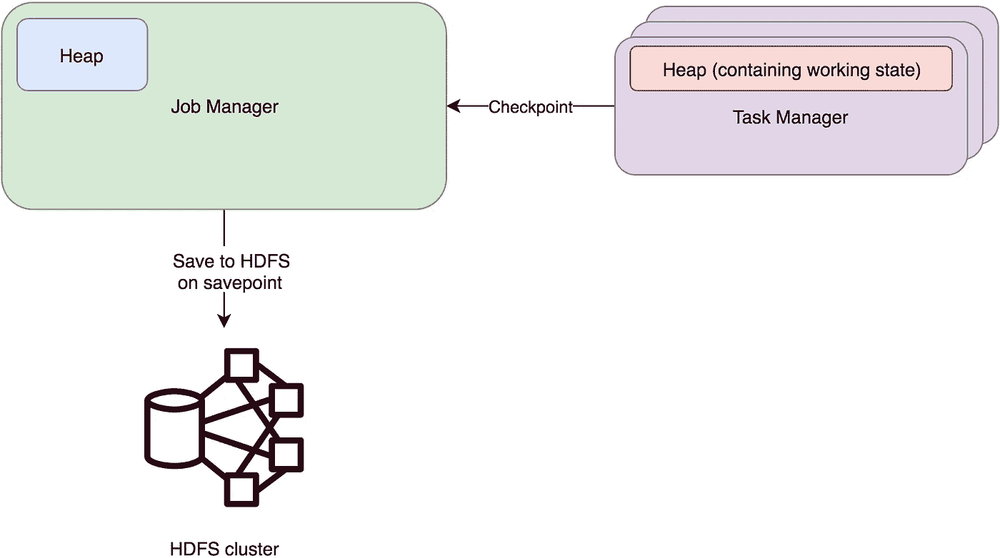

# 以下是 Apache Flink 如何存储您的状态数据

> 原文：<https://towardsdatascience.com/heres-how-flink-stores-your-state-7b37fbb60e1a?source=collection_archive---------8----------------------->

## Flink 中有状态处理的幕后


Photo by [Samuel Zeller](https://unsplash.com/@samuelzeller?utm_source=medium&utm_medium=referral) on [Unsplash](https://unsplash.com?utm_source=medium&utm_medium=referral)

Apache Flink 的一个重要特性是它能够进行有状态处理。存储和检索状态数据的 API 很简单，这使得它很容易使用。

然而，在 API 的背后是一个管理数据的系统，同时提供持久性保证，这就是我们将在本文中理解的。

我们将会看到国家管理的三个部分——

1.  状态后端
2.  数据格式
3.  持久性和故障恢复

让我们首先看看状态实际存储在哪里。

# 我的数据存储在哪里？

Flink 为您的状态提供了三个现成的后端存储。这些是

1.  内存状态后端
2.  文件系统(FS)状态后端
3.  RocksDB 状态后端

## 内存状态后端

这种存储将数据保存在每个任务管理器堆的内存中。因此，这使得它的访问速度极快。尽管有这样的性能，但这种状态永远不应该在生产作业中使用。这是因为状态会在作业管理器内存中创建数据备份(也称为检查点),这给作业管理器的操作稳定性带来了不必要的压力。

这个后端的另一个限制是任务的总状态大小不能超过 10MB。可以将其配置为更高的限制，但出于性能考虑，作者不建议这样做。

这是 Flink 在没有配置任何东西的情况下使用的默认后端。



## 文件系统后端

这个后端类似于内存状态后端，只是它将备份存储在文件系统上，而不是作业管理器内存中。文件系统可以是任务管理器的本地文件系统或持久存储，如 HDFS/S3。

这种状态也受到堆内存的限制，因此应该在数据较少并且需要高性能的情况下使用。


## RocksDB 后端

这个后端使用脸书的 RocksDB 来存储数据。如果您不知道 RocksDB，那么它是一个提供 ACID 保证的可嵌入键值存储。它基于谷歌的 [LevelDB，但提供了更好的写性能。](https://github.com/google/leveldb)

Flink 选择使用 RocksDB，而不是一些最流行的嵌入式存储，如 SQLlite，因为它的高写入性能来自基于 LSM 架构的设计。
由于 RocksDB 还维护着一个内存表(也称为 mem-table)和 bloom filters，读取最近的数据也非常快。

每个任务管理器维护它自己的 Rocks DB 文件，并且这个状态的备份被检查点设置到一个持久存储，比如 HDFS。


这是唯一支持增量检查点的后端，即只备份修改过的数据，而不是完整的数据。

如果您的应用程序需要存储一个大的州，这应该是您的选择。但是，因为它需要磁盘访问和序列化/反序列化，所以它比其他后端要慢。

# 这个国家实际上是什么样子的？

让我们看看在应用程序中创建状态后，数据实际上是如何存储的。

存储格式因后端而异。但是，常见的部分是状态的键和值都存储在使用 Flink 自己的类型序列化程序创建的字节数组中。

我们将使用 RocksDB 后端进行演示。

每个任务管理器都有多个 RocksDB 文件夹，每个文件夹本身就是一个数据库。每个数据库包含由状态描述符中给出的名称定义的多个列族。

每个列族都包含键-值对，其中键是操作符的键，值是状态数据。

举个例子。让我们看看这个示例作业的状态

该作业包含两个状态函数，定义如下

如果运行此作业，并在 flink-conf.yml 文件中将 Rocksdb 设置为 state backend，则在每个任务管理器上都将生成以下目录。

```
drwxr-xr-x   4 abc  74715970   128B Sep 23 03:19 job_127b2b84f80b368b8edfe02b2762d10d_op_KeyedProcessOperator_0d49016af99997646695a030f69aa7ee__1_1__uuid_65b50444-5857-4940-9f8c-77326cc79279/dbdrwxr-xr-x   4 abc  74715970   128B Sep 23 03:20 job_127b2b84f80b368b8edfe02b2762d10d_op_StreamFlatMap_11f49afc24b1cce91c7169b1e5140284__1_1__uuid_19b333d3-3278-4e51-93c8-ac6c3608507c/db
```

下面是目录名的定义方式


这些名称由三部分组成

1.  **JOB_ID:** 创建作业图表时分配给作业的随机 ID。
2.  **OPERATOR_ID** :这是 OPERATOR 的基类、operator uid 的 Murmur3 Hash、任务的索引和任务的整体并行度的组合。例如，对于我们的 StatefulMapTest 函数，这 4 个部分结果是

*   河流平面图
*   mur mur 3 _ 128(" stateful _ map _ test ")-> 11f 49 AFC 24 B1 CCE 91 c 7169 B1 e 5140284
*   1，因为在并行度为 1 的作业中只能有一个任务，因此任务索引为 1
*   1，因为我在执行作业时将并行度设置为 1

3. **UUID** :这只是创建目录时随机生成的 UUID。

每个目录都包含一个 RocksDB 实例。RocksDB 的文件结构将是

```
-rw-r--r--  1 abc  74715970    21K Sep 23 03:20 000011.sst
-rw-r--r--  1 abc  74715970    21K Sep 23 03:20 000012.sst
-rw-r--r--  1 abc  74715970     0B Sep 23 03:36 000015.log
-rw-r--r--  1 abc  74715970    16B Sep 23 03:36 CURRENT
-rw-r--r--  1 abc  74715970    33B Sep 23 03:18 IDENTITY
-rw-r--r--  1 abc  74715970     0B Sep 23 03:33 LOCK
-rw-r--r--  1 abc  74715970    34K Sep 23 03:36 LOG
-rw-r--r--  1 abc  74715970   339B Sep 23 03:36 MANIFEST-000014
-rw-r--r--  1 abc  74715970    10K Sep 23 03:36 OPTIONS-000017
```

的。sst 文件是包含实际数据的 Rocksdb 的 SSTable 文件。
日志文件包含提交日志。
清单包含元数据，如列族。
选项包含用于创建 RocksDB 实例的配置。

让我们使用 RocksDB java API 打开这个 DB。我们将看一下 StatefulMapTest 函数目录。

以下代码打印数据库中存在的所有列族名称。上面这段代码的输出结果是

```
default
previousInt
nextInt
```

我们还可以打印每个列族中的所有键值对。这可以使用下面的代码来完成

在我们的例子中，它将打印出键值对，如
(testing123，1423)，(testing456，1212)等。

这里的 TestInputView 只是 Flink 特定的构造，用于读取字节数组数据流。

# 我需要备份数据吗？

Flink 使用一种称为检查点的机制为应用程序状态提供持久性。它定期拍摄状态快照，然后将其存储在持久性存储中，如 HDFS/S3。这允许 Flink 应用程序在出现故障时从该备份中恢复。

默认情况下，对 Flink 作业禁用检查点。要启用它，您可以将以下代码添加到您的应用程序中

这将配置您的应用程序每 60 秒拍摄一次状态快照，并将其放入作业管理器/HDFS/S3 以备将来恢复。在 HDFS/S3 的情况下，可以用 flink-conf.yml 中的 **state.checkpoints.dir** 配置用于存储检查点的目录

检查点的最终目录结构如下所示

```
hdfs:///path/to/state.checkpoints.dir/{JOB_ID}/chk-{CHECKPOINT_ID}/
```

JOB_ID 是应用程序的唯一 ID，检查点 ID 是自动递增的数字 ID。

要在应用程序启动时从检查点恢复状态，只需运行

```
flink-1.9.0/bin/flink run -s hdfs:///path/to/state.checkpoints.dir/{JOB_ID}/chk-{CHECKPOINT_ID}/ path/to//your/jar
```

您可以使用检查点函数来扩展有状态函数，该函数提供了在初始化和拍摄快照时修改状态的能力。可以扩展前面的 StatefulProcess 函数来使用这个接口。

这就完成了我们对 Flink 状态的深入研究，现在您可以确信您的状态被应用程序很好地保存了。

如果你想开始使用状态处理 Apache Flink，这里有一些到官方文档的有用链接

1.  [工作状态](https://ci.apache.org/projects/flink/flink-docs-stable/dev/stream/state/state.html)
2.  [州后端](https://ci.apache.org/projects/flink/flink-docs-release-1.9/ops/state/state_backends.html)
3.  [状态处理器 API](https://ci.apache.org/projects/flink/flink-docs-release-1.9/dev/libs/state_processor_api.html)