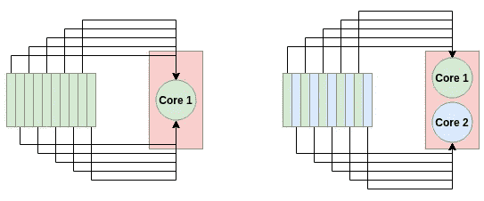
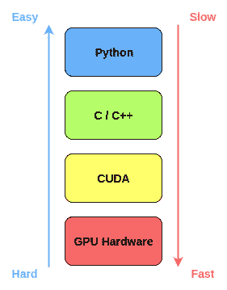
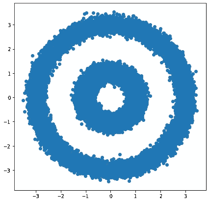
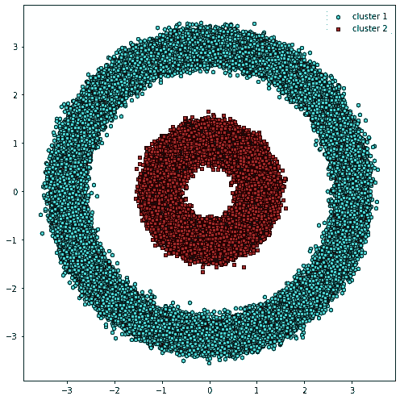
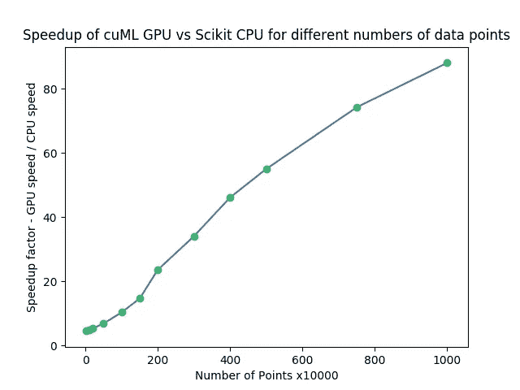

# 以下是如何在 GPU 上加速数据科学的方法

> 原文：<https://towardsdatascience.com/heres-how-you-can-accelerate-your-data-science-on-gpu-4ecf99db3430?source=collection_archive---------6----------------------->

> 想获得灵感？快来加入我的 [**超级行情快讯**](https://www.superquotes.co/?utm_source=mediumtech&utm_medium=web&utm_campaign=sharing) 。😎

数据科学家需要计算能力。无论你是用 Pandas 处理一个大数据集，还是用 Numpy 在一个大规模矩阵上运行一些计算，你都需要一台强大的机器来在合理的时间内完成工作。

在过去几年中，数据科学家通常使用的 Python 库在利用 CPU 能力方面已经变得相当不错。

Pandas 的底层代码是用 C 语言编写的，它在处理超过 100GB 的数据集方面做得很好。如果您没有足够的内存来容纳这样的数据集，您可以使用方便的分块功能，一次处理一部分数据。

# GPU 与 CPU:并行处理

对于海量数据，一个 CPU 是无法处理的。

一个超过 100GB 的数据集将会有很多很多的数据点，大概在*百万*甚至*十亿*的范围内。有这么多的点要处理，无论你的 CPU 有多快，它都没有足够的内核来进行高效的并行处理。如果您的 CPU 有 20 个内核(这将是相当昂贵的 CPU)，您一次只能处理 20 个数据点！

CPU 在时钟速度更重要的任务中会更好——或者你根本没有 GPU 实现。如果你正在尝试执行的进程有一个 GPU 实现，那么如果这个任务可以从并行处理中受益，那么 GPU 将会更加有效。



How a Multi-core system can process data faster. For a single core system (left), all 10 tasks go to a single node. For the dual-core system (right), each node takes on 5 tasks, thereby doubling the processing speed

深度学习已经看到了利用 GPU 的公平份额。深度学习中的许多卷积运算都是重复的，因此可以在 GPU 上大大加速，甚至高达数百倍。

今天的数据科学没有什么不同，因为许多重复操作都是通过 Pandas、Numpy 和 Scikit-Learn 等库在大型数据集上执行的。这些操作在 GPU 上实现起来也不会太复杂。

终于有解决办法了。

# GPU 加速与急流

[Rapids](https://rapids.ai/) 是一套软件库，旨在利用 GPU 加速数据科学。它使用低级别的 CUDA 代码来实现快速的 GPU 优化算法，同时仍然拥有一个易于使用的 Python 层。

Rapids 的美妙之处在于它可以与数据科学库顺利集成——像 Pandas 数据帧这样的东西很容易通过 Rapids 进行 GPU 加速。下图说明了 Rapids 如何实现低级别加速，同时保持易于使用的顶层。



Rapids 利用了几个 Python 库:

*   [**cuDF**](https://github.com/rapidsai/cudf)—Python GPU data frames。在数据处理和操作方面，它几乎可以做熊猫能做的一切。
*   [**cuML**](https://github.com/rapidsai/cuml) — Python GPU 机器学习。它包含许多 Scikit-Learn 拥有的 ML 算法，格式都非常相似。
*   [**cuGraph**](https://github.com/rapidsai/cuml)—Python GPU 图形处理。它包含许多常见的图形分析算法，包括 PageRank 和各种相似性度量。

# 如何使用 Rapids 的教程

## 装置

现在你将看到如何使用急流！

要安装它，前往[网站](https://rapids.ai/start.html)，在那里你会看到如何安装 Rapids。您可以通过 [Conda](https://anaconda.org/anaconda/conda) 将它直接安装在您的机器上，或者只需拉动 Docker 容器。

安装时，您可以设置您的系统规格，如 CUDA 版本和您想要安装的库。例如，我有 CUDA 10.0，想安装所有的库，所以我的安装命令是:

```
conda install -c nvidia -c rapidsai -c numba -c conda-forge -c pytorch -c defaults cudf=0.8 cuml=0.8 cugraph=0.8 python=3.6 cudatoolkit=10.0
```

一旦该命令运行完毕，您就可以开始进行 GPU 加速的数据科学了。

## 设置我们的数据

对于本教程，我们将经历一个修改版本的 [DBSCAN 演示](https://github.com/rapidsai/notebooks/blob/branch-0.8/tutorials/DBSCAN_Demo_Full.ipynb)。我将使用 [Nvidia 数据科学工作站](/nvidias-new-data-science-workstation-a-review-and-benchmark-e451db600551)来运行 2 个 GPU 附带的测试。

DBSCAN 是一种基于密度的[聚类算法](/the-5-clustering-algorithms-data-scientists-need-to-know-a36d136ef68)，可以自动对数据组进行分类，而无需用户指定有多少组。在 [Scikit-Learn](https://scikit-learn.org/stable/modules/generated/sklearn.cluster.DBSCAN.html) 中有它的一个实现。

我们将从获取所有导入设置开始。用于加载数据、可视化数据和应用 ML 模型的库。

```
import os
import matplotlib.pyplot as plt
from matplotlib.colors import ListedColormap
from sklearn.datasets import make_circles
```

*make_circles* 函数将自动创建一个复杂的数据分布，类似于我们将应用 DBSCAN 的两个圆。

让我们从创建 100，000 个点的数据集开始，并在图中显示它:

```
X, y = make_circles(n_samples=int(1e5), factor=.35, noise=.05)
X[:, 0] = 3*X[:, 0]
X[:, 1] = 3*X[:, 1]
plt.scatter(X[:, 0], X[:, 1])
plt.show()
```



## CPU 上的数据库扫描

使用 Scikit-Learn 在 CPU 上运行 DBSCAN 很容易。我们将导入我们的算法并设置一些参数。

```
from sklearn.cluster import DBSCANdb = DBSCAN(eps=0.6, min_samples=2)
```

现在，我们可以通过调用 Scikit-Learn 中的一个函数对 circle 数据应用 DBSCAN。在我们的函数前加一个`%%time`告诉 Jupyter Notebook 测量它的运行时间。

```
%%timey_db = db.fit_predict(X)
```

对于这 100，000 个点，运行时间是 8.31 秒。结果图如下所示。



Result of running DBSCAN on the CPU using Scikit-Learn

## GPU 上带 Rapids 的 DBSCAN

现在让我们用急流让事情变得更快！

首先，我们将把数据转换成一个`pandas.DataFrame`，并用它来创建一个`cudf.DataFrame`。Pandas 数据帧无缝转换为 cuDF 数据帧，数据格式没有任何变化。

```
import pandas as pd
import cudfX_df = pd.DataFrame({'fea%d'%i: X[:, i] for i in range(X.shape[1])})
X_gpu = cudf.DataFrame.from_pandas(X_df)
```

然后我们将从 cuML 导入并初始化一个*特殊*版本的 DBSCAN，一个 GPU 加速的版本。DBSCAN 的 cuML 版本的函数格式与 Scikit-Learn 的完全相同——相同的参数，相同的风格，相同的函数。

```
from cuml import DBSCAN as cumlDBSCANdb_gpu = cumlDBSCAN(eps=0.6, min_samples=2)
```

最后，我们可以在测量运行时间的同时为 GPU DBSCAN 运行我们的预测函数。

```
%%timey_db_gpu = db_gpu.fit_predict(X_gpu)
```

GPU 版本的运行时间为 4.22 秒，几乎是 2 倍的加速。因为我们使用相同的算法，所以结果图也与 CPU 版本完全相同。


Result of running DBSCAN on the GPU using cuML

# 借助 Rapids GPU 获得超快速度

我们从 Rapids 获得的加速量取决于我们处理的数据量。一个很好的经验法则是，较大的数据集将受益于 GPU 加速。在 CPU 和 GPU 之间传输数据会产生一些开销时间，对于较大的数据集，这些开销时间变得更加“值得”。

我们可以用一个简单的例子来说明这一点。

我们将创建一个 Numpy 随机数数组，并对其应用 DBSCAN。我们将比较我们的常规 CPU DBSCAN 和 cuML 的 GPU 版本的速度，同时增加和减少数据点的数量，以查看它如何影响我们的运行时间。

下面的代码演示了这个测试:

```
import numpy as npn_rows, n_cols = 10000, 100
X = np.random.rand(n_rows, n_cols)
print(X.shape)X_df = pd.DataFrame({'fea%d'%i: X[:, i] for i in range(X.shape[1])})
X_gpu = cudf.DataFrame.from_pandas(X_df)db = DBSCAN(eps=3, min_samples=2)
db_gpu = cumlDBSCAN(eps=3, min_samples=2)%%time
y_db = db.fit_predict(X)%%time
y_db_gpu = db_gpu.fit_predict(X_gpu)
```

查看下面 Matplotlib 的结果图:



当使用 GPU 而不是 CPU 时，数量会急剧增加。即使在 10，000 点(最左边)，我们仍然获得了 4.54 倍的加速。在更高端的情况下，10，000，000 点在切换到 GPU 时，我们获得了 88.04 倍的加速！

# 喜欢学习？

在推特[上关注我，我会在这里发布所有最新最棒的人工智能、技术和科学！也在 LinkedIn](https://twitter.com/GeorgeSeif94) 上与我联系！