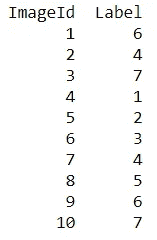
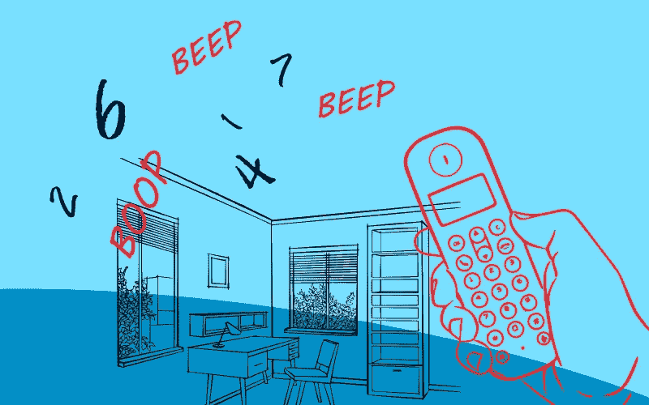

# 嘿，能给我你的号码吗？

> 原文：<https://towardsdatascience.com/hey-can-a-i-get-your-number-805eda62419f?source=collection_archive---------24----------------------->


Source: BGR

## 现代科学的逐步指南

## 用 CNN 帮助爱情在 21 世纪蓬勃发展

好吧，听着。他们刚认识你——这太疯狂了。

但是你不知何故得到了他们的电话号码，所以现在你要打电话给他们…也许。

(除非你出生在 2000 年之后，在这种情况下，你会不惜一切代价避免给别人打电话——发短信就行了，怪人。)

只有一个问题。你刚做了 Lasik 眼科手术:


You clearly CANNOT see what that says (roll with me on this)

现在你看起来像斯蒂维·旺德，你看不到 SH*T，更不用说这张纸上的数字了。在你绝望的时候，你左顾右盼，寻找一个能让你在意识到自己什么也看不见之前跳下去的高处。


This is you for the next 6 hours. Maybe you’ll get singing superpowers too. (Britannica)

但是等等。这不是结束。你已经有了一个变通办法:一个如此疯狂的计划，它可能会奏效

> 你要用人工智能。

等等，什么？艾！？瓦力现在能帮你什么？


看，这有点误解——人工智能不一定意味着机器人。

> 人工智能描述了计算机执行人类可以完成的任务。

诸如“看到”手写数字的图片并识别它们是什么数字之类的任务。当谈到图像分类时，我们通常使用一种称为卷积神经网络或 CNN 的结构。查看[这篇文章](https://medium.com/@igrandic03/what-defines-a-rubber-duck-cb5545650662)，深入分析它们是如何工作的——但这里有一个简短的总结:

*   神经网络有**层**。CNN 的每一层都在寻找某些**特征**。
*   图像被分成几部分来看，搜索和映射特征。**特征映射**通过像素数给出特定特征出现的概率位置。
*   我们可以通过从更小的增量中取最大值来简化复杂的地图，我们将图像分解成更小的新图像。这叫做**池**。
*   然后，我们通过一个 **ReLU** (整流线性单位)函数运行所有这些值，该函数将所有负值变为 0。
*   我们可以多次映射、合并和重新逻辑，以变得更加精确。这些可以被编译成对应于每个标签或结果的**连接层**。
*   CNN 通过使用**加权像素**来确定每种结果的概率，并给出它对图像内容的最佳猜测。

很刺激，对吧？

> 那么，你到底如何利用这项惊人的技术呢？

幸运的是，你是一个键盘高手，甚至不需要*看到屏幕就能做到这一点——下面是它的分解:*

1.  你在做数据科学——你需要数据！
2.  然后你要看看数据是否平衡和可用。
3.  准备好你的资料。
4.  用模型上的数据训练和测试 CNN。
5.  用你刚拿到的电话号码查一下。

# 1.让我们得到这些数据


(Giphy)

Kaggle 是一个数据科学竞赛平台，在这里你可以找到免费的数据集。通常情况下，你必须得到手写数字的照片，把它们转换成。包含其特征的 csv 文件，然后通过模型运行该文件来训练它。

幸运的是，我们现在还不需要这么做——你可以在这里从 MNIST[数据集](https://www.kaggle.com/c/digit-recognizer)中获得这些数据。我们还必须添加一些依赖项，为我们提供实现这一目标的工具:

```
import pandas as pd
import numpy as np
import matplotlib.pyplot as plt
import matplotlib.image as mpimg
import seaborn as sns
%matplotlib inlinenp.random.seed(2)from sklearn.model_selection import train_test_split
from sklearn.metrics import confusion_matrix
import itertoolsfrom keras.utils.np_utils import to_categorical # convert to one-hot-encoding
from keras.models import Sequential
from keras.layers import Dense, Dropout, Flatten, Conv2D, MaxPool2D
from keras.optimizers import RMSprop
from keras.preprocessing.image import ImageDataGenerator
from keras.callbacks import ReduceLROnPlateausns.set(style=’white’, context=’notebook’, palette=’deep’)
```

# 2.平衡程度如何？


Wikimedia Commons

在你的一生中，如果你只看到 1 只兔子和 39999 只鸭子，你可能会猜那是一只鸭子。相反，如果你看到 1 只鸭子和 39，999 只兔子，你会猜兔子。

机器的学习方式与你的学习方式类似——如果数据偏向/不平衡于某个标签，可能会导致不准确的预测。我们需要确保数据是均匀分布的**，这样机器就可以学习所有相同的 10 个数字。**

**您可以使用一些简单的 python 命令来实现这一点:**

```
train = pd.read_csv (r".../train.csv")
test = pd.read_csv (r".../test.csv")Y_train = train[“label”]X_train = train.drop(labels = [“label”],axis = 1)del traing = sns.countplot(Y_train)Y_train.value_counts()
```

****

**看起来您的数据已经相当均匀地分布了，所以您可以开始了！**

# **3.数据准备**

**我们必须使我们的数据集可行，所以我们对它进行规范化和整形，以便它能与我们稍后要使用的模型一起工作。然后，我们将标签(10 位数字)编码成向量:**

```
X_train = X_train / 255.0
test = test / 255.0X_train = X_train.values.reshape(-1,28,28,1)
test = test.values.reshape(-1,28,28,1)Y_train = to_categorical(Y_train, num_classes = 10)
```

**现在，让我们将数据进一步分为训练集和验证集:**

```
random_seed = 2X_train, X_val, Y_train, Y_val = train_test_split(X_train, Y_train, test_size = 0.1, random_state=random_seed)
```

# **4.培训+测试模型**

****

**This is your model. (Giphy)**

**我们将使用 Keras Sequential API 来解决这个问题，它的组合有点像这样:**

```
model = Sequential()

model.add(Conv2D(filters = 32, kernel_size = (5,5),padding = 'Same', 
                 activation ='relu', input_shape = (28,28,1)))
model.add(Conv2D(filters = 32, kernel_size = (5,5),padding = 'Same', 
                 activation ='relu'))
model.add(MaxPool2D(pool_size=(2,2)))
model.add(Dropout(0.25))

model.add(Conv2D(filters = 64, kernel_size = (3,3),padding = 'Same', 
                 activation ='relu'))
model.add(Conv2D(filters = 64, kernel_size = (3,3),padding = 'Same', 
                 activation ='relu'))
model.add(MaxPool2D(pool_size=(2,2), strides=(2,2)))
model.add(Dropout(0.25))

model.add(Flatten())
model.add(Dense(256, activation = "relu"))
model.add(Dropout(0.5))
model.add(Dense(10, activation = "softmax"))
```

**我们在这里做的是添加我们的数据将要经过的层。现在我们设置一个优化器和退火器来避免过度拟合。我们还可以增强和扩展我们的数据集，以进一步避免这种情况:**

```
optimizer = RMSprop(lr=0.001, rho=0.9, epsilon=1e-08, decay=0.0)model.compile(optimizer = optimizer , loss = “categorical_crossentropy”, metrics=[“accuracy”])learning_rate_reduction = ReduceLROnPlateau(monitor='val_acc', 
                                            patience=3, 
                                            verbose=1, 
                                            factor=0.5, 
                                            min_lr=0.00001)datagen = ImageDataGenerator(
 featurewise_center=False, 
 samplewise_center=False,
 featurewise_std_normalization=False, 
 samplewise_std_normalization=False, 
 zca_whitening=False, 
 rotation_range=10, 
 zoom_range = 0.1, 
 width_shift_range=0.1, 
 height_shift_range=0.1, 
 horizontal_flip=False, 
 vertical_flip=False)datagen.fit(X_train)
```

**现在让我们把它们放在一起！**

```
epochs = 2 #depending on how good your computer is, you can do more
batch_size = 86history = model.fit_generator(datagen.flow(X_train,Y_train, batch_size=batch_size),
 epochs = epochs, validation_data = (X_val,Y_val),
 verbose = 2, steps_per_epoch=X_train.shape[0] // batch_size
 , callbacks=[learning_rate_reduction])
```

****

**耶！通过手术后正在恢复的眼睛，你可以看到这个模型大约有 96%的准确性。**

# **5.号码是多少？？**

**你就快到了。你和你的浪漫的命运之间唯一的事情是能够实际上*使用*这个模型来计算出那个电话号码是什么。**

****

**A diagrammatical representation of your predicament.**

**不知何故，你设法拍下了组成那个电话号码的各个数字的照片，并把它们上传到了你的电脑上，你这个聪明的坏蛋:**

****

**您的第一项工作是将它们的像素值转换成您的模型可以读取的格式。这意味着你需要一个脚本来放入这些照片。csv 格式，与您的训练数据集格式相同。**

```
import os,array
import pandas as pd
os.chdir(r”.../phone_digits”)
import timefrom PIL import Image
columnNames = list()for i in range(784):
 pixel = ‘pixel’
 pixel += str(i)
 columnNames.append(pixel)new_data = pd.DataFrame(columns = columnNames)
start_time = time.time()
for i in range(1,11):
 t = i
 img_name = str(t)+ (“.jpg”)
 img = Image.open(img_name)
 rawData = img.load()

 data = []
 for y in range(28):
 for x in range(28):
 data.append(rawData[x,y][0])
 print (i)
 k = 0

 new_data.loc[i] = [data[k] for k in range(784)] print (“Done”)new_data.to_csv(“new_data_converted.csv”,index = False)
```

**这应该会在同一个文件夹中创建一个. csv 文件，您可以将它输入到您的模型中。让我们现在就开始吧:**

```
phone_number = pd.read_csv (r”C:\Users\hilal\Pictures\phone_digits/new_data_converted.csv”)
phone_number = phone_number / 255.0
phone_number = phone_number.values.reshape(-1,28,28,1)results = model.predict(phone_number)
results = np.argmax(results,axis = 1)results = pd.Series(results,name=”Label”)final_order = pd.concat([pd.Series(range(1,11),name = "ImageId"),results],axis = 1)
print (final_order)
```

**而现在…**

****

**DRUMROLL PLEASE! (Giphy)**

**您的结果如下:**

****

**哇哦。你做到了。天啊。你真是个天才。弥赛亚。男人中的英雄。你从笔记本电脑上站起来，绕场一周，和你的狗击掌。右边的数字告诉你电话号码是多少，你终于可以看到了，因为你的视力恢复了。**

**当然，这可能意味着这整个练习是不必要的，但是请跟我一起做。)**

**你拿起电话，开始拨打那些甜蜜的数字，这时你意识到…**

****

**“等一下——**

> **这不可能是一个实数。"**

**哦，好吧…也许其他人会对你的数据科学技能印象深刻？**

****

***cries in Python***

**大家好，我是 Murto，是一名 17 岁的企业家，也是加拿大多伦多的一名学生。如果你对这篇文章有任何反馈，或者你只是想聊天，请通过 [*LinkedIn*](https://www.linkedin.com/in/murto-hilali-7a6068136/) *联系我！下一步:***

*   **告诉某人你爱他们**
*   ***战胜你的敌人***
*   ***查查我写过的其他一些关于艾的文章* [*这里*](/how-to-train-your-artificial-intelligence-the-hidden-code-20cb3a35e1d6?source=your_stories_page---------------------------) *和* [*这里*](/nobody-understands-me-but-soon-artificial-intelligence-just-might-440f771c2024?source=your_stories_page---------------------------)**
*   ***祝你今天愉快***

**谢谢！**