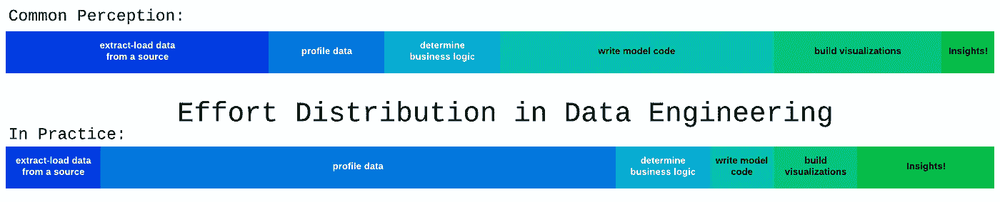

# 嘿，数据工程师，这是在源代码中

> 原文：<https://towardsdatascience.com/hey-data-engineers-its-in-the-source-code-ea241f1dd52a?source=collection_archive---------35----------------------->

*关于数据剖析的一些想法，以及如何通过学习阅读应用程序源代码来超越它。*

作为一名数据工程师，你有没有尝试过解释你实际上*做的*是什么？例如，如果一个聚会上没有技术背景的人问起数据工程，你如何描述这项工作？我使用了关于缩放的比喻(“如果数据科学家是制作汤的米其林明星厨师，我的工作就是想出如何制作足够的汤来养活一支军队。”)或过于简化的管道(“我构建移动、整合和处理数据的东西”)。尤其是一个比喻，最近已经成为我个人最喜欢的，主要是因为它的准确性(也因为它听起来很酷):

> 数据工程师是考古学家的一种。我们挖掘一个组织的事务化石和工件，并使用它们来确定过去事件的事实，以便我们可以从中学习。

当然，这个角色很复杂，许多数据工程师做的远不止这些。但是对于许多数据团队来说，数据工程师负责业务逻辑转换和建模，这个数据剖析过程——理解我们的源数据，以便我们可以将其转换成更直观的形状——是工作中最耗时(也是最昂贵)的部分之一。


We have the data! Now, does anyone know what the `user_prod_xq` column does?

数据剖析很难。这很难，因为源系统并不真正关心我们这些数据人员——他们也不应该关心。源系统有一项工作要做，如销售我们的产品，向我们的客户做广告，或管理我们的工资单等。我们希望这些系统 100%专注于做这项工作，而不是担心让他们在这个过程中留下的数据痕迹易于阅读。这意味着数据可能会被它们所服务的交易目的的噪音所扰乱。这也意味着我们通常没有一个事件的实际记录*，只有周围的证据*，需要通过仔细的研究收集逻辑来填补空白。

数据剖析也很难，因为我们经常错误地假设一些人或不知名的部门知道“数据”我们相信我们的 DBA 一定知道`temp_orders_related_bypass`表的用途，或者至少有一个应用程序开发人员能够很容易地解释`users.highest_purchase_threshold`列是如何填充的。有时候会。更常见的是，他们*认为*他们了解，也就是说，他们对一个实体有足够的了解来做他们的工作，但没有完整的了解。而如果 codebase 已经存在几年了， ***很可能他们完全没有概念*** 。这并不罕见，也不是您的 DBA /开发团队的一个失误。在某些情况下，他们不会比你知道得更多，这是有充分理由的:

*   对象关系映射器(ORM)是许多应用程序用来与数据库交互的工具。这些从软件开发中抽象出许多 DBA 类型的工作，结果是没有人真正设计数据库模式。很难从开发者那里得到关于机器人为他们建造的桌子的答案。
*   人来人往。您有疑问的数据集可能是由一位前员工或早已去世的顾问创建的。除非他们煞费苦心地记录数据集(遗留代码很少出现这种情况)，否则部落知识会随着创造者一起离开。
*   代码库变得越来越大，人们没有无限的记忆。一个没有记录他们 3 年前编写的代码/创建的表格的 DBA 或软件工程师很可能记得细节，就像我记得我高中时的储物柜组合一样(提示:不太可能)。



No science behind this, but it feels pretty accurate to me.

# 一个实际例子

假设您的公司提供楼宇安全管理软件即服务，并希望监控保安物业巡查的性能，并可能对其应用预测分析。当警卫走过物业时，他们会在每个由您的产品管理的外门读卡器上刷一个 RFID 密钥卡。如果出现任何问题(如入侵者)，他们会立即停止走动，并通过您的产品向值班经理发送电子邮件。您在密钥卡阅读器和外发电子邮件上都有来自您产品的源数据。

两个数据集都不会有“财产步行”或“步行问题”的表格，就像考古学家不会找到一块刻有公元前 2412 年 15 万人在这里战斗的古代石碑一样。相反，您将依靠石箭头和数据的化石遗迹来讲述故事(即`outgoing_emails`和`keyfob_swipes`表)。您的模型可能会包括“完整的财产巡查”记录，即保安在每个门上刷卡，“不完整的财产巡查”记录，即保安错过一个或多个门的记录，以及“事件财产巡查”记录，即在刷卡的给定时间窗口内发送电子邮件的记录。但是您还没有分析数据！找出隐藏的复杂性，那些数据不能告诉你的，是你大部分工作的真正所在。假设该建筑在去年增加了包含在步行路线中的密钥卡阅读器，或者在 2 个月的时间里，该建筑在更换密钥卡供应商时为所有警卫使用一个共享的密钥卡。或者假设两个保安住在大楼里，当作为租户进出时使用他们的 fob，或者当值班经理离开时，他们从数据库中被删除，以及该经理的所有依赖于外键的电子邮件记录。数据不能告诉你这些，任何查看相同数据的人(无论是 DBA 还是开发人员)也不能推断出这些东西。

那么，我们在哪里找到这些复杂问题的答案呢？如果有足够的时间和资源，软件开发人员和数据库管理员*最终会给他们提供答案吗？*

寻找答案的一个明显的地方是主题专家和组织历史。拜访部门负责人，询问 2017 年夏天是否发生了什么事情，可能会找到一个简单的解决方案，比如“我们买了一个新仓库”或“我们开了第二家店”。但是很多时候，组织中的任何人都无法帮助你。对于在其他地方找不到的隐藏的复杂性的非常重要的一部分，那些 DBA 和软件工程师有另一个锦囊妙计…

# 他们阅读源代码

就像任何需要添加的功能或需要修复的错误一样，第一步是通读现有的代码，以了解一件事情是如何工作的。考虑逻辑数据“监管链”:如果应用程序是与生产数据库交互的东西，应用程序源代码是定义应用程序行为的东西，那么我们的绝大多数答案实际上都在应用程序代码库中。更重要的是，受版本控制的源代码可以让我们“穿越时空”,轻松地查看记录创建时的代码。这在许多年前应用程序的行为非常不同并且记录反映了这些差异的情况下非常有用。

您不需要精通编写源应用程序的语言——远非如此。如果你的主要产品是基于 Rails 的，那就在周末学习足够的 Ruby 吧。如果是 Django，看几个 Python 101 的视频。即使您无法编写一行可编译的代码，您也可以轻松地解决这个问题

```
if user.is_active:
    user.send_email()
```

可能意味着我们只给活跃用户发邮件。代码库通常比您预期的更直观——例如，如果您了解到应用程序的`models`文件夹包含所有连接到数据库的代码，那么当试图理解用户表的一个奇怪之处时，`models/users.rb`是一个很可能的起点。

即使它不能 100%回答您的问题，亲自阅读代码通常可以让您完成 80%的工作，并让 DBA 或开发人员轻松完成最后 20%的工作。考虑这两个请求:

> **request 1** :我需要知道为什么`users.system_id`和`users.admin_id`的匹配率是 75%，但是旧的记录却是 100%。你能帮我吗？
> 
> **请求 2** :我正在试图找出为什么`users.system_id`与`users.admin_id`匹配的几率为 75%，但是在一月份之前的记录中，它与`users.admin_id`匹配的几率为 100%。看起来我们在第 76 行的文件`users_import_ids.php`中的<提交 sha >中提交了一个修改，它调用了第 91 行的另一个类来填充 system_id，但是另一个类使用了一些我不太理解的代码。你能帮我吗？

第一个请求是您在不阅读任何应用程序代码的情况下所能做的最好的事情。第二个是你可以做些额外的努力。一旦您能够自助，您的数据分析工作会变得多么迅速和有效，这其中的差别是惊人的。您会发现大多数开发人员和 DBA 都很乐意帮助您深入并“带您参观”存储库——因为您知道的越多，您的问题就变得越简单。