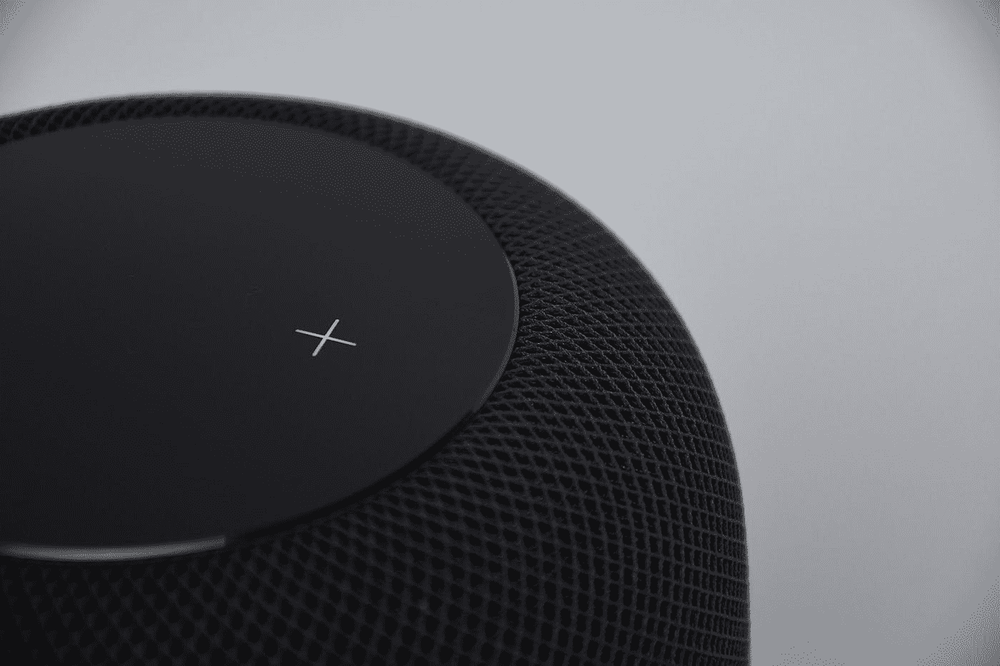

# 嘿人类，让我们谈谈！

> 原文：<https://towardsdatascience.com/hey-human-lets-talk-1669e3e043b1?source=collection_archive---------37----------------------->

## 对话式人工智能就在这里，它想要提供帮助

德克·克内梅尔和乔纳森·福利特

Figure 01: Conversational AI can connect the consumer experience across channels — from Web site to mobile app to smart speaker.
[Photo: [“HomePod” by Przemyslaw Marczynski on Unsplash](https://unsplash.com/photos/04TYM24Wi2c)]

广告业的未来会让我们的生活变得更好吗？大多数人讨厌广告:播客中的可怕信息试图让你购买你不感兴趣的东西，现有的几乎每个网站上的显示广告，以及在你的屏幕和耳机上爆炸的弹出视频，充满声音和愤怒，毫无意义。这是一种商业上可以接受的折磨，真的。

不存在全球退出。参与公共数字空间包括一个隐含的社会契约来吸收这种不和谐的噪音。虽然你的大脑已经变得善于将这些入侵推到背景中，但它们仍然在那里——对你试图完成或享受的事情增加了一层恼怒。

然而，正是广告给你带来了你正在使用的平台。事实是，创作者需要为他们制作的东西得到报酬。出于多种原因，互联网培养了一种人们想要免费东西的文化。广告已经悄悄进入，充当支付代理。我们可能会发现它是邪恶的，但它是必要的。没有它，互联网将只是一个今天的空壳，或者可能会采用替代的货币化策略，甚至更令人厌恶。

Figure 02: Your brain has become adept at shoving these intrusive marketing messages into the background.
[Photo: [“Times Square” by Joshua Earle on Unsplash](https://unsplash.com/photos/X_roZ7toBJY)]

Andy Mauro， [Automat](https://www.automat.ai/) 的联合创始人兼首席执行官，设想了一个市场营销和广告为消费者提供增值服务的未来——而不是遵循破坏和降低我们体验的长期传统。Mauro 已经在语音识别领域工作了近 20 年，他的公司 Automat 为品牌创造了对话式人工智能。

> “我有时会对人们说，‘我职业生涯的前半部分致力于人们讨厌的东西——那些电话语音(识别)系统，后半部分致力于没人用的东西——那就是移动语音助手，比如 Siri，”毛罗说实际上，我们仍然在寻找对话式人工智能中难以捉摸的杀手用例。"

对话式人工智能是语音识别、智能扬声器和聊天机器人(各种基于语言的对话技术)的总称。“我认为只有一个术语实际上很有用，”毛罗说。“因为从自然语言理解的角度来看，底层技术几乎是相同的。理解口头或键入的自由形式文本的能力，以及建立对话、来回对话的技术——这在基于语音和文本的输入之间几乎完全相同。”

Mauro 和 Automat 的团队正在研究的技术之一是对话显示广告。“我认为，如果你试图建造一些有意义的东西，一个真正值得关注的地方是每个人都做但没有人喜欢的东西，”毛罗说。“我不认为许多消费者会说他们喜欢展示广告。我想说，大多数在它们身上花了很多钱的品牌也可能会说，“我也不确定我是否喜欢它们。”周围有问题，有人看到了吗？看到他们的东西是一个真实的人，还是某种自动系统在操纵数字？最终，我从这个广告中获得了任何价值吗？"

对话式展示广告试图为消费者提供更好的东西。“例如，我正在阅读一个汽车博客。我是一个汽车爱好者，正在考虑买车，我看到了一则广告。今天这个广告，充其量，会给我一些融资信息和汽车的图片。如果我点击它，它会把我带到制造商的网站或经销商。它让我偏离了我正在阅读的内容，”毛罗说。“通过对话式展示广告，我可以点击进入该广告，而无需离开内容页面……我还可以与虚拟销售顾问聊天，他可以告诉我一些关于汽车的事情，回答我的问题，甚至可以为我安排试驾。所以，这是更好的消费者体验。非常非常重要的是，在这个数据隐私和安全的世界，以及谷歌和脸书发生的所有事情……从消费者的角度来看，这是非常透明和非常自愿的。你知道你在和一个品牌聊天，当你提供你可能正在寻找的信息时。这比在脸书上进行搜索或喜欢某样东西要透明得多，因为你根本不知道自己选择的是商业交易还是广告交易。”这听起来像是一个巨大的升级。然而，今天，广告是你潜意识里屏蔽的东西，甚至在你意识到它们存在之前，毛罗描述的功能类型更具辅助性。这是一种与用户需求和愿望同步的在线体验，同时还提供企业利益补偿和激励。

毫无疑问，电子商务创新的时机已经成熟。“对于我们这些已经生活了一段时间的人来说，能够在凌晨 3 点穿着睡衣购物是一次了不起的经历。它压缩了时间和空间，这是最优秀、最成功的创新经常做的事情，”Mauro 说。“但在过去 20 年里，没有人真正思考过(那段经历)。我的意思是，电子商务在很大程度上仍然只是产品图像的网格，无论你是在购买电池，还是在购买 5000 美元的手袋，或者是在购买汽车。”

“我们发现，在各种类型的电子商务中，优雅的服务不仅可以带来更好的消费者体验，还可以通过与客户聊天带来更好的业务成果，”Mauro 说。“我们通常谈论的是网络或移动体验，即基于文本的聊天。从参与度和客户满意度的角度来看，我们已经看到了非常惊人的结果。”

Automat 团队还致力于通过对话式人工智能连接不同渠道的消费者体验。对于许多消费者来说，一家公司的跨渠道体验——从网站到应用程序，再到实体商店——可能看起来是脱节的，并且差异很大。“我们认为这种利用与品牌个性相关的对话体验的想法可能是一种提供关联体验的好方法，”Mauro 说。“我可以与同一个人(在这种情况下是虚拟化身)进行统一的对话，并在整个消费过程中获得我需要的东西。”从品牌的角度来看，保持渠道的一致性非常重要。品牌战略的一部分是识别品牌的个性。语音使这一战略愿景在虚拟化身中得以体现。此外，由于聊天机器人和语音技术如此容易地融入任何数字界面，它可能变得似乎无处不在。“这是一次非常相关的经历，”毛罗说。“即使你在网上聊天以了解产品，也许你在手机上聊天以了解订单状态，也许你有一个使用问题，你实际上与你的智能扬声器交谈。”

Automat 采访了数百名喜欢在品牌或零售商网站上交谈的个人消费者。“人们觉得他们得到了在网站上找不到的信息，”毛罗说。“现在，事实上，网站几乎总是在某个地方有产品信息，但它是…在一个他们必须做大量阅读才能获得它的地方。因此，他们觉得自己获得了无法通过其他方式获得的信息。”

这一切都归结为任务完成。聊天机器人——如果做得好的话——可以从数据库中提取相关信息并迅速提供给你，而不是绝望地在一个网站上导航，而不是与一个在你和许多其他客户之间玩弄你的人聊天。因此，你会觉得时间过得更快，实际上花了更多时间与公司打交道。“很多人认为像这样的引导式产品推荐是关于产品发现，找到合适的产品。我们学到的是，虽然这当然是真的，但它真正关乎的是产品信心。所以，人们觉得产品还可以，但他们真正需要的是有人，或者在这种情况下，一些东西，来强化并告诉他们为什么这实际上是适合他们的产品。

## **自然语言处理和自动化的发展**

当然，尽管对话式人工智能可以创造一些重大胜利，但它并不是万无一失的。“在语言方面，人类远比机器好得多，”毛罗说。"我认为我们离根本性的变革还有很长的路要走。"在人类交流中，通常没有单一的意图或单一的潜在信息。语言比那更复杂，但是现在，NLP 技术有它的限制。“底层技术基础设施正迫使我们走上一条每一句话都需要满足一件事的道路。”毛罗说。"这并不是语言真正的工作方式."自然语言处理的下一个突破可能需要持续的理解——在这种情况下，机器不仅可以解释一个人此刻正在说的话的意思，还可以解释这个意思在这个人继续说话时是如何演变的。“关于语言是否等同于 AGI 或人工智能问题，存在着真实、合法、哲学和技术上的争论，”Mauro 说。“如果解决了语言，有没有让计算机变得和人类一样聪明？这两件事有很大关系吗？”

Figure 03: There’s usually not a single intent, or one single underlying message, in human communication.
[Photo: [“Between lines” by JR Korpa on Unsplash](https://unsplash.com/photos/JXb5j1vdWSI)]

关于这些技术可能如何改变未来工作的前景，Mauro 有一些鼓舞人心的想法。“我们可能会获得哪些我们没有预料到的自动化功能，这些功能不会使现有工作自动化，但实际上会做一些以前没有做过的事情？我可以从哪里获得我无法以任何方式获得的帮助？我认为这是一种更有创造性、更有希望、更令人兴奋的看待它的方式。我真的想挑战每个人，让他们不要认为有人有 X 工作，让人工智能来做吧。让我们考虑提供新的就业形式，只有人工智能可以[帮助实现]，”毛罗说。如果对话式人工智能可以帮助实现更好的消费者体验，也许新形式的营销工作也即将到来。

[*Creative Next*](http://www.creativenext.org/) *是一个播客，探索人工智能驱动的自动化对创意工作者，如作家、研究人员、艺术家、设计师、工程师和企业家的生活的影响。本文伴随* [*第二季第九集——对话式营销前沿*](https://creativenext.org/episodes/frontiers-of-conversational-marketing/) *。*