# 嘿，模特，你为什么说这是垃圾邮件？

> 原文：<https://towardsdatascience.com/hey-model-why-do-you-say-this-is-spam-7c945cc531f?source=collection_archive---------16----------------------->

## 将原因附加到模型预测


Shapley 值在机器学习中用于解释复杂预测模型的预测，*又名*“黑盒”。在这篇文章中，我将使用 Shapley 值来确定 YouTube 评论的关键术语，这些术语解释了为什么一个评论被预测模型预测为垃圾或合法。特定关键术语的“联盟”可以被认为是模型返回给定预测的“原因”。此外，我将使用聚类来识别在如何使用这些关键术语方面有相似之处的评论组。最后，我将进一步概括预测原因，以便使用代表原因类别的更少关键术语的字典对评论组进行分类。

## 序文

遵循这篇文章中的代码片段需要 Python 和 r。包含所有代码片段的完整 Jupyter 笔记本可以在[这里](https://gist.github.com/alessiot/769ebe433adf79725b08687cf889f4cb)找到。运行代码所需的 Python 库如下。我们将使用 *rpy2* 库在 Python 中运行 R 的实例。

```
import rpy2.ipythonfrom rpy2.robjects import pandas2ripandas2ri.activate()%reload_ext rpy2.ipythonfrom sklearn import model_selection, preprocessing, metrics, svm
from sklearn.feature_extraction.text import CountVectorizer
from sklearn import decomposition, ensembleimport pandas as pd
import numpy as npimport stringimport matplotlib.pyplot as plt
import seaborn as sns
%matplotlib inlineimport xgboostimport shap, time
```

## *沙普利法*

沙普利值是在合作博弈理论中进行的一项研究的结果。他们告诉如何在玩家之间公平分配“奖金”。当使用先前训练的模型预测数据实例的标签时，可以通过假设数据实例的每个特征值是游戏中的玩家来解释该预测，其中该预测是支出。Shapley 值是所有可能的要素组合中某个要素值的平均边际贡献。Christoph Molnar 的在线书籍提供了更多的细节。

我们可以用一个简单的例子来介绍 Shapley 方法:XOR 表。我们将在接下来的章节中进行更详细的讨论。

```
data = {'F1':[0,0,1,1], 'F2':[0,1,0,1], "Target":[0,1,1,0]} #XOR
df = pd.DataFrame(data)X = df[["F1","F2"]]
y = df["Target"].values.tolist()df
```

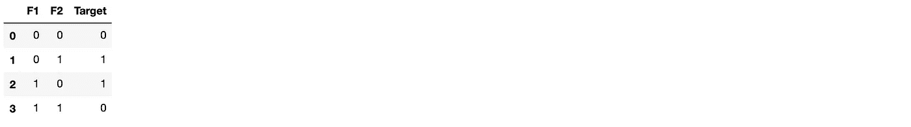

为了计算 Shapley 值，我们首先需要训练一个模型。例如，让我们使用径向基函数核的 SVM。我们现在可以使用 Python 库 *shap* 计算 Shapley 值。

```
clf = sklearn.svm.SVC(kernel='rbf', probability=False).fit(X, y) df["Prediction"] = clf.predict(X)# Explaining the probability prediction results
explainer = shap.KernelExplainer(clf.predict, X)
shap_values = explainer.shap_values(X)pd.concat([df, pd.DataFrame(shap_values, 
           columns='shap_'+ X.columns.values)], axis=1)
```


从上述结果可以看出，当每个数据实例的两个特征的计算贡献(Shapley 值)都为负时，预测为 0，当 Shapley 值都为正时，预测为 1。请注意，这两个贡献加起来就是该实例*的预测与预期预测𝐸(𝑓之间的初始差值，它是实际目标值的平均值，如下所示:*

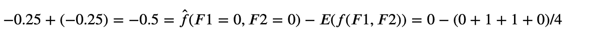

## YouTube 垃圾评论

我们将使用一个文本分类数据集，从 5 个不同的 YouTube 视频中收集 [1956 条评论。这些评论是通过 YouTube API 从 2015 年上半年 YouTube 上观看次数最多的十个视频中的五个收集的。数据集包含被标记为合法邮件或垃圾邮件的非编码邮件。由于我将在本文稍后再次使用 R，我决定使用我在搜索数据集时找到的](http://www.dt.fee.unicamp.br/~tiago//youtubespamcollection/) [R 片段](https://github.com/christophM/interpretable-ml-book/blob/master/R/get-SpamTube-dataset.R)下载数据集。

上面的代码片段会将 csv 格式的文件下载到本地文件夹。我们可以使用*熊猫*图书馆来探索内容。

```
youtube_data = pd.read_csv("youtube_data/TubeSpam.csv")
youtube_data.head()
```

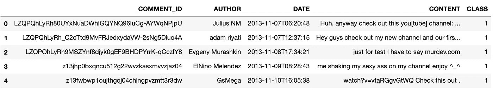

我们可以选择稍后将用于建模的列内容和类，并删除缺少内容的行。运行下面的代码片段将返回 1954 行，并显示标签 0(合法评论)和 1(垃圾评论)在删除重复行后出现的次数大致相同。

```
youtube_df = pd.DataFrame()
youtube_df['text'] = youtube_data['CONTENT']
youtube_df['label'] = youtube_data['CLASS']
youtube_df.dropna(inplace=True)youtube_df.groupby('label').describe()
```

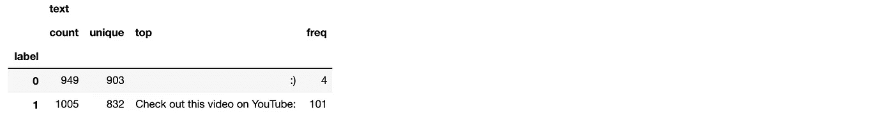

```
youtube_df.drop_duplicates(inplace=True)
```


\

我们可以看看合法评论和垃圾评论在长度上是否有明显的区别

```
youtube_df['length'] = youtube_df['text'].apply(len)
youtube_df.hist(column='length', by ='label', bins=50, figsize = (10,4))
```

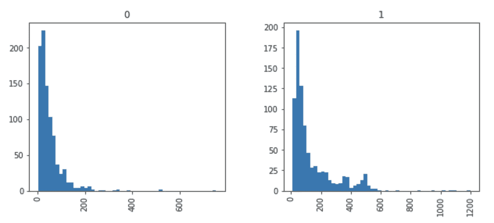

显然，垃圾评论平均来说要长一些。最长的注释之一是，例如:

```
youtube_df[youtube_df['length'] == 1077]['text'].iloc[0]
```

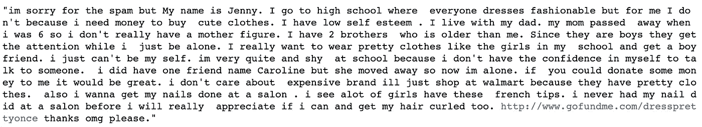

## 预处理注释

在使用文本数据进行建模之前，我们将使用一些标准的自然语言处理(NLP)技术对其进行清理。特别是，我们将删除数字，标点符号，额外的空格，将所有单词转换为小写，删除停用词，词干和词条。为此，我们将使用 Python 库 *nltk* 。

```
from nltk.tokenize import word_tokenize
from nltk.corpus import stopwords # nltk.download('stopwords')
from nltk.stem import PorterStemmer
from nltk.stem import WordNetLemmatizer #nltk.download('wordnet')import string, restop_words = list(set(stopwords.words('english')))
stemmer= PorterStemmer()
lemmatizer=WordNetLemmatizer()translate_table = dict((ord(char), None) for char in string.punctuation)def nltk_text_preproc(text_in):
    text_out = re.sub(r'\d+', '', text_in) # rm numbers
    text_out = text_out.translate(translate_table) # rm punct
    text_out = text_out.strip() # rm white spaces return text_outdef nltk_token_processing(tokens):
    tokens = [i.lower() for i in tokens]
    tokens = [i for i in tokens if not i in stop_words]
    tokens = [stemmer.stem(i) for i in tokens]
    tokens = [lemmatizer.lemmatize(i) for i in tokens]

    return tokens
```

之前，我们可以查看数据集中的前 10 条评论

```
pd.options.display.max_colwidth = 1000
youtube_df['text'].head(10)
```

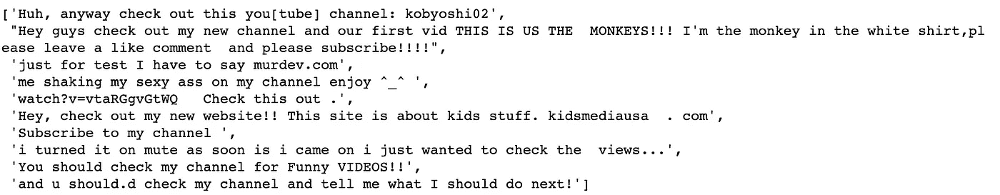

之后，使用我们的预处理步骤

```
youtube_df['text'].head(10).map(lambda x: nltk_text_preproc(x)).map(lambda x: nltk_token_processing(word_tokenize(''.join(x)))).map(lambda x: ' '.join(x))
```

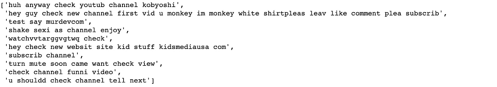

在继续之前，我们现在准备处理数据集中的所有文本。

```
youtube_df['text'] = youtube_df['text'].map(lambda x: nltk_text_preproc(x))
youtube_df['text'] = youtube_df['text'].map(lambda x: nltk_token_processing(word_tokenize(''.join(x))))
youtube_df['text'] = youtube_df['text'].map(lambda x: ' '.join(x))
```

新数据集包含 1735 行。

## 从文本创建要素

在这一部分，预处理的文本数据将被转换成特征向量。我们将使用 *nltk* Python 库的*计数矢量器*方法。这将文本行转换成一个矩阵，其中每一列代表所有文本中的一个术语，每个单元格代表特定术语在给定行中出现的次数。

```
count_vect = CountVectorizer(min_df=0.01, 
                             max_df=1.0, ngram_range=(1,3)) 
count_vect.fit(youtube_df['text'])
youtube_df_text = count_vect.transform(youtube_df['text'])
```

这里，我们请求删除出现在不到 1%的评论或所有评论中的术语，并要求 CountVectorizer 计算最多 2 个连续术语的 n 元语法。

例如，第二个注释(行)

```
text_example_orig = youtube_df['text'][1]
print(text_example_orig)
```

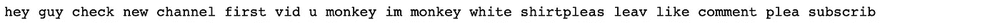

成为

```
text_example = count_vect.transform([text_example])
print(text_example)
```

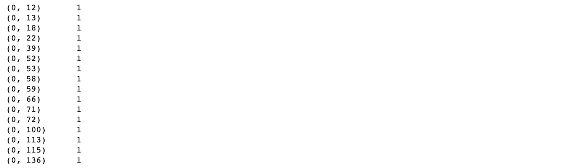

如果我们想知道哪些项对应于 CountVectorizer 返回的索引，我们可以使用下面的代码

```
for row, col in zip(*text_example_transf.nonzero()):
    val = text_example_transf[row, col]
    #print((row, col), val)
    print(count_vect.get_feature_names()[col])
```

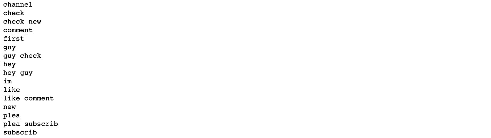

计数矩阵不是标准矩阵，而是稀疏矩阵

```
print ('Shape of Sparse Matrix: ', youtube_df_text.shape)
print ('Amount of Non-Zero occurences: ', youtube_df_text.nnz)
print ('sparsity: %.2f%%' % (100.0 * youtube_df_text.nnz /
                             (youtube_df_text.shape[0] * youtube_df_text.shape[1])))
```

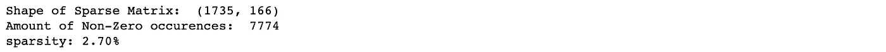

稀疏矩阵是包含极少非零元素的矩阵的最佳表示。事实上，用二维数组表示稀疏矩阵会导致大量内存浪费。在我们的例子中，有 1，735 行* 166 个项，这将导致具有 288，010 个元素的二维矩阵，但是只有 7，774 个具有非零出现(2.7%稀疏度)，因为不是所有行都包含所有项。

## 建模

我们将把数据集分成训练集和验证集。

```
train_x, valid_x, train_y, valid_y, index_train, index_val = model_selection.train_test_split(youtube_df_text, youtube_df['label'], range(len(youtube_df['label'])), stratify=youtube_df['label'], random_state=1, train_size=0.8)
```

现在属于训练集和验证集的合法评论和垃圾评论的数量是

```
np.unique(train_y, return_counts=True)
```

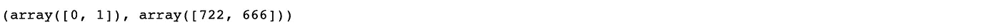

现在是时候训练我们的模型了

```
def train_model(classifier, feature_vector_train, label, feature_vector_valid, valid_label):
    # fit the training dataset on the classifier
    classifier.fit(feature_vector_train, label)

    # predict the labels on validation dataset
    predictions = classifier.predict(feature_vector_valid)

    return classifier, metrics.accuracy_score(predictions, valid_label), metrics.classification_report(predictions, valid_label)
```

看看它在验证集上的表现。我们将使用 XGBoost 分类器。

```
classifier, accuracy, confusion_matrix = train_model(xgboost.XGBClassifier(), 
            train_x, train_y, valid_x, valid_y)
print("Xgb, Accuracy: ", accuracy)
print(confusion_matrix)
```

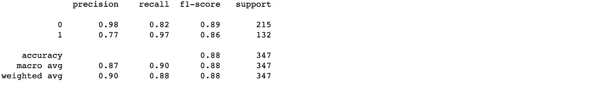

对于这篇文章来说，一个高性能的模型是不必要的。事实上，我们正在寻找一个关于特性和标签如何相互关联的一般性描述。事实上，这里我们只需要一个像样的模型。

## 用 SHAP 计算沙普利值

Python 库[SHAP](https://github.com/slundberg/shap)(SHapley Additive explaints)可以解释任何机器学习模型的输出，特别是它为[树集成方法](https://arxiv.org/abs/1802.03888)提供了高速精确算法。这就是为什么我们的模型是 XGBoost 模型的原因之一。在我们的例子中，计算 SHAP 值只需要几分之一秒。这里，我们计算整个数据集的 SHAP 值。请注意，将 XGBoost 与逻辑目标函数结合使用时，SHAP 值是对数优势。要将对数优势差额转换为概率，我们可以使用公式 odds = exp(对数优势)，其中 p = odds/(1+odds)。在本节的最后，我们将做这个练习，但现在让我们首先计算 SHAP 值并研究它们。

```
t0 = time.time()
explainer = shap.TreeExplainer(classifier)
shap_values_train = explainer.shap_values(youtube_df_text)
t1 = time.time()
timeit=t1-t0
print('time to compute Shapley values (s):', timeit)
```

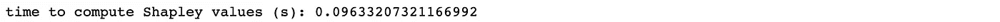

将稀疏矩阵转换成密集矩阵是很方便的。

```
txt_dense_df = pd.DataFrame(youtube_df_text.todense(), 
                            columns=count_vect.get_feature_names())
shap_values_train_df = pd.DataFrame(shap_values_train, 
                                    columns=txt_dense_df.columns)
```

有了这个数据框，我们就可以计算整体要素的重要性

```
shap_sum = np.abs(shap_values_train_df).mean(axis=0)
importance_df = pd.DataFrame([txt_dense_df.columns.tolist(), 
                              shap_sum.tolist()]).T
importance_df.columns = ['column_name', 
                         'shap_importance (log-odds)']
importance_df = importance_df.sort_values('shap_importance (log-odds)', ascending=False)
importance_df['shap_importance (%)'] = importance_df['shap_importance (log-odds)'].apply(lambda x: 100*x/np.sum(importance_df['shap_importance (log-odds)']))
```

并且选择例如前 20 个特征

```
topN = 20
top20 = importance_df.iloc[0:topN]["column_name"]print('Cumulative Importance', 
      np.sum(importance_df.iloc[0:topN]["shap_importance (%)"]))shap_values_imp = shap_values_train_df[top20]shap.summary_plot(shap_values_train_df, 
                  txt_dense_df, plot_type="bar")importance_df.iloc[0:topN]
```

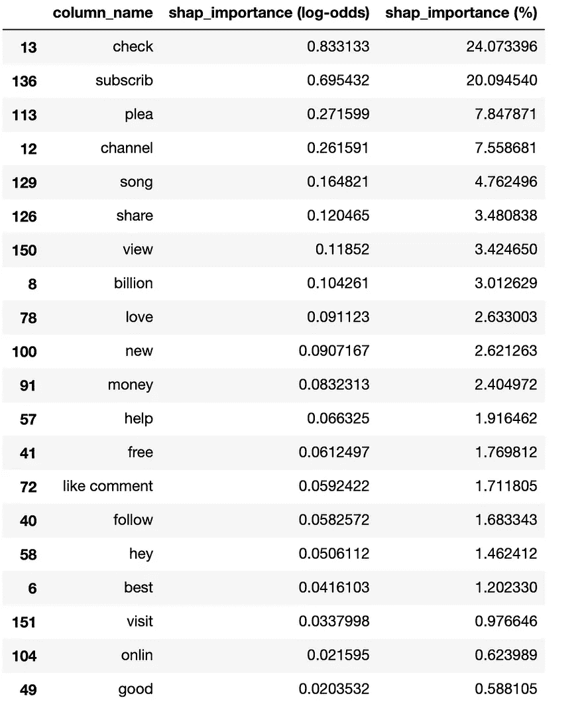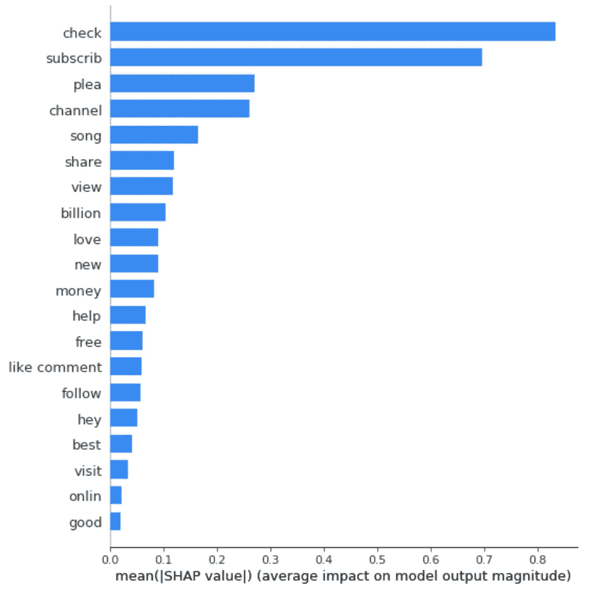

其累计“重要性”约为 94%。上面的条形图显示了每个特征的 SHAP 值的平均绝对值。

也可以使用更多的可视化来解释模型结果。举个例子，

```
j = 1
youtube_df.iloc[j]
```

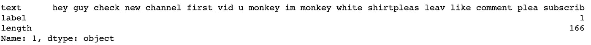

是典型的垃圾评论。我们可以显示有助于将模型输出从基础值(我们使用的训练数据集的平均模型输出)推至模型输出的项。将预测推向更高的对数优势值的术语显示为红色，将预测推向更低的对数优势值的术语显示为蓝色。在这个特殊的例子中，有一个典型的垃圾评论的所有“成分”。事实上，所有术语的 SHAP 值都将模型输出推至一个比平均输出值高得多的值。

```
shap.initjs()# visualize the j-prediction's explanation (use matplotlib=True to avoid Javascript)
shap.force_plot(explainer.expected_value, shap_values_imp.iloc[j].to_numpy(), 
                txt_dense_df.iloc[j][top20])
```

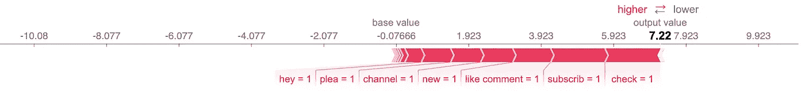

对于合法的评论，如

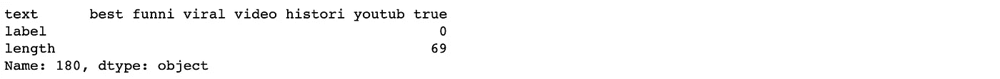

上面使用的可视化变成了

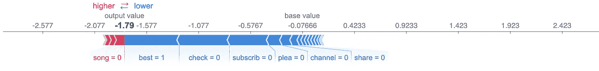

在我的[笔记本](https://gist.github.com/alessiot/769ebe433adf79725b08687cf889f4cb)中，我添加了更多的可视化内容，这并不是这篇文章的主要目的。

最后，让我们做一个将对数几率转换成概率的练习，看看 SHAP 值与它们有什么关系。

```
j = 1# log odds margin to prob
# odds = exp(log odds), p = odds/(1+odds)log_odds = np.sum(shap_values_train_df.iloc[j].to_numpy())
avg_model_output = np.mean(youtube_df['label']) # prob
log_odds_avg_model_output = np.log(avg_model_output/(1-avg_model_output))
predicted_prob = classifier.predict_proba(youtube_df_text.tocsc())[j][1] #target=1
predicted_log_odds = np.log(predicted_prob/(1-predicted_prob))print("Sum of Shaphley values (log-odds)for j-instance:", log_odds, 
      'prob:', np.exp(log_odds)/(1.0+np.exp(log_odds)))
print("Average model output:", avg_model_output)
print("Predicted probability value for j-instance:", predicted_prob,
      "Predicted value:", classifier.predict(youtube_df_text.tocsc())[j])print('log_odds:', log_odds, 'is expected to be equal to pred-expected:', predicted_log_odds-log_odds_avg_model_output)
print('pred-expected (prob):', predicted_prob-avg_model_output)
```

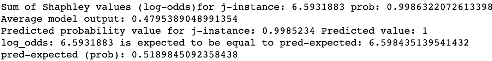

对于评论 j = 1，我们基于对数-赔率(SHAP 值)到概率的转换，计算了 SHAP 值(6.59)，对应于该评论是垃圾邮件(标签= 1)的概率为 99.86%。从模型预测的概率是 99.85%，略有不同，但足够接近。正如我在本文开头所说的，我们期望 SHAP 值(对数优势)等于预测值减去预期概率，这是所有实际目标的平均值(0.48)。

## 聚类 SHAP 值

本文之前选出的前 20 个术语可以用字典总结成更通用的“主题”:

```
top20_dict = {'ACTION': ['check','subscrib','view','share','follow','help', 'visit'],
 'REQUEST': ['plea','hey'],
 'VALUE': ['money','free','billion', 'new', "good", 'best'],
 'YOUTUBE': ['channel', 'song', 'onlin'],
 'COMMENT': ['love', 'like comment']             
}
```

因此，对于每个评论，我们可以确定运行以下代码片段的首要原因。

```
from itertools import chainntopreason = 1 #change this to allow more reasons to be capturedtop20_dict_values = list(top20_dict.values())
top20_dict_keys = list(top20_dict.keys())shap_values_imp_r = shap_values_imp.copy()
target_values_r = pd.Series(predictions)# Create summarizing labels
top_reasons_all = []
for i in range(shap_values_imp_r.shape[0]):

    shap_feat = shap_values_imp_r.iloc[i]
    shap_feat = shap_feat.iloc[np.lexsort([shap_feat.index, shap_feat.values])]

    topN = shap_feat.index.to_list()[-1:] 
    topN_value = shap_feat.values[-1:]

    topN_idx = []
    for topn in topN:
        for idx in range(len(top20_dict_values)):
            if topn in top20_dict_values[idx] and idx not in topN_idx:
                topN_idx.append(idx)

    #topN_idx = [idx for idx in range(len(top20_dict_values)) for topn in topN if topn in top20_dict_values[idx]]

    #Ordered by increasing importance
    top_reasons = [top20_dict_keys[x] for x in topN_idx]#print(i, topN, topN_idx, top_reasons)top_reasons_all.append(','.join(top_reasons))

shap_values_imp_r['target'] = target_values_r
shap_values_imp_r['top_reasons'] = top_reasons_all
```

在一个单独的 Jupyter 单元格中，我们将使用 R 来选择用于对评论的 SHAP 值进行分组的最佳聚类数。

```
%%R -i shap_values_imp_r -w 800 -h 800library(gplots)d_shap <- dist(shap_values_imp_r[1:(ncol(shap_values_imp_r)-2)]) 
hc <- hclust(d_shap, method = "ward.D2")
dend <- as.dendrogram(hc)library(dendextend)
library(colorspace)## Find optimal number of clusters
clusters_test = list()
for (ncl in 2:50){
    clusters_test[[ncl]] <- cutree(hc, k=ncl)
}
```

这里，我们使用层次聚类，聚类数量在 2 到 50 之间。回到 Python，我们计算每个聚类结果的*轮廓*分数。通过查看轮廓分数和聚类的可视化来决定要使用的聚类数量。在选择集群数量时，总是需要做出决定。

```
h_clusters = rpy2.robjects.r['clusters_test']h_clusters_sil = []
cl_id = 0
for cl in h_clusters:
    if cl is not rpy2.rinterface.NULL:
        sil = metrics.silhouette_score(shap_values_imp_r.drop(shap_values_imp_r.columns[len(shap_values_imp_r.columns)-2:], axis=1, inplace=False), 
                                       cl, metric='euclidean')
        h_clusters_sil.append(sil)
        #print(cl_id, sil)
        cl_id += 1
    else:
        cl_id += 1plt.plot(range(2, 51), h_clusters_sil)
plt.title('Silhouette')
plt.xlabel('Number of clusters')
plt.ylabel('Silhouette Index') #within cluster sum of squares
plt.show()
```

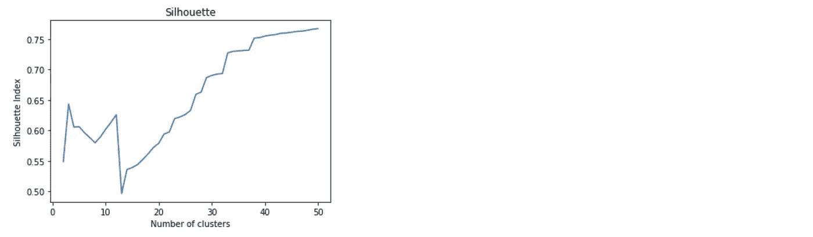

我们使用 Ward 的方法进行聚类，该方法使总的组内方差最小化。在每一步，具有最小聚类间距离的聚类对被合并。合并的高度(见下图)表示两个实例之间的相似性。合并的高度越高，实例越不相似。数据的平均[轮廓](https://en.wikipedia.org/wiki/Determining_the_number_of_clusters_in_a_data_set#The_silhouette_method)是评估最佳聚类数的标准。数据实例的轮廓是一种度量，它与它的分类中的数据匹配得有多紧密，与相邻分类的数据匹配得有多松散。剪影得分范围在-1 和 1 之间，最好为 1。在我们的例子中，我们选择 30 个聚类，以便在评论类型中有足够的粒度，并获得大约 0.70 的良好轮廓分数。

```
%%R -i shap_values_imp_r -w 800 -h 800library(gplots)d_shap <- dist(shap_values_imp_r[1:(ncol(shap_values_imp_r)-2)], 'euclidean') 
hc <- hclust(d_shap, method = "ward.D2")
dend <- as.dendrogram(hc)library(dendextend)
library(colorspace)n_clust <- 30dend <- color_branches(dend, k=n_clust) #, groupLabels=iris_species)clusters <- cutree(hc, k=n_clust)
#print(head(clusters))print(format(prop.table(table(clusters,shap_values_imp_r$top_reasons, shap_values_imp_r$target), margin=1), 
             digit=2, scientific = F))
print(format(prop.table(table(clusters,shap_values_imp_r$top_reasons), margin=1), 
             digit=2, scientific = F))heatmap.2(as.matrix(shap_values_imp_r[1:(ncol(shap_values_imp_r)-2)]), 
          dendrogram = "row",
          Rowv = dend,
          Colv = "NA", # this to make sure the columns are not ordered
          key.xlab = "Predicted - Average log-odds",
          #hclustfun=function(d) hclust(d, method="complete"), 
          srtCol=45,  adjCol = c(1,1))
```

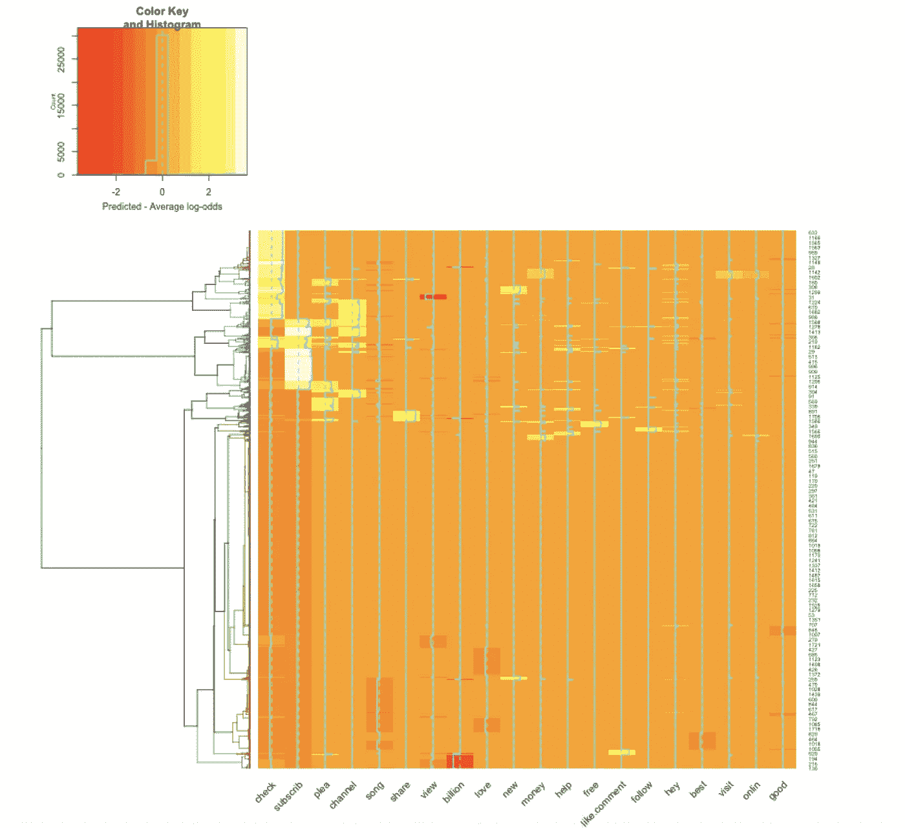

在上面的热图中，我们将分层聚类(左侧 y 轴)与前 20 个术语的重要性(x 轴，根据评论中相应术语对模型预测的影响而着色的单元格)相结合，前者显示了更接近的相似评论(右侧 y 轴上的数字是评论行号)。

我们可以通过汇总每个集群中的评论来进一步总结上面的热图。为了使这一步更通用，我们假设我们的数据集是一个标签未知的新数据集，并使用 k=1 的 k-最近邻分类器基于聚类结果预测标签。然后，在按预测标签分组后，我们可以聚合每个聚类中的 SHAP 值。

```
from sklearn.neighbors import KNeighborsClassifiercluster_model = KNeighborsClassifier(n_neighbors=1)
cluster_model.fit(shap_values_imp,rpy2.robjects.r['clusters'])predicted = cluster_model.predict(shap_values_imp_r[shap_values_imp_r.columns[:-2]]) grouped = pd.concat([shap_values_imp, pd.Series(youtube_df['label'].tolist(), name='avg_tgt')], axis=1).groupby(predicted)# compute average impact to model prediction output. 
sums = grouped.apply(lambda x: np.mean(x))
```

下面的热图显示了 30 个分类(y 轴)中的每个分类的前 20 个术语对模型预测的影响(z 轴上显示的对数优势)。

```
import plotly
import plotly.graph_objs as go
plotly.offline.init_notebook_mode()data = [go.Heatmap(z=sums[sums.columns[1:-1]].values.tolist(), 
                   y=sums.index,
                   x=sums.columns[1:-1],
                   colorscale='Blues')]plotly.offline.iplot(data, filename='pandas-heatmap')
```

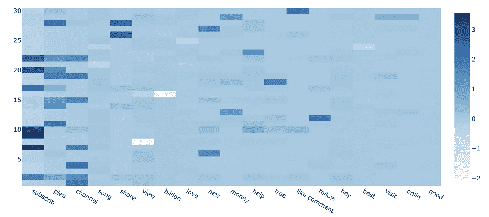

例如，从热图中，我们可以看到，聚类 30 主要是“喜欢的评论”2 元语法，如果我们查看平均预测标签，我们可以看到这是合法评论的聚类(“总和”数据帧的“avg_tgt”值)。聚类 8 平均来说是垃圾邮件聚类，并且以术语“视图”为主。

我们还可以聚集每个聚类中评论的 SHAP 值，以显示每个聚类中什么“主题”占主导地位。

```
agg_sums = pd.DataFrame({k: sums[v].mean(axis=1) for (k, v) in top20_dict.items()})data = [go.Heatmap(z=agg_sums[agg_sums.columns].values.tolist(), 
                   y=agg_sums.index,
                   x=agg_sums.columns,
                   colorscale='Blues')]plotly.offline.iplot(data, filename='pandas-heatmap')
```

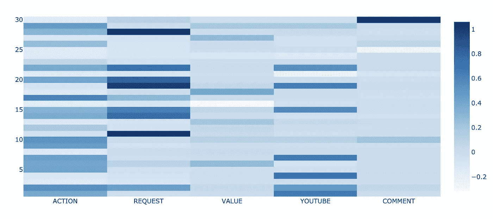

第 30 组的意见是

```
pd.options.display.max_colwidth = 1000cluster_no = 30ex_2 = youtube_df.iloc[rpy2.robjects.r['clusters']==cluster_no]
ex_2_pred = pd.Series(predictions[rpy2.robjects.r['clusters']==cluster_no])
ex_2_top = shap_values_imp_r.iloc[rpy2.robjects.r['clusters']==cluster_no]['top_reasons']ex_2
```

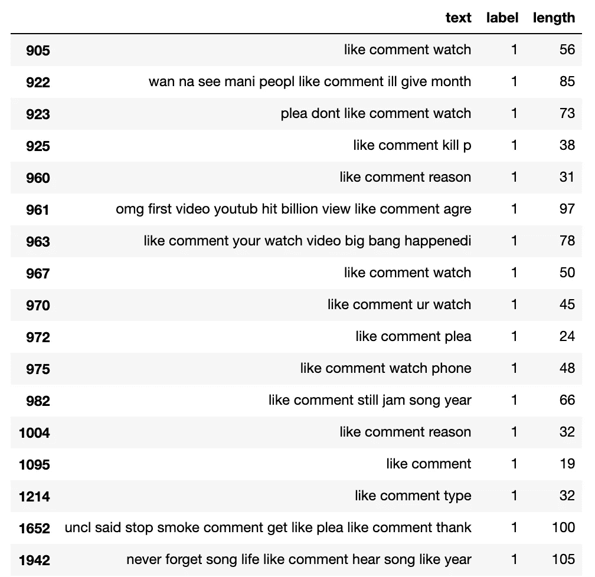

第 8 组的意见是

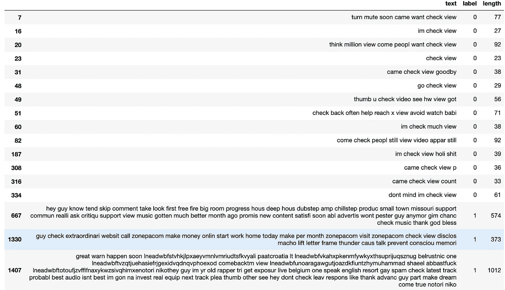

## 结论

在这篇文章中，我展示了如何使用 Shapley 值向模型分数添加信息，这是获得预测标签的“原因”。事实上，一个模型分数应该总是跟随着对这个分数的解释。此外，聚类 Shapley 值可用于识别数据实例组，这些数据实例可以用代表多种原因的更通用的主题来解释。

我要感谢 [Sundar Krishnan](https://medium.com/u/b61b6673cdce?source=post_page-----7c945cc531f--------------------------------) 和 [Praveen Thoranathula](https://medium.com/u/4d9e48e82766?source=post_page-----7c945cc531f--------------------------------) 的有益讨论。