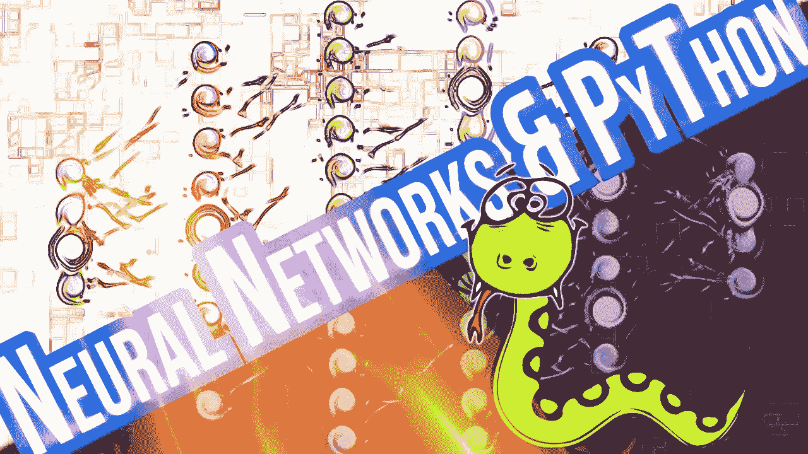
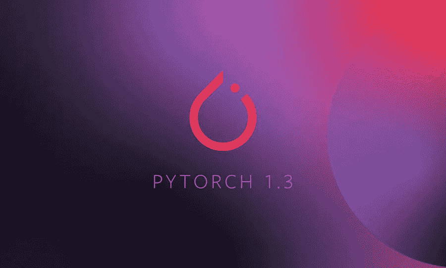
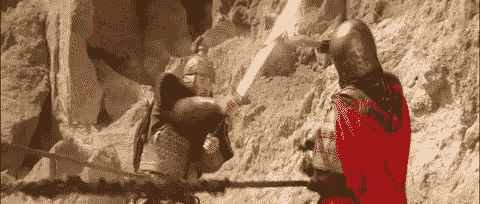
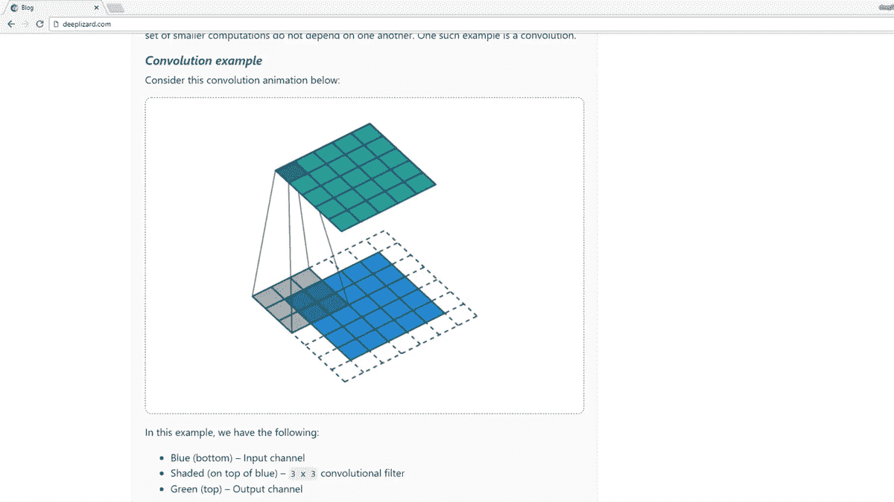
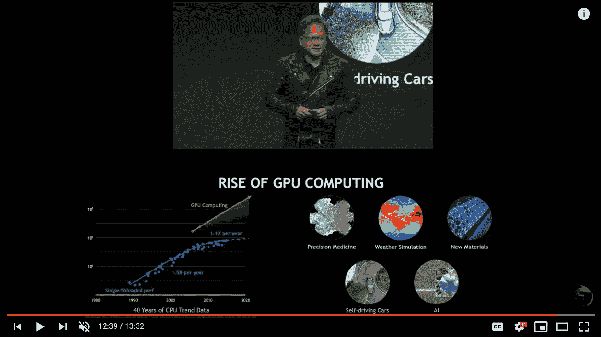

# 💎隐藏的宝石:一个伟大的 PyTorch YouTube 教程系列

> 原文：<https://towardsdatascience.com/hidden-gem-a-great-pytorch-youtube-tutorial-series-by-deeplizard-8de677411bc5?source=collection_archive---------16----------------------->

## 在你深入研究 fast.ai 源代码之前，一定要看一看

# 为什么是 PyTorch🔥？

答根据[维基百科](https://en.wikipedia.org/wiki/PyTorch):

> PyTorch 是一个基于 Torch 库的开源机器学习库，用于计算机视觉和自然语言处理等应用。它主要是由脸书人工智能研究小组开发的。

[脸书最近在 PyTorch DevCon 2019 上发布了备受期待的 1.3 版本，](https://venturebeat.com/2019/10/10/pytorch-1-3-comes-with-speed-gains-from-quantization-and-tpu-support/)增加了对谷歌 TPU、PyTorch Mobile 等的支持。另外， [**The Gradient**](https://thegradient.pub/) 发布了一份关于机器学习框架现状的[报告](https://thegradient.pub/state-of-ml-frameworks-2019-pytorch-dominates-research-tensorflow-dominates-industry/)，称越来越多的研究人员倾向于将 PyTorch 到 TensorFlow 作为他们的主要框架。如果您正在学习/使用 fast.ai 库，另一个很好的原因是它基于 PyTorch，因为它:

> "*使用常规 python 代码的所有灵活性和功能来构建和训练神经网络*",并且"*我们能够处理更广泛的问题*"

对我来说，和 PyTorch 一起工作感觉更自然，更像是蟒蛇。一个更好的类比是，使用 TensorFlow 开发机器学习模型就像穿着沉重的盔甲:它很强大，但非常笨重。PyTorch 给你所有的自由和流畅的动作。

Photo from GHYFY

# 介绍深蜥蜴🐊

Photo from [deeplizard vlog — YouTube](https://www.google.com/url?sa=i&source=images&cd=&ved=2ahUKEwiR4JvI6aHlAhVKRK0KHTUyDYUQjhx6BAgBEAI&url=https%3A%2F%2Fwww.youtube.com%2Fchannel%2FUC9cBIteC3u7Ee6bzeOcl_Og&psig=AOvVaw1MmF-Eeht5Pa5wlXeYyRJN&ust=1571351069273797)

但是 PyTorch 的灵活性是有代价的。进入 PyTorch 并不容易。更多的自由意味着你有更多的因素需要考虑，更多的细微差别需要平衡。

这就是为什么一个好的教程会帮助你平滑学习曲线。外面有很多资源。PyTorch 网站上杰瑞米·霍华德的[精彩教程是一个很好的起点。然而，如果你想更深入地研究，我建议你看看 YouTube 上 deeplizard 的](https://pytorch.org/tutorials/beginner/nn_tutorial.html) [PyTorch 教程系列](https://www.youtube.com/playlist?list=PLZbbT5o_s2xrfNyHZsM6ufI0iZENK9xgG)。

它简明扼要(尊重观众的时间)，相关(基于 PyTorch 1.1)，最重要的是，看起来很有趣。它使用了许多简洁的动画/图形编辑技术，使视频引人入胜，令人愉快。生产质量令人印象深刻。

# “作秀”让 deeplizard 的教程引人入胜🎭

Chris 非常擅长借助出色的动画和多功能的视频短片，以非常简洁明了的方式解释复杂的概念。他们的视频会让你从头到尾都忙个不停。有几件事非常突出:

## 动画、插图的大量使用，以及整体的美感

deep lizard uses animation to explain how convolution works

一些 YouTube 视频提供了出色的内容，但缺乏美感，尤其是截屏视频。观众通常大部分时间都要盯着一两个窗口，视觉上很枯燥，容易疲劳。但对深蜥蜴来说不是。这个团队非常擅长创作微妙而又富有美感的动画。即使对于通常是静态的背景图像，他们也创造了一些放大/缩小的效果，使其不那么无聊。动作非常细微，所以不用担心会晕车。许多赏心悦目的东西🍬我会说。

## 嵌入 TED 演讲、主题演讲和其他教育视频的相关短片

Image from deeplizard @ YouTube

嵌入相关但风格不同的内容的短视频剪辑是使学习引人入胜的另一种方式。如果只有一部分受到刺激，我们的大脑很快就会疲劳。看着同一个场景或者听着同一个人说话，人们不会把注意力保持足够长的时间。至少不花点心思是做不到的。嵌入各种风格的视频剪辑解决了这个问题。你大脑的不同部分变得兴奋，你可以毫不费力地保持学习流程。

## 男性、女性和一个名为“深蜥蜴”的特殊科幻风格的“人工智能”角色来解释不同类型的问题，增加内容的趣味性

R2D2 and C-CPO from theverge.com

除了频道的两个可爱的 YouTubers 用户[克里斯和曼迪](http://Chris and Mandy)，还有一个他们创造的虚拟“人工智能生物”作为第三个画外音。听起来像是星球大战电影里的 C-3PO，不过是女的。它引导浏览者完成调试过程，或者问一些发人深省的隐晦问题，等等。如果你喜欢科幻氛围，你会完全爱上它。同样，不那么无聊，更吸引人。

## 会员网站上良好的扩展内容

除了视频本身，他们还有一个会员网站，你可以在那里找到额外的学习材料:博客、测验、代码片段和其他额外的资源。它在付费墙后面，但我想说它是视频的一个很好的补充。

# 结论

T 何主外卖？我觉得他们让 PyTorch 看起来非常简单易懂。我觉得我完全可以在 PyTorch 上完成我的 ML 项目。虽然我只完成了他们的 PyTorch 教程，但我猜他们的其他内容也不错。请随意探索更多，并在下面告诉我您的体验。如果你正在学习 fast.ai 课程，因为它是建立在 PyTorch 之上的，你迟早要加强你的 PyTorch 知识，deeplizard 的教程是一个很好的起点。此处链接:

觉得这篇文章有用？在 Medium 上关注我([李立伟](https://medium.com/u/72c98619a048?source=post_page-----8de677411bc5--------------------------------))或者你可以在 Twitter [@lymenlee](https://twitter.com/lymenlee) 或者我的博客网站[wayofnumbers.com](https://wayofnumbers.com)上找到我。你也可以看看我下面最受欢迎的文章！

*   [“这是 CS50”:开始数据科学教育的愉快方式](/this-is-cs50-a-pleasant-way-to-kick-off-your-data-science-education-d6075a6e761a)
*   [一枚硬币的两面:杰瑞米·霍华德的 fast.ai vs 吴恩达的 deeplearning.ai](/two-sides-of-the-same-coin-fast-ai-vs-deeplearning-ai-b67e9ec32133?source=your_stories_page---------------------------)
*   我完成了吴恩达的机器学习课程，感觉棒极了！