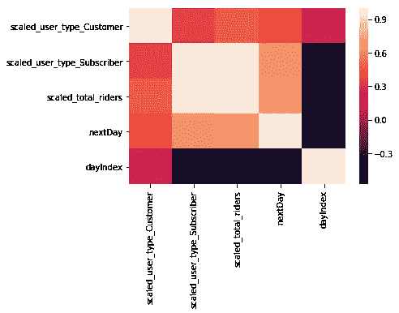
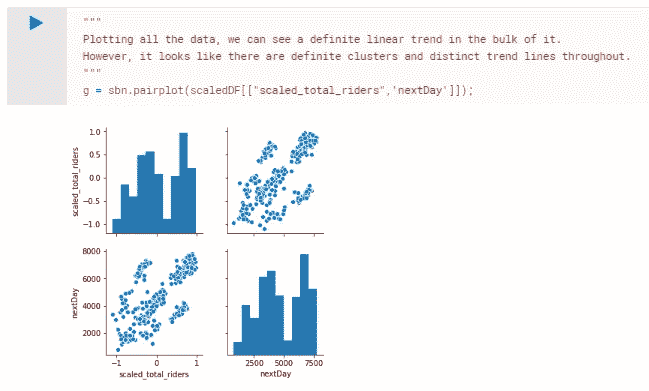
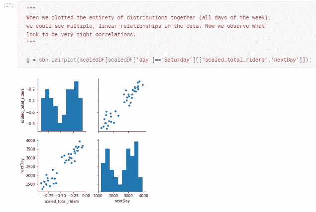
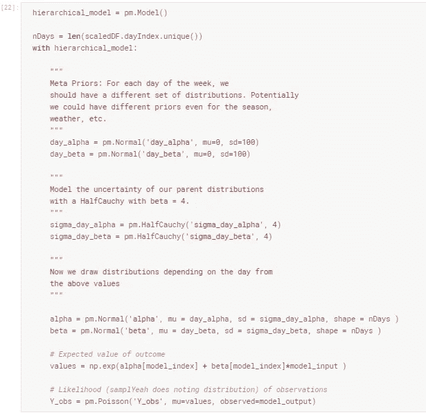
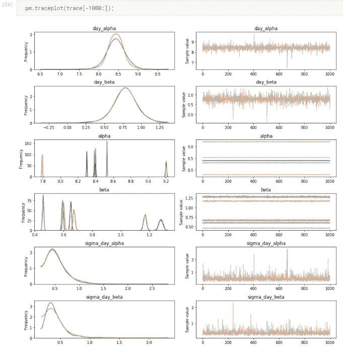
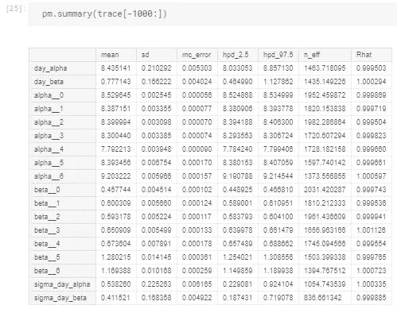
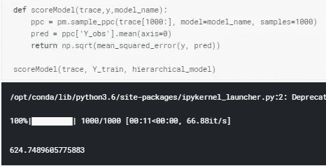
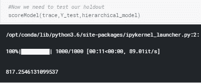

# 使用 PyMC3 对福特 GoBike 乘客进行分层贝叶斯建模—第二部分

> 原文：<https://towardsdatascience.com/hierarchical-bayesian-modeling-for-ford-gobike-ridership-with-pymc3-part-ii-23f84fb4a5e7?source=collection_archive---------12----------------------->

Photo by [sabina fratila](https://unsplash.com/@momhasapples?utm_source=medium&utm_medium=referral) on [Unsplash](https://unsplash.com?utm_source=medium&utm_medium=referral)

在本系列的[第一部分](/bayesian-modeling-for-ford-gobike-ridership-with-pymc3-part-i-b905104af0df)中，我们探索了使用基于贝叶斯的机器学习模型框架 [PyMC3](https://docs.pymc.io/) 来构建福特 GoBike 数据的简单线性回归模型的基础。在这个示例问题中，我们的目标是根据前一天的聚合属性预测明天将使用自行车共享的骑行者数量。那个微不足道的例子仅仅是我们展示我们的*贝叶斯笔触*的画布。

总结一下我们之前的尝试:我们根据数据建立了一个多维线性模型，我们能够了解权重的分布。这与标准线性回归模型相反，在标准线性回归模型中，我们接收点值属性。这些发行版可能非常强大！你的模型有多确定*特性 i* 驱动你的目标变量？对于概率编程，它被打包在你的模型中。我们将我们的模型结果与来自熟悉的 [sklearn 线性回归](http://scikit-learn.org/stable/modules/generated/sklearn.linear_model.LinearRegression.html)模型的结果进行了匹配，并基于 RMSE 度量发现了奇偶校验。

Some fairly strong correlations in our data.

老实说，我会在一个模型上花费更多的时间和精力来获得同样的结果吗？即使对模型输出有稍微好一点的理解？大多数情况下可能不会。我想了解*和*的结果。我们可以通过贝叶斯推理模型来实现这一点，而 PyMC3 非常适合实现这一点。

PyMC3 最擅长的特性之一是可定制的模型。我以前对这个问题的了解可以融入到解决方案中。可以估计测量不确定度。我可以解释许多偏差、非线性效应、各种概率分布，这样的例子不胜枚举。*有了*[*sk learn*](https://pypi.org/project/sklearn/)*或者*[*Spark ml lib*](https://spark.apache.org/docs/latest/ml-guide.html)*这样的包，我们作为机器学习爱好者就被赋予了锤子，我们所有的问题看起来都像钉子。有了 PyMC3，我有了一台 3D 打印机，可以为这项工作设计一个完美的工具。*

您可以从 PyMC3 中学到的最简单、最具说明性的方法之一是层次模型。很多问题都有结构。在一周的不同日子(季节、年份……)人们有不同的行为。气候模式不同。如果我们用标准方法设计一个简单的 ML 模型，我们可以对这些特性进行热编码。我们的模型会学习这些权重。我们还可以为我们正在研究的问题的每个版本建立多个模型(例如，冬季与夏季模型)。

事实是，我们在这里丢弃了一些信息。单个模型可以共享一些潜在的特征。在分层贝叶斯模型中，我们可以学习模型的粗略细节*和*特定上下文的微调参数。我们的福特 GoBike 问题就是一个很好的例子。如果我们绘制前一天(X)的所有数据，并查看第二天(*第二天*)的乘客数量，我们会看到不同斜率的多重线性关系。在上一篇文章中，我们有效地在大量数据中画了一条线，这使得 RMSE 最小化。当然，我们有一个非常好的模型，但是看起来我们似乎遗漏了一些重要的信息。

如果我们只绘制星期六的数据，我们会看到分布更加受限。真实的数据当然是杂乱的，而且线性关系是分散的。然而，与上面的分布相比，两者形成了鲜明的对比。那怎么办呢？我们可以简单地为一周中的每一天建立线性模型，但是对于许多问题来说这似乎很乏味。我猜，虽然周六和周日可能有不同的斜率，但它们确实有一些相似之处。一个聪明的模型也许能够从他们共享的关系中收集一些有用的信息。

让我们建立一个简单的层次模型，只有一个观察维度:昨天的骑手数量。我们的目标变量仍然是今天预测的乘客数量。我们从两个非常宽的正态分布开始， *day_alpha* 和 *day_beta* 。把这些想象成我们粗略调整的参数，模型截距和斜率，我们不能完全确定的猜测，但是可以分享一些共同的信息。*从这些广泛的分布中，我们将估计我们微调过的* alpha *和* beta 的星期几参数。这就是等级发挥作用的地方: *day_alpha* 将会有一些正斜率的分布，但是每天都会略有不同。星期一的斜率( *alpha[0]* )将是从 *day_alpha* 的正态分布得出的正态分布*。星期三( *alpha[1]* )将分享星期一的一些特征，因此将受到 *day_alpha* 的影响，但在其他方面也将是独特的。这就是层次模型的神奇之处。*

一旦我们实例化了我们的模型，并用 NUTS 采样器训练了它，我们就可以检查最适合我们问题的模型参数的分布(称为*轨迹)*。我们可以看到我们的 *day_alpha (* 分级截距)和 *day_beta* (分级斜率)都是非常宽的形状，并且分别以大约 8.5 和大约 0.8 为中心。向下移动到每一天的*α*和*β*参数，它们在分级参数的后验分布中唯一分布。一些斜率( *beta* 参数)的值为 0.45，而在高需求日，斜率为 1.16！

此外，每天的参数看起来都建立得相当好。我们可以看到这一点，因为分布是非常集中的峰值(左侧图)，本质上看起来像一条跨越最后几千条记录的水平线(右侧图)。

我们也可以从数字上看到轨迹分布。到目前为止，分层的 alpha 和 beta 值具有最大的标准偏差。相比之下，每一天都受到很好的约束，差异很小。

和上一个模型一样，我们可以通过 RMSE 来检验我们的预测。在训练集，我们有一个微不足道的+/- 600 骑手误差。在我们故事的第一部分中，我们的 6 维模型有 1200 个骑车人的训练误差！

我们看不见的(预测的)数据也比我们以前的模型好得多。sklearn LR 和 PyMC3 型号的 RMSE 约为 1400。这个简单的 1 功能模型比我们以前的版本强大 2 倍。

我们甚至可以把它变得更复杂。如果对于我们之前模型中的 6 个特征中的每一个，我们都有一个分层的后验分布，那会怎么样？我们可以在我们的模型中添加一层又一层的层次结构、嵌套的季节性数据、天气数据等等。

在 PyMC3 中，您可以非常灵活地构建模型。这绝对比使用预先打包的方法花费更多的时间，但是理解基础数据、模型中的不确定性和误差的最小化的好处可以超过成本。

像往常一样，随时查看 Kaggle 和 Github repos。请在下面添加评论或问题！感谢您的阅读。

 [## 分层 _MVP | Kaggle

### 编辑描述

www.kaggle.com](https://www.kaggle.com/franckjay/hierarchical-mvp) 

[Github 回购](https://github.com/franckjay/HierarchicalFordGoBike)