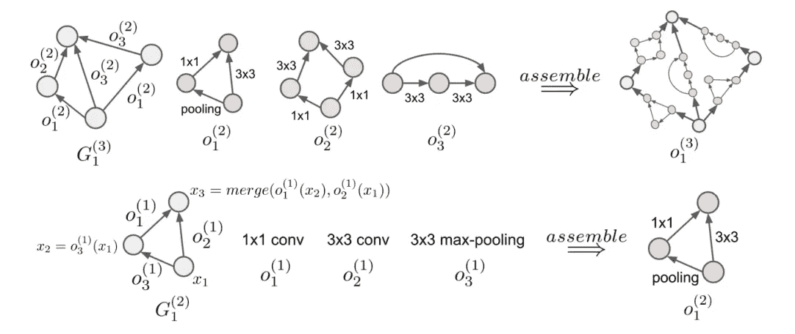
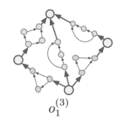

# 分级神经结构搜索

> 原文：<https://towardsdatascience.com/hierarchical-neural-architecture-search-aae6bbdc3624?source=collection_archive---------27----------------------->

许多研究人员和开发人员对神经架构搜索可以为他们的深度学习模型提供什么感兴趣，但被巨大的计算成本吓住了。已经开发了许多技术来促进更有效的搜索，特别是可区分架构搜索、参数共享、预测性终止和架构的**分层表示。**

本文将解释分层表示的概念，因为这是实现效率和充分表达的搜索空间之间的平衡的最简单的方法。神经网络的这种表示是如此强大，以至于您可以通过随机搜索获得有竞争力的结果，从而消除了实现贝叶斯、进化、强化学习或可微分搜索算法的需要。

# **30 秒内分级神经架构搜索:**

这个想法是将更大的结构表示为它们自身的递归组合。从一组构建块开始，如 3x3 可分离卷积、最大池或身份连接，我们用一组预定义的节点构建一个微结构。在构建下一级结构时，以前发现的结构被视为与初始构建块相同。关键思想是递归组合。

原始论文测试了这一层次的两个级别，如下所示。在下面的例子中，第一层有一个**人类编码的 3 个节点和一个**人类编码的 3 个单元，第二层有一个**人类编码的 4 个节点和一个人类编码的 1 个单元。如果这种粗体字体看起来多余，我很抱歉，但强调神经架构搜索算法中插入的先验/偏见是很重要的。**



作为算法的人类设计者，层次表示的超参数包括原语操作、层数、每层的结构数以及每层包含的节点数。上面的示例演示了 3 个基本操作(1x1 conv、3x3 conv、3x3 最大池)、2 个级别、第一级的 3 个节点和第二级的 4 个节点，以及第一级的 3 个结构和第二级的 1 个结构。

# 对此感兴趣的两个快速理由:

1.  给定这种表示，即使随机搜索也能很好地执行。这些架构被编码为一系列邻接矩阵，对角线上是 0，对角线左侧是 0，以呈现 DAG。Dag 在解码时服从神经网络的拓扑排序。在这些 DAG 邻接矩阵的右侧随机填充每一层可用的不同操作效果非常好。与论文中测试的更复杂的进化搜索相比。
2.  由此产生的架构具有理想的稀疏性，如下图所示:



从参数计数的角度来看，这种稀疏性是非常可取的，其他的神经网络设计理论超出了本文的范围。

**层级与平面表示**

基本区别是 11 节点邻接矩阵**与** 4 个独立的 4 节点邻接矩阵和 1 个 5 节点邻接矩阵。

首先，像直接编码 11 个节点的 DAG 这样的平面表示会有非常密集的连接，不像上图中的渲染单元。这导致网络具有高得多且不必要的参数计数。其次，这些细胞的组合学要复杂得多。拥有如此高的组合学使得搜索空间不可行。

```
Flat Representation DAGs (Combinatorics)11 nodes results in OPS^n(n-1)/2 different ways to encode them
ex: 6 operations, 11 nodes --> 6^55 possible architectures
```

分层表示的组合爆炸要低得多，并且可由搜索的人类设计者高度控制。

```
Hierarchical Representation DAGs (Combinatorics)
6 primitive operations, 4 nodes in level 1
OPS^n(n-1)/2 --> 6^6 ways to encode each level 1 structure5 level 1 structures, 5 node in level 2
OPS^n(n-1)/2 --> 5^10 ways to encode each level 2 structure4(6^6) level 1 structures * 1(5^10) level 2 structures6^24 * 5^10 (Hierarchical Rep.) << 6^55 (Flat Rep.)
```

虽然 6 ⁴ * 5 ⁰仍然是一个巨大数量的可能的结构，它明显少于 6⁵⁵.

我希望这篇文章能帮助你理解神经结构搜索中的层次表示背后的思想，这使得搜索更加有效！感谢您的阅读，如果您有进一步的兴趣，请查看下面的视频！