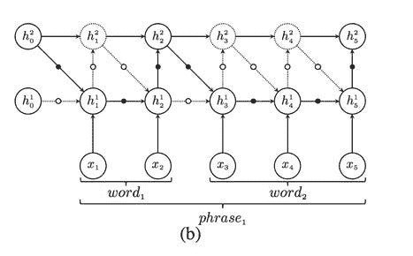

# 分级 RNNs，训练瓶颈和未来。

> 原文：<https://towardsdatascience.com/hierarchical-rnns-training-bottlenecks-and-the-future-415788192773?source=collection_archive---------16----------------------->

[Image source](https://www.flickr.com/photos/hellowchan/28511137926/in/photolist-Krr2Zy-FN8VyT-2kW7Kb2-7nZoqk-2kXPPf2-2hPvCRu-2hTpPSv-E1zfwC-2hEuPYk-rooNSX-DE7eLn-LH8xdq-upDP2Q-DRqd47-2j1jwH6-SZ8Qku-rgst9T-qY9o3R-Q5Dm3y-dMScTp-QPTRJd-8ZqYWa-8Z6LQy-H91VSN-e3y9Bz-NLYJZa-zdWLTe-HFd8nY-2kh1Lnc-qegMZY-2dUgATk-2iTSLHJ-2kLyWUC-dAU1xB-6fZ2Ms-2kZ5bup-2kF1NGy-26c1Xq1-HqeLa3-zvF9rU-H7aWrz-TSpkPs-bTksTK-9rX2Mt-STEyvz-Mw4qXz-Ree9bZ-2irHnhi-oCn7se-s3Chhj)

众所周知，标准反向传播算法是计算神经网络中损失函数相对于其参数的精确梯度的最有效的方法。所谓有效，我的意思是给定固定的网络架构，其计算成本总是与计算损耗的成本相同(例如，给定分别具有 I、j、k 和 l 个节点的 4 层前馈网络，具有“t”个训练实例的一个时期的总时间复杂度将总是 [O(t*(ij + jk + kl))](https://ai.stackexchange.com/questions/5728/time-complexity-for-training-a-neural-network) )。

可微性和连续性公理告诉我们，对于一个在点 *x_* 0 可微的函数，它在定义域中的每一点都必须是连续的。这进一步要求反向传播中涉及的所有参数。必须拥有连续的值。然而，情况可能每次都不一样；相反，我们可能希望有一个由神经元组成的网络，这些神经元在不同的时间尺度上对时间事件做出艰难的随机决策——0/1 值表示文本中的单词/短语边界或视频中故事片段的结尾。这种二进制输出进一步引入了可用作正则化技术的稀疏表示，从而允许设计选通单元来选择对于给定实例实际上需要计算模型的哪一部分。[1]

这可以用下面的例子来解释。设 x 是神经元的输入，其值决定神经元是否输出尖峰(1)或(0)。定义函数 *f* 的一种方式是二进制化的 ReLU 激活:

> f(x) = {1 如果 x ≥ 0 否则 0

然后我们可以观察到，除了阈值，f 的导数都是 0，也就是说，当它等于∞时，导数是 0。这意味着在用 *f* 训练网络时，任何基于梯度的学习在这些点都是不可能的，因为权重将与零梯度相乘，因此没有更新。因此，反向传播失败！

**ℚ.等等，但是什么样的网络可能需要这样的神经元呢？**

这正是我们的交易——分级递归神经网络(HRNNs)的目的。简而言之，HRNNs 是一类堆叠 RNN 模型，其设计目标是对序列数据(文本、视频流、语音、程序等)中的层次结构进行建模。).在文本的上下文中，这些层次结构可以构成最低层的字符，这些字符组合形成单词，单词组合形成句子，而在计算机程序的上下文中，这些层次结构可以指调用子模块的模块。因此，关键思想在于更新属于对应于数据中的层级层的堆栈的不同层的神经元的权重。

那么，我们如何决定属于堆栈不同层的内容呢？一个可能的想法是让二进制神经元，如上所述，具有 0/1 输出，指示当前时间步长的输入是否属于与先前处理的输入相同的层级。HRNNs 也是基于同样的原理。能够捕捉这样的层次结构有助于他们解决典型 rnn 的缺点，典型 rnn 可以构造顺序敏感但结构无知的文本中单词的表示。

**ℚ.好吧，那么我们如何训练需要这种二元决策的网络呢？**

迄今为止，存在两种广泛使用的用于训练这种网络的方法:(a)梯度估计技术，其将二进制神经元训练为网络的组成部分，以及(b)基于策略梯度的强化学习方法，其通过创建状态-动作对的映射来决定在观察特定输入时采取什么动作，从而绕过对二进制神经元的需要。我们将使用两类能够在文本中学习多层抽象的 HRNNs 来浏览它们。

# 1.分层多尺度递归神经网络(HM-RNN)

下图描绘了 HM-RNN 模型**【1】**的清晰结构:

为了决定上面提到的 0/1 边界决策，HM-RNN 在每一层使用边界检测器(比如， *z* )。这些自适应地基于三个操作来确定权重的更新时间:

*   **更新**:类似于 LSTMs 中通常的更新规则。
*   **复制**:保留当前层的全部状态，不丢失任何信息
*   **FLUSH** :将当前段的汇总表示弹出到上层，然后重新初始化状态以处理下一段。

现在应该很清楚，边界检测器只不过是我们之前讨论过的相同的二进制神经元。但是它们可能还有其他用途吗？答案是肯定的，取决于当前时间步 *t* 和当前层 *l* 的 *z* 的值以及前一时间步 *t-1* 和层 *l-1* 的值:

*   如果在层 l 和步骤 t-1 处 z = 0，并且在层 l-1 和步骤 t 处 z = 1，这意味着已经在较低层检测到边界(即，字结束)，因此，执行更新以反映从较低层获得的汇总信息。
*   如果在(l，t-1)和(l-1，t)处 z = 0，这意味着在任一级都没有识别出边界，因此，执行复制操作只是为了保存来自先前神经元的信息。
*   如果在(l，t-1)处 z =1，这意味着在前一时间步检测到边界(即，短语结束)，现在，执行刷新操作以将当前神经元的表示传输到上层神经元，同时重新初始化其单元状态。

因此，边界检测器的使用消除了每个时间步的更新操作。因为更新动作包括 RNN 单元中操作复杂性的主要部分，省略它在总时间成本**【2】**上给予良好的增益。现在，问题仍然存在:我们如何计算边界检测器神经元的梯度(0/1 输出)？

这就是**直通估计器**发挥作用的地方。这个想法很简单。让我们回忆一下上面定义的函数 *f* 。我们现在进行两步训练:

1.  在正向传递过程中，我们保持神经元的输出不变。由于输出由 0/1 值组成，我们可以用逐位运算优雅地取代大多数算术运算。因此，二进制神经元被认为可以显著减少内存大小和访问**【3】**。
2.  在反向传递期间，不是计算 *f，*的导数，而是将其输入梯度设置为等于其输出梯度的阈值函数。由于后向传递涉及将梯度设置为固定值，直通估计器属于有偏估计器的范畴。

# 2.分级结构 lstm(HS-lstm):

研究了 HMRNN 的基本原理后，现在让我们来看看另一个模型，即。HS-LSTMs。

框架**【4】**由三部分组成:结构化表示网络为每个输入单词分配一个状态“s ”,并接收来自策略网络(P-net)的反馈，该策略网络基于随机策略π(α| s；θ).使用的两个结构化表示模型是:信息提取 LSTM (ID-LSTM)和 HS-LSTM，两者都将动作翻译成结构化表示。然后，分类网络(C-net)使用学习到的表示进行预测，并相应地向 P-net 提供策略学习的奖励。

回到 HS-LSTM，该模型具有与前述 HRNNs 类似的架构。然而，代替 0/1 边界检测器，我们现在依赖于策略梯度方法，该方法逐渐学习策略来为每个状态(即，单词)选择更好的动作(即，短语结束或短语内部)。HS-LSTM 仅在 p-net 已经对其所有单词的动作进行采样之后才确定句子的结构化表示。p-net 因此在[延迟奖励](https://www.cs.cmu.edu/afs/cs/project/jair/pub/volume4/kaelbling96a-html/node16.html)策略上运行。

下一个至关重要的步骤是使用**加强**算法，这是一种基于梯度的技术，通过增加政策在给定状态下做出有益行为的概率来更新政策权重:

# 未来

综上所述，我们看到，以捕获时间序列中的层次结构为最终目标的分级 rnn 家族依赖于识别边界来分离多层层次结构。在基础层面上，目标是对底层数据的组合性进行建模。正如彭博著名认知科学教授[艾伦·l·尤耶](http://www.cs.jhu.edu/~ayuille/)最近在[的博客文章](https://thegradient.pub/the-limitations-of-visual-deep-learning-and-how-we-might-fix-them/)中优雅地解释的那样， ***组合模型*** 通过学习数据的结构和子结构的结构化表示来工作。由于大多数现实世界数据中出现的组合爆炸问题，组合性原则旨在开发可解释的模型，并可以生成样本，从而使错误更容易诊断。虽然已经发现这一特性在视觉领域有很大帮助(通过引入对抗攻击的鲁棒性)，但是 NLP 领域也有可预见的好处。

> “这个世界是合成的，或者上帝存在。”—斯图尔特·格曼

在这一点上，你一定想知道是什么让我在结束这篇文章时得出了组合性原则。事实上，在层次化 rnn 想要捕捉的结构化表示和我们正在谈论的组合语义[3]之间有着根深蒂固的联系。这就把我们带到了我们的最终目的地——***分布假设*** 。根据语言的语义理论，这一假说认为一个词是由它的同伴来表征的。因此，在相同的上下文中使用的单词倾向于表达相似的意思。从我们通过分层 rnn 识别的子结构的角度来考虑这个问题，会给出一个清晰的视图。每个子结构/短语现在可以被认为是具有相似分布并且语义一致的单词。因此，很明显，复合模型，如神经模块网络**【5】**——由联合训练的神经模块集合组成的模型，其架构足够灵活，可以捕捉深度网络的表示能力和文本中的复合语言结构，可能是分层递归神经网络的未来！

# 参考资料:

[1] Chung，j .，Ahn，s .，& Bengio，Y. (2017)。分层多尺度递归神经网络。 *CoRR，abs/1609.01704* 。

[2]张，s .，吴，y .，车，t .，林，z .，梅米塞维奇，r .，萨拉赫胡季诺夫，r .，&本吉奥，Y. (2016)。递归神经网络的结构复杂性度量。*辊隙*。

[3]胡巴拉，I .、库尔巴里奥克斯，m .、苏德里，d .、亚尼夫，r .、&本吉奥，Y. (2016 年)。二值化神经网络。 *NIPS* 。

[4]张，汤，黄，米，赵，李(2018).通过强化学习学习文本分类的结构化表示。 *AAAI* 。

[5]j . Andreas、m . rohr Bach、t . Darrell 和 d . Klein(2016 年)。神经模块网络。 *2016 年 IEEE 计算机视觉与模式识别大会(CVPR)* ，39–48。