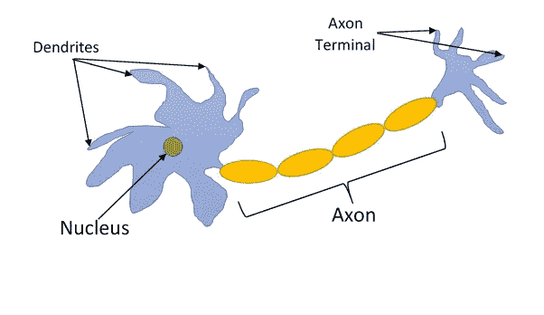
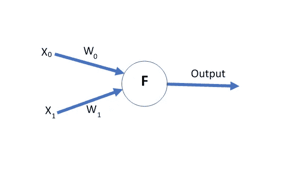
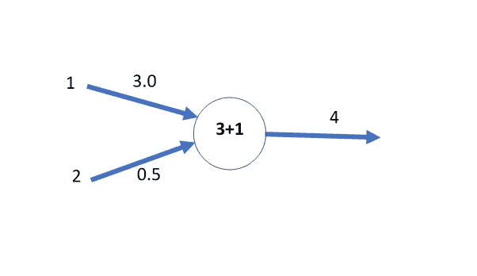
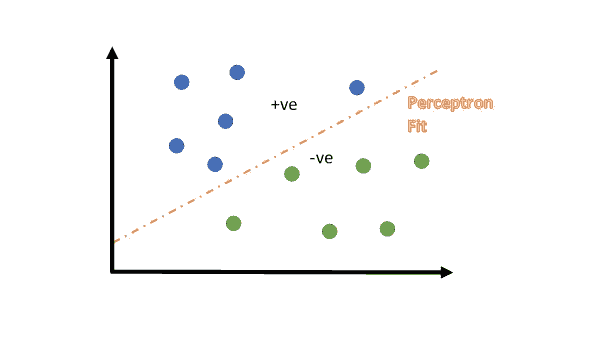
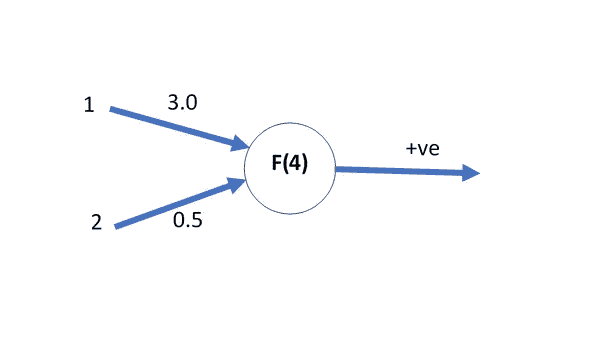
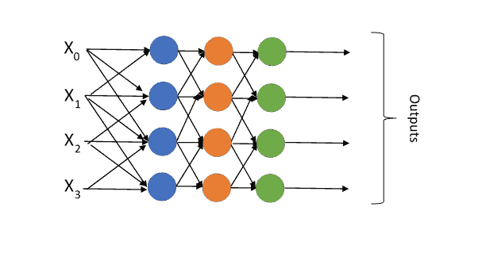

# 神经网络的高级介绍

> 原文：<https://towardsdatascience.com/high-level-introduction-to-neural-networks-51cb0a088d7a?source=collection_archive---------20----------------------->

Photo by [Daniel Hjalmarsson](https://unsplash.com/@artic_studios?utm_source=medium&utm_medium=referral) on [Unsplash](https://unsplash.com?utm_source=medium&utm_medium=referral)

在数据科学、机器学习或人工智能领域呆上一段时间，你肯定会碰到神经网络。问它们是什么，大多数人会说，“它就像一个大脑，有很多相连的神经元”。但这意味着什么呢？

这种与人脑的关系有一定的真实性，因为在它们的核心，神经网络是由模拟神经元的尝试激发的(由于许多原因，模拟神经系统一直是一个大话题)。发现它们对于执行二元分类问题是很好的，在二元分类问题中，对象可以属于一个类别，也可以不属于一个类别(即，它是“猫”还是“狗”)。正是从这一点出发，我们将选择最简单和最不复杂的人工神经网络来构建我们关于神经网络如何工作的知识:感知器。

# 感知器

感知器诞生于 1958 年，是最长寿的机器学习算法之一，你最有可能知道它，并且在你的现代数据科学和机器学习工具包中可以找到它。

作为一个有趣的旁白，感知机有着可疑的荣誉，既刺激了大量的研究投资，也导致了该领域的一些停滞不前(称为人工智能冬天)。它被吹捧为能够做从自然语言到图像识别的大量事情，但这种吹嘘是导致 10 年停滞不前的原因之一，当时感知机的局限性被发现，主要是感知机只能解决线性可分的问题(我将在后面解释)。

# 那么，什么是感知机呢？

形象化的最好方法是观察一个神经元:

Fig 1\. A very simple representation of a typical Neuron

神经元的工作方式是从其树突接收信号，并根据这些输入决定是否要发送信号(根据强度以及它对接收的每个信号给予的权重或考虑)。如果是的话，那么这个信号就沿着它的轴突传播，并通过轴突末端离开。这个终端连接到另一个神经元，同样，树突是神经元从与之连接的神经元接收信号的地方。这些神经元一起形成了一个复杂的连接网络，能够完成一些令人惊叹的壮举，例如写这篇文章(即我的大脑)。

感知器是神经元的数学表示，看起来像这样:

Fig 2\. Visual representation of a Perceptron

感知器接收一系列信号(X 值),并在函数(F)中使用它们来决定输出是什么。因为我们想要调整输出，所以需要给每个输入信号(W)一个权重，以获得最佳输出。赋予该函数的值仅仅是权重乘以信号并相加。

对于一个简单地输出它接收的总信号的函数，它看起来像这样:

Fig 3\. Example output for a Perceptron

在上面的例子中，我们接收信号 1 和 2，权重分别为 3 和 0.5。这意味着输出是 1*3+2*0.5=4.0。

您可能会看到，如果这两个信号中的一个保持不变，而另一个允许变化，那么您就创建了一个[线性回归](https://en.wikipedia.org/wiki/Linear_regression)函数:

y = m*x + c

其中，m 是变化的输入的权重(回归中的斜率)，c 是从不变化的输入的输入(它是常数或回归的截距)，y 是函数的输出。

然而，虽然感知器可以被修改来执行线性回归，但它的许多工作都是围绕分类进行的，在分类中，它会尝试确定数据点是否属于一个组或另一个组。另一个重要的概念是偏见。在回归示例中，保持不变的输入类似于截距，因此可以在不修改斜率的情况下移动直线(否则直线将始终通过图表上的零点)。在神经网络中，这种偏差可以添加到感知器中，以改善它们的行为(通常可以通过预测准确性的提高来看出)。否则，如果输入特征都是零，那么感知器只能输出零。增加一个偏差使这种行为变得不同。

例如:

Fig 4\. Classifying blue and green points with a Perceptron (the decision boundary is in Orange)

在这个例子中，我们有绿色和蓝色的点，我们希望感知器能够根据它们在图上的位置告诉我们哪个是哪个。为了做到这一点，它画了一条直线，一边的任何东西都属于一组，另一边的属于第二组。

# 但是它是如何处理数字的呢？

最简单的方法是，我们替换之前使用的返回加权输入总和的函数，并替换为返回总和值的[符号](https://en.wikipedia.org/wiki/Sign_function)的函数。如果它返回正值(+ve)，则它属于蓝色组，而负值(-ve)则属于绿色组。然后是调整权重的情况，直到感知器使用数据的最佳拟合线(图 6 中的橙色虚线)。

Fig 5\. An example Perceptron giving a classification prediction

# 线性可分的问题

查看图 4 中给出的示例，您可以看到感知器可以清楚地绘制一条线来完美地分隔各组，这就是我之前所说的线性可分的意思。只有当感知器能画出一条直线时，它才能完美地区分各组。这就是它的问题所在——如果有多个组，或者它们稍微混杂在一起，那么它就无法将它们分开。

这是感知器的问题之一，因为它只能将事物分成两组，并且它们必须很好地分开才能完美地工作。

值得注意的是，感知器的许多问题可以通过将它们链接在一起来解决。我的意思是，输入馈入几个感知器，这些感知器的输出馈入另一层感知器，以此类推，直到我们得到最后一层，给出我们的最终输出。这被称为多层感知器(MLP，图 6)。这些通常使用不同的函数(称为激活函数，因为它决定感知器是否给出输出),这取决于期望的 MLP 行为(例如分类或回归)。

Fig 6\. Example of an MLP where every layer is a different colour and all Perceptrons are connected to each other (some connections are missing for legibility)

# 将这一切结合在一起

为了将更准确的标签(和一些进一步的阅读链接)放在感知器上，我们有:

*   信号在感知器中以一种方式传播，并给出一个单一的输出(其中信号只在一个方向上传播，没有返回，这被称为[前馈](https://en.wikipedia.org/wiki/Feedforward_neural_network)算法)
*   我们将一组输入标记为 X0、X1 等。
*   感知器可以有任意多的输入
*   每个输入都有一个权重(W0，W1 等等。)
*   加权输入被输入到一个[激活函数](https://en.wikipedia.org/wiki/Activation_function)(例如我们正在使用的符号函数)
*   调整权重使得感知器能够通过改变输入的权重来调整它的答案，如果它得到的答案是错误的
*   这种对权重的调整被称为[梯度下降](https://en.wikipedia.org/wiki/Gradient_descent)，在这里我们最小化函数的误差
*   可以改变激活函数来改变感知器输出的行为
*   也可以在感知器输入中加入一个偏差来改善行为

# 拿走

我们已经研究了最基本的神经网络，它的局限性，并讨论了它在更高层次上的功能。它可以执行分类，并且通过改变激活函数，它还可以用于回归问题。

如果你想更深入地了解感知机(以及后来的 MLP)的数学和结构是如何工作的，那么我怎么推荐 YouTube 上关于从头开始构建的神经网络的视频都不为过(它们从简单开始，逐渐变得越来越强大)

# 链接:

*   [罗森布拉特感知器 1950 年的论文](https://www.ling.upenn.edu/courses/cogs501/Rosenblatt1958.pdf)
*   [1943 年关于神经元建模思想的论文](http://www.cse.chalmers.se/~coquand/AUTOMATA/mcp.pdf)
*   [艾冬](https://en.wikipedia.org/wiki/AI_winter)
*   《感知器》(驳斥感知器疯狂主张的书)
*   [人工智能历史](https://en.wikipedia.org/wiki/History_of_artificial_intelligence#Perceptrons_and_the_dark_age_of_connectionism) e
*   [感知器](https://en.wikipedia.org/wiki/Perceptron)
*   [多层感知器](https://en.wikipedia.org/wiki/Multilayer_perceptron)
*   [人工神经元](https://en.wikipedia.org/wiki/Artificial_neuron)
*   [人工神经网络](https://en.wikipedia.org/wiki/Artificial_neural_network)
*   [激活功能](https://en.wikipedia.org/wiki/Activation_function)
*   [偏置](https://deepai.org/machine-learning-glossary-and-terms/bias-vector)