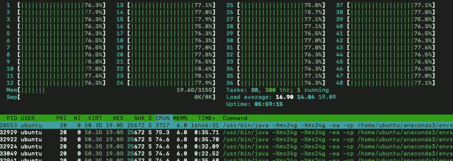
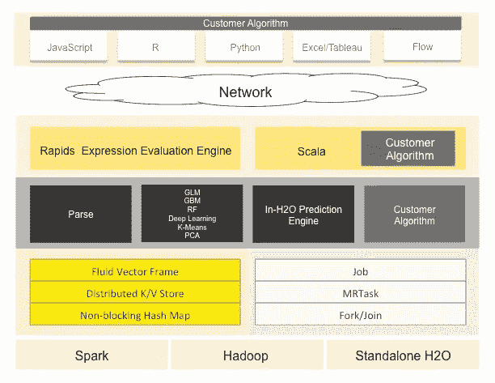
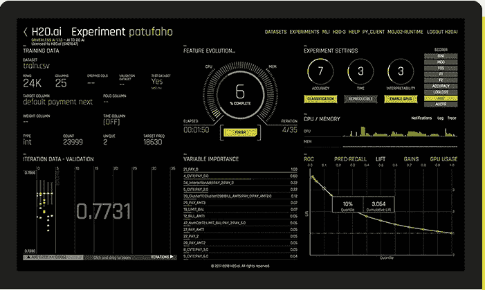
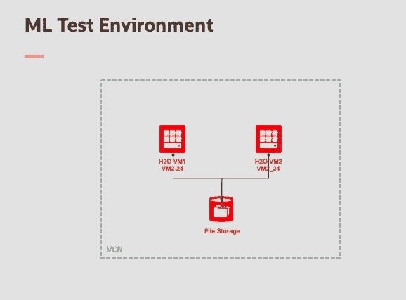
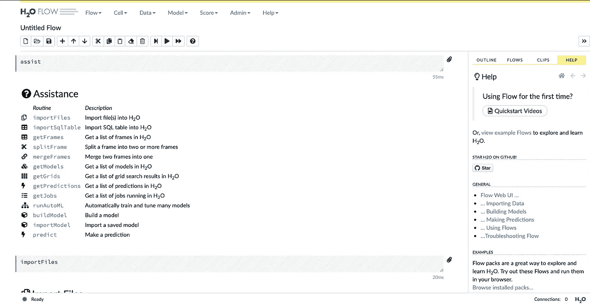
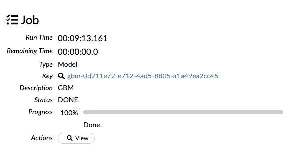
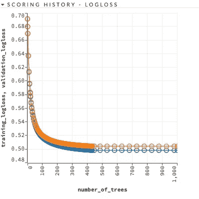
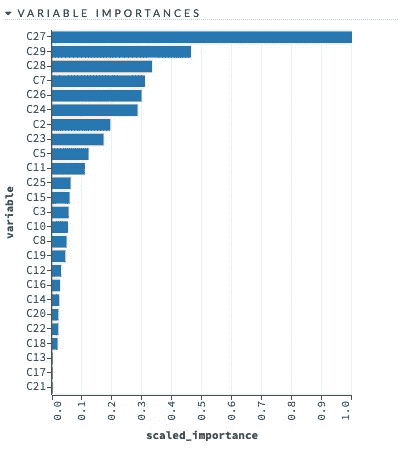
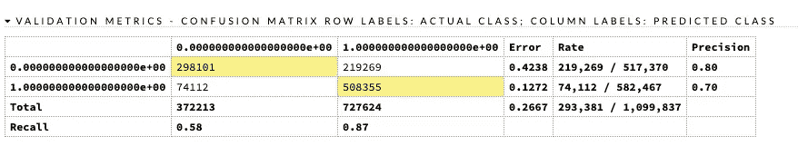

# 基于 Oracle 云和 H2O 的高性能机器学习

> 原文：<https://towardsdatascience.com/high-performance-machine-learning-on-oracle-cloud-with-h2o-b60acc8815fa?source=collection_archive---------29----------------------->



Running on a multi-CPU VM

# 介绍

如果你读一本关于机器学习(ML)的介绍性书籍，那么开发一个模型似乎总是一件容易、有趣和美好的任务。在真正的商业案例中，现实是完全不同的。

在现实世界中，开发一个有效的模型可能是一项困难而漫长的任务。为了实现良好的预测能力，您需要大量的数据(越多越好),并且经常需要使用不同的算法进行多次尝试，以便为模型的超参数定义最佳值。

这就是为什么你经常需要高计算能力，以便能够在合理的时间内迭代许多次执行。

因此，能够使用底层基础设施的所有可用 CPU 并进行扩展的 ML 算法的可用性对于能够在期望的时间框架内实现您的业务目标至关重要。

正是在这种背景下，像 **H20** 这样的框架可以成为整个解决方案的重要组成部分。

在这个主题的第一个故事中，我想快速描述什么是 H2O，并提供我在 Oracle 云基础设施(OCI)上进行的一些测试的一些细节，以验证 H2O ML 框架的可扩展性和性能。

# 闪闪发光的 H2O。

[**H2O.ai**](https://www.h2o.ai/) 是一家硅谷公司，其宣称的使命是:“为每个人民主化人工智能”。换句话说，使采用 ML 技术解决商业问题变得更加容易。

他们提供的核心是 **H2O** (现在版本 3，H2O-3)。最好的描述可以在他们的网站上看到:

> “H2O 是一个完全开源的分布式内存机器学习平台，具有线性可扩展性。H2O 支持最广泛使用的统计和机器学习算法，包括梯度增强机器、广义线性模型、深度学习等。H2O 还拥有行业领先的 AutoML 功能，可自动运行所有算法及其超参数，生成最佳模型排行榜”。

所以，关键成分是:

*   支持最重要的“经典”算法，用于回归和分类，有监督和无监督:GLM，朴素贝叶斯，SVM，K-Means，PCA
*   支持更现代和“最先进”的算法，如分布式随机森林、梯度推进机(GBM)、XGBoost、堆叠集成、隔离森林、深度神经网络(DNN)
*   内存计算
*   一种能够使用单个虚拟机上的可用核心，并在连接节点的群集上线性扩展，同时仍使用所有可用核心的实施
*   Python、R、JavaScript 的客户端库
*   AutoML
*   基于 POJO(和 MOJO)的训练模型的简单部署

除了 H2O，你还可以使用:

*   **H2O4GPU** ，提供上述算法的实现，运行在 NVIDIA GPU 上
*   **苏打水**，运行在 **Hadoop** 和 **Apache** **Spark** 集群之上的实现，用于大数据环境

该实现具有客户端-服务器架构:核心是一个提供 REST 接口的 JEE 应用程序(h2o.jar)。提供了支持 Python、R 和 JavaScript 编程的库。



H2O architecture (from h2o.ai official documentation)

此外，还提供了一个不需要任何编码的图形化的“基于笔记本”的交互界面:它被称为**流**。

使用 Flow，如果你知道你在做什么，你可以不写一行代码就完成开发和测试你的模型**的整个旅程。很好也很有成效。**

最后，但同样重要的是，H2O 也有重要的 **AutoML** 功能:要搜索最佳模型，你可以简单地定义搜索边界(哪些算法),让引擎搜索所有的算法和超参数空间。

为了完整起见，H2O.ai 还出售一款名为**无人驾驶 AI** 的授权产品。无人驾驶人工智能使模型的开发、测试和可解释性变得更加容易，拥有一个漂亮的深色用户界面。



Driverless AI (from H2O.ai site).

# 测试。

在和 H2O 玩了一段时间后，我决定在甲骨文云基础设施(OCI)上建立一个测试环境来验证:

*   H2O 的性能和可扩展性
*   在某种程度上，用大量数据开发一个模型是多么容易

我决定使用的数据集是“ [**希格斯数据集**](https://archive.ics.uci.edu/ml/datasets/HIGGS) ”。这个数据集想要解决的问题非常有趣:如何使用机器学习技术快速识别高能粒子(著名的希格斯玻色子)。你可以在网上找到许多关于这个挑战的文章。

该数据集包含 1100 万个样本。磁盘上的大小约为 8 GB。它以 CSV 文件的形式提供。第一列(values: 0，1)包含标签(1 表示:是真正的希格斯玻色子，0 表示“噪音”)；其他 28 列包含代表从探测器测量的运动学数据的数值。你可以在 [UCI 机器学习库](https://archive.ics.uci.edu/ml/datasets/HIGGS)找到数据集的完整描述。

我决定采用这个数据集的主要原因是，它是一个大型数据集，并且经过一些变化，它已经在一个著名的 [Kaggle 挑战赛](https://www.kaggle.com/c/higgs-boson)中使用过。另外，我已经意识到这个分类任务并不容易。

**测试基础设施**是在 OCI 建立的 **2 虚拟机集群**。每个虚拟机有 24 个 OCPU(核心)。这两个虚拟机通过 OCI 提供的高性能、非超额订阅网络连接。数据的共享存储是使用文件存储(NFS 装载)实现的。H2O 集群的两个节点之间的通信设置为使用单播。



Test Environment on OCI

我已经决定建立一个基于希格斯数据集的**梯度推进机**模型。梯度推进是基于决策树(DT)的所谓“集成模型”的一部分。GBM 的基本思想是迭代地改进 DT 的性能，将权重应用于先前模型不能很好工作的样本。

这些是我为模型采用的(非默认)参数(在一些试验后定义):

```
ntrees      1000
max_dept    10
min_rows    10
learn_rate  0.05
```

大量的树和小的学习率增加了训练模型所需的计算能力。但是使用大量 OCPU，训练所需的时间可以保持较小。

# 模型的开发。

如前所述，模型的整个开发都是使用 H20–3 的 Web UI**Flow**完成的。我没有写过一行代码。

在默认设置中，可以通过端口 54321 访问 H2O 流。



H2O Flow UI starting page

以下是开发模型所需的步骤列表:

1.  导入文件
2.  设置文件解析；将列 C1 标记为枚举(标签)
3.  解析文件
4.  验证没有缺失值
5.  训练/验证集中的分割(数据)帧(90%，10%)
6.  建立模型；从菜单中选择 GBM 设置非默认值(见上表)

# 结果。

最后，结果如下:

**构建时间** : 9 分钟。13 秒。



得分历史:



从评分历史中，您可以看到，在 500 棵树之后，性能没有显著提高，并且(有待确认)没有大的过度拟合(训练集和验证集之间的性能差异)。

GBM 还为您提供了一个衡量特征重要性的方法，我们可以据此决定开发一个更简单的模型，例如，只使用前 10 个特征:



最后，在验证集上计算的**混淆矩阵**:



The Confusion Matrix

混淆矩阵非常有趣(它证实了这个问题并不简单):

*   在 1 类样品(真玻色子)上，达到的精度是 0.87
*   在 0 类样本(噪声)上，精度仅为 0.58

从全球来看，该模型的准确率约为 73%。还不错。但该模型在 0 类样本上表现不佳。当然还有改进的余地，但整个练习只花了我半天时间。事实上，在这种环境下，训练所需的时间只有 10 分钟左右。让我安心。

比较在训练集和验证集上计算的混淆矩阵，我们可以确认没有过度拟合。

改进的想法:

*   我首先会尝试使用 **AutoML** 。使用 AutoML，我们可以定义探索的边界(使用哪些算法),并让引擎尝试找出具有最佳参数的最佳模型。这需要更多的时间(几个小时)
*   第二个是尝试堆叠的系综。

最后一个问题:引擎能够充分利用 24+24 OCPU 吗？答案是肯定的！在两个节点上运行的“htop”实用程序证实，H2O 以 100%的 CPU 利用率全速运行(本文开头的第一张图片是来自一个节点的“htop”报告)。

# 结论。

从我所做的测试来看，H2O 和甲骨文 OCI 公司似乎是一个很好的组合，为开发机器学习模型提供了一个**高性能**和**易于使用的**平台。