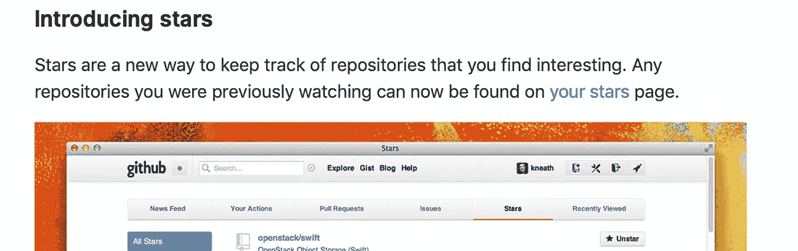
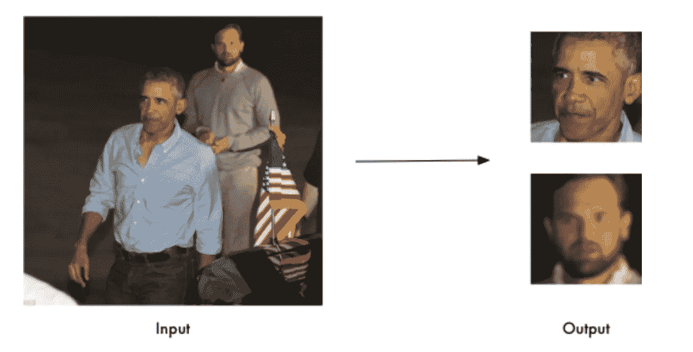
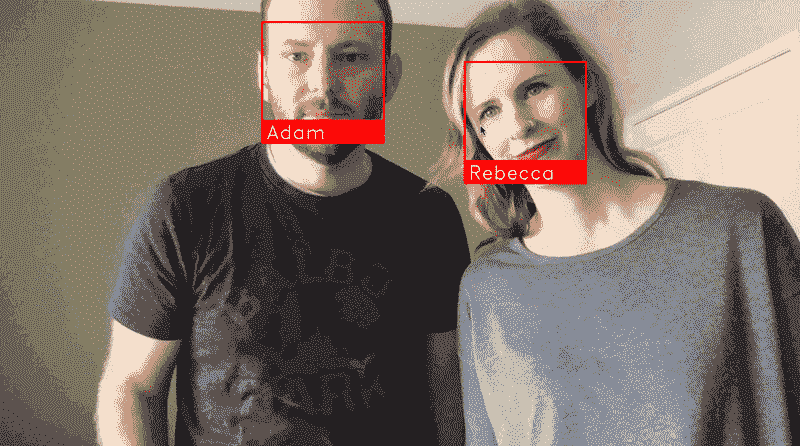
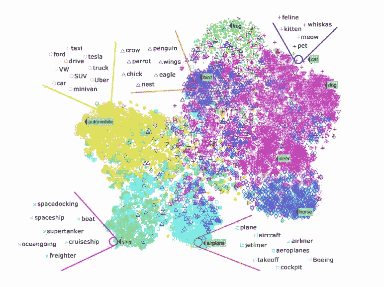
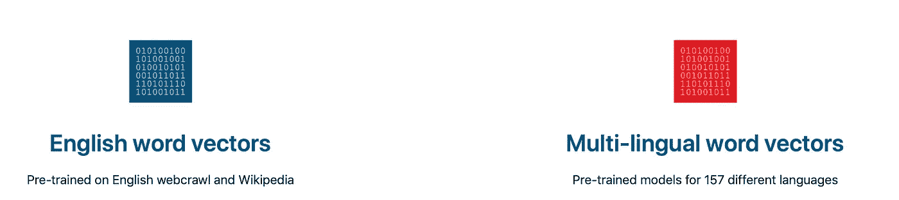
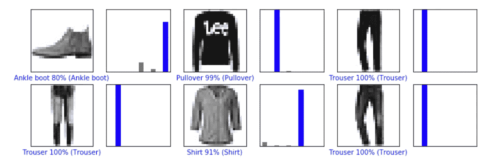
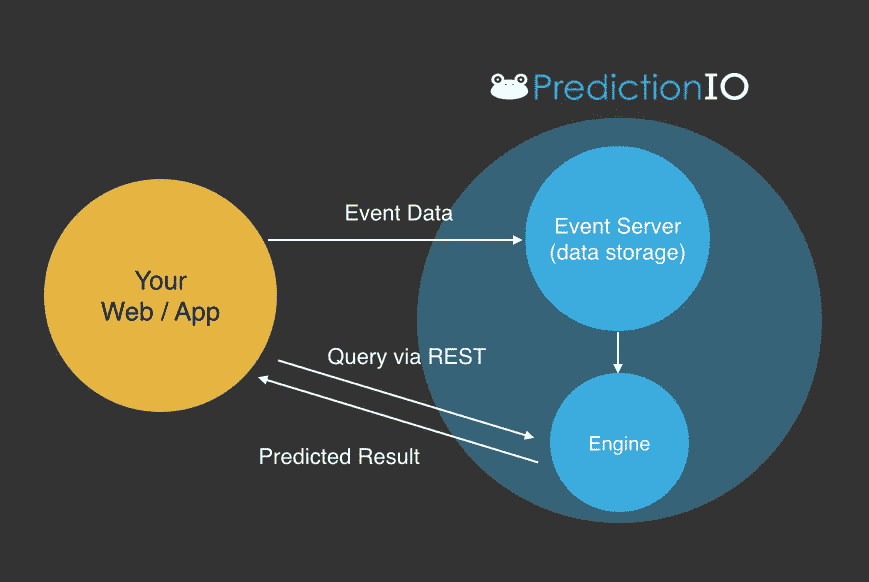

# Github 上评分最高的 ML 项目

> 原文：<https://towardsdatascience.com/highest-rated-ml-projects-on-github-694486293512?source=collection_archive---------7----------------------->

## 不可能什么都懂。然而，这 5 个值得一看。

机器学习作为一个领域，正在以极快的速度发展。Github 是全世界都在看的白板。高质量的代码被定期发布在无限的智慧板上。


Photo by [Morgan Harper Nichols](https://unsplash.com/@morganharpernichols?utm_source=medium&utm_medium=referral) on [Unsplash](https://unsplash.com?utm_source=medium&utm_medium=referral)

显然不可能跟踪机器学习世界中发生的所有事情，但 Github 对每个项目都有一个**星级**。基本上，如果你**启动**一个库，你就表明了你对这个项目的欣赏，同时也记录了你感兴趣的库。



[Github Blog](https://github.blog/2012-08-06-notifications-stars/)

这个星级可以作为了解最受关注的项目的一个很好的指标。让我们来看看 5 个评价很高的。

## 1) [人脸识别](https://github.com/ageitgey/face_recognition)—25858★

世界上最简单的面部识别工具。它为 Python 和命令行提供了应用程序编程接口(API)。它对于识别和处理图像中的人脸非常有用。它是使用 [dlib](http://dlib.net/) 最先进的人脸识别算法构建的。深度学习模型在野生数据集的[标签人脸上的准确率为 99.38%。](http://vis-www.cs.umass.edu/lfw/)

它还提供了一个简单的`face_recognition`命令行工具，可以让你从命令行本身对一个图像文件夹进行人脸识别！



这个库也可以处理实时人脸识别



[Github — face-recognition](https://github.com/ageitgey/face_recognition)

## 2)[fast text by Facebook research](https://github.com/facebookresearch/fastText)—18819★

fastText 是由脸书团队开发的开源免费库，用于高效学习[单词表示](https://medium.com/x8-the-ai-community/making-egalitarian-ai-algorithms-c80ebb151aa)。它是轻量级的，允许用户学习文本表示和句子分类器。它在标准的通用硬件上工作。模型可以缩小尺寸，甚至适合移动设备。

文本分类是许多应用的核心问题，如垃圾邮件检测、情感分析或智能回复。文本分类的目标是将文档(如电子邮件、帖子、短信、产品评论等)分配到多个类别。



Example of word classes | Source: Alterra.ai

对于 NLP 爱好者来说，这是一个非常有用的资源。



[fastText](https://fasttext.cc)

## 3)awesome-tensor flow—14424★

这是一个帮助你理解和利用张量流的资源集合。github repo 包含一个令人敬畏的 TensorFlow 实验、库和项目的精选列表。

TensorFlow 是 Google 设计的机器学习端到端开源平台。它有一个全面的工具、库和社区资源的生态系统，让研究人员在 ML 中创建最先进的技术。使用它，开发者可以很容易地构建和部署 ML 驱动的应用程序。



[Tensorflow](https://www.tensorflow.org/tutorials/keras/basic_classification)

## Apache 预测— 11852 ★

Apache PredictionIO 是一个面向开发人员、数据科学家和最终用户的开源机器学习框架。用户可以使用这个框架来构建现实世界的 ML 应用，部署和测试它们。

它甚至支持事件收集、评估和查询预测结果。它基于可扩展的开源服务，如 Hadoop、HBase 等。

就机器学习而言，它基本上减轻了开发人员的思想负担。



[PredictionIO](http://predictionio.apache.org/appintegration/)

## 5) Style2Paints — 9184 ★

这个存储库与上面的略有不同，因为它由于缺乏资金而被关闭了！这是一个相当有趣的概念，人工智能被用来给图像着色。

他们声称 Style2paints V4 是目前最好的人工智能驱动的艺术线条着色工具。

他们声称，它不同于以前的端到端图像到图像的翻译方法，因为它是第一个在现实生活的人类工作流程中给艺术线条着色的系统。大多数人类艺术家都熟悉这个工作流程

```
**sketching** -> **color filling/flattening** -> **gradients/details adding** -> **shading**
```

**Style2Paints** 就是根据这个流程设计的。这样的流程只需两次点击就能从最左边的图像生成中间的图像。


[Style2Paints](https://style2paints.github.io)

只需再点击 4 次，这就是你所得到的


[Style2Paints](https://github.com/lllyasviel/style2paints)

互联网是海洋，机器学习是流入其中的河流。Github 上的星星是筛选这条宝藏河的一个很好的指标。