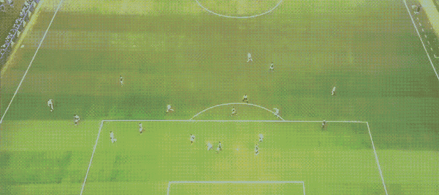
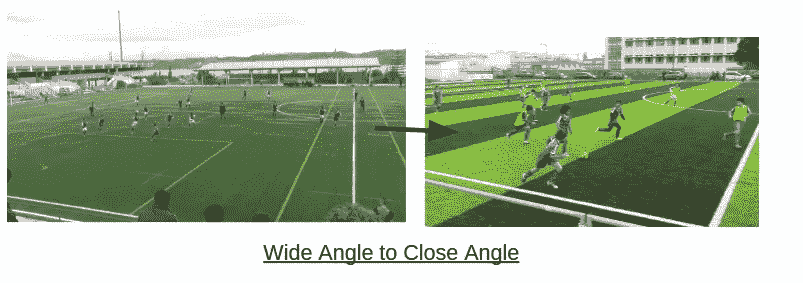
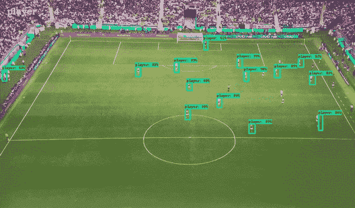

# 使用 Tensorflow 突出足球中的动作区域

> 原文：<https://towardsdatascience.com/highlight-action-area-in-soccer-using-tensorflow-1c59d644b404?source=collection_archive---------18----------------------->

## 用数据做很酷的事情！

# 介绍

如果相机能够智能地自我理解体育运动中的活动区域并捕捉正确的镜头，那该有多酷。这可以使我们在足球场上安装摄像机，特别是在当地比赛进行的地方，捕捉他们的视频，并自动创建有用的亮点，供球队观看他们的移动和学习新的打法。有几家公司提供具有这些功能的“人工智能相机”——[veo](https://techcrunch.com/2017/08/30/veo/)就是其中之一。但是这些相机很贵。一个更经济的选择是拥有自己的高分辨率普通相机和定制模型，连接到一个或多个相机，并在云中进行处理。这可能是一个更具可扩展性的解决方案，也可以扩展到足球以外的运动。那么我们如何做到这一点呢？

[张量流物体探测](https://github.com/tensorflow/models/tree/master/research/object_detection)正在带我们去那里！我用了一个 youtube 视频来强调这一点。见下文。蓝色矩形框突出显示了作用区域。

Soccer — Highlighting area of action

我喜欢这个视频，因为它为这部戏捕捉了一个广角。如果相机是高分辨率的，那么物体检测可以突出显示行动区域，我们可以放大它，创建一个特写镜头，如下所示。

你可以找到我在我的 [Github 回购上使用的代码。](https://github.com/priya-dwivedi/Deep-Learning/tree/master/soccer_area_of_action)

# 步骤概述

Tensorflow 对象检测 API 是用于快速构建对象检测模型的非常强大的资源。如果你对这个 API 不熟悉，请看下面我写的介绍 API 的博客，教你如何使用 API 构建自定义模型。

[tensor flow 对象检测 API 简介](/is-google-tensorflow-object-detection-api-the-easiest-way-to-implement-image-recognition-a8bd1f500ea0)

[使用 Tensorflow 对象检测 API 构建自定义模型](/building-a-toy-detector-with-tensorflow-object-detection-api-63c0fdf2ac95)

## 用于检测球员和球的定制模型

我在这里建立了一个自定义模型来检测球员和足球。为此，我从视频中截取了大约 50 帧，并在其中标注了球员和球。这需要一些时间，因为每一帧有 15-20 名球员。我也注释了足球，但是正如你在下面看到的，检测它有点困难，因为它移动的速度太快了，所以变得模糊。通过添加更多模糊球的图像，也可以更好地检测球。我从 [Tensorflow 对象检测动物园](https://github.com/tensorflow/models/blob/master/research/object_detection/g3doc/detection_model_zoo.md)选择了更快的 RCNN 初始模型。一旦模型在大约 50 帧上被训练，我在 10 分钟的完整视频上运行它，我可以看到模型已经概括得很好。为了使模型能够在各种摄像机角度下工作，需要对不同的图像进行更多的训练。

Player and Ball detection using Faster RCNN Inception model

你可以在我的 [github repo](https://github.com/priya-dwivedi/Deep-Learning/tree/master/soccer_area_of_action) 上找到训练好的模型。

## 确定行动领域

现在，我们可以确定所有球员的位置以及我们对球位置的最佳猜测，我们可以做一个有趣的练习来理解动作在哪里。

tensorflow 对象检测为我们提供了传递给它的每一帧的类、盒子和分数的信息。我们可以缩小输出范围，只在得分高的地方得到边界框。有了这些信息，我们就知道了球场上大部分球员的质心，以及某些帧中的球。

现在我们必须找出有最多球员和球的矩形，因为那里可能是行动的地方。我采取的方法是:

1.  选择高亮区域作为帧大小的一部分，以保持代码的灵活性
2.  一旦我们有了所选区域的尺寸，我们就在整个框架上迭代，系统地选择许多区域，并计算其中有多少玩家。如果该区域也有球和球员，那么得分会高得多
3.  选择得分最高的区域，并将该矩形添加到框架上

## 结论和下一步措施

太棒了。所以现在你可以看到我们如何使用深度学习模型的输出来产生有趣的结果。这仅仅是开始。再多花一点时间，我们可以进一步改进这段代码。以下是一些后续步骤:

1.  通过更多针对本课程的训练，更好地探测球
2.  添加旋转矩形焦点区域的选项，以捕捉与此处不同方向的角度或视图
3.  更快地运行这段代码。我很想用 YOLO 来实现这个目标。很快会有一个帖子。

我有自己的深度学习咨询公司，喜欢研究有趣的问题。我已经帮助许多初创公司部署了基于人工智能的创新解决方案。请到 http://deeplearninganalytics.org/来看看我们吧。

你也可以在 https://medium.com/@priya.dwivedi 的[看到我的其他作品](https://medium.com/@priya.dwivedi)

如果你有一个我们可以合作的项目，请通过我的网站或 info@deeplearninganalytics.org 联系我

参考

1.  [摄像机角度](http://blog.videobserver.com/sports-video-analysis-camera-specifications-angle-and-position/)
2.  [张量流物体检测](https://github.com/tensorflow/models/tree/master/research/object_detection)