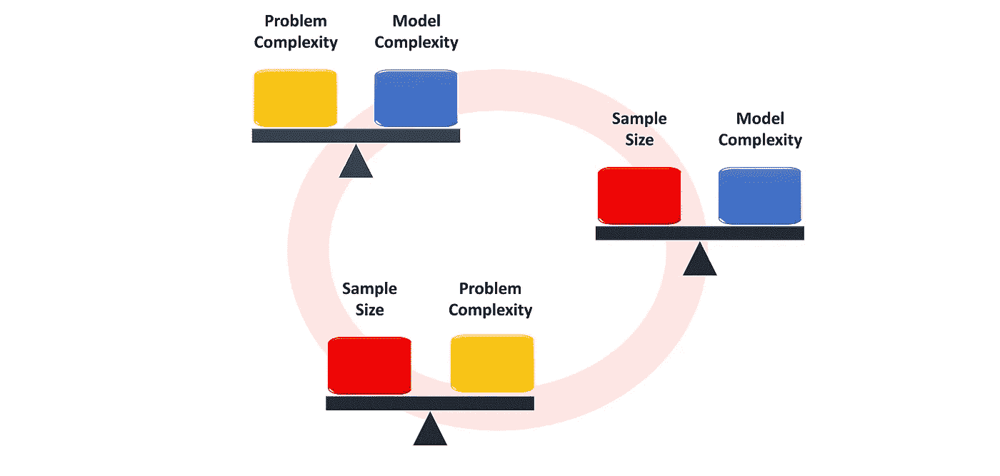
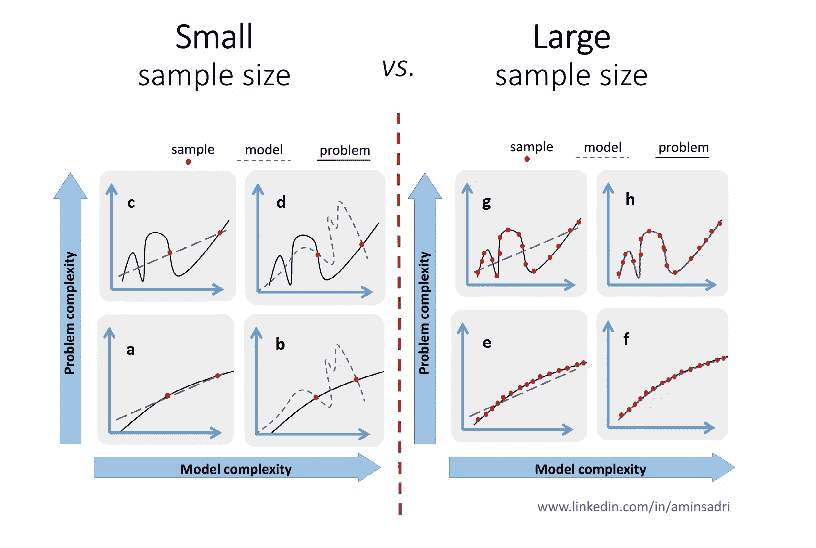

# 为什么我的 ML 模型不起作用？

> 原文：<https://towardsdatascience.com/hint-model-complexity-problem-complexity-and-sample-size-should-be-in-line-c12e73b498a6?source=collection_archive---------19----------------------->

# 提示:问题复杂性、模型复杂性和样本大小应该一致。

在学习机器学习课程时，您可以轻松地在课程项目中部署和测试机器学习模型。一切正常。然而，在现实生活中，你的模型只会产生无意义的结果，你可能不确定问题出在哪里。

在本文中，我将讨论三个应该相互匹配的组件，以使一个 ML 模型工作:*问题复杂性、模型复杂性和样本大小*。作为一名数据科学家，我们负责定义和识别每个组件。我们定义一个清晰的问题，识别模型，决定是否需要更多的数据。

在本文的其余部分，我将分别研究这些组件，然后研究不同的场景并给出一些建议。

Problem Complexity, Model Complexity, and Sample Size should be in line.

# 问题复杂性

在某些情况下，问题可能不清楚，我们可能需要自己定义确切的问题。这是第一步，好的开始总会有好的结局。尝试尽可能简单地定义问题，同时确保它将解决业务挑战。下面举两个例子来说明这个问题:

a)假设您有一个视频监控项目，其中一台摄像机记录了一个房间的镜头。任务是确定房间里是否有人。一种方法是在视频数据上部署人体检测算法。第二种方法是检测视频中的任何运动，因为你知道房间中的运动只能由人引起。第二种方法比第一种简单得多，并且预计更简单的模型将给出期望的结果。

b)问题的复杂性在于数据的多样性。因此，如果我们有更少的维度，问题就不那么复杂。

假设一个文档分类算法，其中您想要对官方文档进行分类。第一种方法是应用基于视觉的方法，该方法考虑文档的每个像素。另一种方法是查看文档中的文本。如果文档包括不同的文本，那么它们可以通过文本来区分。第二种方法中问题的复杂性远低于第一种方法中的复杂性，因为文本与图像相比是低维度的。低维意味着灵活性和复杂性较低。

# 模型复杂性

模型复杂性可以从训练阶段应该设置的*数量的权重*中推断出来。如果模型中包含大量的权重，那么学习起来就更加灵活。反过来，你需要更多的数据来训练模型。

让我们看一些例子:

A)具有 3 个输入和一个具有 10 个神经元的隐藏层的深度学习模型，具有大约 50 个权重。

b)深度为 4 的决策树有 15 个权重(阈值被认为是权重)。

c)3 个输入的线性回归模型具有 4 个权重。

数据科学家应该对他或她使用的不同算法有所了解。如果你知道算法是如何工作的，你就会对算法的权重和复杂度有所了解。在这种情况下，您不需要花费时间向复杂的模型提供少量数据。

在下一节中，我将根据权重的数量给出一些关于样本数量的提示。

# 样本量

这是设计 ML 模型时要考虑的最重要的部分。我见过很多样本量太小的情况，但是机器学习工程师花时间部署不同的模型和调优参数。在某些情况下，数百个样本就足以进行训练，而在其他情况下，模型无法从数千个样本中学习。

# 需要多少样品？

看看这三个组成部分，现在是时候看看你是否有足够的数据用于指定的 ML 模型和问题了。

样本的正确数量是一个公开的问题。没有人能在不分析数据的情况下说出训练一个模型需要多少样本。这更多的是基于经验。但是，有一个正确范围的感觉是非常重要的。你可能会在会议中被问到你需要的样本的大概数量。你的答案是 100，10000，还是 1000000？

在这里，我会给你一些估计样本数量的建议。

模型中代表模型复杂性的权重数不应超过样本数。考虑一个简单的线性回归问题，它有 10 个权重(9 个特征)，你有 8 个样本。从数学的角度来看，有无限的线性模型来拟合样本。从我的经验来看，样本的数量至少要比特征的数量多十倍。这意味着训练一个具有 10 个特征的回归模型，我们至少需要 100 个样本。请记住，数字 10 是基于经验的，没有证据证明这一点，因为它取决于数据的特征。在我们的示例中，如果数据具有线性特征，我们可以用较少的样本来训练我们的模型。此外，如果所有的样本看起来相似，我们需要更多的样本来建立一个更健壮的模型。还有其他一些参数有助于获得正确的样本数。然而，考虑模型中权重的数量会提示您大概需要多少个样本。

# 不同的场景

基于每个参数的状态，我们有 8 个不同的场景。图 1 和图 2 显示了每个场景的示例图。我将分别讨论每个场景。

**小样本量:**如果样本数量太少，不如考虑一个基于规则的模型，而不是训练一个 ML 模型。一般来说，如果样本少于 50 个，我们不使用 ML 模型。

a)模型复杂度=低，问题复杂度=低，样本量=小:这是在没有足够数据的情况下，唯一可以得到有意义结果的情况。如果问题不复杂，就挑一个简单的模型，用那些样本训练它。

b)模型复杂性=高，问题复杂性=低，样本量=小:您应该选择一个更简单的模型，因为模型的复杂性应该与问题复杂性和样本量相称。即使您从非常复杂的模型中获得了更高的性能，简单的模型对于看不见的数据也能更好地工作。原因是评估只是基于少量不可靠的数据，通过调整复杂模型的参数，您可能会过度拟合模型。简单模型在实践中会更加稳健。

c)模型复杂性=低，问题复杂性=高，样本量=小:如果可能，尝试解决一个子问题或问题的一个简单版本。至少，你可以达到一个有意义的结果。

d)模型复杂度=高，问题复杂度=高，样本量=小:即使你获得了很高的精度，在处理看不见的数据时，模型在现实情况下也会失效。

**大样本量:**拥有足够的样本是创建一个好的 ML 模型的关键。应该注意的是，样本不应该有偏差。否则，小样本量和大样本量没有太大区别。

e)模型复杂度=低，问题复杂度=低，样本量=大:对于复杂的问题和大样本量，模型选择不是大问题。大多数 ML 模型返回一个好的结果。

f)模型复杂性=高，问题复杂性=低，样本量=大:与典型模型相比，复杂模型可能返回稍好的结果。考虑到模型的可解释性和维护性，您可以选择使用更简单的模型。

g)模型复杂度=低，问题复杂度=高，样本量=大:如果你喜欢使用最先进的方法，这是一个适合你的案例。挑一个复杂的模型(比如深度学习)，你会得到一个想要的结果。

h)模型复杂度=高，问题复杂度=高，样本量=大:在这种情况下可以看到机器学习的强大和美好。魔法在这里发生。

# 结论

我在本文中所写的内容纯粹基于我使用 ML 模型的经验。你永远不会在课程或书中找到它们，因为这些都是定性的概念。每个数据都是不同的，您无法确定所需数据的数量。如果不分析数据，就不可能有选择最佳模型的规则。然而，在实践中，粗略了解本文中讨论的三个组件非常重要。这将有助于你采取正确的行动来修复你的 ML 模型。

一如既往，我非常感谢每一个阅读我作品的人，我希望你们喜欢这本书！如果您有任何问题或意见，请在下面留下您的反馈，或者您可以通过 [LinkedIn](https://www.linkedin.com/in/aminsadri/) 联系我。