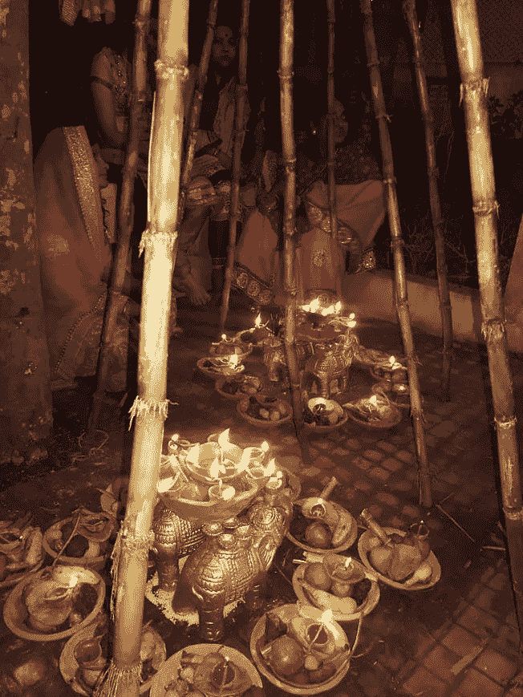
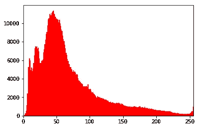
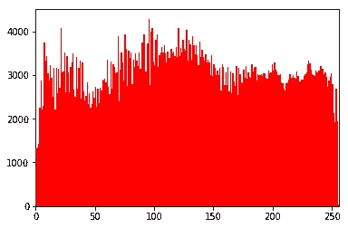
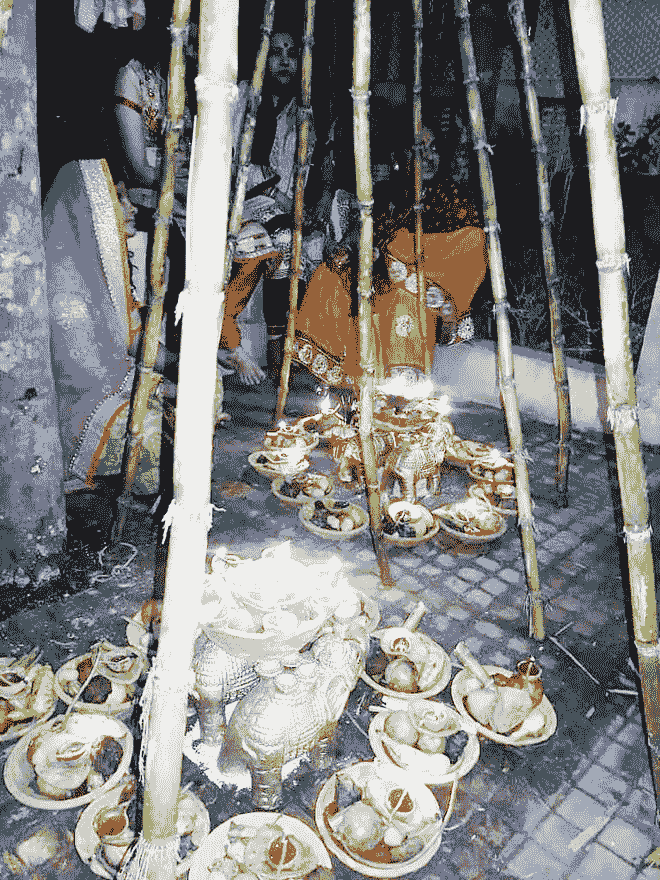
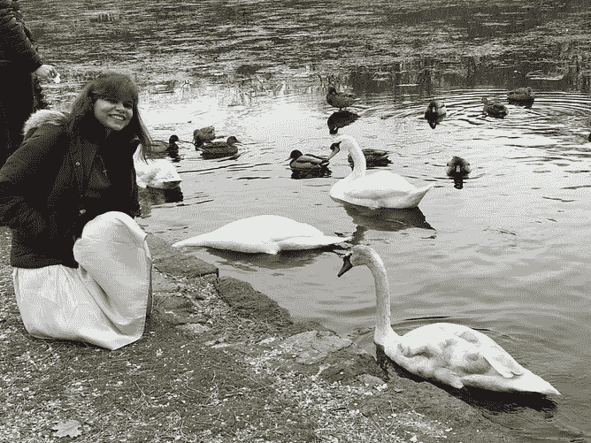
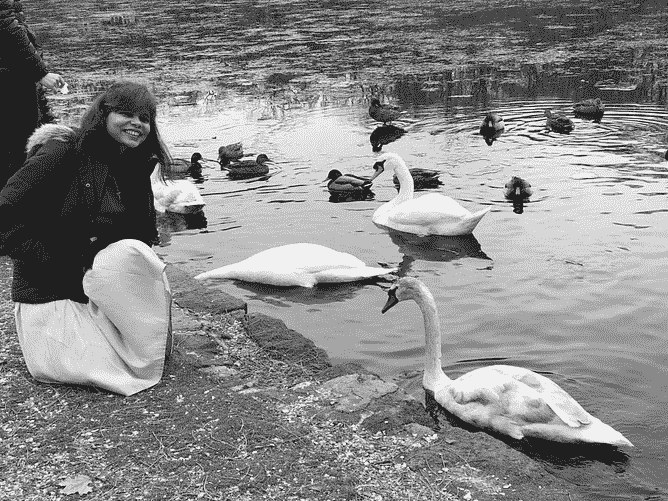
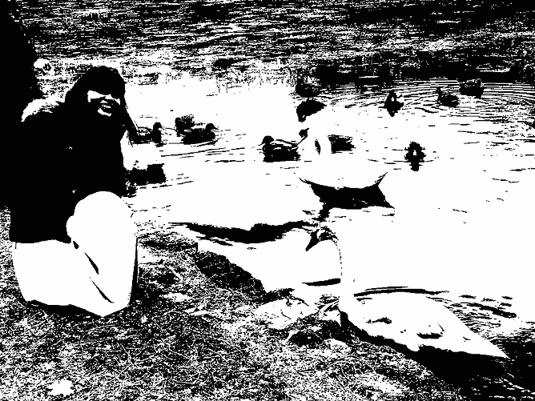

# 直方图均衡化——提高图像对比度的简单方法

> 原文：<https://towardsdatascience.com/histogram-equalization-a-simple-way-to-improve-the-contrast-of-your-image-bcd66596d815?source=collection_archive---------4----------------------->

我在石溪大学的计算机视觉课上从 Shilkrot 教授那里学到了直方图均衡化。这是一个非常简单的概念，只需要几行代码就可以实现。

你认为图像的直方图表示是什么样的？就像左边的红色区域？是啊！



(a) input image and its histogram

我们从上面的图中看到，直方图位于(a)中较亮的区域。但是，如果我们需要亮度的均匀分布，我们将需要一个变换函数，将较亮区域中的输入像素映射到整个区域中的输出像素。这就是**直方图均衡**所做的。它增强了图像的对比度。直方图均衡化的结果图像可以在(b)的右侧看到。



(b) resulting image post histogram equalization technique

```
## code to plot histogram in pythonimport numpy as np
import cv2
from matplotlib import pyplot as pltimg = cv2.imread('Chatth_Puja_Bihar_India.jpeg',0)
hist,bins = np.histogram(img.flatten(),256,[0,256])
plt.hist(img.flatten(),256,[0,256], color = 'r')
plt.xlim([0,256])
plt.show()
```

我们可以在 OpenCV 中使用函数 **cv2.equalizeHist()** 来做到这一点。如果它的输入只是灰度图像，那么输出就是我们的直方图均衡化图像。如果是彩色(RGB)图像，我们可以分离所有三种不同的流——红色、绿色、蓝色；在这些通道上分别调用 **cv2.equalizeHist()** ，最后合并回来，如下面的代码所示。为了更好地理解，我还通过 numpy 数组提供了代码。

```
def histogram_equalization(img_in):# segregate color streams
    b,g,r = cv2.split(img_in)
    h_b, bin_b = np.histogram(b.flatten(), 256, [0, 256])
    h_g, bin_g = np.histogram(g.flatten(), 256, [0, 256])
    h_r, bin_r = np.histogram(r.flatten(), 256, [0, 256])# calculate cdf    
    cdf_b = np.cumsum(h_b)  
    cdf_g = np.cumsum(h_g)
    cdf_r = np.cumsum(h_r)

# mask all pixels with value=0 and replace it with mean of the pixel values 
    cdf_m_b = np.ma.masked_equal(cdf_b,0)
    cdf_m_b = (cdf_m_b - cdf_m_b.min())*255/(cdf_m_b.max()-cdf_m_b.min())
    cdf_final_b = np.ma.filled(cdf_m_b,0).astype('uint8')

    cdf_m_g = np.ma.masked_equal(cdf_g,0)
    cdf_m_g = (cdf_m_g - cdf_m_g.min())*255/(cdf_m_g.max()-cdf_m_g.min())
    cdf_final_g = np.ma.filled(cdf_m_g,0).astype('uint8')cdf_m_r = np.ma.masked_equal(cdf_r,0)
    cdf_m_r = (cdf_m_r - cdf_m_r.min())*255/(cdf_m_r.max()-cdf_m_r.min())
    cdf_final_r = np.ma.filled(cdf_m_r,0).astype('uint8')# merge the images in the three channels img_b = cdf_final_b[b]
    img_g = cdf_final_g[g]
    img_r = cdf_final_r[r]

    img_out = cv2.merge((img_b, img_g, img_r))# validation
    equ_b = cv2.equalizeHist(b)
    equ_g = cv2.equalizeHist(g)
    equ_r = cv2.equalizeHist(r)
    equ = cv2.merge((equ_b, equ_g, equ_r))
    #print(equ)
    #cv2.imwrite('output_name.png', equ)return img_out
```

# 应用程序

1.  您可以使用直方图均衡化来改善任何低对比度图像的亮度。
2.  在人脸识别技术中，在训练人脸数据之前，对人脸图像进行直方图均衡化，使它们具有相同的光照条件。

# 奖金

首先，使用下面的代码将图像转换为灰色和黑白。

```
import cv2

originalImage = cv2.imread('avalon_lake.jpeg')
grayImage = cv2.cvtColor(originalImage, cv2.COLOR_BGR2GRAY)
(thresh, blackAndWhiteImage) = cv2.threshold(grayImage, 127, 255, cv2.THRESH_BINARY)cv2.imwrite('blackAndWhiteImage.png', blackAndWhiteImage)
cv2.imwrite('grayImage.png', grayImage)
```



Original -> Gray -> BW