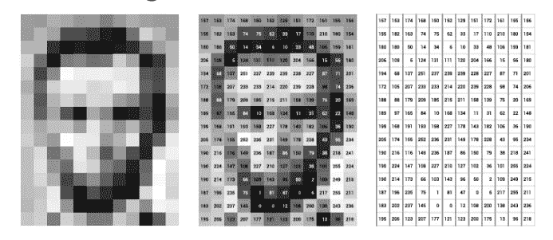

# skimage-Python 在图像处理中的直方图

> 原文：<https://towardsdatascience.com/histograms-in-image-processing-with-skimage-python-be5938962935?source=collection_archive---------2----------------------->


可视化一直是表示和解释许多统计细节的有效方法。在图像处理中，直方图用于描述我们正在处理的图像的许多方面。比如，

*   暴露
*   对比
*   动态量程
*   浸透

还有很多。通过可视化直方图，我们可以改善图像的视觉呈现，并且我们还可以通过比较图像的直方图来找出可以应用什么类型的图像处理。

# 什么是直方图？



图像存储为像素值，每个像素值代表一个颜色强度值。直方图是图像中出现的这些强度值的频率分布。

```
h(i) = the number of pixels in I(image) with the intensity value i
```

例如，如果 i = 0，则 h(0)是值为 0 的像素数。

# 用 skimage 创建图像的直方图

**灰度图像**


```
from skimage import io
import matplotlib.pyplot as pltimage = io.imread('~/Desktop/Lenna_gray.png')ax = plt.hist(image.ravel(), bins = 256)
plt.show()Output: Figure-1
```


Figure-1

在上面的代码中，我们已经加载了 Lenna 的灰度图像，并使用 matplotlib 生成了它的直方图。由于图像是以 2D 有序矩阵的形式存储的，我们使用 ravel()方法将其转换为 1D 数组。

**彩色图像**

在彩色图像中，我们有 3 个颜色通道代表 RGB。在组合颜色直方图中，强度计数是所有三个颜色通道的总和。

```
h(i) = h_red(i) + h_green(i) + h_blue(i)
```


```
from skimage import io
import matplotlib.pyplot as pltimage = io.imread('~/Desktop/Lenna.png') _ = plt.hist(image.ravel(), bins = 256, color = 'orange', )_ = plt.hist(image[:, :, 0].ravel(), bins = 256, color = 'red', alpha = 0.5)_ = plt.hist(image[:, :, 1].ravel(), bins = 256, color = 'Green', alpha = 0.5)_ = plt.hist(image[:, :, 2].ravel(), bins = 256, color = 'Blue', alpha = 0.5)_ = plt.xlabel('Intensity Value')
_ = plt.ylabel('Count')
_ = plt.legend(['Total', 'Red_Channel', 'Green_Channel', 'Blue_Channel'])
plt.show()Output: Figure-2
```


Figure-2

# **什么是直方图宁滨？**

通常，在 8 位 representation(2⁸).中，图像的亮度值范围是从[0–255]但是图像也可以使用 2 ⁶、2 比特等来表示。在这种情况下，强度范围很大，很难在直方图中表示每个强度值。

我们用宁滨来克服上述问题。这里我们将范围量化为几个桶。举个例子，

```
if we quantize 0-255 into 8 bins, here our bins will be
0-31, 32-63, 64-95, 96-127, 128-159, 160-191, 192-223, 224-255
```

现在，我们需要找到一种方法将每个亮度值放入适当的箱中。我们可以简单地解决这个问题，

```
k = 256 #number of possible integer values in 8 bit representation
b = 8   #number of binsj = floor( (h(i)*b)/k )#j is the bin number of the intensity value at position i
```

让我们再次绘制灰度 Lenna 图像的直方图，

```
from skimage import io
import matplotlib.pyplot as pltimage = io.imread('~/Desktop/Lenna_gray.png')_ = plt.hist(image.ravel(), bins = 8 )
_ = plt.xlabel('Intensity Value')
_ = plt.ylabel('Count')
plt.show()Output: Figure-3
```


Figure-3

# 什么是累积直方图？

累积直方图是一种特殊的直方图，可以从正常直方图中导出。我们找到从 0 到 255 的每个强度值的计数，然后将每个后续计数相加，

```
if i = 0 then H(i) = h(0)
else H(i) = H(i-1) + h(0)
```

累积直方图在许多图像处理应用中是有用的，如直方图均衡化等。

```
from skimage import io
import matplotlib.pyplot as pltimage = io.imread('~/Desktop/Lenna_gray.png')_ = plt.hist(image.ravel(), bins = 256, cumulative = True)
_ = plt.xlabel('Intensity Value')
_ = plt.ylabel('Count') 
plt.show()Output: Figure-4
```


Figure-4

我希望你明白什么是直方图，以及如何使用 skimage 创建直方图。让我们再见面，我会告诉你一些直方图在图像处理中的用例。