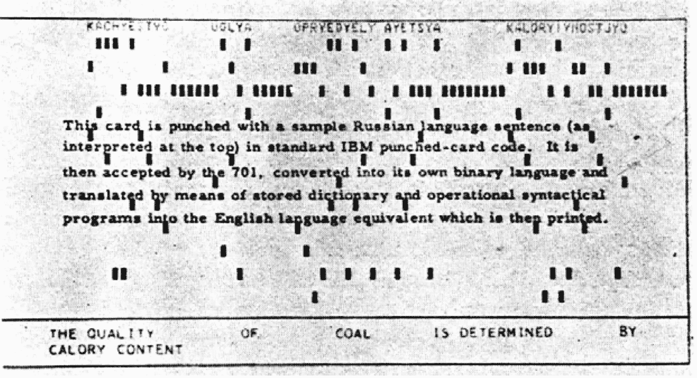
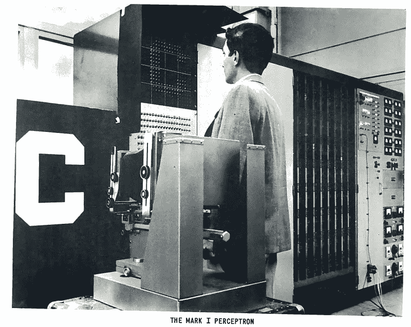

# 第一个人工智能冬天的历史

> 原文：<https://towardsdatascience.com/history-of-the-first-ai-winter-6f8c2186f80b?source=collection_archive---------4----------------------->

人工智能历史悠久。人们可以争辩说，它甚至早在这个术语首次被创造出来之前就已经开始了；大部分是在故事里，后来是在叫做自动机的实际机械装置里。这一章只涵盖了与 AI winters 时期相关的事件，并没有过于详尽，希望从中提取出可以应用于今天的知识。

# 导致第一个人工智能冬天的事件

为了帮助理解艾温特斯现象，导致他们的事件进行了审查。

## 20 世纪 50 年代人工智能领域的开端

许多关于思维机器的早期想法出现在 20 世纪 40 年代末至 50 年代，由图灵或冯·诺依曼等人提出。图灵试图框定“机器能思考吗？”创造了模仿游戏，现在著名的图灵测试。

1955 年，亚瑟·塞缪尔写了一个程序，可以很好地玩跳棋。一年后，它甚至出现在电视上。它结合使用了启发式和学习权重的树搜索。塞缪尔手工制作的启发来自跳棋专家的一本书。他使用了一种他称之为“时间差学习”的学习算法，利用最初计算的分数和搜索完成后的分数之间的“误差”来调整权重。

1954 年，进行了机器翻译的首批实验之一。它使用了 250 个单词的词典进行翻译，并结合了句法分析。演示了英语和俄语之间的翻译。*纽约时报*评论道:

> “不可否认，这相当于粗略的逐字翻译……但设计者说，对于科学家翻译词汇远比句法更成问题的外国技术论文来说，这将是非常有价值的。”

那时，设计者认为大部分工作已经完成，只有一些小错误需要修复。Hutchin 指出，这是机器翻译有史以来最深远的报道。由于这个原因，它产生了巨大的炒作，并使其更容易获得资金用于后续工作。

人工智能研究从美国国防机构(ONR 和 ARPA，后来称为 d ARPA)获得了大量资金，希望这些技术对美国海军有用。当时，人们对人工智能的状态充满了热情和乐观。机器翻译领域在冷战期间尤为重要，因为政府对从俄语到英语的自动翻译非常感兴趣。

早期的实验激发了 1956 年创建达特茅斯夏季项目的灵感，人工智能一词就是在那里诞生的。暑期项目的主题是“学习的每一个方面或智力的任何其他特征原则上都可以被精确地描述，以至于可以制造一台机器来模拟它”。来自许多不同领域的研究人员被邀请，提出了许多不同的想法、论文和概念。虽然取得了进展，但有些人感到失望，例如，麦卡锡在回应研讨会时说，“研讨会没有达到我的预期的主要原因是人工智能比我们想象的更难。”

1957 年，罗森布拉特发明了感知器，这是一种神经网络，其中二进制神经单元通过可调权重连接。他受到 20 世纪 40 年代神经科学工作的启发，这使他在大脑中创建了神经元的原始复制。

他尝试了很多不同的布局和学习算法。一种感知器被称为串联耦合，这在今天是指神经网络的标准前馈布局，其中数据从输入流向输出。一个突出的布局是他所谓的阿尔法感知器，一个三层串联耦合网络，在这种情况下，三层包括输入和输出层。当时的计算机运行感知器太慢了，所以罗森布拉特建造了一台特殊用途的机器，带有由小电机控制的可调电阻(电位计)。该设备能够学习对不同形状或字母的图像进行分类。*纽约时报*报道了感知器:

> "海军展示了一种电子计算机的雏形，它期望这种计算机能够行走、说话、看、写、自我复制并能意识到自己的存在。"

同年(1957 年)，西蒙这样总结了人工智能的当前进展:

> “我的目的不是让你感到惊讶或震惊——但我能总结的最简单的方法是，现在世界上有了会思考、会学习、会创造的机器。此外，他们做这些事情的能力将迅速提高，直到——在可见的未来——他们能够处理的问题范围将与人类思维的应用范围相同。”

## 平静的十年

在 20 世纪 50 年代和 60 年代初对机器翻译的投资和热情增加后，进展停滞了。哈钦斯把 1967 年到 1976 年这段时间称为机器翻译的平静十年。Bar-Hillel 说机器翻译是不可行的。他证明了计算机需要太多关于世界的信息来进行正确的翻译，他认为这“完全是空想，几乎不值得任何进一步的讨论。”自动语言处理咨询委员会在 1964 年得出结论，没有立即或可预见的有用的机器翻译的前景。1966 年的一份报告得出结论说，“还没有通用科学文本的机器翻译，而且近期也不会有”，这导致所有学术翻译项目的资金被削减。

机器翻译中的失望对人工智能领域尤其有害，因为美国国防机构希望出现可用的系统，但在人工智能的其他领域也注意到了类似的模式。1965 年，德雷福斯将人工智能与炼金术并列。他研究了当时几个领域的成就，并得出结论:“一个总体模式正在形成:基于简单任务的轻松表现或复杂任务的低质量工作的早期戏剧性成功，然后是回报递减、失望，以及在某些情况下的悲观情绪。”

机器翻译平静的十年是导致第一个人工智能冬天的最重要事件之一。另一个是联结主义运动的衰落，这将在下一节讨论。

## 联结主义的衰落

1969 年，明斯基和帕佩特的书*感知器*出版。这是对罗森布拉特感知机的严厉批评。Minsky 和 Papert 证明了感知器只能被训练来解决线性可分问题。例如，非线性可分问题的一个最糟糕的例子是异或(XOR)。对于成功解决 XOR 问题的网络，只有当它的一个输入为真时，它的输出才能为真，而不是两个都为真。这对联结主义者来说是一个巨大的打击，他们相信人工智能可以通过模仿大脑来实现。Minsky 和 Papert 知道多层能够解决这个问题，但是没有算法来训练这样的网络。这种算法花了 17 年才被设计出来，现在被称为反向传播。只是到了后来，人们才发现反向传播算法以前就被发现过。事实证明，反向传播算法甚至在*感知机*发表之前就已经发明了。

## 莱特希尔报告及其后果

莱特希尔报告(1973 年出版)是为英国科学研究委员会撰写的对当时人工智能现状的评估。该报告得出的结论是，人工智能研究人员的承诺被夸大了:“迄今为止，该领域的任何发现都没有产生当时承诺的重大影响。”尽管报告指出，最令人失望的研究领域是机器翻译，“在这个领域，花费了巨额资金，却没有什么有用的结果……”报告的作者詹姆斯·莱特希尔认为，未能战胜“组合爆炸”是问题的核心。他所指的术语组合爆炸是搜索空间中一个众所周知的问题，就像树一样，当沿着树向下时，节点的数量呈指数增长。例如，在像国际象棋这样的游戏中，Shannon 证明了可能的游戏数量从第一步的 20 个增加到第二步的 400 个，到第五步已经有 4，865，609 个可能性，因此代表了组合爆炸。

当时莱特希尔的报告遭到了很多批评，甚至一场为 BBC 拍摄的辩论也不幸从未播出。与其他科学领域进行了比较，并评论说，人们不应该期望结果那么快。尽管这些评论可能是正确的，但这份报告还是产生了影响。报告发布后，英国政府削减了除两所大学以外的所有参与该领域研究的大学的资金，这掀起了一股席卷整个欧洲的浪潮，甚至对美国产生了影响。

## 第一个人工智能冬天

几个情况结合起来创造了第一个人工智能冬天。起初，随着大量乐观的新闻报道，人们对这一新领域的潜力的热情迅速增长。然后，机器翻译中的失望创造了一个安静的时代。接着明斯基和帕佩特提出了阻碍感知机发展的障碍。最终，莱特希尔的报告出台了，它要求对该领域进行现实的评估。随着莱特希尔报告的到来，第一个冬天开始于 1973 年左右。该报告对资金有影响，因此人工智能的研究变得困难。DARPA(国防高级研究计划局)开始资助更多的应用人工智能项目和更少的基础工作。人工智能的冬天持续了几年，但在 80 年代初，人工智能领域经历了另一个高潮。

## 我就这个话题制作了一个很酷的视频——来看看吧！

## 查看第二部分！