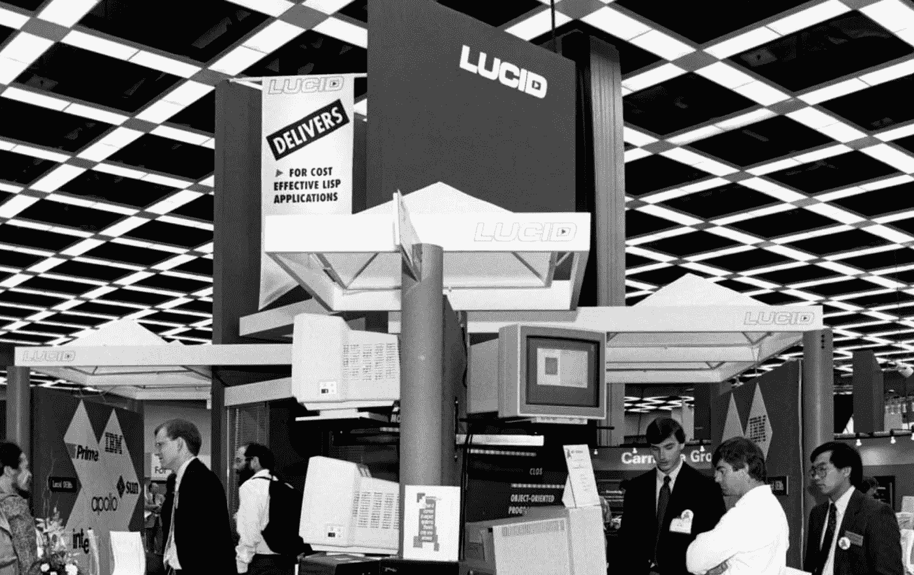
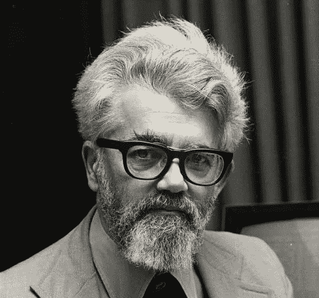

# 第二届 AI 冬季的历史

> 原文：<https://towardsdatascience.com/history-of-the-second-ai-winter-406f18789d45?source=collection_archive---------13----------------------->

## 先来看看[第一部](https://medium.com/@schuchmannsebastian/history-of-the-first-ai-winter-6f8c2186f80b)！

# 导致第二次人工智能冬季的事件

在第一个人工智能冬天的影响开始下降后，一个新的人工智能时代开始了。这一次，更多的努力集中在创造商业产品上。此外，像 AAAI 这样的大型会议始于 20 世纪 80 年代初，门票销售迅速增长。普通行业和政府官员都开始对人工智能技术表现出新的兴趣。

人工智能商业化的核心是专家系统。这些系统是由调查专家手工制作的，并相应地创建了“如果-那么”规则集。这种方法被称为“自上而下”的人工智能方法，许多人认为专家知识是创造人工智能的最佳方式。这些系统应用于金融规划、医疗诊断、地质勘探和微电子电路设计等领域。

《T2 商业周刊》也加入了炒作的行列，并在 1984 年发表了标题为《人工智能:它在这里》的文章。类似地，许多公司做出了不同寻常的声明，如:“我们已经建造了一个更好的大脑”，并宣称“现在可以将人类的知识和经验编程到计算机中……人工智能终于成熟了。"

## 对即将到来的冬天的恐惧

随着对人工智能的大肆宣传，研究人员担心该领域可能不会产生预期的结果。在一个名为“人工智能的黑暗时代——我们能避免还是生存下去？”在 1984 年的 AAAI 会议上，科学家们讨论了是否可以阻止即将到来的人工智能冬天。

> “这种不安是因为担心对人工智能的期望过高，这最终会导致灾难。我认为重要的是，我们要采取措施，确保人工智能冬天不会发生[……]。”

人们担心，当不切实际的期望无法实现时，资金会再次枯竭。这种担心被证明是正确的。

# 第二个人工智能冬天

在接下来的几年里，关于人工智能系统能力的说法不得不慢慢面对现实。处于革命中心的专家系统面临许多问题。1984 年，约翰·麦卡锡批评专家系统，因为他们缺乏常识和对自身局限性的了解。

John McCarthy

他描述了为帮助医生而建立的专家系统 MYCIN。然后，他列举了一个病人肠道内有*霍乱弧菌*的情况。当被询问时，系统开出了两周的四环素。这很可能会杀死所有的细菌，但那时病人已经死了。此外，对于工程师来说，许多任务过于复杂，无法围绕它们手动设计规则。视觉和语音系统包含太多的边缘情况。

DARPA ISTO(国防高级研究计划局/信息科学与技术办公室)主任施瓦茨在 1987 年至 1989 年间得出结论，人工智能研究一直有

> “……在特定领域取得了非常有限的成功，紧接着又未能实现更广泛的目标，而这些最初的成功起初似乎暗示了……”。

这导致人工智能研究的资金减少。由于预期无法实现，对人工智能的普遍兴趣下降。这个时候很多 AI 公司关门了。1986 年吸引了 6000 多名参观者的 AAAI 会议到 1991 年迅速减少到只有 2000 人。类似地，从 1987 年开始，人工智能相关的文章减少，并在 1995 年达到最低点，这可以在纽约时报中观察到。

## 我就这个话题制作了一个很酷的视频——来看看吧！