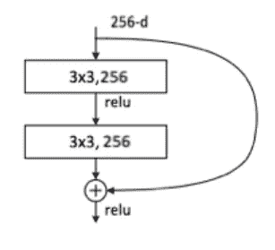
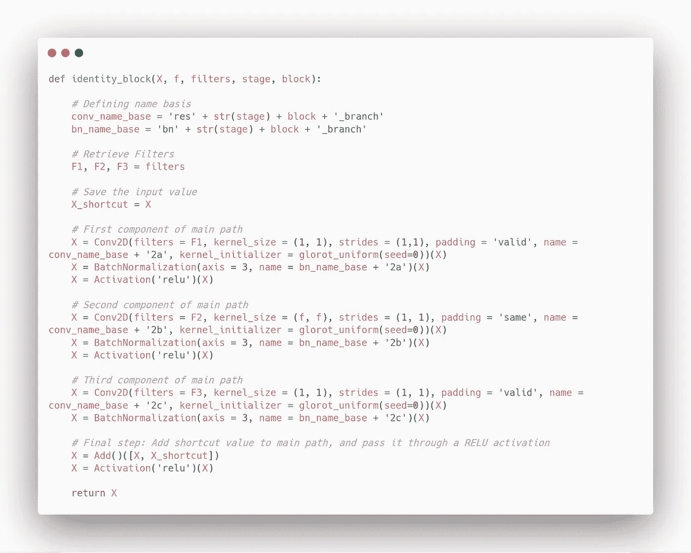
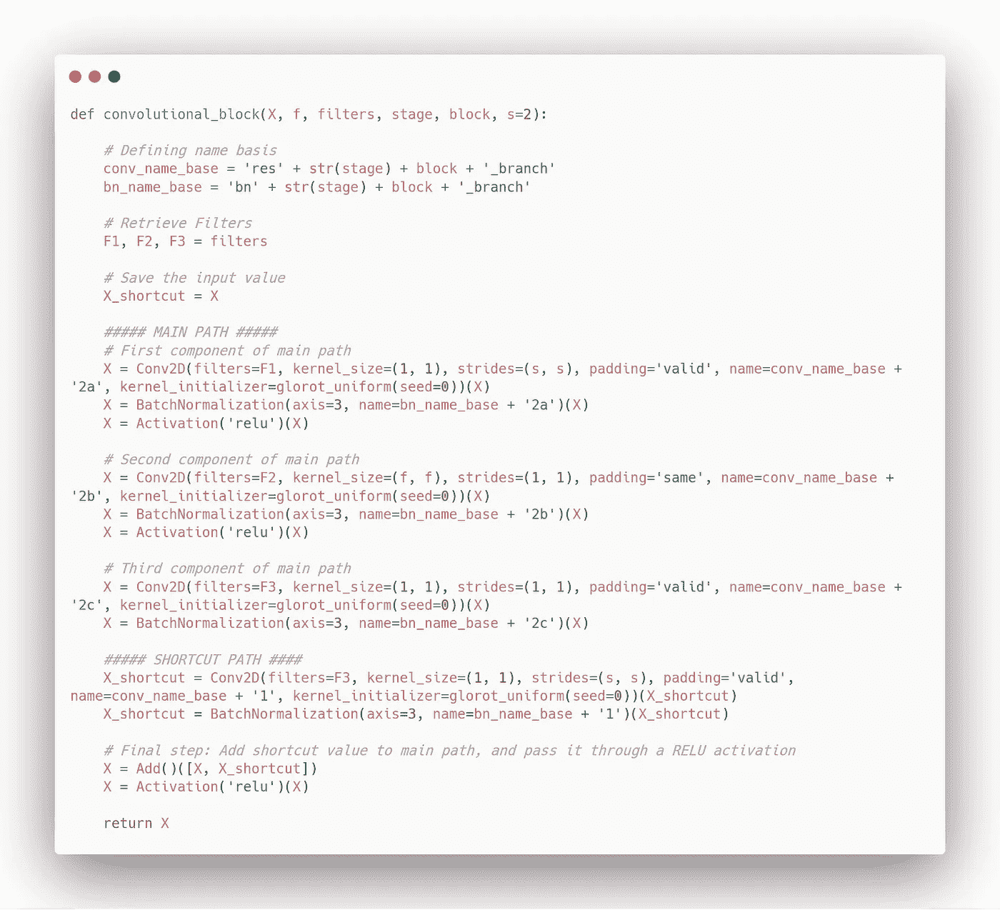
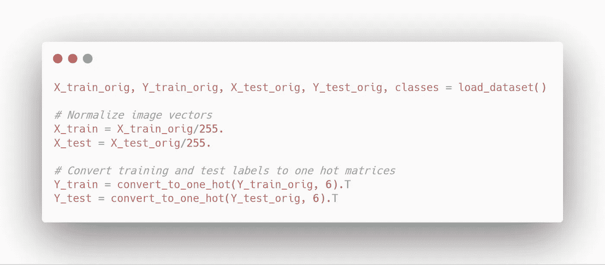

# 喀拉斯剩余网络搭便车指南(ResNet)

> 原文：<https://towardsdatascience.com/hitchhikers-guide-to-residual-networks-resnet-in-keras-385ec01ec8ff?source=collection_archive---------2----------------------->

## 学习剩余网络的基础，并在 Keras 中建立一个 ResNet


Photo by [Andrés Canchón](https://unsplash.com/@bethewerewolf?utm_source=medium&utm_medium=referral) on [Unsplash](https://unsplash.com?utm_source=medium&utm_medium=referral)

非常深的神经网络很难训练，因为它们更容易消失或爆发梯度。为了解决这个问题，来自一层的激活单元可以被直接馈送到网络的更深层，这被称为**跳过连接**。

这形成了**剩余网络**或**剩余网络**的基础。这篇文章将在 Keras 中实现一个之前介绍剩余网络的基础知识。

> 关于机器学习、深度学习和人工智能的实践视频教程，请查看我的 [YouTube 频道](https://www.youtube.com/channel/UC-0lpiwlftqwC7znCcF83qg?view_as=subscriber)。

With ResNets, we can build very deep neural networks

# 残余块

ResNet 的构造块被称为**剩余块**或**标识块**。当一层的激活被快进到神经网络中更深的层时，残余块就简单了。



Example of a residual block

正如您在上面的图像中看到的，来自前一层的激活被添加到网络中更深一层的激活中。

这个简单的调整允许训练更深层次的神经网络。

理论上，训练误差应该随着更多层被添加到神经网络而单调减少。然而，在实践中，对于传统的神经网络，它将达到训练误差开始增加的点。

ResNets 没有这个问题。随着更多的层被添加到网络中，训练误差将不断减小。实际上，ResNets 已经使训练 100 层以上的网络成为可能，甚至达到 1000 层。

# 建立图像分类的资源网

现在，让我们使用 [Keras](https://keras.io/) 为图像分类构建一个 50 层的 ResNet。

> Keras 是一个高级神经网络 API，用 Python 编写，能够在 [TensorFlow](https://github.com/tensorflow/tensorflow) 、 [CNTK](https://github.com/Microsoft/cntk) 或 [Theano](https://github.com/Theano/Theano) 之上运行。它的开发重点是支持快速实验。

在这种情况下，我们将使用 TensorFlow 作为后端。当然，在开始之前，可以随意抓取整个[笔记本](https://github.com/marcopeix/Deep_Learning_AI/blob/master/4.Convolutional%20Neural%20Networks/2.Deep%20Convolutional%20Models/Residual%20Networks.ipynb)并进行所有必要的导入。

## 步骤 1:定义标识块

首先，我们定义身份块，这将使我们的神经网络成为一个*剩余网络*，因为它表示跳过连接:



## 步骤 2:卷积块

然后，我们构建一个卷积模块，如下所示:



注意卷积块是如何结合*主*路径和*快捷方式*的。

## 步骤 3:构建模型

现在，我们将两个模块结合起来构建一个 50 层剩余网络:

## 第四步:培训

在训练之前，要认识到我们有一个返回*模型*的函数。因此，我们需要将它赋给一个变量。然后，Keras 要求我们编译模型:

```
model = ResNet50(input_shape = (64, 64, 3), classes = 6)
model.compile(optimizer='adam', loss='categorical_crossentropy', metrics=['accuracy'])
```

完成后，我们可以对图像进行标准化，并对其进行一次性编码:



之后，我们可以拟合模型:

```
model.fit(X_train, Y_train, epochs = 2, batch_size = 32)
```

看看它的表现如何:

```
preds = model.evaluate(X_test, Y_test)
print (“Loss = “ + str(preds[0]))
print (“Test Accuracy = “ + str(preds[1]))
```

现在，你会看到我们只有 16%的准确率。这是因为我们只训练了 2 个纪元。你可以在你自己的机器上训练你的模型更长的时间，但是要意识到这需要很长的时间，因为它的网络非常大。

## 步骤 5:打印模型摘要

Keras 使得对我们刚刚构建的模型进行总结变得非常容易。只需运行以下代码:

```
model.summary()
```

您将获得网络中每一层的详细总结。

您还可以生成网络架构的图片，并将其保存在您的工作目录中:

```
plot_model(model, to_file=’ResNet.png’)
SVG(model_to_dot(model).create(prog=’dot’, format=’svg’))
```

太好了！您刚刚学习了剩余网络的基础知识，并使用 Keras 构建了一个剩余网络！同样，随意训练算法更长时间(约 20 个历元)，您应该会看到网络表现非常好。然而，如果你只在 CPU 上训练，这可能需要超过 1 小时。

在未来的帖子中，我将展示如何在 TensorFlow 中执行神经风格转移，这是一种非常有趣的应用卷积神经网络的方法！

继续学习！

参考: [deeplearning.ai](https://www.deeplearning.ai/)