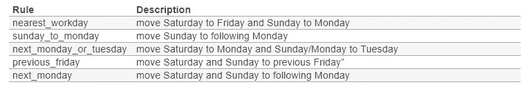

# 有熊猫的节日日历

> 原文：<https://towardsdatascience.com/holiday-calendars-with-pandas-9c01f1ee5fee?source=collection_archive---------1----------------------->

听说**数据科学家**是在 Mac 上使用 Python 的统计学家是很常见的。在某种程度上，这是正确的。然而，任何在学术界工作过的人都知道，对于统计学家来说，[奶牛是球形的](https://en.wikipedia.org/wiki/Spherical_cow)，一个月有 365.25/12 天。相反，在现实世界中，没有两头牛是相同的，也没有一个月是相同的。

我希望这篇文章为那些处理数据的人所花费的额外工作和时间增加价值，避免统计简化，不管他们是数据科学家还是其他什么人。


Photo by [Julien Riedel](https://unsplash.com/@djulien?utm_source=medium&utm_medium=referral) on [Unsplash](https://unsplash.com?utm_source=medium&utm_medium=referral)

# 熊猫的时间序列

Pandas 是 Python 中数据管理的实际分析工具*。它允许你轻松地处理数字表格和时间序列。Pandas 中的一个有用特性是使用 ***pd.date_range()*** 函数轻松设置日期范围，该函数包括以下参数(必须指定三个):*

*   **开始**:范围的开始。生成日期的左极限
*   **结束**:范围结束。右极限
*   **周期**:要生成的周期数
*   **频率**:频率字符串(如 D:日历日频率，M:月末频率，Y:年末频率)参见[抵销别名列表](https://pandas.pydata.org/pandas-docs/stable/user_guide/timeseries.html#offset-aliases)。

# **时间序列的基本例子**

几行就够了:

```
 Date
0  2019-01-31
1  2019-02-28
2  2019-03-31
3  2019-04-30
4  2019-05-31
5  2019-06-30
6  2019-07-31
7  2019-08-31
8  2019-09-30
9  2019-10-31
10 2019-11-30
11 2019-12-31
```

# **创建每月最后一个工作日的时间序列**

在某些领域，主要是金融和精算领域，管理日期范围特别有用，其中系列中的日期对应于该月的第一个或最后一个工作日(例如，当计划支付息票或年金时)。

为此，***PD . date _ range()***函数具有不同的频率参数值。在以下示例中，“BM”对应于 *BusinessMonthEnd* (每月的最后一个工作日):

```
 Date
0  2019-01-31
1  2019-02-28
2  2019-03-29
3  2019-04-30
4  2019-05-31
5  2019-06-28
6  2019-07-31
7  2019-08-30
8  2019-09-30
9  2019-10-31
10 2019-11-29
11 2019-12-31
```

# **要从数据中预测未来，就必须知道要填补的空白**

然而，如果我们想要更准确，我们必须考虑银行假日(例如，如果我们计算的成本取决于息票和息票之间的确切天数，20 天中有 1 天是 5%的误差)。在评估人类习惯和行为(医疗保健、旅行等)时，知道一段时间内的假期特别有用。).在保险业，这些模式可以直接影响会计准备金；例如，在计算已发生但未报告的成本时(IBNR)。事实上，在一些保险公司，由于闰年比其他年份多一个日历日，所以略微提高索赔率是很常见的。

在下面的例子中，我们引入了两个银行假日的列表(*2 月 28 日*和*5 月 31 日*)来看看它是如何工作的。然后，如果付款发生在每月的最后一个工作日，我们将计算付款间隔的天数:

```
 Date  n_days
0  2019-01-31     0.0
1  2019-02-27    27.0
2  2019-03-29    30.0
3  2019-04-30    32.0
4  2019-05-30    30.0
5  2019-06-28    29.0
6  2019-07-31    33.0
7  2019-08-30    30.0
8  2019-09-30    31.0
9  2019-10-31    31.0
10 2019-11-29    29.0
11 2019-12-31    32.0
```

*如图所示，2019–02–28 和 2019–05–31 没有出现在支付日历中。*

# **为自定义假日日历创建规则**

最后，可以选择编写计算公共假期的规则(因为这些规则通常会延续到下一个工作日)。

在某些国家，如美国，有法律(*1968 年统一星期一假日法案*)，其规则包含在 Pandas，*print(usfederalholidaycalendar . rules)*中，作为开发其他日历的示例。

然而，在许多其他国家，没有确定一年中的假期的规则(如在欧洲)，假期是由每年的法规确定的。对于在固定日期发生的假日(例如*美国阵亡将士纪念日*或*4 月 4 日*),遵守规则确定该假日是在周末还是其他未遵守的日子。定义的遵守规则有:



在这种情况下，可以使用一些公共前提来编写劳工日历的规则，用于计算银行假日，因为星期日被移到下一个星期一(*observation = Sunday _ to _ Monday*instruction)。例如:2018 年加拿大国庆日(7 月 1 日)是周日，被移到了 7 月 2 日。这些应该在*AbstractHolidayCalendar*类上被覆盖，以使范围应用于所有日历子类。

后来，我展示了 2018 年 7 月的劳动节，以检查它是如何工作的:

```
 Date
0  2018-07-03
1  2018-07-05
2  2018-07-06
3  2018-07-09
4  2018-07-10
5  2018-07-11
6  2018-07-12
7  2018-07-13
8  2018-07-16
9  2018-07-17
10 2018-07-18
11 2018-07-19
12 2018-07-20
13 2018-07-23
14 2018-07-24
15 2018-07-25
16 2018-07-26
17 2018-07-27
18 2018-07-30
19 2018-07-31
```

你可以看到 7 月 1 日星期日是如何被 7 月 2 日星期一取代的

这样，一旦我们创建了自己的国家假日日历，我们就可以使用它来查看未来几年的银行假日，例如 2020 年:

```
DatetimeIndex(['2019-01-01', '2019-01-07', '2019-03-18', 
               '2019-04-01', '2019-04-19', '2019-05-01', 
               '2019-07-01', '2019-07-04', '2019-11-01', 
               '2019-12-25'],
              dtype='datetime64[ns]', freq=None)
```

地区和当地的节日也可以以同样的方式包括在内，尽管注意到在某些国家通常是可移动的节日(一个宗教节日，每年不在同一天)。在这种情况下，有必要基于 ***【复活节()*** 或 ***周日 _ 至 _ 周一()*** 熊猫函数创建一个新函数。例如，在法国，圣灵降临节是复活节后的第七个星期一。


Photo by [San Fermin Pamplona - Navarra](https://unsplash.com/@sanfermin?utm_source=medium&utm_medium=referral) on [Unsplash](https://unsplash.com?utm_source=medium&utm_medium=referral)

我们的自定义日历也可以用于其他图书馆，如 Prophet。 [Prophet](https://facebook.github.io/prophet/docs/quick_start.html) 是一个由脸书创建的高级机器学习库，专注于非线性时间数据回归模型，需要用户提供一个假期列表。

关于犹太历中规则的创建，请看由 Ulrich 和 David Greve 所做的这些规则。

*(西班牙文，*[](https://analisisydecision.es/calendario-dias-laborales-pandas/)**)**