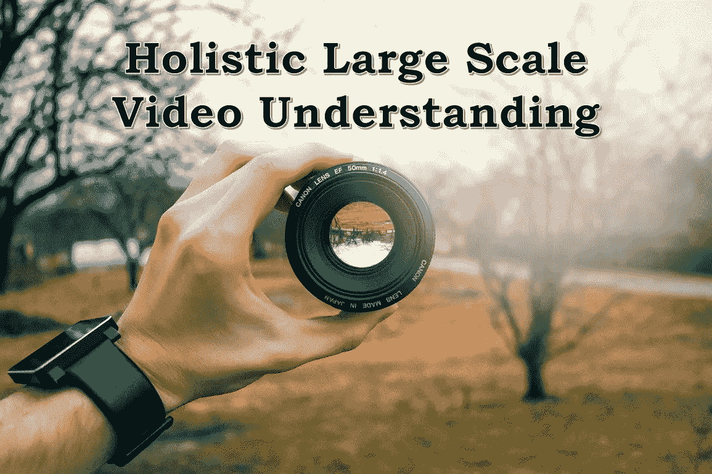
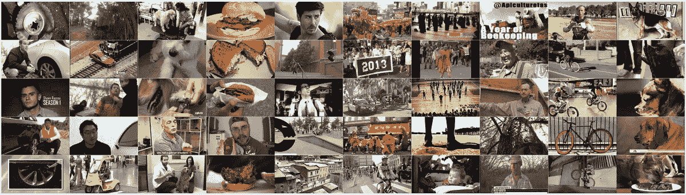
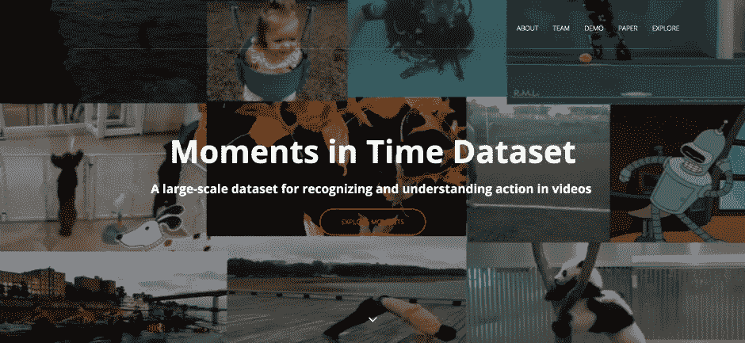
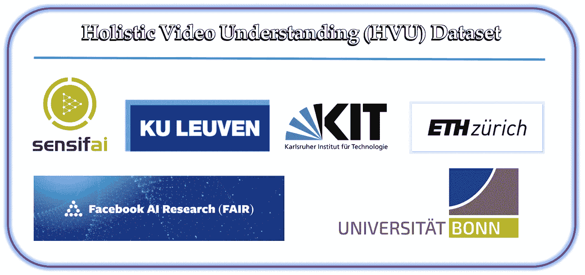
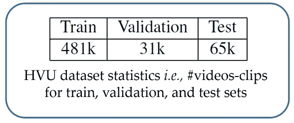
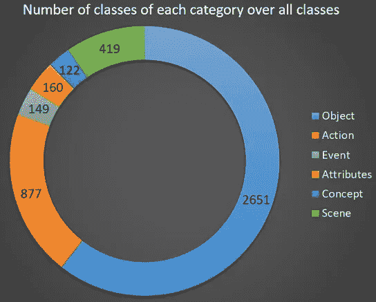
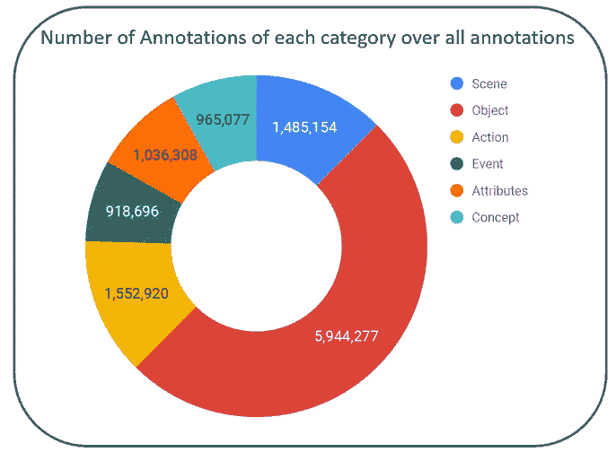
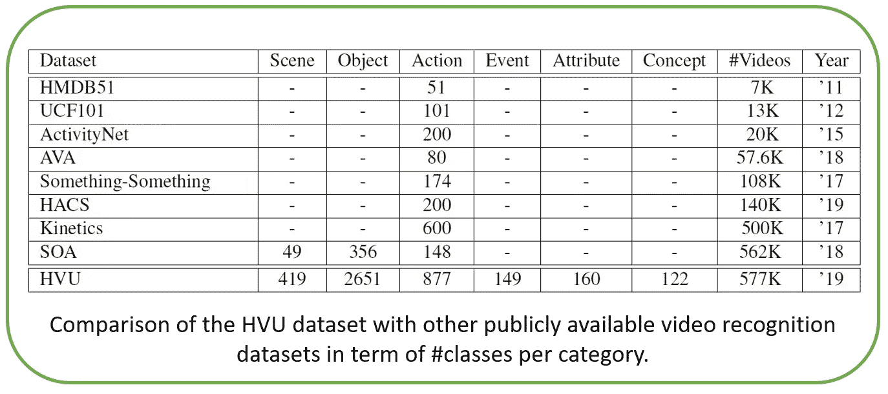
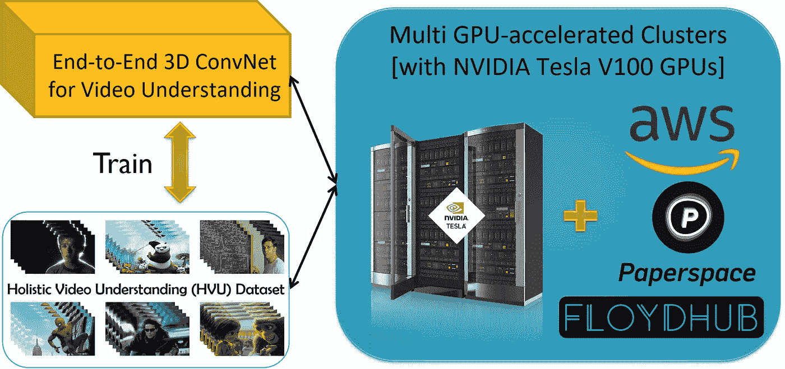
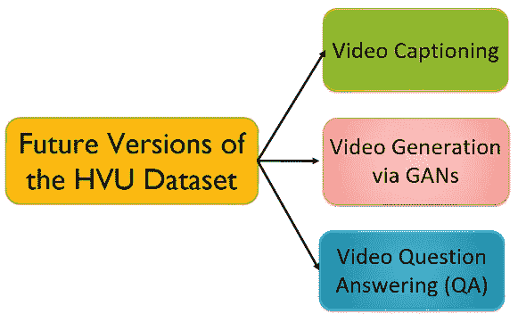

# 整体大规模视频理解

> 原文：<https://towardsdatascience.com/holistic-large-scale-video-understanding-c423701b777a?source=collection_archive---------16----------------------->

每年在世界各地都会举行几次机器学习、深度学习和计算机视觉方面的会议。在这些会议上，将确定提交研究人员文章的具体截止日期。会议的组织者将收集提交的文章，然后，他们的裁判将判断和审查他们。通常，裁判是从优秀的大学教授中挑选出来的，这些教授对机器学习领域有着丰富的知识，拥有长尾专业知识。最后，在创新程度、质量、解决科学问题的效果以及其他措施方面，一些较好的文章将被选择用于出版过程。

在会议期间，他们提交的论文被接受的研究团队将在预定的时间内展示他们的工作和研究成果。通常在这些会议之余，会在上述领域举办一些特别重要的研讨会。在这些研讨会中，将研究人工智能特定领域的科学和实践方面的当前趋势(*例如*，视频理解)。在某些情况下，还会发起一场竞赛来鼓励研讨会的参与者。这些会议及其相关的研讨会对人工智能领域的实践和科学进步具有重大意义。

在计算机视觉和机器学习领域最重要的会议中，我们可以参考*计算机视觉和模式识别(CVPR)、国际计算机视觉会议(ICCV)、欧洲计算机视觉会议(ECCV)、神经信息处理系统会议(NIPS)、国际学习表征会议(ICLR)* 等。同时， [ICCV 2019](http://iccv2019.thecvf.com/) 大会预计将于今年 10 月 27 日至 11 月 2 日在韩国首尔举行。

ICCV 2019 [[reference](http://iccv2019.thecvf.com/)]

ICCV 2019 提供了非常[有趣的研讨会](http://iccv2019.thecvf.com/program/workshops)，在它的研讨会中，还提议在视频处理领域举办其他几个研讨会。这些讲习班包括以下内容:

# 1- [大规模整体视频理解](https://holistic-video-understanding.github.io/workshops/iccv2019.html):

这个研讨会的内容是这篇文章的主题，我将在后面继续阐述(在接下来的部分)。

# 2- [野外综合视频理解(CoVieW 2019)](http://cvlab.hanyang.ac.kr/coview2019/) :

本次研讨会主要讨论基于场景和动作信息组合的未剪辑(*即*，真实视频)视频摘要任务。由于在当今世界，为互联网用户节省时间是一件非常重要的事情，根据这一观点，视频摘要在不同的应用中是一项非常有利可图的任务。视频摘要任务仍然处于其早期阶段，并且从用户的观点来看还远远没有达到期望的程度。根据本次研讨会组织者的观点，动作识别和场景识别信息的结合可以导致解决这个问题的适当方法。本次研讨会的组织者还为此提供了一个数据集，其中包括约 1，500 个视频，并基于此设计了一个挑战。他们将每段视频分成 5 秒钟的片段，然后让 20 名人类注释者对每段片段进行注释。注释过程也由该段视频(*，即*，每个视频片段)的重要程度，以及相关的场景和相关的动作标签决定。该数据中场景和动作类的总数分别为 98 和 74 类。总而言之，可以说，提到的工作坊是视频内容理解领域的一个有价值的工作坊。然而，在我看来，对于这样一个复杂的任务来说，所提供的数据集的大小(*，即*，其中可用的视频数量)是低的。

Some Video Snapshots of the *CoVieW 2019 Workshop [*[*reference*](https://github.com/yalesong/tvsum50/blob/master/images/tvsum50.png)*]*

# 3- [视频检索方法及其局限性(病毒性)](https://sites.google.com/view/viral2019/):

本次研讨会的重点是基于内容分析的视频检索任务。在这方面，研讨会的组织者将视频搜索和检索问题分为两大类:1- *一般搜索*和 2- *实例搜索*。*一般搜索*或*特别搜索*是根据用户的查询检索最相关或最相似的视频的任务。查询类型还可以包括视频、图像或文本(*即*，自然语言描述)。而*实例搜索*任务是用户实际在寻找一个特定的物体、人或者地点，从而检索出包含用户想要的物体的视频。本次研讨会的组织者没有为上述任务提供具体的数据集，相反，他们介绍了该领域三个先前开发的数据集，作为他们提议的数据集。这三个数据集如下:1- Vimeo Creative Commons (V3C)，2-Internet Archive Creative Commons(IACC . 3)，3-BBC east enders[Reference](https://sites.google.com/view/viral2019/home/supported-datasets)。

# 4- [第三届 YouTube-8M 大型视频理解工作坊](https://research.google.com/youtube8m/workshop2018/):

[本次研讨会](https://research.google.com/youtube8m/workshop2019/index.html)的主要焦点是基于 YouTube-8M 数据集的*视频分类*任务。谷歌公司在 2016 年首次引入了这个数据集；显然，这个数据集是庞大的 YouTube-100M 数据集的子集，YouTube-100m 数据集是谷歌的私有数据集，谷歌不打算发布它。就视频数量而言，该数据集被认为是视频分类领域中最大的可用数据集。此外，它还对应着 YouTube 网站上约 610 万个视频的视频分类任务，每个视频的时长在 120 到 500 秒之间。该数据集的类别集(*即*，标签集)包含 3862 个实体(类别标签)。每个视频的关联标签是半自动生成的(*即*，机器生成)，并由 3 个审查者视觉验证。
这个数据集中的所有视频也都有音频，在 ***多模态(视听建模)*** 和 ***深度融合学习*** 方法方面很重要。该数据集包含总共约 35 万小时的视频，需要超过 100 的存储空间。谷歌研究团队为了使小型团队对这个庞大的数据集进行研究变得可行，还从帧级 Inception V3 模型中提取并提供了总共 13 亿个视觉特征，以及来自 VGG 启发的声学模型的大约 13 亿个音频特征。尽管就可用视频的数量而言，这个数据集被认为是当前最大的数据集，但在我看来，它的主要问题和缺点是其现有的注释非常有限，并且没有足够的丰富度来全面处理整体视频理解任务。

[[reference](https://research.google.com/youtube8m/workshop2018/logo.png)]

# 5- [智能短视频](https://intelligentshort-video.godaddysites.com/):

由于大量的短视频(*即*，从几秒到几分钟的视频)在社交网络上在不同用户之间共享和交换的事实，这些视频的处理可以是计算机视觉社区的重要主题。研讨会的主要重点是讨论这个案例。据我所知，只要这篇文章还在写，这个研讨会就不会提供任何数据集和竞赛。

# 6- [多模式视频分析和时刻](https://sites.google.com/view/multimodalvideo/home):

该研讨会的重点是基于视频内容的多模态行为来分析视频内容(*即*，提供*深度融合学习*模型，可以同时整合和训练正确的空间、时间和听觉视频信息)。研讨会的组织者，大部分是麻省理工学院-IBM 沃森人工智能实验室的成员，也提议在研讨会的同时举办两个比赛。第一场比赛是多模态多标签动作识别挑战赛。比赛是基于 ***时刻*** 数据集设计的，旨在以多模态、多标签的方式识别给定视频中的动作。《时刻》数据集由大约 83 万个 3 秒的视频片段组成，有超过 200 万个动作标签[ [参考](https://sites.google.com/view/multimodalvideo/challenges)，[参考](http://moments.csail.mit.edu/) ]。该数据集在视频理解领域是一个重要而有价值的数据集，但问题是其当前版本仅关注视频的动作，没有其他注释。

[[reference](http://moments.csail.mit.edu/)]

第二场比赛名为 ***时间动作定位挑战赛*** ，计划在视频动作定位任务中进行。动作定位任务意味着精确地确定给定视频中特定动作的确切时间段。主办方团队为本次比赛提供的数据集为 [HACS 片段数据集](http://hacs.csail.mit.edu/)；它有 140，000 个动作片段，带有来自 50，000 个未剪辑视频的时间注释。
接下来，我会详细讲解 ***大规模整体视频理解*** 工作坊以及视频内容综合理解的话题。

# 整体视频理解:

我们在视频处理领域的终极目标是全面理解给定视频的内容。视频中包含了很多信息，比如关于每一帧的信息(也称为 ***空间*** 信息)、运动信息、时间信息、音频信息、不同帧中发生的动作、事件、视频每一帧中存在的物体、每一帧的场景信息等概念和属性。如果我们可以将所有这些信息结合在一起，并对它们进行适当的分析，或者我们设计一个深度神经网络，将所有这些信息一起彻底学习，那么我们可以声称我们已经实现了一个智能视频分析系统，通过它我们可以对视频信息进行二次分析，换句话说，我们已经使视频可以搜索。
遗憾的是，几乎所有视频内容理解领域的前期工作都只关注视频中的动作识别问题。虽然准确的动作识别将对视频内容的理解产生重大影响，并且动作识别在视频理解中起着关键作用，但在以前的作品中，其他信息的缺乏是相当明显的。之前的数据集如 YouTube-8M，Sports-1M，Kinetics 等。，只专注于动作识别或视频分类任务(特别是关于体育活动和人类活动)，其他关于视频内容的信息不包含在它们的标注中。因此，他们的注释列表在提供整体智能视频理解系统方面并不丰富。值得注意的是，其他视频信息的可用性，如其中的对象、场景信息等。在确定视频活动的类型方面也非常有效，不幸的是当前的数据集缺乏这种信息。

[[reference](https://pbs.twimg.com/profile_images/1134461595038474241/bu0Mcvgc_400x400.png)]

非常好的消息是，计划在 ICCV 2019 大会上举行的 ***大型整体视频理解*** 研讨会即将应对上述问题。在这方面，研讨会的组织者设计了一个全面且极具价值的数据集(*即*、[整体视频理解(HVU)数据集](https://arxiv.org/abs/1904.11451))，包括一整套语义概念(来自[、**、**](https://sensifai.com/)、[、**脸书人工智能研究**、](https://research.fb.com/category/facebook-ai-research/) (FAIR)、KU Lueven、波恩大学、KIT、ETH Zurich)。这个数据集着重于全面的 ***多标签*** 和 ***多任务*** 视频理解，而在这方面，HVU 数据集包含了大约**57.7 万**个视频和**1300 万**个标注！此外，我们可以声称，从大量注释的角度来看，HVU 数据集被认为是用于视频内容理解的极其有价值和独特的数据集。

HVU 视频的持续时间不同，最长为 10 秒钟。HVU 有 6 个主要类别:场景、对象、动作、事件、属性和概念。总共有 4378 个班级。用于训练和验证集的 13M 注释。平均来说，每个类有 2681 个注释。它包含 419 个场景类别、2651 个对象类别、877 个动作类别、149 个事件类别、160 个属性类别和 122 个概念类别，自然地捕捉到了现实世界中视觉概念的长尾分布。HVU 由训练、验证和测试集中的 481k、31k、65k 个样本组成，是一个足够大的数据集，这意味着数据集的规模接近图像数据集的规模(*例如*，ImageNet)。下图展示了 HVU 数据集的一些统计数据。

The HVU dataset statistics [[reference](https://arxiv.org/abs/1904.11451)]

Number of classes of each category over all classes in the HVU dataset [[reference](https://arxiv.org/abs/1904.11451)]

Number of annotations of each category over all annotations in the HVU dataset [[reference](https://arxiv.org/abs/1904.11451)]

HVU 数据集是在整体视频理解的语义分类中分层组织的。如前所述，我可以说，在最近的动作识别工作中，一个重要的研究问题没有得到很好的解决，那就是利用视频中的其他上下文信息。HVU 数据集使得评估不同任务之间的学习和知识转移的效果成为可能，例如实现视频中物体识别到动作识别的转移学习，反之亦然。总之，HVU 可以帮助视觉社区，并为整体视频理解带来更多有趣的解决方案。HVU 数据集侧重于识别现实世界中用户生成的视频中的场景、对象、动作、属性、事件和概念。下图展示了 HVU 数据集和其他公开可用的视频识别数据集在注释方面的比较。显然，HUV 数据集的注释比其他数据集更加丰富。

Comparison of the HVU dataset with other publicly available video recognition datasets [[reference](https://arxiv.org/abs/1904.11451)]

事实上，受努力构建静态图像中对象识别的大规模基准的激励，*即*学习 ***通用特征表示*** 的大规模视觉识别挑战(ILSVRC)现在是支持几个相关视觉任务的主干。我的意思是，由于 ImageNet 数据集的发布为图像理解任务的许多领域开辟了一个研究场所，因此这样的数据集也是视频理解所需要的。考虑到这一事实，上述研讨会的组织者收集并设计了 HVU 数据集。他们受同样的精神驱使，学习视频级别 的 ***通用特征表示，以获得整体视频理解。因此，我们得出结论，HVU 数据集可以帮助视觉社区，并为整体视频理解带来更多关注。***

# HVU 数据集的采集和注记过程:

本节简要介绍了 HVU 数据集的收集和注记过程。由于他们的目标是现实世界中用户生成的视频，得益于 Youtube8M、Kinetics-600 和 HACS 的分类多样性，他们将这些数据集用作 HVU 的主要来源。所有上述数据集都是用于动作识别的数据集。我们知道，由于视频的数量，手动注释大量具有多个语义概念的视频是不可行的，而且人类很难注意到每个细节，这可能会引入难以消除的标签噪声。因此，他们采用了半自动的标注方法。他们已经使用 [**森思飞视频标签 API**](https://demo.sensifai.com/) 来获得视频的粗略注释，该注释预测每个视频的多个标签(或类别标签)。Sensifai 是一家创业公司，它开发了许多前沿的视听深度学习技术，以提供明智的整体视频理解模块。为了确保每个类都有大约相同数量的样本，他们删除了样本少于 50 个的类。他们提供了一个带有视频播放器的 GUI 界面和每个视频的预测标签，每个标签都有一个复选框条目。随后，专家人工注释者验证标签与其相应视频的相关性，以用于验证和测试集。

# 结论:

视频内容理解是计算机视觉领域中最有趣和最具挑战性的课题之一。在这篇文章中，我试图简要介绍计划在 ICCV 2019 大会上举行的研讨会，以便给研究人员一个参与这些研讨会的强大激励和动力。除了 HVU 数据集，在视频理解领域已经提供的其他数据集和研讨会中，没有一个具有用于明智的视频理解的强大和全面的注释集。幸运的是，随着新 HVU 数据集的引入，可以设计和训练深度神经网络，以提供端到端的全面视频理解过程。值得注意的是，在视频处理领域数据集(如 HVU)上训练深度模型的过程需要基于高性能 GPU 的服务器，并且实际上不可能将它们安置在家用和较低 GPU 架构上(*例如*，游戏 GPU)。这是由于该领域中大量的大规模数据集以及该领域深层网络的多模态和通常的 3D 性质(*，例如*，3D ConvNet 架构)。因此，我鼓励读者使用基于高性能多 GPU 的机器在该领域提到的数据集上训练他们设计的深度模型(*，例如*，AWS，FloydHub， [Paperspace](https://www.paperspace.com/kubernetes-clusters) ，或具有多 Tesla V100 GPUs 的 Alibaba 实例)。

值得一提的是，据我所知，HVU 数据集提供商团队打算在未来开发该数据集(在视频数量和丰富其注释列表方面)，甚至可能添加视频描述作为自然语言描述。因此，在未来，我们可以利用这样一个巨大而有价值的数据集来完成一些有用的任务，比如视频字幕或视频问答。此外，在未来几年而不是目前，我们可能会看到通过使用视频的自然语言描述和*生成对抗网络* ( *a.k.a.* ，GANs)自动创建目标视频的帧！

最后，我想说，我相信 HVU 数据集将在学习通用视频表示方面补充计算机视觉，这将实现许多现实世界的应用。此外，在 HVU 数据集上训练模型，将提高基于视频的任务的迁移学习泛化能力。我还将鼓励深度学习研究人员通过基于多 GPU 的机器在 HVU 数据集上设计和训练他们的深度模型，以达到视频理解的奇妙通用特征表示。

# 关于作者:

我是高级深度学习研究员。我在机器学习、深度学习和计算机视觉方面经验丰富。我为这个行业在这些领域做了很多项目。
可以关注我的
(我的 [LinkedIn 简介](https://www.linkedin.com/in/amir-hossein-karami-b8690739/) )
(我的 [GitHub 简介](https://github.com/ahkarami) )
(我的[谷歌学术简介](https://scholar.google.com/citations?user=u49U8FEAAAAJ&hl=en&oi=ao))