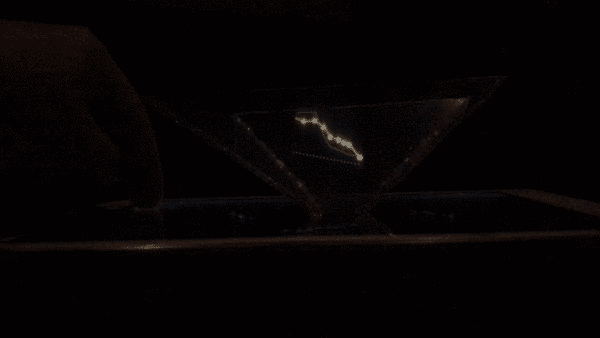
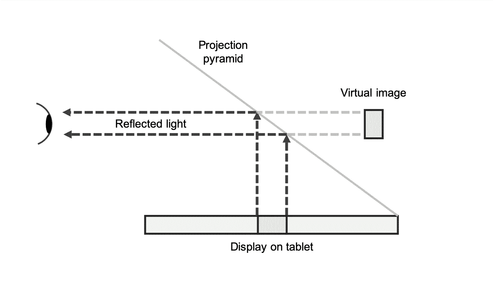
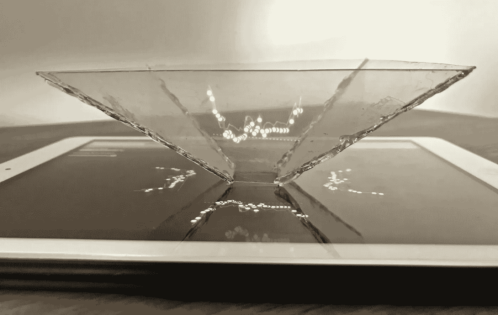
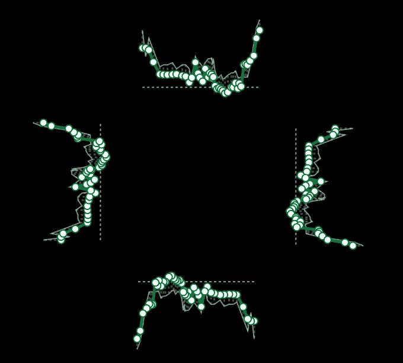

# 全息伦敦地铁可视化

> 原文：<https://towardsdatascience.com/holographic-london-underground-visualisation-b0462ae19d6e?source=collection_archive---------30----------------------->

Image of the Victoria line presented as a hologram ©Christopher Doughty

## 使用 d3.js 和 pepper 的 ghost 作为呈现数据的创造性方式

在他的书《想象信息》中，爱德华·塔夫特谈到了我们的视觉被屏幕和纸张的二维平面困住[1]。我想探索一种可视化数据的替代方法，所以我寻找一种创造性的方法来引起观众的兴奋，并逃离电脑屏幕的单调。像增强现实这样的技术是通过在现有的基础上增加层次来实现的；然而，我选择了更容易和更便宜的东西。用一张塑料，我创造了一个数据可视化的全息幻觉。

最终的可视化效果可在以下页面查看(需要查看器):[https://penguinstrikes . github . io/content/pepper _ ghost/index . html](https://penguinstrikes.github.io/content/pepper_ghost/index.html)

Me interacting with the visualisation on an iPad

## 佩珀的鬼魂

我想在作品中利用的视觉化技术使用了一种叫做“胡椒幽灵”的幻觉。19 世纪 60 年代，一位名叫约翰·h·佩珀的讲师首次描述了这一现象。这种效果在剧院里被用来创造舞台上的幻影，包括从观众和被投影的物体上斜放一块玻璃。下图显示了错觉的工作原理。

Diagram explaining how Pepper’s Ghost works

为了使效果在屏幕上工作，必须建立一个查看器。这可以通过从四个梯形塑料创建一个金字塔来创建一个查看器来实现，如下图所示。

My pyramid placed on an iPad

## 伦敦地铁数据

有了全息技术和一个观察器，我寻找一些数据来显示。已经下载了几个开源数据集，我决定使用伦敦地铁站和深度数据[2]。

## D3.js 实现

最棘手的部分是构建可视化。我选择使用 D3.js 并创建四个 SVG，它们都显示相同的数据，但是旋转形成一个正方形的每一边。下图是从浏览器中捕捉到的，以不同的投影角度呈现了所有四个数据集。

D3.js visualisation showing the same data at 0, 90, 180, and 270 degrees

我想在表示层使用 D3.js 的原因是为了提供与数据交互的功能，而我之前在 Pepper's Ghost online 上看到的都是演示视频。

## 决赛成绩

您可以通过以下链接查看 D3.js 可视化效果[https://penguinstrikes . github . io/content/pepper _ ghost/index . html](https://penguinstrikes.github.io/content/pepper_ghost/index.html)，但是您需要自己的查看器来查看实际效果。请注意，如果您在平板电脑或手机上浏览，那么您需要水平旋转显示屏并重新加载页面以确保格式正确。

虽然我不认为这将成为一种革命性的数据呈现方式，但投影确实可以让信息在离开屏幕时变得更加有形。主要的缺点是全息图的尺寸使得你几乎不可能理解数据显示给你的是什么。我知道这严重违反了数据可视化原则，但是尝试一些有创意的东西是值得的！

## 参考

[1] Tufte，E. R .，&图形出版社。(1990).预见信息

[2]根据[开放政府许可证 v3.0](http://www.nationalarchives.gov.uk/doc/open-government-licence/version/3/) 提供