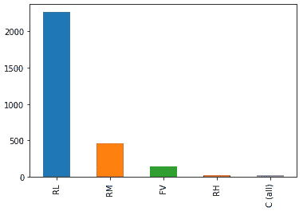

# 家庭价值预测

> 原文：<https://towardsdatascience.com/home-value-prediction-2de1c293853c?source=collection_archive---------10----------------------->

## 使用机器学习算法预测房地产价值


像 Zillow 这样的公司是如何为不出售的房屋提供估价的？他们收集每个属性的特征数据，并使用机器学习算法进行预测。在本文中，我将使用 Kaggle 的“房价”竞赛中包含的数据集来演示类似的分析。

# **探索性数据分析**

首先，让我们看看响应变量“销售价格”。它是正向倾斜的。大多数房子的售价在 10 万至 25 万美元之间，但有些房子的售价要高得多。


Figure 1: Observed sale price

该数据集包含 80 个描述房产特征的特征，包括浴室数量、地下室面积、建造年份、车库面积等。热图(图 2)显示了每个特性和响应变量“销售价格”之间的相关性。这为我们提供了有关预测销售价格的特征重要性的信息，并指出哪里可能存在多重共线性。毫不奇怪，房屋的整体质量“总体质量”与销售价格高度相关。相比之下，房屋出售的年份“YrSold”与销售价格几乎没有关联。


Figure 2: Heat map showing the correlation among features and sale price

# **数据清理**

## 应对 NAs

此数据集中有许多 NAs 有些功能几乎全是 NAs，而许多功能只有少数几个。


我们可以删除提供很少信息的功能，如实用程序。

```
df.Utilities.describe()
```


除了一个属性之外，所有属性都被指定为“Allpub”类别，因此我们可以删除该特性。由于缺乏变化，该特性与我们的响应销售价格几乎没有关联(图 2)，所以我们并不担心会失去它。

```
df=df.drop([‘Utilities’], axis=1)
```

很少有 NAs 是随机的，因为缺少信息通常与记录本身有关，而不仅仅是因为收集错误。例如，GarageType 记录的 NA 可能意味着该物业上没有车库。在该数据集中，有与车库相关的分类和连续特征。我们可以相应地用 0 和“无”来填充那些具有 NAs 功能的属性，表示缺少车库空间。

```
# Garage categorical features to none
for i in (‘GarageType’, ‘GarageFinish’, ‘GarageQual’, ‘GarageCond’):
 df[i] = df[i].fillna(‘None’)# Garage continuous features to 0
for i in (‘GarageYrBlt’, ‘GarageArea’, ‘GarageCars’):
 df[i] = df[i].fillna(0)
```

NAs 对于其他功能没有明确的解释，与信息的缺乏有关。在这种情况下，我们可以观察每个记录的出现频率，并选择最可能的值。让我们看看描述分区分类的特性“MSZoning”的频率分布。



Figure 3: Frequency of zoning classification

到目前为止，住宅低密度(RL)是最常见的分类。解决此功能中四个 NAs 问题的实用方法是简单地用“RL”替换 NAs。

```
df.MSZoning=df[‘MSZoning’].fillna(df[‘MSZoning’].mode()[0])
```

## 数据转换

为了最大化我们的模型的性能，我们想要标准化我们的特征和响应变量。正如我们在图 1 中看到的，我们的响应变量是正偏的。通过应用对数转换，销售价格现在类似于正态分布(图 4)。

```
resp=np.log1p(resp) # transform by log(1+x)
```


Figure 4: Log transformed response variable Sale Price

我们还必须检查所有连续要素的倾斜情况。

```
# identify numerical features
num_feats=df.dtypes[df.dtypes!=’object’].index# quantify skew
skew_feats=df[num_feats].skew().sort_values(ascending=False)
skewness=pd.DataFrame({‘Skew’:skew_feats})
skewness=skewness[abs(skewness)>0.75].dropna()
skewed_features=skewness.index
```


在我们想要转换的所有这些特性之间，偏斜度会有很大的变化。box cox 变换提供了一种灵活的变换特征的方法，每个特征可能都需要另一种方法。函数 boxcox 将估计最佳 lambda 值(变换中的一个参数)并返回变换后的要素。

```
# add one to all skewed features, so we can log transform if needed
df[skewed_features]+=1
# conduct boxcox transformation
from scipy.stats import boxcox# apply to each of the skewed features
for i in skewed_features:
 df[i],lmbda=boxcox(df[i], lmbda=None)
```

## 一键编码

最后，我们需要对我们的分类变量进行一次性编码(或伪代码),以便它们可以被模型解释。

```
df=pd.get_dummies(df)
```

# 建模

我们将把两个广泛应用的机器学习模型拟合到训练数据中，并使用交叉验证来评估它们的相对性能。

## 随机森林回归量

为了确保我们的随机森林回归模型具有最大化其预测能力的属性，我们将优化超参数值。我们希望估计以下各项的最佳值:

***n _ 估计量:*** 森林中的树木数量

***max _ features****:*每次分割要考虑的最大特征数

***max_depth:*** 任意树的最大分裂数

***min _ samples _ split:***拆分一个节点所需的最小样本数

***min _ samples _ leaf:***每个叶节点所需的最小样本数

***自举:*** 数据集是自举还是整个数据集用于每棵树

```
n_estimators=[int(x) for x in np.linspace(start = 200, stop = 2000, num = 10)]
max_features = [‘auto’, ‘sqrt’, ‘log2’]
max_depth = [int(x) for x in np.linspace(10, 110, num = 11)]
max_depth.append(None)
min_samples_split = [2, 5, 10]
min_samples_leaf = [1, 2, 4]
bootstrap = [True, False]
grid_param = {‘n_estimators’: n_estimators,
 ‘max_features’: max_features,
 ‘max_depth’: max_depth,
 ‘min_samples_split’: min_samples_split,
 ‘min_samples_leaf’: min_samples_leaf,
 ‘bootstrap’: bootstrap}
```

如果我们使用 sci-kit learn 的 GridSearchCV 来确定最佳超参数，我们将评估 6，480 个候选模型和 32，400 个符合五重交叉验证的模型。这在计算上将非常昂贵，因此我们将使用 RandomizedSearchCV，它使用从我们定义的参数空间中随机选择的超参数来评估指定数量的候选模型(n_iter)。我们将使用五个折叠进行 k 折叠交叉验证。

```
from sklearn.ensemble import RandomForestRegressor# the model prior to hyperparameter optimization
RFR=RandomForestRegressor(random_state=1)from sklearn.model_selection import RandomizedSearchCV
RFR_random = RandomizedSearchCV(estimator = RFR, param_distributions = grid_param, n_iter = 500, cv = 5, verbose=2, random_state=42, n_jobs = -1)RFR_random.fit(train, resp) 
print(RFR_random.best_params_)
```

现在我们有了一个模型，它的属性最适合我们的数据。

```
Best_RFR = RandomForestRegressor(n_estimators=1000, min_samples_split=2, min_samples_leaf=1,max_features=’sqrt’, max_depth=30, bootstrap=False)
```

我们希望精确测量模型预测的房价与售出房屋的实际价格之间的差异。我们将通过 k 倍交叉验证来计算模型的均方根误差(RMSE)。给定五个折叠，我们将使用五组模型拟合中每一组的平均 RMSE 值。

```
from sklearn.model_selection import KFold, cross_val_score
n_folds=5
def rmse_cv(model):
    kf = KFold(n_folds,shuffle=True,random_state=42)
.get_n_splits(train)
    rmse= np.sqrt(-cross_val_score(model, train, resp, scoring=”neg_mean_squared_error”, cv = kf))
    return(rmse.mean())

rmse_cv(Best_RFR)
```

随机森林模型表现相当好，平均 RMSE 为 0.149。

让我们尝试另一个模型，看看我们是否能获得更好的预测。

## 梯度推进回归器

我们将使用 RandomizedSearchCV 进行相同的评估，以确定最佳超参数。我们将从“xgboost”中使用的梯度推进回归器具有以下我们想要优化的超参数:

***n _ 估计量:*** 树木数量

***子样本:*** 每棵树样本百分比

***max_depth:*** 每棵树的最大层数

***min _ child _ weight:***一个子代中需要的所有观察值的最小权重之和

***col sample _ bytree:***每棵树使用的特征百分比

***学习率:*** 学习率或步长收缩

***伽玛:*** 进行拆分所需的最小缩减成本函数

```
n_estimators=[int(x) for x in np.linspace(start = 200, stop = 2000, num = 10)]
subsample = [.6,.7,.8,.9,1]
max_depth = [int(x) for x in np.linspace(10, 50, num = 10)]
min_child_weight = [1,3,5,7]
colsample_bytree=[.6,.7,.8,.9,1]
learning_rate=[.01,.015,.025,.05,.1]
gamma = [.05,.08,.1,.3,.5,.7,.9,1]
rand_param = {‘n_estimators’: n_estimators,
 ‘subsample’: subsample,
 ‘max_depth’: max_depth,
 ‘colsample_bytree’: colsample_bytree,
 ‘min_child_weight’: min_child_weight,
 ‘learning_rate’: learning_rate,
 ‘gamma’: gamma}
```

使用与随机森林模型相同的方法，我们将使用 k-fold 交叉验证运行随机超参数搜索。

```
Boost_random = RandomizedSearchCV(estimator = Boost, param_distributions = rand_param, n_iter = 500,
 cv = 5, verbose=2, random_state=42, n_jobs = -1)Boost_random.fit(train, resp)
```

我们现在可以计算优化模型的 RMSE，并将 xgboost 的性能与随机森林模型进行比较。

```
Best_Boost = XGBRegressor(subsample=.7, n_estimators=1600, min_child_weight=3, max_depth=41,learning_rate=.025, gamma=.05, colsample_bytree=.6)# evaluate rmse
rmse_cv(Best_Boost)
```

我们的梯度推进回归模型表现出优于随机森林模型的性能，RMSE 值为 0.131。

## 做最后的预测

在这个分析中，我采用了一种实用的建模方法；还有其他建模技术可以略微提高预测精度，如堆叠或应用一套替代模型(如 Lasso、ElasticNet、KernalRidge)。

我们将把这个分析中的最佳模型(梯度推进回归)应用于测试集，并评估它的性能。

```
# fit to the training data
Best_Boost.fit(train,resp)
# transform predictions using exponential function
ypred=np.expm1(Best_Boost.predict(test))# make a data frame to hold predictions, and submit to Kaggle
sub=pd.DataFrame()
sub['Id']=test['Id']
sub['SalePrice']=ypred
sub.to_csv('KaggleSub.csv', index=False)
```

梯度推进回归模型在测试集上以 0.1308 的 RMSE 值执行，不错！

# 结论

我们可以根据房产的特点对房子的售价做出合理的预测。关键步骤包括为 NAs 分配适当的值、标准化变量、优化候选模型的超参数以及选择最佳模型。

我感谢任何反馈和建设性的批评。与该分析相关的代码可在[github.com/njermain](https://github.com/njermain)上找到