# 多臂土匪问题的 Thompson 抽样(上)

> 原文：<https://towardsdatascience.com/hompson-sampling-for-multi-armed-bandit-problems-part-1-b750cbbdad34?source=collection_archive---------7----------------------->

## 使用贝叶斯更新进行在线决策

“多臂土匪”可能是数据科学中最酷的术语，不包括对“裸欧式看涨期权”或“空头铁蝴蝶”的金融应用。它们也是最常见的实际应用。

这个术语有一个有益的激励故事:“一个武装匪徒”指的是吃角子老虎机——拉“手臂”,“匪徒”会拿走你的钱(大多数时候——有可能你会赢大钱)。“多臂土匪”是一个有许多手臂的吃角子老虎机，每个手臂都有不同的获胜概率和相关的支付。如果不知道这些概率/收益，你需要边走边学，拉动更容易成功的杠杆，并希望尽快收敛到最佳杠杆。

抛开赌博不谈，我们可以想象很多情况下的多臂土匪问题。一家医院对临床协议的潜在修改有多种想法，以改善结果——由于需要干预的临床事件数量有限，并且修改不当可能会产生意想不到的后果，我们如何评估所有修改，同时确保最好的修改能够迅速上升到最高层。或者一家营销公司想通过选择它已经开发的 3 个潜在活动之一来部署新的广告策略。

在本文中，我们将重点关注伯努利强盗问题——支出为 1 或 0 的问题(将问题的复杂性降低到确定支出的概率)。我们将应用两种方法:ε-贪婪和汤普森抽样。在以后的文章中，我们将讨论更复杂的多臂土匪问题(包括共轭先验对我们不友好的采样方法！)和其他解决这个问题的方法。

**ε-贪婪**

一个算法是“贪婪的”,因为它选择立即的回报而不考虑长期的结果。树算法通常是“贪婪的”——在每个节点上，它们选择熵最小化最多的分裂。该分裂可能不是在后续分裂中最小化熵最多的树。

贪婪算法在路径数量呈指数增长并且很快变得难以处理的情况下很常见(即计算强度达到不可能的程度)。例如，基于 10 个特征的树，甚至允许每个变量仅使用一次(这不是常见的约束)，3.6M 个可能的配置(10！= 10 * 9 * 8…).加上第 11 个特征就成了 39.9M，等等。

使用贪婪算法可以合理地处理多臂土匪问题。在老虎机公式中，我们假设所有杠杆都有相同的成功概率，我们随机选择一个，然后根据成功/失败更新我们的成功假设。在每次连续的迭代中，我们选择成功概率最高的杠杆。

这种算法可能会为了眼前的利益而忽略新的信息。假设我们有 3 个概率为 0.04、0.07 和 0.1 的杠杆。我们可能会偶然发现低概率杠杆的早期成功，然后继续拉杠杆 20-50 次，直到它的概率低于其他杠杆。算法被“卡住”。

该算法的一个增强允许我们忽略成功概率并随机选择一个杠杆的小概率次数(ε)。这有助于收集新信息，允许非最优选择偶尔进入组合。

下面的代码为我们建立了算法。请注意，贝塔分布是伯努利分布的“共轭先验”。这是一个贝叶斯术语，表示贝塔分布是伯努利试验中包含的成功概率的后验预测分布。共轭先验使贝叶斯分析的数学变得简单——下面我们可以通过将 alpha 视为成功的计数，将 beta 视为失败的计数来更新 Beta。

```
import numpy as np
import pandas as pd
import random#Initialize Sampling 
def initialize(arms):
    prior = pd.DataFrame(np.ones((arms, 3)), columns = ['alpha', 'beta', 'theta'])
    prior.loc[:, 'theta'] = prior.loc[:, 'alpha'] / (prior.loc[:, 'alpha'] + prior.loc[:, 'beta'])

    post = pd.DataFrame(columns = ['i', 'arm', 'payout'])
    return prior, post# e-Greedy
def e_greedy(eta, arm_prob, prior):
    #Determine path-selection
    if np.random.uniform(0, 1, 1) <= eta:
        s = np.random.randint(0, len(arm_prob) -1, 1)[0]
    else:
        s = random.choice(np.where(prior['theta'] == np.amax(prior['theta']))[0])

    #Determine success/failure
    r = 1 if np.random.uniform(0, 1, 1) <= arm_prob[s] else 0    

    prior.loc[s, 'alpha'] += r
    prior.loc[s, 'beta'] += 1- r
    prior.loc[s, 'theta'] = prior.loc[s, 'alpha'] / (prior.loc[s, 'alpha'] + prior.loc[s, 'beta'])

    return s, r, prior
```

我们将在该方法上使用几个词之后，用 Thompson sampling 直接测试这段代码。

**汤普森采样**

Thompson 采样采用不同于ε-greedy 的方法来选择下一个要拉的臂。ε-greedy 的一个缺点是，它可能会陷入局部最大值——通过统计机会表现良好的次标准分布。eta 参数被设计成通过迫使算法采取在当前看来是次优选择(即，不是当前最大预测概率)但实际上可能是给定足够信息的最优选择来抵消这一点。

为了做到这一点，Thompson 抽样使用一个随机的统一变量从每个选择的后验预测分布中提取数据。这允许以变化的频率对非最优分布进行采样——随着后验分布变得更加确定，做出选择的概率会动态降低，因此 Thompson 采样动态地平衡了对更多信息的需求和做出当前最优选择。例如，在下图中，我们假设有两种选择，蓝色代表 4 次成功，1 次失败，橙色代表预备队。虽然蓝色选择的平均值约为 0.7，橙色选择的平均值约为 0.3，但有相当大的概率(~4%)会选择橙色而不是蓝色。

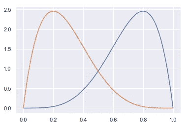

我们的 Thompson 抽样实现看起来是这样的——注意，random.choice 选择现在使用的是以前的分布，而不是以前的均值。

```
# Thompson Sampling
def thompson(arm_prob, prior):
    #Determine path-selection
    s = [np.random.beta(prior.loc[n, 'alpha'], prior.loc[n, 'beta'], 1) for n in range(len(arm_prob))]
    s = random.choice(np.where(s == np.amax(s))[0])

    #Determine success/failure
    r = 1 if np.random.uniform(0, 1, 1) <= arm_prob[s] else 0    

    prior.loc[s, 'alpha'] += r
    prior.loc[s, 'beta'] += 1- r
    prior.loc[s, 'theta'] = prior.loc[s, 'alpha'] / (prior.loc[s, 'alpha'] + prior.loc[s, 'beta'])

    return s, r, prior
```

**这场对决！**

将这两种算法相互比较有助于阐明它们的优缺点。

在下面的例子中，我们模拟了概率来自β(1.5，1.1)的 5 个分支，即向较低概率移动，但仍保持足够的机会获得较高概率。

下图显示了这些方法特有的一次试运行。经过 250 次迭代后，两种方法都达到了最佳水平(水平 1)，但是 TS 由于在分析的早期表现优异而领先。经过 50 次迭代后，两种方法实际上都以 30 胜打平，EG 略微领先。然而，在这一点之后，TS 领先。EG 已经开始拉杠杆 2(通过改变)，并且看到了成功，并且继续拉，直到在前 15 次抽中它看到了 10 次成功(所有这些都是在 EG 假设其他未尝试的杠杆有 0.5 的概率的情况下)。EG 继续大力支持杠杆 2，直到第 175 次迭代，此时它尝试杠杆 1 并发现长期成功。相比之下，EG 早在第 20 次迭代时就发现了 Lever 0，并且早在第 40 次迭代时就几乎独占地拉动了它。

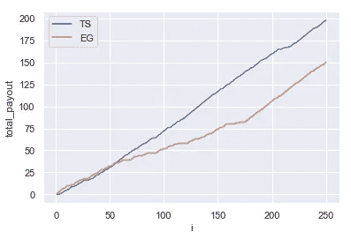

Bernoulli Multi-Armed Bandit with Lever Probabilities = 0.86, 0.44, 0.56, 0.34, and 0.05\. EG using eta = 0.05.

这些算法都可以调整——我们可以调整两个模型中的先验，以及调整 eta，例如，在上面的示例中，我们使用了 5%的 eta。使用更激进的 eta 允许模型不容易出现局部最大值，同时还可能通过实施次优选择来减少长期收益。下图显示了使用 eta = 0.1 的 1000 次迭代。正如预测的那样，我们看到 EG 甚至能够在早期击败 TS(虽然 TS 希望“证明”Lever 0 是正确的选择，但 EG 愿意在没有太多证明的情况下做出这种假设)，但是随着模拟进行到第 1000 次迭代，TS 略微领先，因为 EG 仍有 10%的时间从非最佳 Lever 中采样。对 EG 的改进可以使用 eta 的衰减因子。

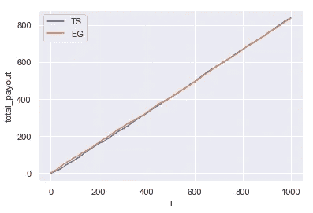

Bernoulli Multi-Armed Bandit with Lever Probabilities = 0.86, 0.44, 0.56, 0.34, and 0.05\. EG using eta = 0.1.

上面的模拟表明，这两种方法都是有效的——它们在很大程度上依赖于上下文。EG 将在做出次优选择伤害较小的情况下表现良好——如果第二或第三个选择的真实概率与第一个选择的真实概率足够接近，那么做出那些勉强低于标准的选择不会损失太多。此外，如果搜索空间广阔，TS 可能会陷入试图证明最佳选择的困境，而 EG 则愿意在没有太多“证明”的情况下快速取胜。

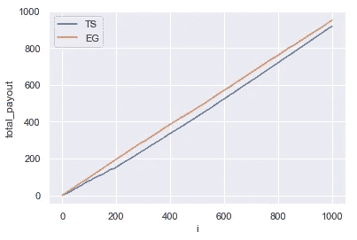

在下面的例子中，使用β(3.5，0.7)模拟了 50 条手臂，这有利于给予手臂更高的概率(参见下面的直方图)。正如预测的那样，EG 能够在 TS 通过迭代 1000 搜索广阔空间的同时取得快速胜利。

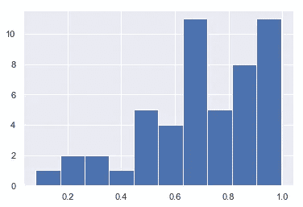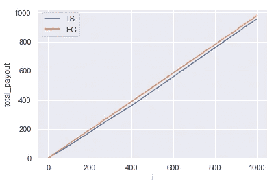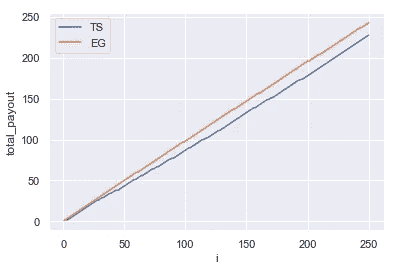

50 Arms with skewed-high probabilities. Histogram of success probabilities, and results from 1000 iterations (with zoom-in on 250).

如果我们翻转概率分布以支持低概率结果-Beta(0.7，3.5)-我们会看到每个算法都在努力寻找胜利。虽然最优选择在 67%的情况下获胜，但在 500 次迭代后，EG 赢了 229 次，TS 略少。然而，在 1000 次迭代之后，TS 领先，预计这一领先将保持，因为 EG 继续对无效空间进行采样。

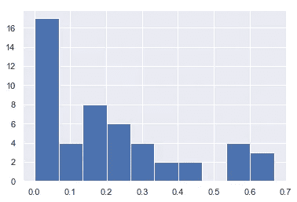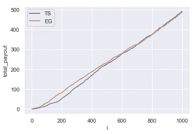

50 Arms with skewed-low probabilities. Histogram of success probabilities, and results from 1000 iterations (with zoom-in on 250).

我们看到 TS 在下面的双峰分布中再次上升(Beta(2.5，1)和 Beta(2.5，10)的 25/75 混合)。

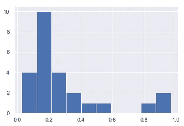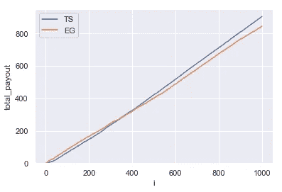

50 Arms with bi-modal probabilities. Histogram of success probabilities, and results from 1000 iterations (with zoom-in on 250).

**结论**

Thompson 采样是一种解决多臂强盗问题的贝叶斯方法，它动态地平衡了合并更多信息以产生每个杠杆的更确定的预测概率与最大化当前获胜的需要。ε-greedy 是一种更简单的方法，它更侧重于当前的成功案例，采用确定性方法来整合更多信息。这种方法的结果是，当前的成功和更多的信息有时是不平衡的(即，集中在局部最大值上)，但是一个好处是，如果该方法在早期发生在全局最大值上，它更愿意信任它，并且可以产生早期成功。

在以后的文章中，我们将讨论使用更复杂的贝叶斯采样技术(在非共轭先验的情况下)扩展这个框架，以及 Thompson 采样在新问题中的应用:非二项式多臂 bandit、路径优化等等。