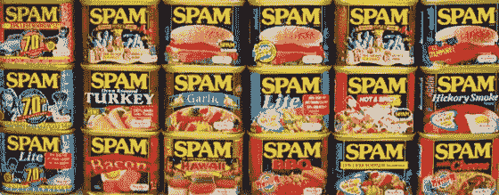
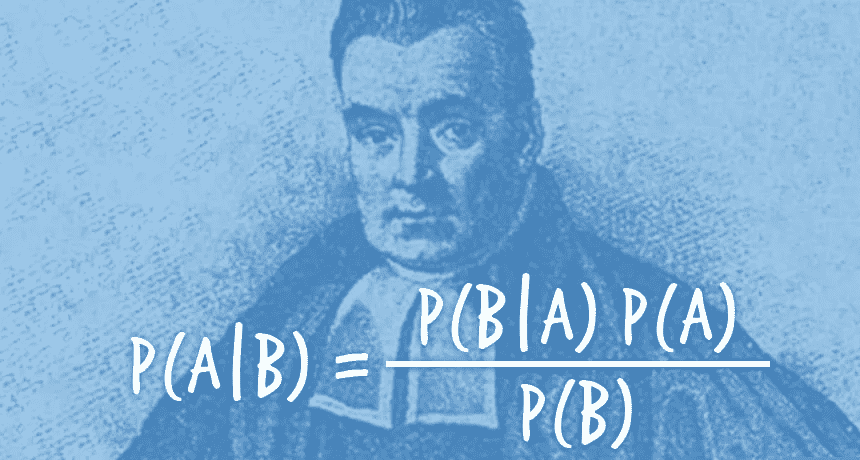
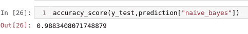
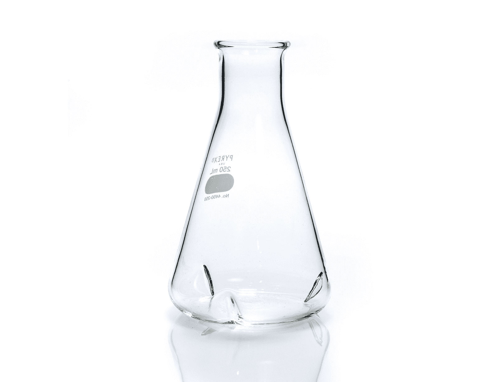

# 希望这个贝叶斯垃圾邮件过滤器不是太天真

> 原文：<https://towardsdatascience.com/hopefully-this-bayesian-spam-filter-isnt-too-naive-d89675bce99c?source=collection_archive---------42----------------------->



我们都遇到过垃圾邮件，从 Gmail 收件箱中的可疑电子邮件，到社交媒体帖子上的重复评论。垃圾邮件是一种自 2000 年初以来一直困扰互联网的现象，并不是什么新鲜事。然而，我们现在有很好的方法使用机器学习来处理垃圾邮件。今天，我们将创建一个带有自然语言处理的垃圾邮件过滤器，它将根据我们是否确定该文本是垃圾邮件来返回布尔值 1 或 0。

# 处理自然语言

([笔记本](https://github.com/emmettgb/Spammy/blob/master/ML/Spam_Filtering.ipynb)

我们的数据最初有一些不重要的列，我很快就删除了。接下来，看看我们从数据帧中提取的两列，标签和文本，标签是包含“垃圾邮件”或“火腿”的分类特征，所以我认为垃圾邮件是垃圾邮件，火腿不是垃圾邮件。

接下来，为了让我们能够使用我们想要使用的任何模型，我将数据集中的所有标签映射到数字类型的布尔

```
dataset['numerical_label'] = dataset.label.map({'ham':0, 'spam':1})
```

这样一来，我使用了一个反矢量器来对我们的英语输入进行矢量化:

```
from sklearn.feature_extraction.text import CountVectorizer
vect = CountVectorizer(stop_words='english')
vect.fit(X_train)
```



对于我的模型，我选择利用贝叶斯多项式模型，

```
from sklearn.naive_bayes import MultinomialNB
model = MultinomialNB()
model.fit(X_train_df,y_train)
```

所以在适应、转换和改变之后，我得到了一个准确度分数:



并准备序列化我的模型，以便在 Flask 应用程序中使用。

```
from sklearn.externals import joblib
filename = 'alg.sav'
joblib.dump(model, filename)
```

# 烧瓶时间，宝贝

我决定使用 HTTP 参数，因为这将使默认版本对任何人来说都是最通用和最容易实现的。所以我们当然要从我们的 app.route()开始:

```
@app.route(‘/’)
```

并在其下方添加我们的函数。

```
def template():
    try:
        txt = request.args['text']
    except KeyError as e:
        return ('Some Values are missing')
```

Request.args 从 URL 中提取 HTTP 参数，用作 Flask 应用程序中的变量。HTTP 请求非常适合数据管道和深度嵌套的后端。接下来，我选择将读取的文本放入数据帧中进行预测。这一步不一定是至关重要的，但我已经将熊猫添加到 Flask 应用程序中，所以我决定使用它。



现在我们已经将数据放入 Flask，我们可以反序列化并加载我们的管道。

需要注意的一点是，为了使数组适合模型，您可能需要用 np.reshape()来改变数组的形状。

```
pipeline = load('alg.sav')    
estimate=pipeline.predict(df['input'])    
return(estimate)
```

没什么太复杂的！现在，我们可以通过任何字符串请求访问 Flask 应用程序，并通过数据管道尽可能多地重用这个精确的算法！

> 厉害！