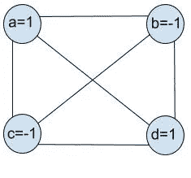
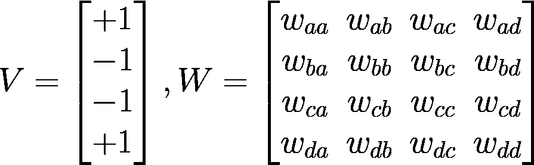
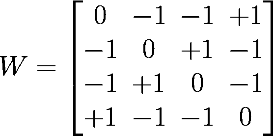
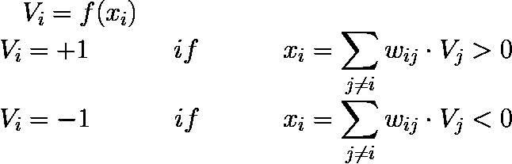
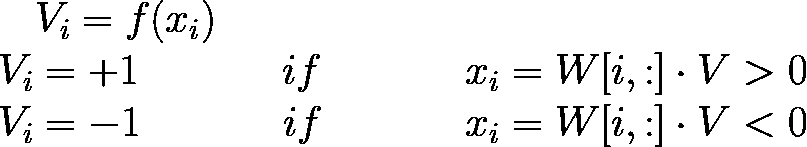
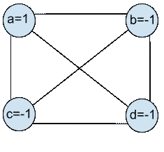
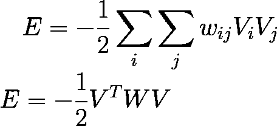
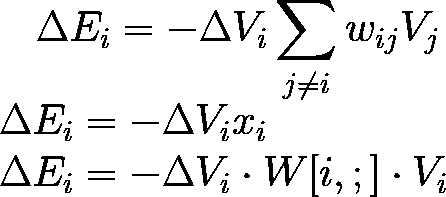
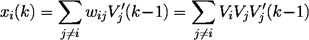

# Hopfield 网络毫无用处。以下是你应该学习它们的原因。

> 原文：<https://towardsdatascience.com/hopfield-networks-are-useless-heres-why-you-should-learn-them-f0930ebeadcd?source=collection_archive---------6----------------------->

Photo by [Ryan Schroeder](https://unsplash.com/@ryanschroeder?utm_source=medium&utm_medium=referral) on [Unsplash](https://unsplash.com?utm_source=medium&utm_medium=referral)

Hopfield 网络是由 J.J. Hopfield 于 1982 年发明的，到那时，许多不同的神经网络模型已经被放在一起，相比之下具有更好的性能和鲁棒性。据我所知，它们大多是在教科书中介绍和提到的，当接近玻尔兹曼机器和深度信念网络时，因为它们是建立在 Hopfield 的工作基础上的。

然而，与深度学习的当前状态相比，它们提供了如此不同和替代的学习系统视角，因此值得理解。

让我们来看看*它们是如何工作的。*

# **一个基本的 Hopfield 网络及其工作原理**

Hopfield 网络的核心是一种模型，它可以在收到相同数据的损坏版本后重建数据。

我们可以把它描述为一个由节点——或单元，或神经元——通过链接连接起来的网络。每个单元在任一时刻都有两种状态，我们假设这些状态可以是+1 或-1。我们可以在向量 v 中列出每个单元在给定时间的状态。

链接代表单元之间的连接，它们是对称的。换句话说，无论您在图中向哪个方向看，node-i 和 node-j 之间的链接都是相同的。特别是，相同的是代表每个单元之间连接强度的数字。我们可以在矩阵中列出这些数字。

Fig.1 — A Hopfield Network

如果我们有一个如图 1 所示的网络，我们可以这样描述它:

A state vector and a weight matrix describe the graph at some point in time

我们如何构建 *W* ？我们首先注意到一个节点与其自身之间没有连接，因此我们通过将 waa、wbb、wcc、wdd 置零来明确这一点。我们也知道链接或者权重是对称的，所以例如 *wab = wba* 。所以 *W* 是零对角线对称的。其余元素是这样填充的: *wab = Va Vb* 。结果是矩阵 *W* 。对于连接权重来说，这是一个聪明的选择，因为它遵循了我们稍后将再次看到的赫比规则。

The weight matrix fully describes the network connections

现在我们已经建立了权重矩阵，我们需要定义一个规则来确定每个节点的状态。因为我们有二进制状态，我们可以使用这个定律:

State update rule

类似地，通过使用上面定义的权重矩阵，我们得到:

现在我们可以直观地了解 Hopfield 网络实际上是如何工作的。

假设我们有一个 *V* 的腐败版本，我们就叫它 *V' = [1 -1 -1 -1]* ，这样最后一位就反过来了。我们可以用*V’*初始化网络状态。

Network initialized with corrupted states: d is now -1

我们可以继续用之前建立的规则更新网络状态。对于 Va，我们将有:

*Va = f(wab Vb+WAC Vc+wad Vd)*=+1

注意 *wab Vb* 和 *wac Vc* 对 *x* 都有正的贡献，尽管 *Vb* 和 *Vc* 为-1，推动 *Va* 为+1，而讹误位的贡献方向相反。换句话说，通过像以前一样构建 *W* ，我们迫使节点在它们应该具有相反符号时处于相反状态，而在它们应该相等时处于相同状态。相反的状态互相排斥，而相同的状态互相吸引。这是赫比规则的一种表述。

> *赫布边法则:*一起放电的神经元，连接在一起

同理:
*Vb = f(wba Va+WBC Vc+wbd Vd)=*-1 *Vc = f(WCA Va+WCB Vb+wcd Vd)=*-1
现已损坏位:
*Vd = f(wda Va+wdc Vc+wdb Vb)=*+1

并且 *Va =* +1 通过让 wda Va > 0 吸引节点 *d* 为正，而 *Vc=Vd=* -1 通过给予整体正贡献 *wdc Vc + wdb Vd >* 0 排斥节点 *d* 。

原本相同的节点被驱使变得相同，原本符号相反的节点互相排斥变得相反。

**原来的 *V* 神奇的恢复了！**

# 但是* *为什么** 有用呢？

到目前为止，我们已经看到，一旦我们用状态向量 *V* 完全定义了网络——它的*W*——我们想要在损坏后恢复，我们可以通过更新网络状态来完成。

换句话说，在用*V’*初始化网络状态后，我们让网络按照我们之前定义的规律进化，它会收敛到我们最初想要的状态。不仅如此，无论我们持续更新多少次，它都会一直存在。

让我们找出*为什么是*。

我们可以定义一个依赖于图的状态和矩阵的函数。我们将把这个函数称为与网络状态相关的能量函数，并表示为:

Energy function in a Hopfield Network

## 结果#1

如果节点 *Vi* 将其状态从+1 更改为-1，反之亦然，我们将得到:

> 现在:
> 如果 *Vi* 从-1 变为+1，那么 *dVi* = +2
> ，这意味着 ***x*** 必须为正，
> 反过来，能量增量必须为负

这意味着如果按照我们的规则更新网络，能量函数会一直递减，它是*单调递减*，它会努力达到最低点。

## **结果#2**

但是有没有一个最低点或者能量会一直减少到负无穷大？

换句话说，我们试图弄清楚能量增量是否可以为零。
为了让 *dEi = 0* ，我们需要，例如，让 *dVi = 0* ，这仅在 *Vi(k-1)' = Vi(k)'* 时成立，其中 *Vi(k-1)'* 是更新前的节点状态，而 *Vi(k)'* 是更新后的节点状态。

假设我们有 *Vi(k-1)' = +1* ，我们想要 *Vi(k)' = +1* ，或者类似的
*xi(k) > 0* 。
这是:

但是当 *Vj(k-1)' = Vj* 那么 *xi(k)* 总是正的！

在一个镜头中，我们展示了当状态采用原始值(未损坏的值)时，能量函数将不再改变。换句话说， *dVi = 0* 并且节点不会更新到不同的值——配置被认为是稳定的。

> 因此我们证明了在网络达到节点状态的稳定配置之前，能量一直在减少。甚至，稳定配置是对应于恢复的状态向量的配置，即能量函数的局部最小值。

这里省略了许多实现细节，但是我在这里准备的这个 Jupyter 笔记本中有一个基本的工作 Hopfield 网络。