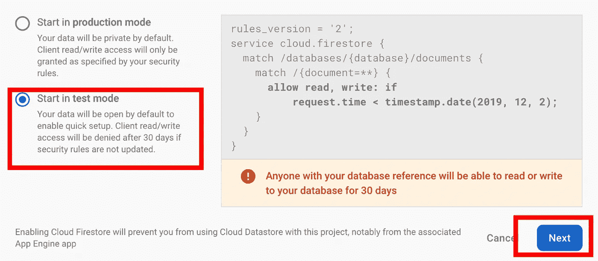
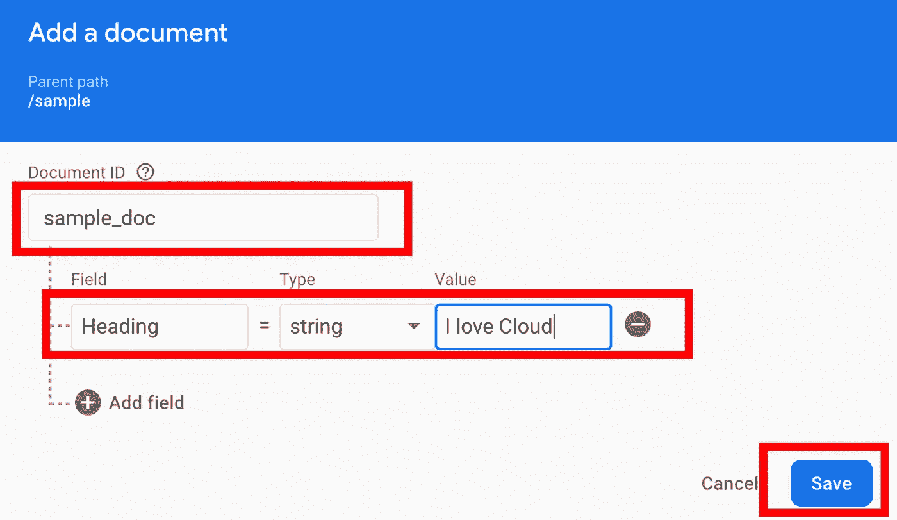
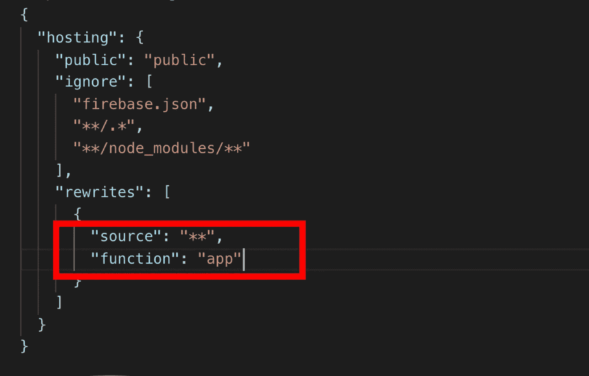
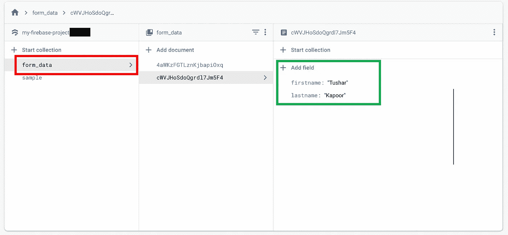
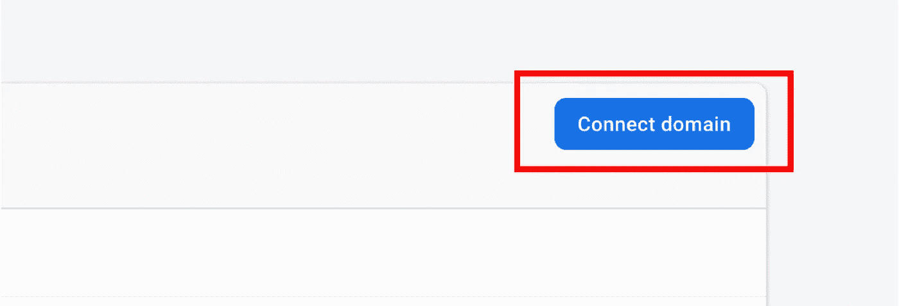

# 使用 Node.js 和 Cloud Firestore DB 在 Google Firebase 上托管一个动态网站

> 原文：<https://towardsdatascience.com/host-a-dynamic-website-on-google-firebase-for-free-using-node-js-and-cloud-firestore-db-88e98239e1b9?source=collection_archive---------1----------------------->


Img Source: [https://firebase.google.com/images/social.png](https://firebase.google.com/images/social.png)

[图沙尔·卡普尔](https://www.tusharck.com/):([https://www.tusharck.com/](https://www.tusharck.com/))

演示 Git 网址:[https://github.com/tusharck/firebase-demo](https://github.com/tusharck/firebase-demo)

# 为什么选择 Firebase 托管？

[Firebase](https://firebase.google.com/) 是一个建立在[谷歌](https://google.com)基础设施上的综合应用程序平台，因此它提供了一个安全、快速、免费(付费选项也可用于额外资源)和简单的方式来在网络或移动应用程序上托管您的内容。

## 免费层的主要特性和优势:

1.  它提供了免费的自定义域& **SSL** (SSL 为 **https** 连接提供了一个标准的安全层。
2.  Cloud Firestore:一个灵活且可扩展的数据库，用于跨客户端应用程序的实时数据同步。
3.  其他功能:云功能，云消息(FCM)，Crashlytics，动态链接，托管，ML 工具包，存储，性能监控，预测和测试实验室(这些产品的功能和资源可以通过购买付费计划来增加，但免费层服务非常好。要查看计划，请检查 [Firebase 定价](https://firebase.google.com/pricing)。
4.  资源的自动缩放。

# 在 Firebase 上托管动态网站的步骤

## 要求

**1。谷歌账户** 如果你没有谷歌账户，你需要注册一个。你可以去 https://accounts.google.com/SignUp 看看。

**2。Node.js 和 npm**

*   你可以从 https://nodejs.org/en/download/下载安装程序。
*   **Linux**
    按照以下步骤安装 Node.js:
    1。打开端子
    2。运行以下命令:

```
sudo apt-get install curlcurl -sL https://deb.nodesource.com/**setup_13.x** | sudo bash -sudo apt install nodejs
```

***注:*** 我用的是`setup_13.x`因为当时的教程最新版本是 **13** 你可以去[https://nodejs.org/en/](https://nodejs.org/en/)查看最新版本。

要检查 Node.js 和 npm 是否已成功安装，请运行以下命令，这将输出已安装的版本:

```
node -v
npm -v
```

**3。Firebase-CLI(命令行界面)** 这些是管理、查看和部署 Firebase 项目的工具。

```
npm install -g firebase-tools
```

# 步骤 1:创建 Firebase 项目

1.  从右上角进入[https://firebase.google.com](https://firebase.google.com)和**签到。**
2.  点击右上角的**进入控制台**。
3.  然后点击**创建项目，**如下所示。


4.下一件事是输入你的项目名称，并按下 continue。


5.按“继续”为您的 Firebase 项目启用 Google Analytics(如果您不想要它，请选中“禁用”)。

6.为 Google Analytics 选择最近的位置。


7.点击**创建项目**，等待加载。然后你会看到类似下面的**。**


# 步骤 2:初始化 Firebase 登录

1.  打开命令行/终端，然后创建并转到一个新目录。

```
mkdir my-firebase-projectcd my-firebase-project
```

2.要在 firebase 上托管网站，请使用以下命令登录 Firebase。运行该命令后，会打开一个浏览器窗口，要求您使用 Google 凭据登录 firebase。在那里输入凭证，Firebase 将登录到您的系统。

```
firebase login
```


You will see something like this after successful login

# 步骤 3:将 Firebase 项目初始化到系统中

1.  现在，我们必须将我们在 Firebase 控制台上创建的项目初始化到系统中。运行下面的命令。

```
firebase init
```

2.按下向下键，然后通过按下**空格键选择**两件东西**。**

*   功能
*   主办；主持

然后**按回车**继续。


3.然后选择`**Use an existing project**`并按下回车键。

4.在`**my-firebase-project**` 或您使用的项目名称上按回车键。


5.选择 **Javascript** 并按回车键。


6.你可以说**不**你想用 ESLint 来捕捉可能的 bug 并加强风格吗？

7.键入 **Yes** 安装与 npm 的依赖关系。


8.这里我们必须完成两项任务:

*   你必须选择你的网站和资产所在的目录。默认情况下，它是**public**你可以按回车键继续，或者你可以改变到你想要的目录名。
*   为单应用程序页面键入 **Yes** ，这样您的动态 URL 就可以被重定向到正确的目的地。


9.通过运行以下命令，在本地系统上测试 firebase 应用程序。然后去[**http://localhost:5000**](http://localhost:5000)看看你的基本网站运行情况。

```
firebase serve --only hosting,functions
```

打开[**http://localhost:5000**](http://localhost:5000)网址后应该会看到下面这样的内容。


10.从终端关闭服务器。

# 步骤 4:为动态网站安装软件包和创建视图目录

1.  在这里，我们将切换到函数目录中进行使用。

```
cd functions
```

**2。Install Express** 它是一个极简灵活的 Node.js web 应用框架。

```
npm i express --save
```

**3。安装手柄** 它是 Node.js 的模板引擎，用于网站的动态前端。

```
npm i handlebars --save
```

**4。安装合并**

```
npm i consolidate --save
```

5.在**函数**文件夹中创建一个名为**视图**的文件夹，我们将在其中存储所有的前端代码。

```
mkdir **views**
```

6.通过运行以下命令切换回主目录:

```
cd ..
```

# 步骤 5:设置 Firestore(云数据库)

## 数据库配置

1.  去 https://console.firebase.google.com/。
2.  选择您的项目。
3.  从左侧窗格中选择**数据库**


4.点击**创建数据库**


5.选择在测试模式下启动，因为否则您将无法从您的系统访问数据库。我们将改变这个设置，一旦我们完成了网站的发展。
完成后，点击**下一步**。



6.选择 Firestore 数据库的位置。
***注意:*** 设置好这个位置后，以后就不能更改了。

## 创建虚拟数据

1.  点击开始收集。


2.输入**收藏 ID** ，即可进行采样。


3.输入样本数据。输入 **sample_doc** 作为**文件 ID。**在**字段中输入**标题**。我喜欢**值**里面的云**。然后点击**保存**。



# 步骤 6:建立网站的动态内容

我们将把这一部分分成两部分，在第一部分，我们将看到如何从 Firestore 获取数据并在网站中使用。在第二部分，我们将看到如何提交表单数据。

**首先，我们将下载访问 Firestore 的凭据**

1.  前往[https://console.firebase.google.com/](https://console.firebase.google.com/)。

2.点击左侧窗格中的**设置**，进入**项目设置**。


3.转到**服务账户**并点击**生成新的私钥。**


4.点击**生成密钥**，会弹出下载密钥的窗口。将密钥存储在您网站的**功能**文件夹中。


## 从 Firestore 获取

1.  打开**功能**文件夹内的 **index.js** 。


2.我们需要定义一些我们希望在应用程序中使用的库。这些是我们之前安装的相同的库。

```
const functions = require('firebase-functions');const express = require('express');const engines = require('consolidate');var hbs = require('handlebars');const admin = require('firebase-admin');
```

3.我们在这里设置了一些东西:

*   使用 express 初始化应用程序。
*   我们将把引擎设置为把手。
*   然后，我们将告诉 express，我们的前端代码将放在 views 文件夹中。

```
const app = express();app.engine('hbs',engines.handlebars);app.set('views','./views');app.set('view engine','hbs');
```

4.授权您的应用程序访问您的 Firestore 数据库。
***注:***
1。更改**您的 SDK 名称**。json 与您下载的文件一起作为**访问 Firestore 的凭证。
2**2。将数据库 URL 更改为您的数据库 URL。要查看网址你可以到**设置>服务账号**。

```
var serviceAccount = require("./**YOUR_SDK_NAME**.json");admin.initializeApp({credential: admin.credential.cert(serviceAccount),**databaseURL: "https://myfirebaseproject-bx54dasx3.firebaseio.com"**});
```

5.从 Firestore 获取数据的函数。

*   收集 ID 为**的样本**。
*   文档 ID 为 **sample_doc。**

我们在输入样本数据时定义了上述内容。

```
async function getFirestore(){const firestore_con  = await admin.firestore();const writeResult = firestore_con.collection('**sample**').doc('**sample_doc**').get().then(doc => {
if (!doc.exists) { console.log('No such document!'); }
else {return doc.data();}})
.catch(err => { console.log('Error getting document', err);});return writeResult
}
```

***注:*** 我们使用 **async** 是因为我们要等待数据库和我们网站之间的承诺操作完成。

6.创建路由并将结果发送到前端。

```
app.get('/',async (request,response) =>{var db_result = await getFirestore();response.render('index',{db_result});});exports.app = functions.https.onRequest(app);
```

7.在**视图**文件夹中创建 **index.hbs** 。
***注:*** 。hbs 是一个 handelbars 文件

8.在 **index.hbs** 中编写这个基本的 HTML 代码，以查看获取的结果。

```
<html>
    <body> <h1>{{db_result.Heading}}</h1> </body>
</html>
```

***注:*** {{db_result。Heading}}，db_result 是从后端传递过来的变量。**。标题**是我们在 Firestore 数据库中输入数据时定义的文档内的字段。

9.打开 **firebase.json** ，将**" destination ":"/index . html "**改为`"function":"app".`



10.删除**公共**文件夹内的**index.html**，删除这个很重要。如果你不删除它，它将总是选择这个文件，我们的后端代码将是无用的。

11.通过运行以下命令，在本地系统上测试 firebase 应用程序。然后去[**http://localhost:5000**](http://localhost:5000)看看你的基本网站运行情况。

```
firebase serve --only hosting,functions
```

12.从终端关闭服务器。

## 插入 Firestore

在这里，我们将从我们的网站插入数据到 Firestore。

1.创建另一个名为 form_data 的集合，我们将在其中插入表单数据。

***注意:*** 它将要求您输入一个文档，并创建集合以输入任何样本值。


2.运行下面的命令在本地服务器上进行测试后，转到[**http://localhost:5000**](http://localhost:5000)。

```
firebase serve --only hosting,functions
```

3.添加 HTML 代码，在 **index.hbs** 中创建一个示例表单。

```
<html>
    <body><h1>{{db_result.Heading}}</h1>**<form action="/insert_data"** **method="post" >
     <fieldset>
       <legend>Sample Form</legend>** **First name:<br>** **<input type="text" name="firstname" >** **<br>** **Last name:<br>** **<input type="text" name="lastname">** **<br><br>** **<input type="submit" value="Submit">** **</fieldset>
     </form>** </body>
</html>
```

*   **action="/insert_data"** 是我们将在函数内部定义的路径。
*   刷新页面后，它应该像下图所示。


3.在 **index.js** 中添加将数据插入 Firestore 的代码。

```
async function insertFormData(request){const writeResult = await admin.firestore().collection('**form_data**').add({
firstname: request.body.firstname,
lastname: request.body.lastname
})
.then(function() {console.log("Document successfully written!");})
.catch(function(error) {console.error("Error writing document: ", error);});
}
```

4.在 index.js 内部定义 HTML 表单发送 post 请求的路径。

```
app.post('**/insert_data**',async (request,response) =>{var insert = await insertFormData(request);response.sendStatus(200);});
```

6.在表单中插入一些示例数据来测试它。


7.点击提交后，你应该会看到网页上显示的回复`**OK**` 。

8.转到[https://console.firebase.google.com/](https://console.firebase.google.com/)然后转到数据库部分。您应该会看到插入的表单数据。



# 步骤 7:在线部署(最后一步)

1.  我们需要更改一些用于身份验证的代码，因为当您在线部署它时，Firebase 会负责身份验证。

*   在 **index.js** 内部删除以下代码:

```
var serviceAccount = require("./**YOUR_SDK_NAME**.json");admin.initializeApp({credential: admin.credential.cert(serviceAccount),**databaseURL: "https://myfirebaseproject-bx54dasx3.firebaseio.com"**});
```

*   取而代之的是在 **index.js** 中，将它插入到您的代码中:

```
admin.initializeApp(functions.config().firebase);
```

这里我们告诉 Firebase 从部署时存在的配置中获取认证信息。

2.在网站目录内的终端上，运行以下命令:

```
firebase deploy
```

这需要几分钟的时间，但之后，您应该会看到类似这样的内容:


3.如上图所示，转到 firebase 提供的**托管 URL** 。


**恭喜你已经在 Firebase 上托管了一个动态网站。**

# **步骤 8:(可选)使用自定义 URL**

1.  从任何一个提供商那里购买域名，比如 GoDaddy 或其他你喜欢的提供商。
2.  从左侧窗格转到**主机**。
3.  点击**连接域**。



4.在此输入域:


5.遵循验证说明。

***声明:***

1.  【Firebase 服务的服务条款
2.  Firebase 和它的服务是谷歌的产品，这篇文章中没有任何地方暗示不是这样。
3.  这篇文章是为了教育目的。