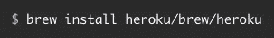
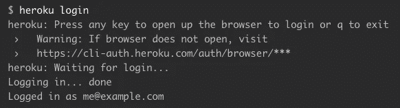
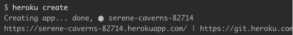
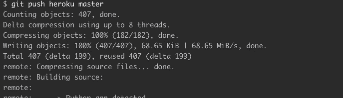

# 托管您的交互式可视化

> 原文：<https://towardsdatascience.com/hosting-your-interactive-visualizations-f11a10b74f51?source=collection_archive---------29----------------------->

Bokeh & Heroku

# 请点击下面的链接亲自查看！

 [## 全球选民投票率

voterturnoutmap.herokuapp.com](https://voterturnoutmap.herokuapp.com/MapScript) 

[https://voterturnoutmap.herokuapp.com/MapScript](https://voterturnoutmap.herokuapp.com/MapScript)

可视化使每个人都可以访问数据。他们把令人麻木的 excel 电子表格变成有趣且易于理解的图表。他们总结，突出，良好的可视化也允许用户自己探索数据。用户可以探索数据来回答他们自己的问题并做出他们自己的发现。

“Look at this graph.”

作为 Python 程序员，许多人都熟悉 Matplotlib 和 Plotly，但最近我一直在尝试使用散景。有一些关于使用散景的很棒的教程，我鼓励你去看看—

 [## 使用 Python 中的散景进行数据可视化，第一部分:入门

### 提升你的视觉游戏

towardsdatascience.com](/data-visualization-with-bokeh-in-python-part-one-getting-started-a11655a467d4)  [## 使用 Python 制作交互式地理地图的完整指南

### 想知道这些美丽的地理地图是如何创建的吗？我们的数据世界收集了大量的…

towardsdatascience.com](/a-complete-guide-to-an-interactive-geographical-map-using-python-f4c5197e23e0) 

这些教程演示了如何创建交互式可视化，但交互仅通过 gif 或视频显示。您可以在自己的服务器上本地托管您创建的可视化效果，但是有没有办法托管交互式可视化效果，以便读者可以进行交互？是的，答案是 [Heroku！](https://dashboard.heroku.com/apps)

Heroku 有很棒的文档和一步一步的指导来迎合不同的编程语言。我将引导你通过我所做的把我的视觉化变成一个应用。如果你想让你的作品容易被分享，这是非常有用的。

# 设置

首先，你必须用 Heroku 创建一个帐户，因为我们是数据科学家，所以我假设你正在使用 Python。确保你的 Python 是最新的！你还需要一个 GitHub 账户。动手吧！最后，您需要安装 Heroku。这很容易，尤其是如果你已经有了自制软件。

Command to install Heroku via Homebrew

现在，您应该已经拥有了开始工作所需的一切。用这个简单的命令从您的终端登录 Heroku:

You must login!

根据 heroku 文档，“Heroku 和 git 命令都需要这种身份验证才能正常工作。”

现在真正的工作开始了。我假设你已经有了一个伟大的想象，你需要与世界分享。如果没有，遵循我上面链接的教程之一。我使用的数据来自 [IDEA 的选民投票率数据库](https://www.idea.int/data-tools/data/voter-turnout)。

您需要将可视化转换为. py 文件。您需要整理您的数据帧并创建一些必要的文件:

*   procfile——用 py 文件初始化应用程序的简单代码行

I broke this up into two lines so you could see the whole thing.

*   requirements.txt

Find your versions with the terminal command, “pip freeze”

*   runtime.txt

Your version of Python!

一旦存储库中有了所有这些文件，就可以部署应用程序了。在 github repo 中，发出命令:

Create the app

您可以在创建后指定应用程序的名称。留空，Heroku 会为你命名。最后，把你的工作推给 Heroku，它会把你的代码作为自己的应用程序托管。

Look for the url printed at the bottom.

发布的 url 会将您带到您的活动应用程序。你也可以按照下面的命令，它会做同样的事情。

Simple.

既然你的项目已经有了自己的网站，那就和全世界分享吧！

 [## 使用 Python 开始使用 Heroku

### 本教程将让你在几分钟内部署一个 Python 应用程序(一个简单的 Django 应用程序)。再坚持几分钟…

devcenter.heroku.com](https://devcenter.heroku.com/articles/getting-started-with-python)