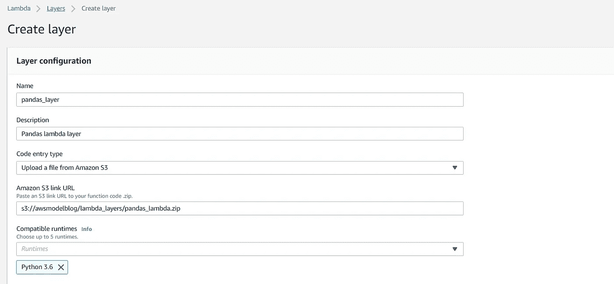
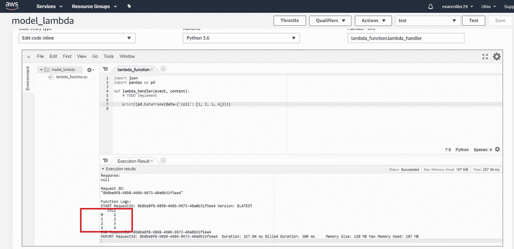

# 在 AWS Lambdas + API Gateway 上托管您的 ML 模型第 1 部分

> 原文：<https://towardsdatascience.com/hosting-your-ml-model-on-aws-lambdas-api-gateway-part-1-9052e6b63b25?source=collection_archive---------3----------------------->

## [我关于模型部署的其他帖子](https://towardsdatascience.com/tagged/modeldeployment)

## 所以你辛苦了几个星期/几个月，你漂亮的机器学习模型完成了。感谢上帝。

但是现在有人想用你的模式。这是个好消息，不是吗？

确实是，但是一个全新的问题出现了。你必须把它放在某个地方，让其他人也能使用它。

我将向您展示如何在 AWS 上轻松、廉价地完成这项工作。

**关于我的其他关于模型部署的文章，请查看标题上方的链接。**


You don’t need to be Gordon Freeman to handle these lambdas

本系列教程将向您展示如何使用 AWS 来做到这一点。具体来说，我们将使用以下组件:

*   S3 水桶
*   λ函数
*   λ层
*   API 网关(来自第 2 部分)

## 为什么不用 Sagemaker？

我没有使用 Sagemaker，因为它可能非常昂贵，每个模型 100 p/m，而 lambda 函数只需为每个请求付费。

这可能导致 lambdas 的成本是在 Sagemaker 上运行相同模型的 1/5 到 1/10，特别是如果您有几个模型要在低流量下部署。

## 你需要什么

你需要一些东西来完成这个。你需要安装 Python (scikit learn，pandas 等)和 Docker。如果你在 Windows 机器上，Docker 将需要构建正确的 lambda 层文件(我是通过艰难的方式学到这一点的)。

所以你首先需要一个模型。我将根据 Kaggle 上的英国房价数据集建立我的模型(数据可以在这里找到[，我的代码在这里](https://www.kaggle.com/hm-land-registry/uk-housing-prices-paid/downloads/uk-housing-prices-paid.zip/2))。

# λ—层/功能

Lambdas 是执行特定任务的小型运行时。它们可能需要一段时间来配置，但它们完全由 AWS 管理，所以您需要配置的只是 lambda 的内存。

他们可以在上面安装 Python，但不会安装开箱即用的模型运行包。为了实现这一功能，我们需要使用λ层。

如果你熟悉的话，Lambda 层与 Docker 图像非常相似。每一层都继承了上一层的功能。但是你需要知道一些关于他们的事情。

*   Lambda 图层必须是 zip 文件
*   对于给定的 lambda 函数，只能有五个 lambda 层
*   lambda 层不能大于 250MB(总计，解压缩后)

**对于这个例子，我们需要使用 4 个 lambda 层**

1.  Numpy / scipy 层，因为后面的层需要这些包(由 AWS 预构建)
2.  Pandas 层，以允许我们使用模型中使用的 ColumnTransformer
3.  Sklearn 层支持使用 scikit-learn 库
4.  我们的模型将驻留的模型层

所以接下来我将向您展示如何构建您自己的 AWS lambda 层，以允许您的 lambda 函数使用 Pandas

# 第 2 层—熊猫

这些步骤在 Pandas/scikit-learn 层之间是相同的，因此我们将在这里重点关注它们，您可以对 scikit-learn 层重复这些步骤。

接下来，您需要打开 bash/Powershell 并将目录更改为 layers/Pandas 目录。

然后运行以下命令:

```
docker run --rm -it -v ${PWD}:/var/task lambci/lambda:build-python3.6 bash
```

注意:${PWD}在 Powershell 中将当前工作目录挂载到 Windows 环境中的映像。如果你用的是 mac/linux $pwd 应该没问题。

这个简单的命令做了几件事:

*   拉下兰姆西的 docker 图像。这个 docker 映像模拟了 Python 3.6 lambda 环境的运行时，并允许我们在运行文件的相同环境中构建文件(这对 Windows 用户非常重要)
*   将当前目录挂载为一个卷，以便 docker 映像可以输出 lambda 构建文件
*   允许我们直接攻击 docker 图像

现在运行以下脚本，在 docker image bash 中为 lambda 层构建 python 文件(对于 sklearn 层也完全相同):

```
pip install -r requirements.txt --no-deps -t python/lib/python3.6/site-packages/
```

这将构建在 lambda 函数中使用 Pandas 所需的 python 文件。主要区别是 __pycache__ 中的所有文件扩展名都应该有。pyc 文件类型。在 lambda linux 环境下运行代码需要这些文件。

接下来，我们需要为要使用的代码创建一个 zip 文件。

Lambda 层需要在 zip 文件中有一个特定的文件夹结构:

```
- python
  - lib
    - python3.6
      - site-packages
        - all your python package files will be included in here
```

所以仔细检查并运行 zip_layers.py 中的代码，它将创建作为 lambda 层工作的 zip 文件。

# 在 AWS 上上传和测试

接下来的步骤是:

1.  将您的 pandas_layer.zip 上传到 S3
2.  将 pandas_lambda.zip 文件的路径复制到 S3 存储桶中
3.  选择 AWS 服务上的 Lambda
4.  单击左侧面板并选择图层
5.  创建一个新层



Viola，你已经创建了你的第一个 lambda 层！但是现在我们需要测试它是否有效。为此，你需要用 Python 3.6 运行时创建一个 lambda 函数。

要添加 lambda 图层，您需要单击 lambda 函数模板中的图层图标，然后单击添加图层按钮。

然后，您将从运行时兼容层列表中选择 numpy/scipy，然后选择您刚刚构建的 Pandas 层。


**但是一定要先放 numpy/scipy 层。**否则熊猫层将不能使用它上面的层的 numpy 依赖。

别忘了点击保存！！

接下来你需要刷新你的页面，浏览并编辑 lambda 函数。使用下面的代码来测试 Pandas 功能是否如您所期望的那样工作:

```
import json
import pandas as pddef lambda_handler(event, context):

    print((pd.DataFrame(data={'col1': [1, 2, 3, 4]})))
```

保存您的功能并单击测试。您将需要创建一个测试用例，但只需给示例一个名称，因为我们在构建模型层之前不需要它。

如果你看到了下面的输出，那么这是一个巨大的成功，你已经让熊猫在你的 lambda 函数上工作了。哇哦。



# 第三层— sklearn

现在，我们需要重复上述步骤，使用 docker 来构建文件，以便使用 sklearn。重复以上步骤(使用 my github 中的 sklearn resources.txt)创建新的 sklearn_lambda.zip 并上传到 S3。

现在我们需要测试 sklearn 安装是否在 lambda 函数上工作。要使用它，我们只需更新上面的 lambda 函数代码，以包含对 sklearn 的引用。

```
import json
import pandas as pd
import sklearndef lambda_handler(event, context):

    print((pd.DataFrame(data={'col1': [1, 2, 3, 4]})))
    print(sklearn.__version__)
```

如果你看到 0.20.3 被添加到 lambda 的输出中，那么你做得非常好，几乎所有的困难工作都完成了！！接下来，我们将模型添加到 lambda 函数中，这样我们就可以开始返回模型预测。

# 第 4 层—您的 ML 模型

通过运行 build_model.py，您将获得一个完美格式化的 zip 文件，以便在您的 lambdas 上使用该模型。

要将它添加到你的函数中，你需要重复上面的步骤，并使用那个压缩文件(上传压缩文件到 S3，创建一个新的模型层，然后将这个层添加到你的 lambda 函数中)。

为了测试这一点，我们需要做更多的工作。首先，我们需要配置 JSON，以允许输入模型所需的字段。

如果您没有更改 lambdas 中的基本测试用例，您的测试 JSON 将如下所示:

```
{  
  "key1": "value1",
  "key2": "value2",
  "key3": "value3"
}
```

现在，您需要更新它，以便与我们需要的模型输入一起工作。

```
{
    "Property Type": "S", 
    "Old/New": "Y", 
    "Duration": "L"
}
```

一旦你把你的模型 lambda 层链接到你的 lambda 函数，你就可以开始了。

将您的 lambda 函数更新为这段代码，您将能够从您的模型返回预测。lambda 函数将获取您的模型层并保存您的。pkl 文件到/opt/model_name.pkl。

```
import json
import pandas as pd
from sklearn.externals import joblibmodel = joblib.load('/opt/house_price_model.pkl')def lambda_handler(event, context):

    df = pd.DataFrame([event])

    # Returning the value from the list
    result = model.predict(df)[0] 

    return result
```

仅此而已。如果所有的步骤都成功了，那么你应该会得到一个结果。我得到 1644.62626412，但这将取决于你的随机种子，功能的数量等。

但仅此而已。这不是太可怕，但如果你不知道来龙去脉，可能需要一段时间。

接下来，我将把这个 lambda 挂接到 API 网关，这样我们就可以使用 Python 中的请求包来调用我们的模型 API。