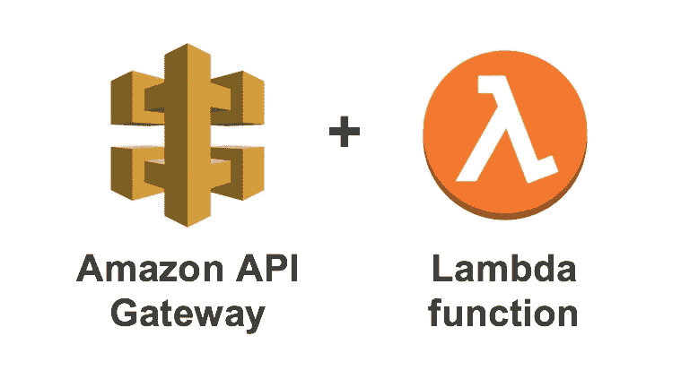
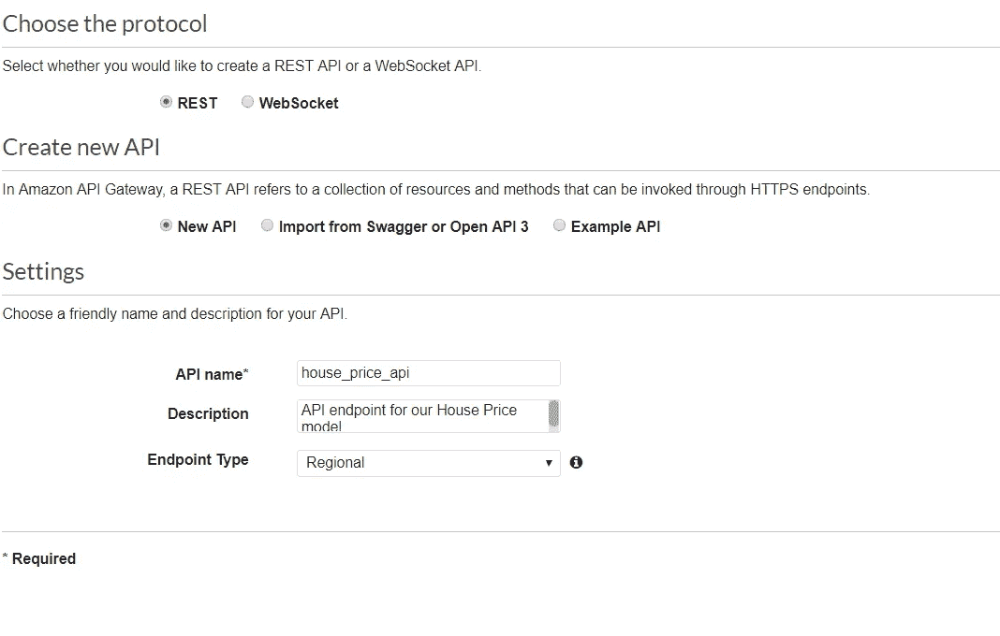
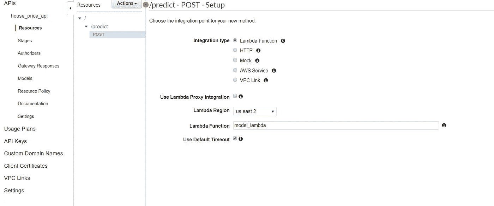
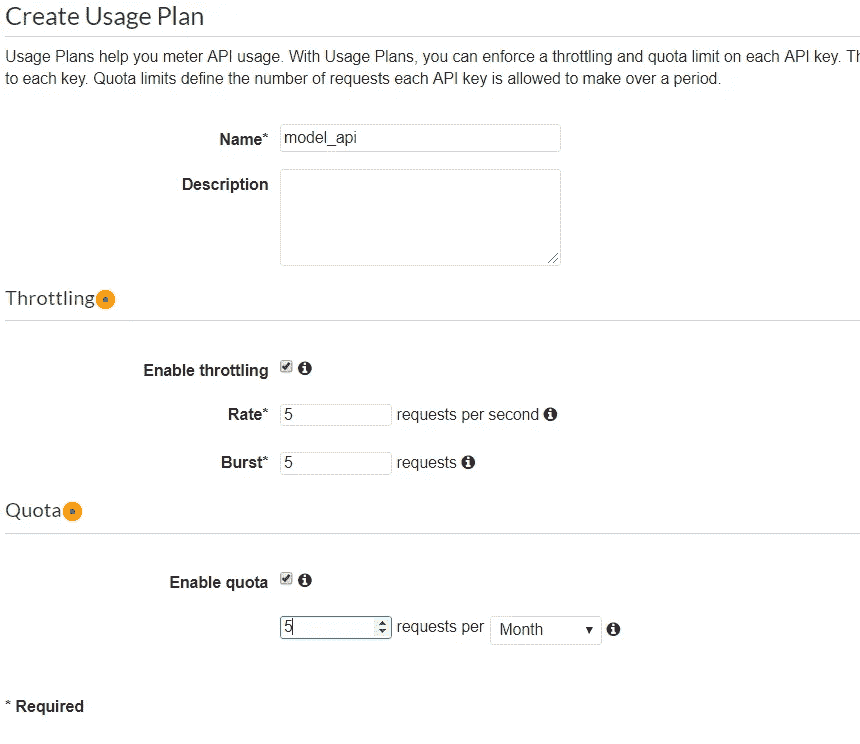
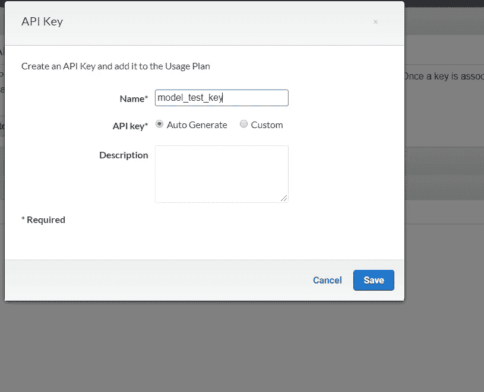
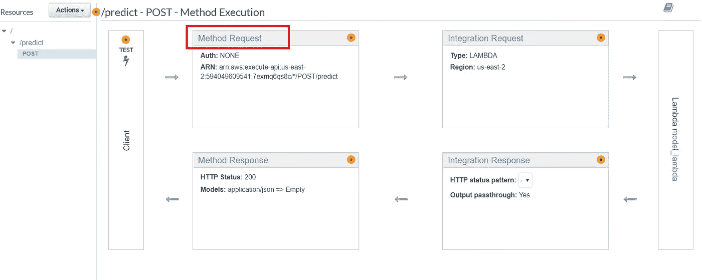
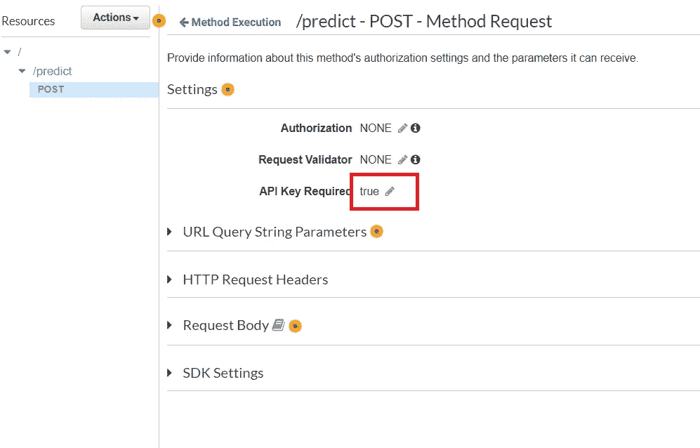
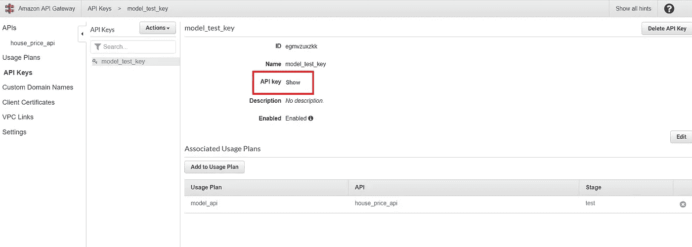

# 在 AWS Lambdas + API Gateway 上托管您的 ML 模型第 2 部分

> 原文：<https://towardsdatascience.com/hosting-your-ml-model-on-aws-lambdas-api-gateway-part-2-23517609522b?source=collection_archive---------23----------------------->

## [我关于模型部署的其他帖子](https://towardsdatascience.com/tagged/modeldeployment)

## 这是我在 AWS 系列上托管您的 ML 模型的第 2 部分，我将通过 API 网关安全地公开您的 ML 模型 lambda。

我有一些好消息，虽然，**这是容易的一点**。

你已经完成了设置 lambda 函数和所有层的所有艰苦工作，所以这应该是小菜一碟。

**关于我的其他关于模型部署的文章，请查看标题上方的链接。**



# 将 lambda 链接到 API

因此，首先您需要通过 API 网关创建一个新的 API。



对于您的新 API，选择 resources 并单击 actions。您需要添加一个资源，然后添加一个 POST 方法。让我们称资源为 predict，因为这就是它的作用(有趣的想法),并将 POST 方法分配给 predict 资源。

接下来，您将需要将 API 与 lambda 函数集成在一起。输入您的 lambda 函数名，并允许 API 访问该资源。它应该是这样的:



APIs are easy AF

接下来我们只需要部署 API。重新单击 Actions 按钮，选择 Deploy API，并为您的新部署命名和描述(如果您愿意的话)。

我通常把我所有的 API 都称为测试，这样至少人们不会太惊讶，然后他们会爆炸。

# 测试您是否可以访问您的 API

你已经在 AWS 端完成了所有的配置，现在让我们看看是否能从你的 API 中得到一些预测。

其实超级简单。

```
import requests

url = "https:your_url.amazonaws.com/test/predict"input_data = {
  "Property Type": "S",
  "Old/New": "Y",
  "Duration": "L"
}

r = requests.post(url, json=input_data)
print(r.json())164735.29632791804
```

维奥拉。您实际上已经部署了您的模型，现在可以从任何可以在您的 API 上创建 POST 请求的地方访问它。

这很酷。

# 为您的 API 增加一些安全性

但是很明显，我们不希望任何获得 URL 的人能够从 API 访问结果。

也许它是商业 IP 或其他东西，但无论哪种方式，你都必须为通过它的所有请求付费(不要担心它真的很便宜)，所以让我们为 API 添加一个 API 密钥，这样它就变得很好很安全。

你需要做的第一件事是创建一个使用计划。您可以通过 API 设置节流/突发流量。



Just click the toolbar on the left hand side and select usage plan. Please set your quota to more than 5 per month though. Testing will be hell otherwise

一旦您创建了您的使用计划(如果您正在与企业合作**，您可能希望每秒钟有 5 个以上的请求**)，您就可以开始了，然后接下来会提示您创建您的 API 密钥。



现在我发誓我们快到了。接下来，您需要进入您的 APIs POST 方法并添加 API 密钥需求，否则您仍然可以在没有密钥的情况下访问 API。

所以让我们直接进入方法响应



**最后一步，别忘了部署您的 API。**

您会惊讶地发现，做出更改却忘记部署是多么容易。

现在我们需要去做一些测试，以确保这是我们所希望的工作。所以我们要检查一下:

*   #1:测试没有密钥的 API 请求失败
*   #2:测试带有密钥的 API 请求成功

## #1 测试没有 API 密钥的 API 密钥失败

```
import requests

url = "https:your_url.amazonaws.com/test/predict"input_data = {
  "Property Type": "S",
  "Old/New": "Y",
  "Duration": "L"
}

r = requests.post(url, json=input_data)
print(r.json())
```

运行该脚本应该会返回以下错误。

```
{'message': 'Forbidden'}
```

如果这种情况没有发生，你需要检查你的 API 密匙是否已经被正确地附加到你的 API 上，因为它现在不工作。

但是，现在你已经成功地保护了你的 API。

## #2:带有密钥的 API 请求成功

您需要返回到 API 网关，在 API 密钥下，您需要显示您的 API 密钥。



Half the battle of AWS is knowing where to find these things

将它粘贴到 Pycharm(或您正在使用的任何 IDE)中，这样您就可以在 POST 请求中传递它。

所以你的帖子请求应该是这样的:

```
key="yourapikey" # In reality it'll look much weirder

headers = {
  'x-api-key': key
}

r = requests.post(url, json=input_data, headers=headers)
print(r.json())
```

您应该得到这样的有效响应(实际结果可能会有所不同)

```
164735.29632791804
```

# 包裹

因此，在本教程之后，您应该能够将您的模型部署为 lambda 函数，并使用 API 网关安全地将该 lambda 公开给外界。

我希望你们都学到了一些新的东西，如果有什么你想让我介绍的，就写在评论里，我会研究的。