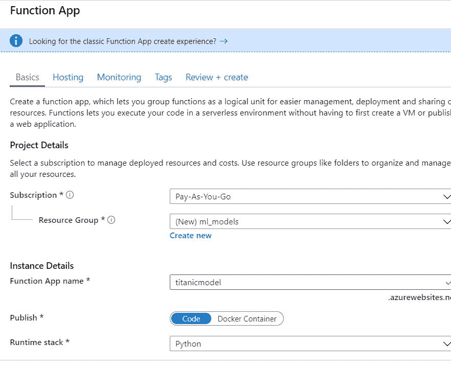

# 在 Azure 函数上托管您的 ML 模型—第 1 部分

> 原文：<https://towardsdatascience.com/hosting-your-ml-model-on-azure-functions-ae3ca4ae1232?source=collection_archive---------13----------------------->

## [我关于模型部署的其他帖子](https://towardsdatascience.com/tagged/modeldeployment)

## 终于有了一种便宜又简单的方法来部署您的模型


这是几个星期的功能工程，模型选择和超参数调整，你完成了。

你的同事对你不断使用“泡菜”这个词感到困惑，他们不再问你在做什么，只是假设你真的喜欢保存蔬菜。

现在让我们把这个模型放在一个你可以从中获得一些价值的地方。

**如果你想通过 AWS lambdas 部署你的模型，请点击标题上方的链接查看我的文章。**

[**如果你想跟进**](https://github.com/evanmiller29/azure_ml_function) ，这里是我的 Git 回购的链接

# Azure 函数 vs AWS Lambdas

这些与 AWS lambdas 非常相似，从模型部署选项来看，它们比 AWS lambdas 有更大的优势。

**指定你的 Azure 函数运行时就像 pi** 一样简单

还记得让 AWS Lambdas 用熊猫有多痛苦吗？我当然知道。改变一个小东西(你的内部 ML 包或者想用一个新的花式 sklearn 模型)AWS lambdas 就开始了。

接下来你使用 Docker 重新创建图层，但愿你不会忘记更改图层版本..

使用 Azure Functions，你只需指定一个 requirements.txt，当你将 Azure Functions 部署到你的帐户时，它会为你安装所有这些包。

*它还允许你从本地直接上传模型到你的 Azure 函数。*

这真是太酷了。

**Azure CLI 允许你在本地调试你的 Azure 功能**

如果你遵循我的 AWS lambda 教程，你可能会花很多时间编写简单的测试来运行你的 AWS lambda，以确保你可以导入熊猫或一些非常小的东西。

然后你可以测试通过 Python 中的请求包向 Azure 函数发送数据。但是现在您只需在本地运行它们，并通过请求包发送 POST 请求，您就可以在部署之前确保它正在工作

**创建 HTTP Azure 函数只需一个简单的步骤就可以部署和公开端点**

以前，当将模型部署到 AWS Lambdas 和 API Gateway 时，您必须分别执行这两个步骤。有了 Azure 函数，它们只是一个步骤。

除此之外，你的 Azure 函数是预先保护的(比如:有一个 API 密匙),所以当你在 API 网关端配置东西时，你不必担心关闭你的 AWS Lambda。

# 入门指南

现在我们进入有趣的部分。如果你想跟进[，这里有](https://github.com/evanmiller29/azure_ml_function)GitHub 回购。

首先你需要安装 Azure CLI 工具。这将允许您在本地测试您的 Azure 功能，然后将其推送到您的 Azure 帐户。

在这一点上，获得 Azure 帐户可能是值得的。如果你从未注册过，你可能会得到 200 美元的免费积分。但是，如果您不能，请不要担心，这些部署不会让您倾家荡产。

按照这个来安装 Azure CLI，这样我们就可以开始构建我们的功能了。

要测试这一点，您需要尝试:

```
func new
```

如果安装成功了，你就可以在本地创建一个 Azure 函数。但是在 Windows 上工作可能有点困难。

**让 Azure CLI 在 Windows 上运行**

如果你得到一个错误，说 func not found，你想安装做一些更多的步骤:

*   通过管理外壳安装[巧克力](https://chocolatey.org/install)
*   使用 [chocolatey](https://chocolatey.org/install) 安装 azure cli 工具 [azure cli 工具工作](https://stackoverflow.com/questions/56526088/func-is-not-recognized-as-an-internal-or-external-command-operable-program-or)(答案#2)。
*   运行 func 检查您的结果是否与 Stackoverflow 答案匹配，然后您就可以开始了

显然这是因为 func 不在你的路径上。所以，如果你比我聪明，并整理了这些东西，让我知道，我会在这里添加它。

这将是你初始化 Azure 函数的地方。简单的事情是，如果你让你的 Azure 函数响应 HTTP 请求，那么你已经部署了你的模型，并通过 API 在一个简单的步骤中使它可用。

# **设置你的 Azure 函数和本地 python 环境**

#1 初始化您正在工作的文件夹

```
func init titanic_model --python
```

#2 设置基本 Azure 功能

```
cd titanic_model
func new
```

*   选择 HTTP 触发器
*   给你的函数一个名字，我称之为我的模型 _ 部署

如果你做对了，你会看到这个:


眼尖的读者会意识到我是在我的基本 Python 安装上运行这些功能的。

当我们在本地运行 Azure 函数时，它使用我们指定的 Python 环境来执行。这让我们可以使用 requirements.txt 来指定一个本地环境，该环境将镜像将在 Azure 函数上运行的内容。

我使用 conda 创建我的环境，因为它很简单，但是你也可以使用 venv 或任何其他解决方案。

我还会添加到 requirements.txt 中，以涵盖所有的依赖项。这是我的样子:

```
azure-functions==1.0.4
pandas==0.25.3
scikit-learn==0.21.3
requests==2.22.0
```

现在运行，这样您就可以安装包并构建用于部署的模型。

```
conda create --name model_deploy python=3.7
activate model_deploy
pip install -r requirements.txt 
```

# 构建模型和配置 Azure 函数

我在 Git repo 中放了一个简单的模型来指导您。来创建模型。您需要运行的 pkl:

```
python model_build.py
```

这个模型是根据泰坦尼克号的数据集建立的，它预测了幸存者:

*   年龄
*   乘客等级
*   上船(乘客上船的地方)
*   性

# **改变 __init__。py 处理您的请求**

__init__。py 是你的 Azure 函数运行的内容。

使用 JSON 输入/输出可能有点麻烦，我花了一段时间才适应。

我将把代码的主要部分粘贴在这里，这样我就可以突出我遇到的主要困惑，这样你就可以从我的错误中吸取教训。

```
data = req.get_json()
data = json.loads(data)
```

您将为此模型使用 POST 请求。但是当您读入 JSON 请求时，它仍然是字符串格式，所以我们需要使用 json.loads 将它转换成适当的 dict/JSON 对象，然后才能使用数据进行预测。

```
response = []
for i in range(len(data)):

    data_row = data[i]
    pred_df = pd.DataFrame([data_row])
    pred_label = clf.predict(pred_df)[0]
    pred_probs = clf.predict_proba(pred_df)[0]

    results_dict = {
        'pred_label': int(pred_label),
        'pred_prob_0': pred_probs[0],
        'pred_prob_1': pred_probs[1]
    }

    response.append(results_dict)

return json.dumps(response)
```

有几件事我会很快提到:

*   警察。DataFrame([data_row]):允许您在 Pandas 中创建一个单行数据框架。否则你会得到一个索引错误
*   int(pred_label):因为输出的类是 numpy 数据类型(int64)而在返回 JSON 对象时是不可用的，所以我转换了它
*   json.dumps(response):即使我们使用 json，你也需要在发回之前将其转换成一个字符串

**现在让我们在本地部署那个坏的 boi**

```
func host start
```

一旦它启动并运行，应该会给你下面的结果


[http://localhost:7071/API/model _ deployment](http://localhost:7071/api/model_deployment)是我们想要发送请求的目标。在本地 Azure 函数运行之后，使用 test_api.py 将数据 ping 到我们的 api。您应该会看到以下结果:


布欧耶。现在成功了！！！！！所以现在我们有了一个本地运行的 Azure 功能，我们需要把它推送到 Azure，这样我们就可以永久地部署它。

# 部署到 Azure

现在我们已经让 Azure 函数在本地工作，我们可以把它推到 Azure 并部署这个坏的 boi。

如果你还没有创建一个 Azure 帐户，那么现在是时候了。一旦你这样做了，就去你的门户网站，然后运行一个 Azure Function 应用程序。

下面是我如何配置我的



Using Docker is a good shout. I’ll do my next blog post on that

现在你已经创建了你的 Azure 应用，你现在可以将你的模型部署到 Azure 并进行测试。

从您的本地 Azure 函数目录中，您将需要运行以下命令

```
az login
```

这将无缝执行，或者要求您登录 Azure 帐户。一旦完成，你就可以开始了。现在让我们将您的本地代码推送到 Azure。

```
 func azure functionapp publish <APP_NAME> --build remote
```

其中 APP_NAME 是您给函数 APP 起的名字(duh)。我的是泰坦模型，但是你的会不同。

一旦完成，你需要找到你的 Azure 应用的 URL。你可以在这里找到


这个 URL 是您将要用来从 Azure 访问您的模型的。所以用你的 azure 函数 url 替换 test_api.py 中的 azure_url，试一试。

如果一切按计划进行，您将获得:

```
[
  {
    "pred_label": 1,
    "pred_prob_0": 0.13974358581161161,
    "pred_prob_1": 0.86025641418838839
  },
  {
    "pred_label": 0,
    "pred_prob_0": 0.65911568636955931,
    "pred_prob_1": 0.34088431363044069
  },
  {
    "pred_label": 1,
    "pred_prob_0": 0.13974358581161161,
    "pred_prob_1": 0.86025641418838839
  },
  {
    "pred_label": 0,
    "pred_prob_0": 0.65911568636955931,
    "pred_prob_1": 0.34088431363044069
  }
]
```

现在，您还会有一种温暖而模糊的感觉，即将您的第一个 ML 模型部署到 Azure 函数中！！

由于 API 端是由 Azure 函数本地处理的，我将在第二部分使用 Docker 重新创建这个过程，这可能会使事情变得更简单。