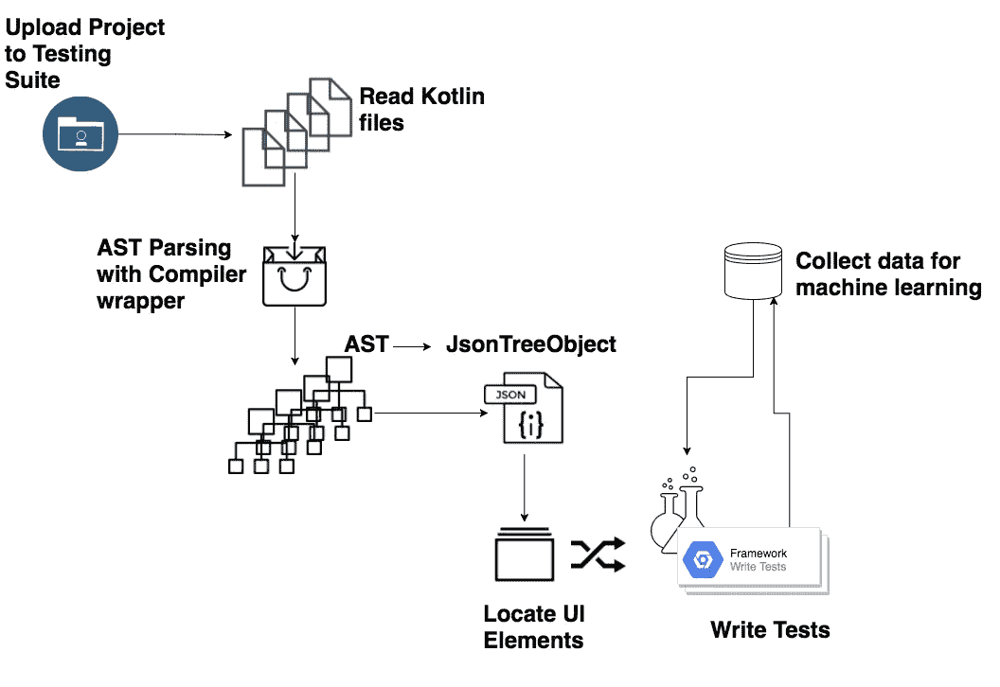
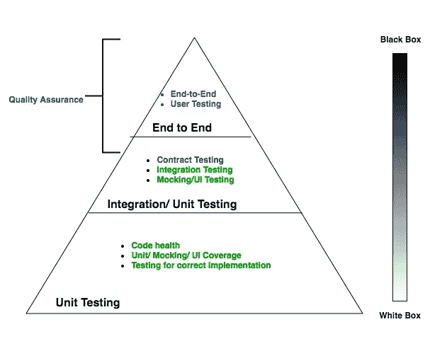
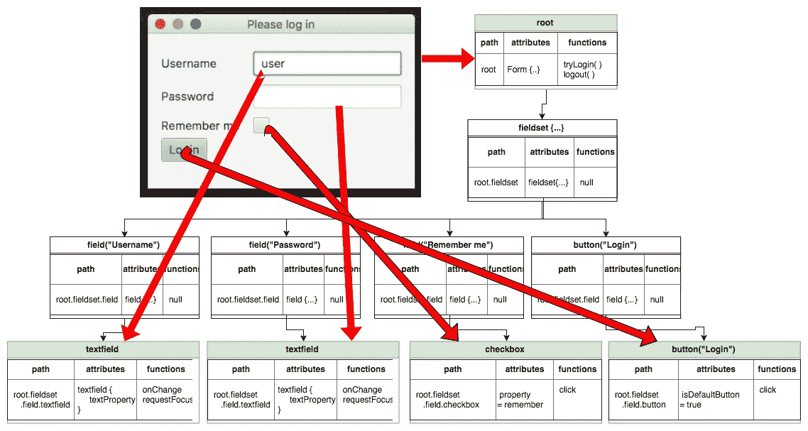

# 热狗还是热狗:使用元编程编写 UI 测试

> 原文：<https://towardsdatascience.com/hot-dog-or-not-a-hot-dog-using-metaprogramming-to-write-ui-tests-61e70b050dc5?source=collection_archive---------27----------------------->

## 关于 Kotlin 运行时脚本当前缺点的见解，黑盒与白盒测试，以及 AST 解析如何帮助编写愚蠢(但有效)的 UI 测试。

在对 Kotlin 的长期探索中，[现代元编程的下一个前沿领域](/kotlin-the-next-frontier-in-modern-meta-programming-8c0ac2babfaa)，我很高兴能够使用元编程来编写 UI 测试。这个想法是将一个 TornadoFX 项目上传到[的 TornadoFX-Suite](https://github.com/ahinchman1/TornadoFX-Suite) 中，后者依次读取项目，检测 UI 控件，并动态编写 UI 测试。

Tornado-FX 套件即将开始编写 UI 测试。尽管在过去几个月里 AST 解析受阻，但我终于又开始行动了。当我接近复合分解的 MVP 时，现在可能是谈论*如何*使用应用程序的复合抽象来创建测试的好时机。以下是迄今为止所取得的成就:

The last two steps are stages 2 and 3 of this project.

我们已经检测到一些 UI 输入，并使用解析来创建类分解。所以…我们该拿它怎么办？让我们花点时间来谈谈 UI 测试。

# 用户界面(UI)测试

测试是验证软件是否按预期运行的必要组成部分。不同种类的测试可能有其各自的目的，但是如果没有一个坚实的基础，其他种类的测试可能会变得乏味，甚至糟糕。测试一般可以分为两类: [*黑盒测试*和*白盒测试*](https://www.softwaretestingclass.com/difference-between-black-box-testing-and-white-box-testing/) *。*

*黑盒测试*是一种从用户角度保证软件质量的方法，意思是在不知道代码本身是什么的情况下测试软件。这可能意味着测试是在用户与应用程序交互时在应用程序本身上进行的(手动或自动)。其他测试可能会检查应用程序的不同组件是否能够有效地相互通信。 ***黑盒测试*测试系统的行为和功能。**

*另一方面，白盒测试*测试*系统如何运行。与黑盒测试不同，*白盒测试*是利用代码本身的知识编写的。 ***白盒测试*涵盖了代码的健康，它的业务逻辑，并确保正确的数据路径。***

我们正在从我们分析的代码中创建 UI 测试，这可能是一个灰色地带。根据 [Android 文档](https://developer.android.com/training/testing/ui-testing/)，UI 测试“让你确保你的应用程序满足其功能需求，并达到高质量标准，从而更有可能被用户成功采用。”

探索应用程序本身的环境可能会发现错误，但是如果没有白盒测试，就很难确定不需要的功能的来源。

一年多前，我编写了一个非常酷的仪表板生成器，来帮助生成可以呈现为 JavaScript 的 XML。因为我自己对拖放功能进行了微观管理，所以很难确定为什么代码本身会出现这样的错误:

[TornadoFX-Dnd-TilesFX](https://github.com/ahinchman1/TornadoFX-DnD-TilesFX)

应用程序不会崩溃，也不会记录任何错误。应用程序本身没有中断，但是功能显然没有按预期工作。UI 错误很难诊断和解决，但这正是 UI 测试的用武之地。UI 测试不仅有助于定义和保证期望的行为，而且随着复杂性的增加，它还使得调试、重构和维护代码变得更加容易。

**一个好的 UI 测试应该是这样的:**

1.  **抓取特定视图**
2.  **在视图上执行一个动作**
3.  **检查用户界面，看它看起来是否正常**

在这个特别讨厌的 bug 的例子中，我们可以看到大多数预期的行为都在那里；然而，很明显，一个特定的序列暴露了一个功能漏洞。我们的测试将遵循这些步骤，但包括边缘情况以及顺序交互的排列将有助于解决类似这些棘手的疏忽。

# 元编程如何编写 UI 测试？

在编写 UI 测试的元编程中存在一些挑战，尤其是在像 Kotlin 这样的静态类型语言中。虽然从 Kotlin 1.3 开始，Kotlin 具有反射能力和自脚本能力来编译运行时代码，但如果没有必要的导入和依赖，我无法成功编译上传的 Kotlin 文件。

不幸的是，Kotlin 还没有*完全*准备好像在运行时编译整个项目这样雄心勃勃的事情，但是我将同时关注问题 [KT-27960](https://youtrack.jetbrains.com/issue/KT-27960) 和 [KT-28916](https://youtrack.jetbrains.com/issue/KT-28916) 。

现在，我求助于另一个 Kotlin 解决方案，通过创建一个 AST 解析器，使用 [kastree](https://github.com/cretz/kastree) 和 [gson](https://github.com/google/gson) 进行基本的类分解，来编写我自己版本的代码自省。**创建我自己的 AST 解析器有助于克服挑战，例如不必担心封装和访问级别或递归中的类型转换，同时将解决方案保留在 Kotlin 中**——最终，编写 Kotlin DSLs 变得容易！

我们有一种方法来确定所需的控制，我们有一个基本的复合分解。让我们看看如何利用这些东西来实现编写 UI 测试:

1.  **抓取一个特定的视图** —通过用视图()扩展类，TornadoFX 有一种区分视图的简单方法。说到测试，我们可以用 id 抓取视图控件。由于人们通常不会在他们的 TornadoFX DSLs 上附加 id，我不想强迫他们这样做。相反，我们可以遍历视图层次结构中的节点，并将每个节点的路径以及节点的状态保存在一个字典中，以便在编写脚本时容易访问。
2.  **在视图上执行一个动作**——以编程方式在视图上执行一个功能并不是一个挑战，除了保存一个可以用每个控件完成的可能动作的字典。
3.  检查用户界面，看看它是否…嗯，变化—*真正的挑战*是知道 UI 控件预期会发生什么变化，更不用说弄清楚 UI 应该是什么样子了。机器学习可能会发现节点中哪些属性发生了变化，但目前，我们将保持较小的目标。保持一个组合契约的抽象表示对于帮助跟踪视图中的节点是什么是必要的，节点的状态是否变脏是必要的，以及将改变节点的函数的关系映射到节点本身是必要的。如此复杂的关系需要用有向图结构来表示。

这是一个很高的要求，只是看看一个节点是否改变或保持不变，热狗或不是热狗。为了让测试更有用，下一阶段将应用 Tensorflow 开始收集尽可能多的数据，以进行更智能的测试。这个阶段的 UI 测试可能没什么用，但这是我感到兴奋的事情。

正如库梅尔·南贾尼在硅谷所说，“核心技术是有效的。它只是……它只是需要训练。”