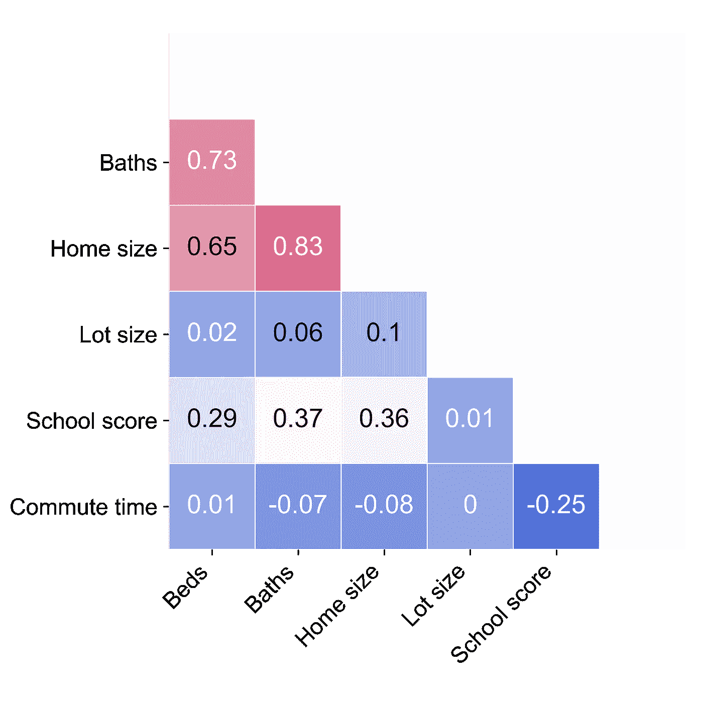

# 旧金山湾区的住房:使用机器学习寻找交易

> 原文：<https://towardsdatascience.com/house-hunting-in-the-san-francisco-bay-area-deal-hunting-using-machine-learning-3ed6fc8e8991?source=collection_archive---------16----------------------->

## 模拟房价揭示了被低估的社区和房源。

*Aerial view of San Francisco downtown and the East Bay. Photo credit:* [*Unsplash*](https://unsplash.com/photos/6b9rqGI_w1s)

## **总结**

本文描述了旧金山湾区单户住宅价格的收集、可视化和建模。使用 2019 年 6 月的 7，000 个活跃房源的数据集，探讨了影响该地区房价的因素。发现用位置数据(学校质量和通勤时间)补充列表信息(卧室和浴室的数量、住宅大小和地块大小)可以显著提高简单线性回归模型的解释能力。回归系数还讲述了一个有趣的故事，即市场对住宅及其位置各方面价值的看法。重要的是，定价模型能够识别被低估的房源和社区，为个人购房者和投资者提供潜在兴趣的关键信息。

## **简介**

虽然自 2000 年以来，标准普尔 500 和美国整体房地产市场的表现几乎相同(都上涨了约 100%)，但旧金山湾区的房价指数上涨了约 167% ( [圣路易斯联邦储备银行](https://fred.stlouisfed.org/series/SFXRSA))。因此，海湾地区的房主享受了一个通过房地产积累财富的机会，而这种机会在美国其他地区不一定能获得。

对于那些已经入市的人来说，自 2000 年以来，房地产价值增长了近两倍，这无疑是一件好事。然而，对于那些刚搬到该地区的人来说，攒钱付首付和选择买房地点可能是一项艰巨的任务。受我与朋友和家人的讨论以及投资的基本概念(即，购买定价过低的资产)的启发，我开始收集尽可能多的关于湾区独户住宅当前价格的信息，应用简单的机器学习技术梳理出推动住宅价值的因素，并确定该地区可能吸引投资的角落。

## **方法**

使用 [Regex](https://docs.python.org/3/library/re.html) 和 [Pandas](https://pandas.pydata.org/) 清理和处理来自整个湾区的单户住宅列表的数据(地址、床位、浴室、住宅大小、地段大小、纬度/经度坐标和价格)。作为列表数据的补充，通勤时间从谷歌地图获得，学校质量数据来自 2018 年加州学生表现和进步评估( [CAASPP](https://caaspp.cde.ca.gov/sb2018/ResearchFileList) )。使用来自斯坦福土方工程[的](https://earthworks.stanford.edu/catalog/stanford-vj593xs7263) [Cartopy](https://scitools.org.uk/cartopy/docs/latest/) 、 [Matplotlib](https://matplotlib.org/) 和 shapefiles(城镇、邮政编码和街区边界)将结果信息叠加到地图上。使用 [Seaborn](https://seaborn.pydata.org/) 可视化了盒/条图和变量之间的成对关系。使用 [Statsmodels](https://www.statsmodels.org/stable/index.html) 和 [Scikit-learn](https://scikit-learn.org/stable/) 库对数据进行普通最小二乘(OLS)回归分析。这个项目的完整源代码可以在 [GitHub](https://github.com/mboles01/Realestate) 上找到。

# **结果**

## ***可视化清单数据***

*地理趋势*

有了海湾地区市场上几千处房产的信息，所有房源的位置都用 Python [Cartopy](https://scitools.org.uk/cartopy/docs/latest/) 包和从斯坦福 Earthworks 获得的城市边界信息绘制在地形地图上，并用价格进行颜色编码(图 1)。这张地图揭示了该地区房价相对成本的清晰地理趋势。例如，旧金山、马林县和半岛通常包含最昂贵的 20%的房源(深蓝色数据点)，而奥克兰、圣莱安德罗和里士满通常包含最便宜的 20%的房源(深红色数据点)。类似地，在南湾，靠近圣克鲁斯山脉的房子通常比沿着迪亚波罗山脉的房子更贵。

**Figure 1.** Overview of single-family homes listed for sale in the Bay Area in June 2019\. The 7,153 entries are split into quintiles by price, with list prices falling within the bottom and top 20% colored dark red and blue, respectively.

这种分析的一个自然延伸是将清单分成次区域。放大旧金山、东湾、半岛和南湾，地理价格趋势再次显现(图 2)。旧金山最贵的独栋住宅位于市中心和普雷斯迪奥之间，而最便宜的位于该市南部，从日落区到湾景区。在东湾，奥克兰山两侧(包括皮德蒙特、伯克利和奥林达)的房子最贵，而里士满、南奥克兰和圣莱安德罗的房子最便宜。在半岛上，阿泽顿的帕洛阿尔托和希尔斯伯勒的房价最高，而圣马特奥和东帕洛阿尔托的房价最低。在南湾，最靠近圣克鲁斯山脉(洛斯阿尔托斯、萨拉托加和洛斯加托斯)的房子最贵，而在那以东的几乎所有房子都不太贵。跨地区的相对成本也值得注意:虽然东湾的最高价格五分之一起价为 150 万美元，但半岛上的最低价格也是同样的价格。

**Figure 2.** Zoom showing detail of single-family home list prices in the San Francisco, East Bay, Peninsula, and South Bay regions. In each case, price quintiles have been recalculated to reflect the distribution of prices within the highlighted region.

*城镇间的房价和地价*

为了更好地量化价格变化，使用 Python [Seaborn](https://seaborn.pydata.org/) 库构建了箱线图。这种表示允许跨分类变量(这里是城市/城镇)的分布比较，其中彩色框表示四分位范围的界限(第 25 到 75 个百分点)，其中的线显示中值价格，而触须包含分布的剩余部分减去异常值。

从这个角度来看，从最低到最高的房价中值对选定地区进行排序提供了一些有趣的见解(图 3)。例如，房价中值最低的主要是东北湾(瓦列霍、安提阿和里士满)，而最高的是半岛(希尔斯伯勒、帕洛阿尔托和伍德赛德)。此外，散点叠加在箱线图上说明了大多数人居住的地方:奥克兰、圣何塞和旧金山都有数百套当前房源，而更昂贵的十几个社区只有少数几套当前待售房屋。

**Figure 3.** Box plot displaying home price and for selected Bay Area cities, with individual observations superimposed to reveal sample size and distribution.

有趣的是，将同样的分析应用到房子所在土地的价格上(图 4 ),会得出有些不同的结论。例如，虽然伍德赛德的房价中位数在图 3 所示的 29 个城镇中排名第三，但该社区(主要位于 I-280 以西，以骑马闻名)的单位面积土地成本中位数实际上是这 29 个城镇中最低的。同样，从土地成本的角度来看，其他中值房价较高的城镇，如 Orinda 和 Los Gatos，似乎更实惠。另一方面，帕洛阿尔托和旧金山是迄今为止购买土地最昂贵的地方，这反映了它们作为该地区主要经济活动中心的地位。

**Figure 4**. Box plot displaying land price for selected Bay Area cities.

对于旧金山、奥克兰和圣何塞，房价的分布也是按社区划分的。虽然旧金山的几个街区(内里士满、俄罗斯山、诺布山、滨海区、北海滩)号称是湾区最贵的(> 500 万美元)住宅，但仍有几个街区(湾景、猎人角、Visitacion Valley、怡东、克罗克-亚马逊)提供标价低于 100 万美元的房产(图 5，顶部)。

在奥克兰(图 5，中间)，只有 3 个社区(蒙特克莱尔、栈桥格伦和洛克里奇)的房价中值超过 100 万美元，而几乎所有其他社区(最显著的是考克斯/艾姆赫斯特公园、体育馆和弗鲁特维尔)都有大量价格低于 50 万美元的房源，是该湾最便宜的房源之一。

**Figure 5**. Box plots showing home prices across neighborhoods in San Francisco, Oakland, and San Jose.

这样的便宜货通常在圣何塞找不到(图 5，底部)，那里最便宜的社区房价中值不到 100 万美元。即便如此，这个地区只有少数房子的价格高于 100 美元 2M，而且它们似乎大多位于柳树谷、阿尔马登和常青树社区。有趣的是，这里最高的中值房价出现在西圣何塞，尽管价格分布比类似的社区窄得多，这或许反映了这样一个事实，即该地区的房价普遍不高，其房价是由靠近苹果和网飞等科技巨头而推高的。

# ***建模房价***

在这里，我描述了一个非常简单的方法，使用普通的最小二乘(非正则化)线性回归模型来构建房价模型。我的目标是( *1* )产生一个可解释的模型，其系数揭示了市场对房屋及其所在土地的各个方面的价值，并( *2* )确定湾区的哪些部分提供了最“物有所值”的东西，即那些提供了多种功能组合、保证价格高于市场目前承受水平的东西。当然，其他方法(例如，*k*-最近邻法、决策树、神经网络)可以产生一个解释力更强的模型。下面描述的线性模型符合本文的意图——从描述性分析的角度提供对房屋价值的见解。

## *清单数据*

除了简单描述当前湾区住房和土地价格的地理分布，该数据集还用于使用 Python [Statsmodels](https://www.statsmodels.org/stable/index.html) 和 [Scikit-learn](https://scikit-learn.org/stable/) 库对房价进行建模。

首先，数据集中的 7，151 套房屋的价格根据清单中包含的房产数据(卧室数量、浴室数量、房屋大小和地块大小)分别绘制，并通过 [Seaborn](https://seaborn.pydata.org/) pairplots(图 6，顶部)使用普通最小二乘(OLS)回归进行拟合。在这四个特征中，房子的大小解释了大多数观察到的标价差异( *R* = 0.56)。另一方面，当完整的数据集缩小到一个邮政编码(95126)时，这些特征中的每一个都可以更好地解释价格差异(图 6，底部)。

**Figure 6**. Relationship between price and listing factors is tightened when full set of listings (top) is narrowed to a single zip code (bottom).

## *新增功能:通勤时间和学校质量*

整个地区的房屋面积和价格之间的适度相关性，以及单个邮政编码内的强相关性，提出了一种非常直观的可能性，即特定位置的因素也对价格有影响。为了将“地点”纳入等式，引入了反映便利性和特权的额外数据:通勤时间和公立学校质量。

认识到旧金山和帕洛阿尔托是该地区的两个主要经济中心，通勤时间是通过谷歌地图测量的，即从每个邮政编码到两个目的地中较近的一个的乘车时间(周三上午 8 点)(图 7，左侧)。结果表明，从旧金山到圣何塞，半岛上上下下的住宅提供了通勤时间短于一小时的可能性。同样，马林和奥克兰到旧金山也很方便，弗里蒙特到帕洛阿尔托也是如此。另一方面，从外东湾(里士满、安提阿、圣拉蒙)的家到更近的枢纽的通勤时间通常超过 1.5 小时。

**Figure 7**. Commute times (left) and school quality (right) for zip codes across the Bay Area.

公立学校的质量也很可能在特定地区独户住宅的定价中发挥作用。方便的是，加州学生表现和进步评估(CAASPP)标准化测试机构已经为加州的每所公立学校提供了大量的[学生水平数据](https://caaspp.cde.ca.gov/sb2018/ResearchFileList)。使用 2018 年的数据集，平均每个学校各年级的熟练程度测量值，以及每个邮政编码的学校的熟练程度测量值，学校质量被量化为特定邮政编码内被认为精通阅读和数学的学生的比例(图 7，右)。即使经过这样的平均，这张地图也指出了整个海湾地区学生成绩的近乎双峰的分裂，马林县、半岛和三谷地区享有优秀的学校(> 75%的学生优秀)，而安提阿、瓦列霍、里士满、圣莱安德罗和圣何塞的公立学校学生相比之下似乎很挣扎。

**Figure 8**. Relationship between price and commute times (left) or school quality (right) across the Bay Area.

这些新参数也被评估为标价的独立预测指标。事实上，通勤时间和学校分数在相似的程度上解释了( *R* ~ 0.55)观察到的价格差异，作为之前的最佳预测因素(图 8)。直觉上，最佳拟合线意味着房价和学校质量之间的正相关关系，以及价格和通勤时间之间的负相关关系。

## *功能选择*

[多重共线性](https://statisticsbyjim.com/regression/multicollinearity-in-regression-analysis/)，或特征集合中特征之间的显著相关性，可导致系数的不同值，这取决于选择哪些特征包含在模型中。为了创建一个具有可解释系数的简单模型，这个扩展的特征集必须筛选出那些为价格预测提供有意义的新信息的特征集。

**Figure 9**. Heatmap showing correlation across independent variables.

为此，图 9 中示出了跨特征集的[皮尔逊相关系数](https://en.wikipedia.org/wiki/Pearson_correlation_coefficient)。事实上，列表数据中的三个参数(卧室、浴室的数量和房屋大小)都彼此强烈相关(0.65 < *ρ* < 0.83)，如果我们要在拟合模型后从系数中提取意义，就必须删除其中的两个。作为价格的最强独立预测因素(图 6，顶部)，房屋大小被保留在模型中，而卧室和浴室被丢弃。

引入通勤时间和学校质量数据，简单线性回归模型构建如下:

*价格~户型+地段+通勤时间+学校分数* ( **1** )

## *拟合和解释模型*

使用 sci kit-learn[linear regression](https://scikit-learn.org/stable/modules/generated/sklearn.linear_model.LinearRegression.html)软件包将房价数据回归到上面列出的四个特征上。十倍交叉验证用于估计泛化误差，或模型对未用于训练模型的数据的表现。根据房屋大小、地段大小、通勤时间和学校分数，使用数据集中的所有示例获得了 0.61 的平均测试集 *R* 。然而，剔除异常值后，拟合质量有了相当大的提高，在剔除价格最低和最高的 5%的房屋(分别为 45 万美元和 430 万美元)后，平均测试集 *R* 达到 0.70。下面将进一步研究根据过滤数据训练的模型。

这种简单模型的主要优点是易于解释。为此，特征系数表明，在其他条件相同的情况下，湾区购房者应该准备好为每增加一平方英尺的室内空间支付大约 430 美元，为每增加一平方英尺的室外空间支付 0.35 美元，为每分钟节省的通勤时间支付 14k 美元，为当地公立学校的优秀学生比例每增加一个百分点支付 12k 美元:

*预计标价($)
= $675，900
+ ($429 /平方英尺)住宅面积(平方英尺)
+ ($0.35 /平方英尺)地段面积(平方英尺)
+(-13，560 美元/分钟)通勤时间(分钟)
+ ($12，217 / %熟练程度)* ( **2** )

鉴于其简单性，以及训练和测试集误差非常接近的事实( *R* 分别为 0.71 对 0.70)，可以有把握地说，这种四特征最小二乘线性回归模型位于[偏差-方差权衡](http://scott.fortmann-roe.com/docs/BiasVariance.html)的高偏差侧。例如，通过使用更大的特征集或非参数方法，如*k*-最近邻或决策树，可以毫不费力地构建更精确的模型(参见我最近关于同一主题的文章)。可解释性是付出的代价——关于额外一平方英尺室内空间或较短通勤距离的市场价值的简单规则不容易从复杂的模型中提取出来。

当前模型的性能( *R* = 0.71)和完美性( *R* = 1)之间的差距可以通过三个因素来解释:( *1* )在简单线性模型下无法处理的非线性效应(例如，特征之间的交互效应、房屋大小和价格之间的饱和关系)、( *2* )可能影响价格但不包括在该模型中的房屋及其周围环境的方面，以及( *3* )不匹配第一个问题可以通过增加复杂性来解决，例如添加交互项或转向非参数模型。第二个可以用附加特征来固定，例如本地犯罪率、邻居的美学、财产状况。邻里侦察兵有一个犯罪风险地图，但是据我所知，潜在的数据还没有公布。通过量化理想的属性，如树木覆盖率或海拔高度，可以近似得出邻里关系的美观程度。第三是由市场定价固有的随机性造成的不可减少的误差。

## *识别被低估的领域*

购买被低估的资产是价值投资的核心原则。从机构投资者或精明的购房者的角度来看，住宅价值模型提供了一个诱人的前景，可以识别相对于市场其他部分可能被错误定价的区域(以及最终的个人房产)。

为此，每个列表的位置被标绘在地形图上，现在用标记颜色表示实际价格和预测价格之间的差异(图 10)。低价房源(以红色显示)是那些提供高价房典型的四个特征(住宅和地段大小、通勤时间和学校质量)组合的房源。根据该模型，定价过低的地区可以在旧金山(日落区和湾景区)、沿半岛(戴利市和东帕洛阿尔托)、东湾(阿拉米达、奥林达、海沃德和弗里蒙特)和马林(圣安塞尔莫)找到。

**Figure 10**. Map showing difference between list price and price predicted by the model described in Equation 2\. Listings deemed by the model to be undervalued and overvalued are shown in red and blue, respectively.

考虑一个更复杂模型的场景，例如，我们为每个城市或邮政编码添加虚拟变量。这个模型将提供一个更准确的房价假设，通过将一些美元数字添加到恰好位于高消费城市或邮政编码的列表的预测价格中，从而更好地识别列表级别的交易。然而，我们将失去识别地图上定价过低或过高的角落的能力！通过只选择与房地产内在价值相关的特征，我们剥夺了我们的模型了解东帕洛阿尔托价格便宜的能力，从而获得了揭示东帕洛阿尔托相对于其所提供的价格偏低的能力。

箱线图提供了残差的另一种有趣表示(图 11)。通过实际和预测标价之间的差异排列所选城市，可以看到东帕洛阿尔托和奥林达提供了住宅和位置属性的组合，这些属性是通常定价高于这两个位置 50 万美元的列表的特征。另一方面，门洛帕克、洛斯加托斯和帕洛阿尔托等地的情况似乎正好相反。

**Figure 11**. Box plot showing difference between list price and price predicted by the model described in Equation 2 for selected cities/towns.

对于旧金山、奥克兰和圣何塞，残差也绘制在各个街区上(图 12)。在旧金山，交易很简单:最实惠的社区看起来被低估了。另一方面，在奥克兰就不一定了:例如，蒙特克莱尔和格伦高地社区，看起来在标价上很贵，但相对于 Eq 也很便宜。2.圣何塞似乎结合了两者的元素，这表明一些名义上昂贵的街区(柳树谷，中城)可能确实被高估了，而其他昂贵的街区(寒武纪公园，西圣何塞)看起来在 Eq 方面更合理。2.

**Figure 12.** Box plots showing difference between list price and price predicted by the model described in Equation 2 across neighborhoods in San Francisco, Oakland, and San Jose.

**结论与展望**

从几千份当前的房地产清单中，我们用图表和统计的方法研究了旧金山湾区的独栋房屋的价格。将住宅和地块大小、通勤时间和学校质量纳入多元线性回归拟合，可以对价格进行建模，并识别可能吸引投资的被低估的海湾地区。未来的工作可能包括通过添加可能影响位置的感知合意性的附加特征(例如，犯罪数据、树木覆盖率、海拔)来改进模型，并随着未来几年住房市场的发展跟踪该定价模型的性能。

应用数据科学技术来为房地产交易提供信息不需要只由专业投资者来进行，与 Python 一起使用的免费开源包使个人能够收集大型数据集，可视化关键指标，并应用机器学习技术来识别可能被其他市场参与者忽略的交易。