# 伊斯坦布尔房屋销售价格和场地数据分析

> 原文：<https://towardsdatascience.com/housing-sales-prices-venues-in-istanbul-dbdefb8b06f0?source=collection_archive---------16----------------------->

Photo by [Osman Köycü](https://unsplash.com/@osmank?utm_source=medium&utm_medium=referral) on [Unsplash](https://unsplash.com?utm_source=medium&utm_medium=referral)

# A.介绍

## A.1 .背景的描述和讨论

伊斯坦堡是世界上最大的都市之一，居住着超过 1500 万人，人口密度为每平方公里 2.813 人(T2)。作为这个城市的居民，我决定在我的项目中使用伊斯坦布尔。这个城市总共分为 39 个区。然而，事实上，各区都被挤在大约 **72** 平方公里的区域内，这使得这个城市有一个非常交织和混杂的结构[1]。

从图中可以看出，伊斯坦布尔是一个人口多、人口密度大的城市。如此拥挤的城市导致人口密集的城市中的商店和社交分享场所的所有者。当我们从投资者的角度考虑时，我们希望他们更喜欢房地产成本较低的地区，他们希望建立的企业类型也不那么强烈。如果我们想到城市居民，他们可能也想选择房地产价格较低的地区。同时，他们可能希望根据社交场所的密度来选择地区。然而，现在很难获得将投资者引向这一方向的信息。

当我们考虑所有这些问题时，我们可以创建一个地图和信息图表，其中房地产指数放在伊斯坦布尔上，每个地区根据场地密度进行聚类。

## A.2 .数据描述

为了考虑这个问题，我们可以列出如下数据:

*   我从 NYU 的空间数据库中找到了土耳其的二级行政区划[2]。的。json 文件有土耳其所有城市的坐标。我清理了数据，并将其归入伊斯坦布尔市，在那里我用它创建了伊斯坦布尔房屋销售价格指数的 choropleth 地图。
*   我使用 **Forsquare API** 来获取伊斯坦布尔给定行政区最常见的场地[3]。
*   关于伊斯坦布尔市的人口和社会参数，没有太多的公开数据。因此，在大多数情况下，您必须建立自己的数据表。在这种情况下，我从住房零售网页[4]上收集了伊斯坦布尔每个区最新的每平方米住房销售价格平均值。
*   我使用谷歌地图的“搜索附近”选项来获得每个区的中心坐标。[5].

# B.方法学

作为数据库，我在学习中使用了 GitHub repository。我的主数据，其中有主要成分*区，平均房价，纬度*和*经度*城市的信息。

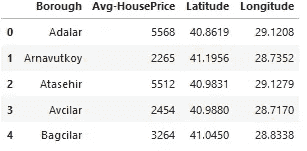

Master Data

我使用 python yellow library 来可视化伊斯坦布尔及其行政区的地理细节，并创建了一个叠加了行政区的伊斯坦布尔地图。我使用纬度和经度值得到如下的视觉效果:

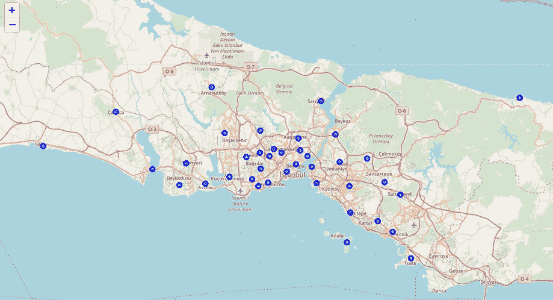

Borough of Istanbul

我利用 Foursquare API 来探索行政区并对它们进行分段。我根据给定的经纬度信息，为每个区设计了 100 个场地和 750 米半径的限制。这里是一个从 Forsquare API 列表场馆名称，类别，纬度和经度信息的标题。

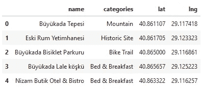

List of Venues

总的来说，Foursquare 返回了 43 个地点。这是一张行政区和场馆的合并表。

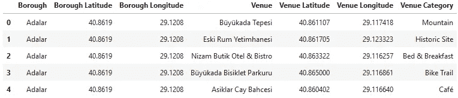

Table of Boroughs and Venues

我们可以看到卡迪科伊、马尔特佩、贝约格鲁、贝西克塔斯、西斯里和法提赫·豪达到了 **100** 场馆的限制。另一方面；Pendik、Arnavutkoy、Tuzla、Adalar、Buyukcekmece、Sultangazi、Cekmekoy、Beylikduzu、Sultangazi 行政区在 **20** 场馆下方，在我们给定的经纬度坐标中，如下图所示。

这一结果并不意味着在各个行政区都进行了调查。实际上，这取决于给定的纬度和经度信息，这里我们只是为每个区运行单一的纬度和经度对。我们可以用包含更多经纬度信息的邻居信息来增加可能性。

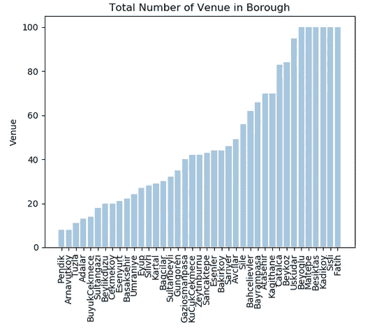

Number of venues for each borough

总的来说，Foursquare 返回了 256 个独特的类别，然后我创建了一个表格，显示了下表中每个区的前 10 个场馆类别。

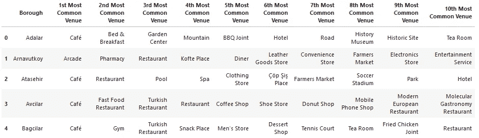

List of top 10 venue category

我们在行政区有一些共同的场地类别。出于这个原因，我使用了无监督学习的 K-means 算法来对行政区进行聚类。K-Means 算法是无监督学习中最常用的聚类方法之一。

首先，我将运行 K-Means 来将行政区聚类成 3 个**聚类，因为当我用肘方法分析 K-Means 时，它确保了 K-Means 的最佳 K 的 3 度。**

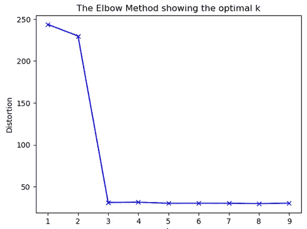

Elbow method to specify the best k value

这是我的合并表，每个区都有聚类标签。

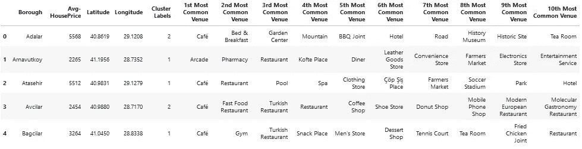

Merged Table with clusters

我们还可以估计每个集群中第一个最常见的场馆**的数量。因此，我们可以创建一个条形图，帮助我们为每个集群找到合适的标签名称。**

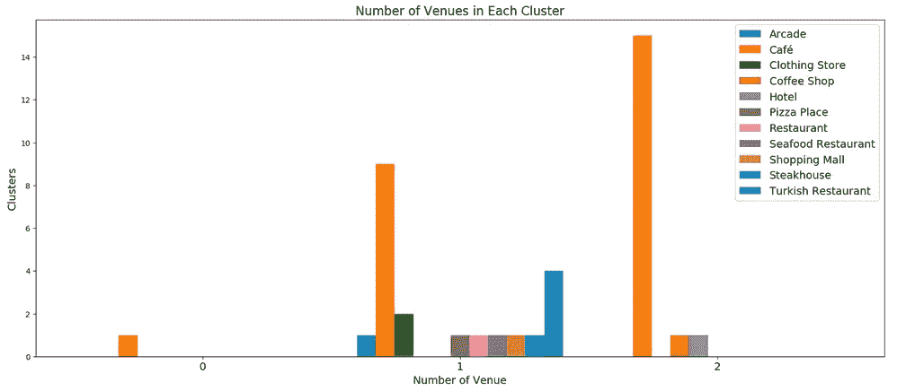

Number of venues in each cluster

当我们检查上图时，我们可以将每个集群标记如下:

*   群组 0:“咖啡馆场所”
*   群组 1:“多种社交场所”
*   第 2 组:“住宿和密集咖啡馆场所”

我们还可以考察一下，在不同的范围内，房屋平均销售价格出现的频率是多少。因此，直方图有助于可视化:

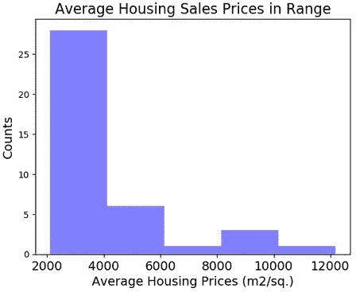

Average Housing Sales Prices in Ranges

如上图所示，我们可以将范围定义如下:

*   4000 AHP:“低级 HSP”
*   4000–6000 AHP:“中级 1 级 HSP”
*   6000–8000 AHP:“中级 HSP”
*   8000–10000 AHP:“高一级 HSP”
*   > 10000 AHP:“高-2 级 HSP”

我的目标之一是在地图上显示每个区的前 3 名场馆信息的数量。因此，我根据前 3 个场馆的数量对每个区进行了分组，并将这些信息组合在 **Join** 列中。

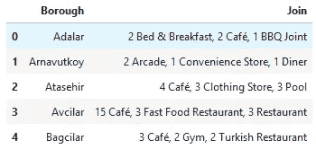

Number of top 3 venues for each borough

# C.结果

让我们将这些新变量与主**主表**中的相关集群信息合并。

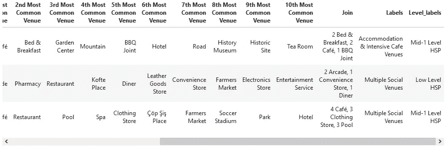

Master table

现在，您可以看到上表中的最后三列是 Join、Labels 和 Level_labels。你还可以看到伊斯坦布尔的一个聚集地图区

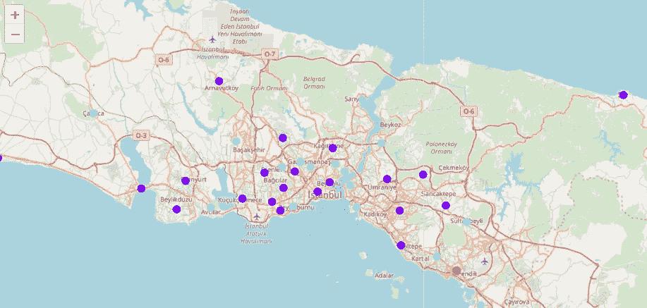

Clustered map boroughs of Istanbul

在总结部分，我的目的之一是用 choropleth 风格的地图可视化每平方米的平均房屋销售价格。因此，我首先从 NYU 空间数据库[2]下载了一个土耳其二级行政区划的 json 文件。我清理了 json 文件，只调出了伊斯坦布尔市。

在最后一部分，我制作了 choropleth 地图，上面有每个区的以下信息:

*   区名，
*   群集名称，
*   住房销售价格(HSP)水平，
*   场馆数量前三名

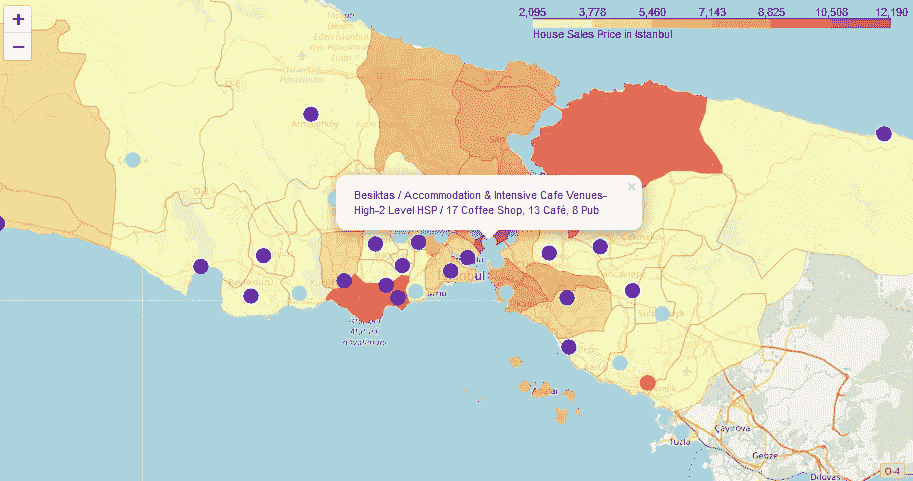

Choropleth map of Istanbul with final datas

# D.讨论

正如我之前提到的，伊斯坦布尔是一个在狭窄区域内人口密度很高的大城市。总共 39 个区的测量总数和人口密度可能不同。由于这种复杂性，在聚类和分类研究中可以尝试非常不同的方法。此外，很明显，并不是每种分类方法都能为这个大都市区产生同样高质量的结果。

我在这个聚类研究中使用了 Kmeans 算法。当我测试肘部方法时，我将最佳 k 值设置为 3。然而，只使用了 39 个地区坐标。为了获得更详细和准确的指导，可以扩展数据集，还可以钻取街区或街道的细节。

我还通过这些信息进行了数据分析，在 GitHub 上添加了地区坐标和房屋销售价格平均值作为静态数据。在未来的研究中，还可以从特定的平台或包中动态访问这些数据。

我通过在伊斯坦布尔地图上可视化数据和聚类信息来结束研究。在今后的研究中，可以通过网络或电话向直接投资者进行申请。

# F.结论

因此，人们开始转向大城市创业或工作。因此，人们可以通过访问提供此类信息的平台来获得更好的结果。

不仅对于投资者，城市管理者也可以通过使用类似的数据分析类型或平台来更有规律地管理城市。

# G.参考资料:

*   [1] [伊斯坦布尔—维基百科](https://en.wikipedia.org/wiki/Istanbul)
*   [2] [土耳其二级行政区划](https://geo.nyu.edu/catalog/stanford-nj696zj1674)
*   [3] [Forsquare API](https://developer.foursquare.com/)
*   [4] [来自“2018 年 Hurriyet 零售指数”的各区房屋销售价格](https://www.hurriyetemlak.com/Emlak-Endeksi/Detayli-Analiz/Istanbul)
*   【5】[谷歌地图](https://www.google.com/maps/)