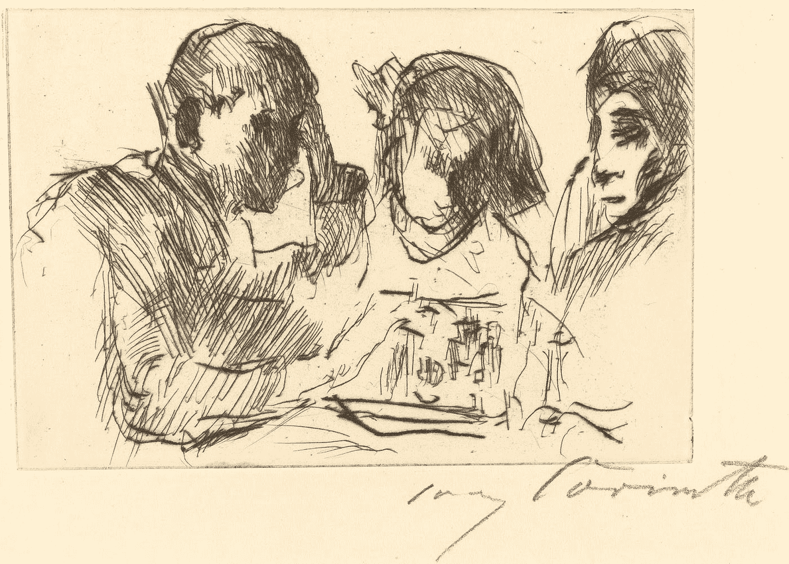
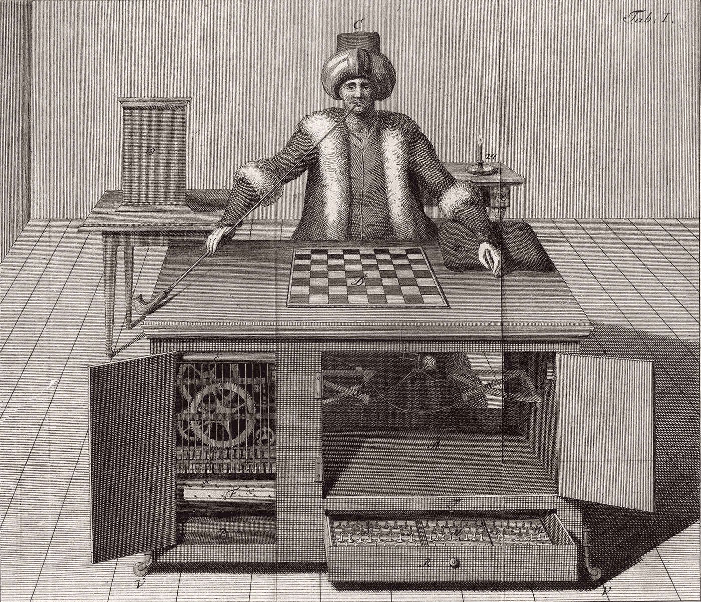
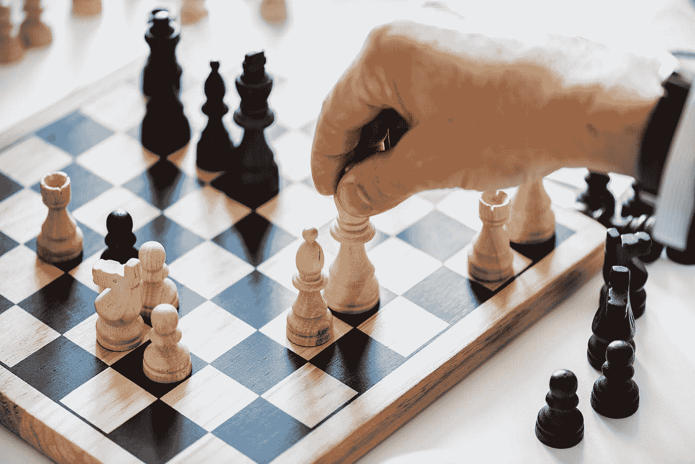

# 22 年的 AI 优势如何改变国际象棋

> 原文：<https://towardsdatascience.com/how-22-years-of-ai-superiority-changed-chess-76eddd061cb0?source=collection_archive---------9----------------------->

## 机器完美前沿笔记

德克·克内梅尔和乔纳森·福利特

Figure 01: The Game of Kings
[Illustration: “Chess Players” by Lovis Corinth (1918), National Gallery of Art]

1997 年，IBM 超级计算机“深蓝”在六局系列赛中以 4 比 2 的比分击败了国际象棋世界冠军加里·卡斯帕罗夫。这是我们称之为“思维机器”发展过程中的一个里程碑时刻，因为在当时世界上最负盛名的战略游戏中，计算机已经证明了自己比最优秀的人类更优秀。

数百年来，机器在国际象棋中击败人类的基准一直是*关注的焦点。众所周知，[1770 年研发的土耳其机器人](https://interestingengineering.com/the-turk-fake-automaton-chess-player)让像拿破仑·波拿巴和本杰明·富兰克林这样的名人激动又困惑。这只是一个精心设计的骗局，这个人力驱动的、不完全自动化的机器人愚弄了公众近 100 年。它的非凡之处不仅在于它似乎是一台自动机，还在于它是一台看似天才的自动机，能够在《王者游戏》中击败人类。从那时起，对能够在国际象棋中击败人类的机器的追求就一直持续着。事实上，第一波计算机科学先驱，像艾伦·图灵、克劳德·香农和约翰·冯·诺依曼，都是国际象棋选手，都试图编写能够掌握国际象棋的软件。*

Figure 02: A Chess Playing Automaton?
[Illustration: “The Turk” by Joseph Racknitz (1789), Humboldt University Library]

当深蓝打败卡斯帕罗夫的时候，计算机已经在国际象棋上打败了人类。在 20 世纪 80 年代，对于业余棋手来说，Radio Shack 牌电脑象棋可能是一个强大的对手，而且有各种技能水平。深蓝的成功是最高的成就，在这一点上，机器游戏完全超过了人类游戏，永不回头。大约 250 年后，我们终于有了一台比我们玩得更好的机器。

最近在围棋、扑克和 Dota 2 等游戏中出现的更多机器征服让最初的深蓝胜利显得过时了。但是有一个重要的区别。因为它发生在 22 年前，我们有 22 年的证据来考虑。深蓝的胜利确实改变了国际象棋，但不是以人们期望或预测的方式。机器和人类如何在国际象棋世界中共存，不仅为我们在围棋、扑克和 Dota 2 等游戏的未来，而且为机器智能将增强或取代人类智能的正常工作和生活环境提供了一个诱人的预览。虽然“深蓝”的技术与现代人工智能几乎没有共同点，但它是人类和机器将如何走到一起的实物课程。

## 机器比我们好…现在怎么办？

我们采访了认知科学家兼国际象棋大师克里斯托弗·沙布里斯，他在《继续游戏》中讲述了职业国际象棋的场景。*华尔街日报*的专栏，关于深蓝征服国际象棋以及这项运动如何改变，这要归功于 22 年来人工智能的进一步发展。Chabris 分享了深蓝 1997 年胜利的影响:“很多人预测这不可能发生，或者当时不会发生。所以，我认为卡斯帕罗夫的落选让人很惊讶。…一些人预测，不知何故这会毁了国际象棋，一旦计算机真的擅长某件事，那么人类就会失去兴趣，或者对人类来说，参与这项活动本质上是一项回报较少的活动。事实上，什么也没发生。接下来的一个月，国际象棋世界继续进行。我相信，如果我没有记错我的国际象棋历史，卡斯帕罗夫本人——在被那场比赛的结果明显摧毁，并说了一些他可能不是故意说的或后来并不感到自豪的过激话之后——在同年晚些时候，他回来了，用他有史以来最好的一些游戏赢得了一场强大的特级大师锦标赛。卡斯帕罗夫继续保持了三年多的世界冠军，我认为当他自己退役时，他仍然在排行榜上名列前茅。至少在受欢迎程度方面，国际象棋基本上还在继续。”

当然，今天，深蓝已经不再是世界上最好的国际象棋“棋手”，甚至远非如此。20 年后，你的智能手机拥有比 IBM 为深蓝设计的电脑更好的电脑。“拥有*一台可以打败世界冠军的计算机*，它被存放在 IBM 的一个研究实验室里，并没有真正改变很多事情，”Chabris 说。“但是让每个人都拥有一台可以打败世界冠军的电脑确实让事情发生了很大的变化。…手机现在被禁止参加国际象棋比赛，因为作弊太容易了。如果你参加锦标赛，如果你能走进浴室，看着你的手机，你就能赢得每一场比赛。”

## **改变游戏方式**

虽然考虑到将智能手机机器象棋偷偷引入竞争可能改变结果的所有方式很有趣，但人工智能已经在更深层次上影响了游戏的玩法。首先，让我们考虑防御策略的领域:“计算机擅长防御，因为它们会检查每个动作。他们不会因为自己处于不利地位、处于守势而受到情绪影响，”沙布里斯说。“他们会考虑每一种可能性，并尽可能长时间地进行分析。通过这样做，他们基本上表明了很多位置是可以防守的…防守比人们想象的更有可能。”

对我们许多人来说，耐心肯定是很难的。虽然人类可能喜欢积极的攻击计划，但计算机可能会采取完全不同的策略，专注于缓慢但稳定的改进，等待对手犯错。“保持压力直到另一个人成为第一个犯重大错误的策略——计算机显示，这些策略比我们意识到的要好，”Chabris 说。

电脑象棋已经影响了顶级游戏和教练。教练使用软件来帮助分析他们的学生和学员的游戏。顶级玩家都必须准备好让他们的对手玩从机器游戏中学来的独特的，甚至是不人道的动作。

Figure 03: Study, Learn, and Advance the Game
[Photo: by rawpixel on Unsplash]

## **一种新的学习方式**

机器象棋已经在许多方面改变了人们学习游戏的方式。在过去，书籍和杂志在一个人提高和掌握这项运动的道路上发挥了重要作用。“国际象棋仍然有大量的印刷文献，”Chabris 说。“事实上，现在出版的国际象棋书籍可能比过去任何时候都多，而且会有更多伟大的国际象棋书籍问世。”但是象棋书籍越来越不重要，因为强有力的玩家可以使用计算机来研究、学习和推进他们的游戏。电脑国际象棋程序可以评估你的游戏，计算最佳的步骤，并为你的游戏做注解。该软件不仅可以指出每一个错误，还可以告诉你错误的严重程度，并告诉你最好的行动应该是什么。“这就像一个真正的好教练，告诉你，‘你应该这样做。“你应该那样做，”沙布里斯说。“这对于改进非常有用，只要学习和看到这一点就行了。”

然而，计算机象棋仍然是一个不完美的系统，至少在人类学习方面是如此。“这并不能解释为什么你应该走那一步，”沙布里斯说。“这并没有解释你将来如何能更好地找到那些更好的动作。它只是说，“这是你的错误。这是你应该做的。…这是人类教练可能会做的事情。我认为最终计算机也能做到。这是一个投入研究努力的问题。“大多数人，大多数时候，不仅仅是通过看到正确的答案来学习。有一个学习的过程。但是，在计算机象棋现在被利用的方式中，完美和实时信息的两步前进伴随着失去最初最能让你学习的过程的一步后退。

在国际象棋软件中添加*为什么*这一层可能在这一点上需要人类的洞察力，但将人类的视角编织到软件中只是时间、金钱和意愿的问题。国际象棋教育市场可能没有足够的利润来让它在短期内发生，但可以肯定地说，向最终用户提供这种服务的软件没有技术障碍，只是对机器学习生成的分析软件的功能有所限制。

## **走向人机协作**

从更广泛的意义上来说，过去 22 年来国际象棋游戏的演变和国际象棋教育的进程，暗示了人类可能通过与智能机器合作来改变、适应和改进的方式。

在输给“深蓝”加里·卡斯帕罗夫(被许多人认为是有史以来最伟大的棋手)后，他开始接受机器象棋。他开创了一种叫高级国际象棋或半人马国际象棋的游戏，这种游戏涉及人类和计算机的合作。它从未真正流行起来，在更大的国际象棋社区中只是一个小插曲。

“人类的能力和计算机的能力之间的差异在什么时候变得如此之大，以至于将人类插入系统成为一个错误？”夏布利问道。“在早期，我认为卡斯帕罗夫的想法是，在国际象棋中，有些情况人类理解得更好，有些情况计算机理解得更好，因此最佳组合是让人类判断是否听从计算机的建议。”

“随着时间的推移，这一比例一直在缩小……到了你开始冒风险的时候，人类可能会认为他们知道得更多，而实际上他们并不知道——这有点像重写计算机，而事实上计算机会提供做出最佳举措的最佳机会。或者在更危急的情况下，计算机有最好的机会驾驶汽车，或降落飞机，或做出正确的医疗诊断。”

## **象棋 AI 的教训**

从计算机统治国际象棋世界的 22 年中，我们可以学到哪些更广泛的教训？“当计算机在智力活动中变得非常出色时，它不会扼杀这种活动。事实上，对人类来说，它甚至可能变得更有趣、更民主，因为它使高质量性能的可用性更加普遍，”Chabris 说。对 Chabris 来说，这种民主化在很多方面改变了游戏规则。在机器象棋出现之前，只有少数特权阶层能够在幼年时接受高质量的训练。“如今，你甚至不需要有那么多钱或者有一个教练，”Chabris 说。也许有点讽刺的是，人工智能象棋事实上已经为人类铺平了竞技场。

随着电脑象棋的不断进步，现在它已经成为游戏的一个公认的支柱，人们对它的态度也在改变。“‘哦，那是引擎移动’，或者‘那是计算机移动’。”这在国际象棋中是一种侮辱。“计算机移动是一个愚蠢的无意义的举动，计算机出于某种模糊的原因做出了没有任何意义的举动，”沙布里斯说。现在，一个计算机移动意味着一个移动是如此好，但如此不寻常，只有计算机会看到它，看到它有多好。"

当然，从机器互动中学习还有很长的路要走。“拥有一个近乎客观的预言或你认为客观的东西，并不是学习、提高和更好决策的唯一必要因素，”Chabris 说。"人类总是能够忽略，甚至是客观上好的想法、信息、观点等等."

“也许我们还需要更多地了解如何最好地利用这些工具，”沙布里斯说它们是新的。我们很久没见过他们了。我们需要真正学习如何……更好地使用计算工具，并更多地研究人与计算工具之间的关系。"

这些都是很好的提醒，人工智能自动化不是一件可怕的事情。它不会很快扼杀我们的工作，它需要时间从笨拙走向有效，更需要时间走向最佳。因为，正如我们所看到的，在人工智能和国际象棋中，无论玩家是人类还是机器，国王的游戏仍然是一个诱人的挑战。

[*Creative Next*](http://www.creativenext.org) *是一个播客，探索人工智能驱动的自动化对创意工作者，如作家、研究人员、艺术家、设计师、工程师和企业家的生活的影响。本文伴随* [*第一季第四集——AI 优势如何改变人类的努力。*](https://creativenext.org/episodes/how-ai-superiority-changes-human-endeavor/)