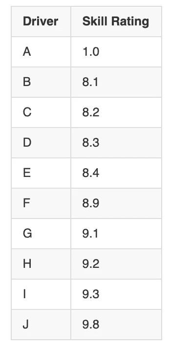
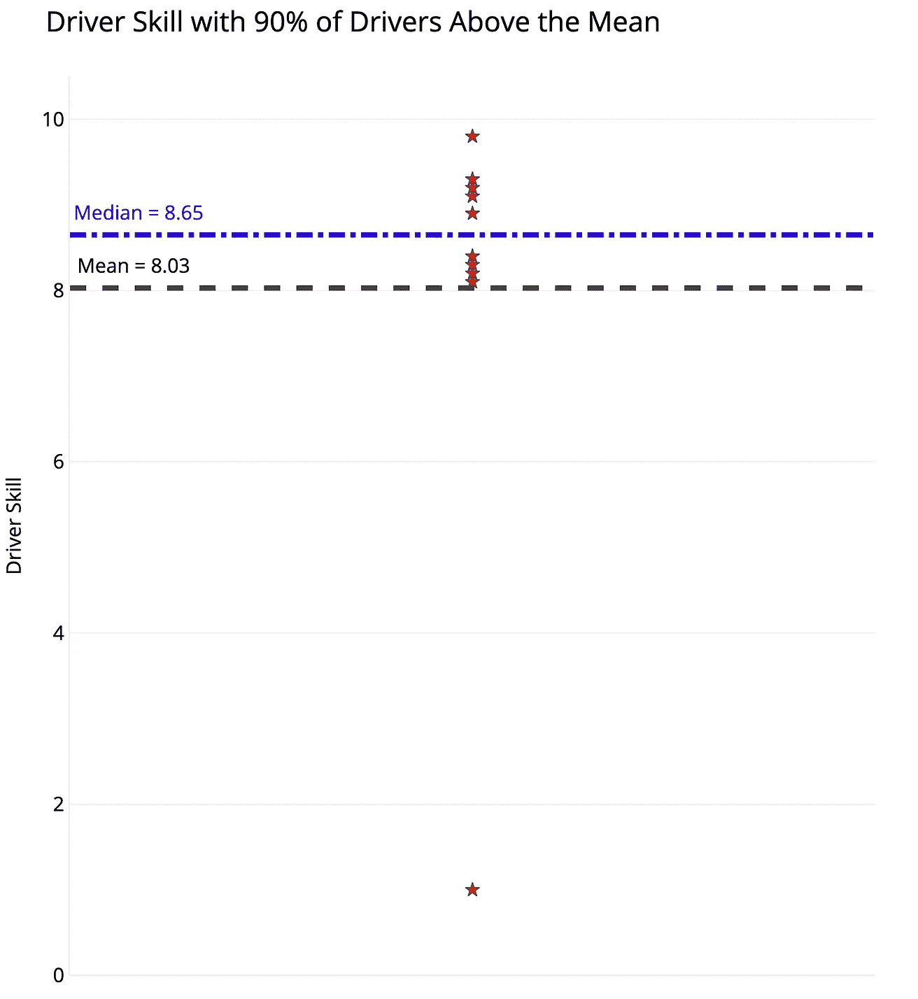
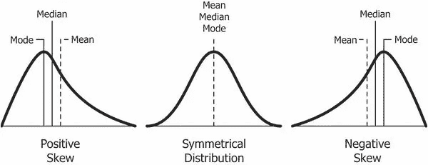
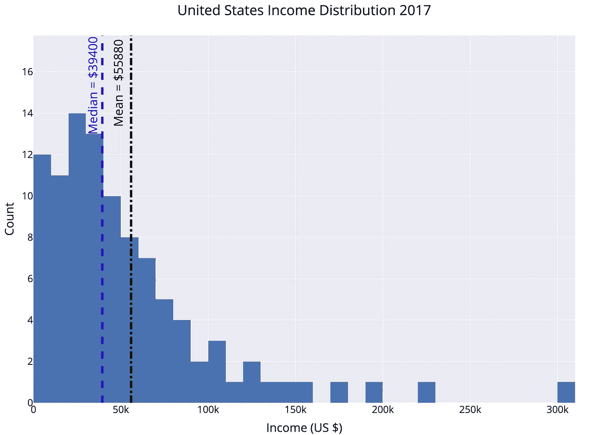
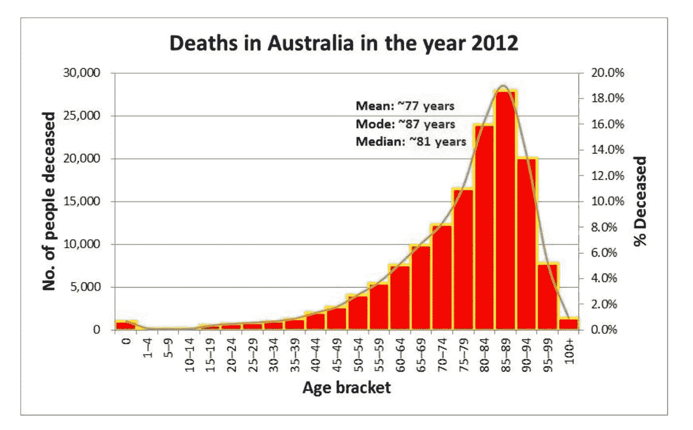
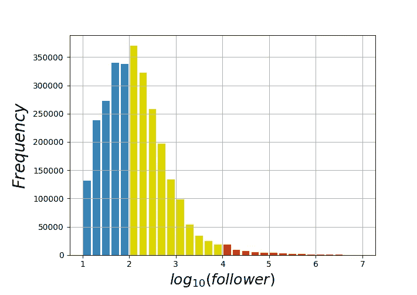

# 为什么 90%的司机可能“高于平均水平”，或者为什么在使用统计数据时需要小心

> 原文：<https://towardsdatascience.com/how-90-of-drivers-can-be-above-average-or-why-you-need-to-be-careful-when-talking-statistics-3df7be5cb116?source=collection_archive---------14----------------------->

([Source](https://www.pexels.com/photo/assorted-color-wooden-house-on-mountain-789380/))

## 现实世界中的均值、中位数和偏态分布

大多数人看到“90%的司机认为自己高于平均水平”的标题，会想“哇，*其他人*在客观评价自己方面很糟糕。”你应该想的是“如果我们在一个严重负偏态分布中使用*均值*来表示平均值，这听起来并不那么难以置信。”

尽管像这样的[标题](https://www.edsurge.com/news/2018-05-24-most-professors-think-they-re-above-average-teachers-and-that-s-a-problem)经常被用来说明[优越感](https://en.wikipedia.org/wiki/Illusory_superiority)(人们[高估了自己的能力](https://www.apa.org/monitor/feb03/overestimate))它也提供了一个有用的教训，在你谈论数据统计时澄清你的断言。在这种特殊情况下，我们需要区分一组值的 [*平均值*和*中值*](https://www.purplemath.com/modules/meanmode.htm) 。根据我们问的问题，有可能 9/10 的司机高于平均水平。这里有数据可以证明:

Driver Skill Dataset and Dot Plot with Mean and Median

区别在于，我们是使用平均值*还是中位数*来表示“平均”驾驶员技能。使用平均值，我们将所有值相加，然后除以值的数量，得到该数据集的 8.03。由于 10 名驾驶员中有 9 名的技能等级高于此，因此 90%的驾驶员可被视为高于平均水平！

相比之下，中位数是通过将值从最低到最高排序并选择一半数据点较小、一半数据点较大的值来确定的。这里是 8.65，下面 5 个司机，上面 5 个司机。根据定义，50%的司机低于中位数，50%超过中位数。如果问题是“你认为自己比其他 50%的司机强吗？”比 [90+%的司机不能如实回答肯定。](https://gigaom.com/2014/08/19/93-of-us-think-we-are-above-average/)

(中值是百分位数的一个特例，在这个值上，给定的数字百分比更小。中位数是第 50 个分位数:数据集中 50%的数字更小。我们还可以找到第 90 个分位数，其中 90%的值较小，或者第 10 个分位数，其中 10%的值较小。百分位数是[描述数据集](https://pandas.pydata.org/pandas-docs/stable/reference/api/pandas.DataFrame.describe.html)的直观方式。)

## 为什么这很重要？

这可能看起来是一个人为的例子或技术细节，但平均值和中间值不一致的数据[在现实世界中经常出现](https://sciencestruck.com/types-of-skewed-distribution-with-real-life-examples)。当值对称分布时，平均值等于中值。然而，现实世界的数据集几乎总是有一定程度的偏差，无论是正的还是负的:

Positive, symmetric, and negative skews. [(Source)](https://www.google.com/url?sa=i&source=images&cd=&cad=rja&uact=8&ved=2ahUKEwjF_OTDur7jAhVwmuAKHUbnD90Qjhx6BAgBEAM&url=https%3A%2F%2Fcodeburst.io%2F2-important-statistics-terms-you-need-to-know-in-data-science-skewness-and-kurtosis-388fef94eeaa&psig=AOvVaw1BPBjo4PiSITF4axKZ9hcR&ust=1563538846161292)

在正偏态分布中，平均值大于中位数。当图表上端相对较少的异常值使图表向右倾斜，而大多数值聚集在较低值时，就会出现这种情况。真实世界的情况是个人收入，平均收入明显大于中值收入。下图显示了 2017 年美国的收入分布，以直方图的形式显示为 100 个百分点。

Income distribution in the United States, a positively skewed distribution

具体数字因来源不同而有所不同([该数据来自这里](https://dqydj.com/united-states-income-brackets-percentiles/))，但总体模式是清晰的:少数高收入者将图表向右倾斜(正值)，使平均值高于中位数。价值 55880 美元，平均值接近第 66 百分位。解释是 66%的美国人收入低于平均国民收入——当平均收入被认为是平均数时！这种现象几乎在每个国家都会发生。

负偏态分布的一个例子是死亡年龄。不幸的是，在这个数据集中，有一些人在相对年轻的时候死亡，降低了平均值，并使图表向左倾斜(负向)。

Age at death in Australia, a negatively skewed distribution [(Source)](http://www.tussursilk.com/tag/skewed-distribution/)

在负偏斜的情况下，中值大于平均值。结果是，当平均值被定义为均值时，更多的人可以在“平均值”之上。“大多数人比平均寿命更长”可能是一个奇怪的标题，但如果你仔细选择你的统计数据，你就可以让它成真。

大多数涉及人类行为的数据集都表现出某种偏斜。股市回报、收入、社交媒体关注者、战斗死亡和城市规模都是高度偏斜的分布。在*反脆弱* , [纳西姆·塔勒布](https://en.wikipedia.org/wiki/Nassim_Nicholas_Taleb)将这个扭曲结果的世界[描述为极端主义](https://kmci.org/alllifeisproblemsolving/archives/black-swan-ideas-mediocristan-extremistan-and-randomness/)。我们在 mediocristan 进化，所有的数据集都是正态分布的，但我们的现代生活现在被不平等分布所主导。生活在极端的地方有机会获得难以置信的回报，但这些只会发生在极少数人身上。这也意味着我们在谈论作为数据集“平均”表示的均值和中位数时必须小心。

DIstribution of Followers ([source](https://www.google.com/url?sa=i&source=images&cd=&cad=rja&uact=8&ved=2ahUKEwinz9jmgr_jAhWMneAKHYzOAkkQjhx6BAgBEAM&url=https%3A%2F%2Fwww.researchgate.net%2Ffigure%2FDistribution-of-the-number-of-followers-denoted-as-n-f-across-all-Weibo-users-We_fig2_316617734&psig=AOvVaw344DELPIhEN6dzawiErju_&ust=1563558251551513)) on social media, a positively skewed distribution.

( [Zip 定律](https://io9.gizmodo.com/the-mysterious-law-that-governs-the-size-of-your-city-1479244159)和其他幂定律也会产生偏态分布。)

# 结论

要记住的一点是，当你指定“平均值”时，你需要澄清你是在说平均值还是中位数，因为它有区别。世界不是对称分布的，因此，我们不应该期望分布的平均值和中位数是相同的。

机器学习可能会得到所有的关注，但数据科学真正重要的部分是我们每天使用的部分:帮助我们理解世界的基本统计数据。能够区分平均值和中值可能看起来很平常，但这比知道如何建立神经网络更与你的日常生活相关。

一如既往，我欢迎反馈和建设性的批评。可以在 Twitter [@koehrsen_will 上找到我。](http://twitter.com/@koehrsen_will)