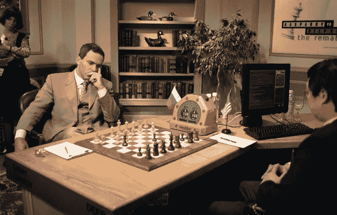
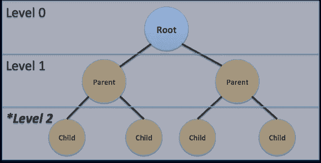
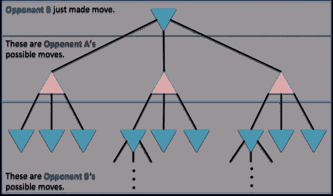
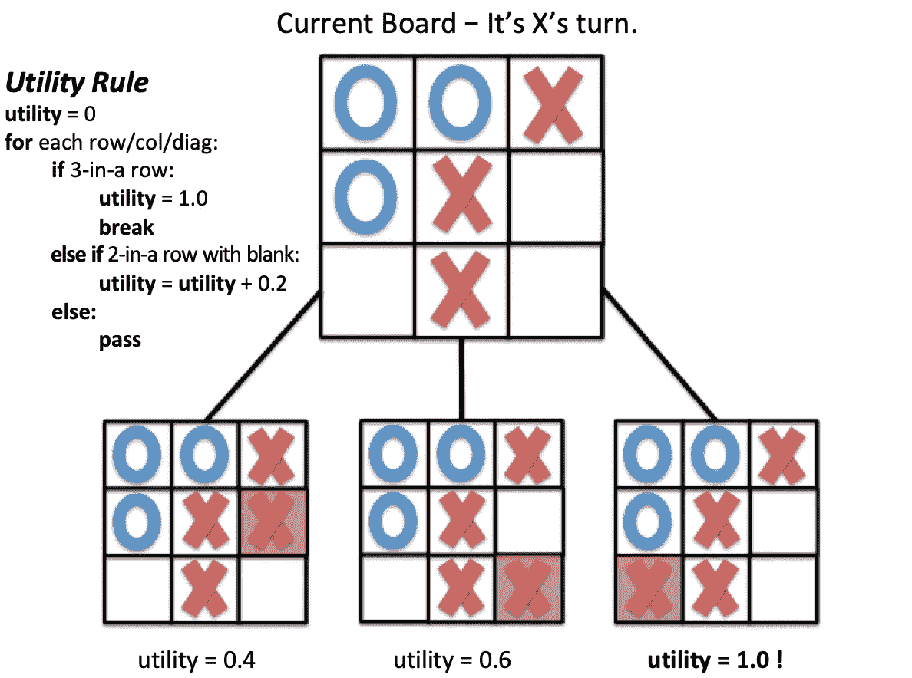
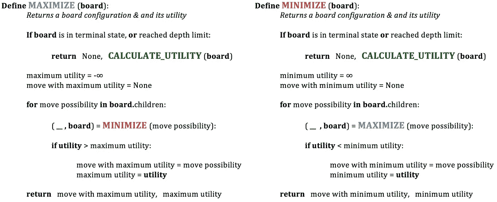
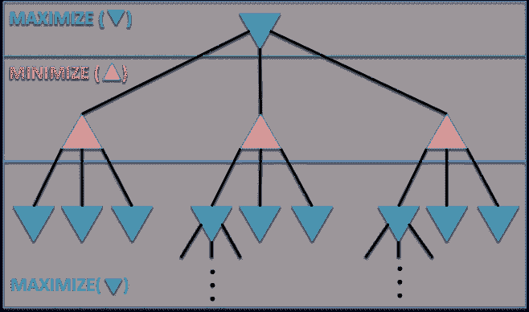
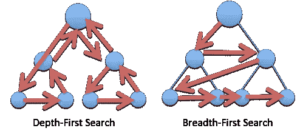

# 博弈论——解释了极大极小算法

> 原文：<https://towardsdatascience.com/how-a-chess-playing-computer-thinks-about-its-next-move-8f028bd0e7b1?source=collection_archive---------4----------------------->

## 1997 年，一台名为“深蓝”的计算机击败了国际象棋世界冠军加里·卡斯帕罗夫——这是人工智能理论史上的一个决定性时刻。

但是国际象棋计算机问题背后的伟大头脑在近 60 年前就已经开始发表这方面的文章了。被称为现代计算机科学之父的艾伦·图灵被认为是引发了追溯到 20 世纪 40 年代的调查。

1997 chess match between world champion Garry Kasparov and IBM computer “Deep Blue”

国际象棋计算机问题被考虑的时间跨度之大，证明了解决方案的复杂性。教科书已经被写在计算机象棋问题上，并且许多复杂程度不同的策略已经被测试。然而，本文将关注计算机在各种战略游戏中使用的一种通用决策策略，包括国际象棋、跳棋、曼卡拉棋、井字游戏等等。

这个一般策略包含在博弈论中广泛使用的算法中，称为极大极小算法。本文将简要介绍计算机如何使用极大极小算法来决定下一步行动，但首先我们需要定义一些东西:

# **游戏树**

在计算机科学中，树是指一种嵌套的数据结构，其中我们从一个“根”节点(第 0 层)开始，从这个根节点开始分支，我们可以有任意数量的“子”节点(第 1 层)。假设这些“子”节点分支成“孙”节点(第 2 层)。现在我们可以说，从第 2 层节点的角度来看，第 1 层的节点是“父”节点，第 2 层的节点是“子”节点。

A schematic of a binary tree from the perspective of Level 2

直观地说，我们可以看到这种数据结构有无限多层次的潜力。在棋盘游戏中，我们可以将根节点(第 0 层)视为棋盘的当前状态，而第 1 层的节点则视为*棋盘的每一种*可能状态，这取决于下一步该怎么走。换句话说，1 级节点负责每一个可能的下一步行动。

## **展望游戏的未来**

在多人游戏中，我们可以想象一个游戏树，其中的根节点是对手 B 走一步后棋盘的当前状态，轮到对手 A 了。因此，第 1 层包含代表对手 A 可能的移动的节点，第 2 层包含代表对手 B 在第 1 层中可能进行的每一次移动的节点。

如果我们继续这样做足够长的时间，我们完全可以描绘出游戏的未来。在某种意义上，上面的示意图过于简单，对手在任何给定的回合中只有 3 种可能的移动。通常情况下，例如在国际象棋中，可能的走法数量会非常非常多，导致我们的博弈树突然变得复杂。事实上，国际象棋的平均分支系数约为 35。

# 效用

效用可以被认为是一种根据每一个可能的移动可能导致的胜利来“打分”的方法。效用如何计算完全取决于程序员。它可以包含各种各样的因素，并在程序员认为合适的时候对它们进行权衡。例如，棋盘上空格的数量，对手当前棋子的位置，我们当前棋子的位置，我们离胜利的阵型有多近，等等。所有这些都可能是在计算某一特定移动的效用时要考虑的因素。让我们以井字游戏为例，它可以有相对简单的效用度量。下图显示了游戏中途的井字游戏棋盘，其中有一个非常简单(可能不是最优)的效用规则。我们可以看到，轮到了 *X* ，只有 3 个可能的移动，因此，有 3 个子节点。对于每个可能的移动，使用下面的效用规则计算效用。用简单的英语来说就是:

*“对于每一行、每一列和每一条对角线，如果我们在一行中有 3 个 X，我们就赢了这场游戏，应该分配 1.0 的效用。如果我们有一行、一列或对角线上有 2 个 X 和 1 个空白正方形的场景，我们的效用应该是发生这种情况的场景数的 0.2 倍。”*

我们可以看到获胜的棋盘具有最大的效用，所以我们的效用规则并非完全无用，尽管它肯定会受益于“防御”成分，这将考虑 *O* 离获胜有多近。

接下来，我们将把这些碎片放在一起，看看计算机如何“思考”它的下一步行动。假设轮到电脑了。决定下一步走哪一步的一个可能的方法是简单地计算每个可能的下一步的效用，并选择效用最高的一步。这通常是普通人在玩棋盘游戏时的策略，当然，游戏也可以通过这种方式获胜。

但是大师和普通人的区别在于他们有能力提前思考几个步骤。事实证明，计算机做这件事的效率比最好的国际象棋大师还要高。以下是如何…

# **极大极小算法**

在开始之前，我们将对我们的游戏做两个假设:

1.  人类玩家应该在最佳状态下比赛，或者努力获胜。随意移动或试图失败实际上可能会干扰算法的有效性。
2.  该游戏必须是纯战略性的，不能包含任何形式的机会成分(*即*大富翁、扑克、俄罗斯方块)。*注:该算法的变体可用于说明“运气因素”。*

该算法的前提是，计算机将通过评估棋盘在几个回合后的效用来计算下一步最佳棋。在这样做的时候，计算机假设对手*总是*选择最好的移动，最小化计算机的效用。当然，这不是一个安全的假设，但你瞧，不管怎样，它往往会很好地工作。

需要注意的一点是，当我们说“效用”时，我们总是从计算机的角度来指效用。例如，当人类玩家做出最好的移动时，我们说该回合的效用最小化。

该算法包含三个基本函数:*最大化*和*最小化*，以及一个*效用计算*函数*。*伪代码看起来像这样:

现在没必要太纠结于细节。该示意图的两个关键要点是:

1.  该算法是递归的，因为*最大化*调用*最小化*，而*最小化*调用*最大化*。
2.  我们有打破递归循环的条件。例如，如果我们到达我们搜索空间中的一个节点，其中有人赢得了游戏，棋盘已满，或者最常见的情况是，我们已经达到了预定的深度限制，就会发生这种情况。

回到轮到计算机的场景，计算机将调用当前棋盘上的*最大化*功能。这将在棋盘的每个子棋盘上调用*最小化*，这将在每个孙棋盘上调用*最大化*，以此类推…

该算法执行我们在计算机科学中称为“深度优先搜索”的操作。这意味着它主要沿着树的整个长度垂直遍历*，直到到达终端节点，然后再向上返回。其次，该算法在其他兄弟节点之间水平移动*、*或。这与“广度优先搜索”形成鲜明对比，后者的作用正好相反——它首先在兄弟节点之间水平移动*，一次搜索整个“层”,然后沿着树向下搜索。下面的示意图有助于说明这一概念:**

**

*极大极小算法以深度优先的方式沿着树向下移动，直到它到达终端节点(*即*某人赢得游戏)或预定的深度限制。深度限制是为涉及复杂搜索空间的游戏设置的，在这种情况下，在合理的时间内搜索整个可能的移动网络是不可行的。一旦到达终端节点或深度限制，调用*效用计算*函数，计算出该特定端子板的最终效用值。*

*然后，该效用值被“向上传递”到父节点，在父节点处，该效用值与父节点处的当前效用值进行比较(如果已分配)。如果父节点处于*最大化*循环*、*中，如果终端节点效用值大于父节点处的当前值*或*，则该终端节点效用值替换父节点处的效用值，父节点尚未被分配效用值。如果父节点在*最小化*循环中，则相反。*

*直觉上，我们可以思考这个循环是如何反复递归发生的，直到我们能够用效用值填充下一个移动节点(第 1 层)。这些是允许计算机做出决定的。下面的剪辑可能有助于形象化这个概念。*

**

*Note: The “best” next move returned by the algorithm is the move that corresponds to the utility value passed all the way up the tree to the root node (current state of the board).*

*但是我们*实际上*在做什么，这如何帮助计算机做出决定？计算机实际上应用了以下逻辑:*

> ***你的下一步棋只有对手的下一步棋弱的时候才算强。***

*从表面上看，我们也许能够识别出什么看起来像是一个强有力的行动；然而，如果这个强有力的移动导致对手更强有力的移动(击落我们的设施)，那么我们最初的移动真的很强吗？*

*这是算法背后的思路，应用于我们的树的几个层次。我们计算未来某处可能的移动的效用，并决定这些效用是否应该代表我们当前的移动选项。如果对手(总是试图最小化效用)很可能会采取所有的行动将我们引向所述未来点，我们应该将该特定的未来效用值沿树向上传递，以表示我们当前的决策节点。*

*这就是它的要点。当我们想到相对复杂的游戏，有巨大的搜索空间和各种各样的策略时，如果计算机能够预测未来，我们就很幸运了。但是历史一次又一次地表明，只要我们的效用规则是有效的，这种总体策略仍然比单独的人类脑力更有效。*

*国际象棋是一种复杂的游戏，具有相当复杂的效用度量和巨大的搜索空间。将上述逻辑应用于国际象棋比赛可能足以让你头晕目眩，这就是为什么这个问题花了几十年(可以说是几十年)才得以解决。但是，编写国际象棋计算机程序的基本原则与上面简化的例子基本相同——观察未来可能的走法，决定这些走法有多好，并预测对手是否会采取所有正确的走法来引导你到达那里。*