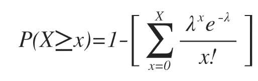
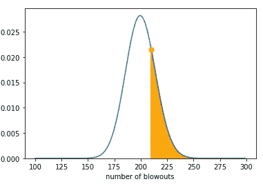

# 数据科学家如何购买延期保修

> 原文：<https://towardsdatascience.com/how-a-data-scientist-buys-extended-warranties-fac4ad3ea8de?source=collection_archive---------10----------------------->

## 深入了解“延长保修”的数学原理

这是我关于利用数据买车的帖子的“第二部分”。
如果你还没看过，那就来看看 [*这里*](/how-a-data-scientist-buys-a-car-822fffbe384d) *。*

**简介**

我们都经历过。我们刚刚承诺购买那辆闪亮的新车，而且我们即将毫发无损地把它开出大楼。
但是，等一下，在我们在虚线上签字并骑行到日落之前，我们还要与“财务”人员再开一次会*(也就是一长串推销的最后一行)*。
他们将为您提供一整套延长保修选项，以保护您的新*虚拟资产。* 这些是汽车经销商最大的赚钱者，令人惊讶的是有大量的数学数据支持它，这就是我们打算探索的。

**一个简单的案例**

假设你正坐在当地汽车经销商的财务办公室里，准备完成一笔交易。

> 你的轮胎获得了延长保修，每月只需花费 7 美元。

它涵盖了从你在车道上碾过一个钉子并需要一个补丁到完全爆胎需要一个全新轮胎的所有事情。

> 你应该接受这笔交易吗？值得吗？对经销商有什么好处？

这是一个概率游戏，为了简单起见，我们将使用一些相当合理的预期概率，这些概率是我经过数秒钟的思考后得出的。比方说，一年中有 5%的几率轮胎完全爆裂，30%的几率只需要修补。假设更换一个轮胎的平均成本是 200 美元，补片的平均成本是 20 美元。

**这对代理商有什么好处？**

为了回答经销商为什么会提供这笔交易以及他们期望从中赚多少钱的问题，我们可以开始用数学公式来表示。

> 假设经销商一年销售 1000 份延长保修。

为了计算出经销商将产生多少成本，我们可以使用以下基本概率概念，其中 E(x)是经销商需要维修的预期车辆数量。

通过一些基本的运算，我们现在可以得到下表:

因此，在一年内，经销商预计从 1000 笔此类交易中获得 68，000 美元的利润***(难怪销售人员如此咄咄逼人)* **。****

**但到目前为止，这不是很有趣，看起来更像会计而不是数据科学。**

## **这是数据科学家开始考虑概率分布、均值方差、模拟、极端情况、数学关系、拐点等等的地方。**

## ****但首先是一些来自统计课的回顾。****

**这个，**

****

**Binomial distribution**

**是一个分布(确切地说是*二项式*分布)。分布有各种形状和大小。有些有定义它们的名称和功能，有些没有。**

***你如何解读这种分布？*
*y 轴上的值代表观察到 x 轴上对应值的概率。*
我意识到令人困惑。
最容易理解的方法就是通过一个例子。
假设你掷一枚**公平硬币** 100 次*(公平硬币的意思是:正面或反面的概率是 0.5)。*
你觉得你会得到几个人头？当然，预期的头数是 50。
但你我都知道，你完全有可能得到 54 或 43 或 61 分。
但是 95 头呢？这可能吗？肯定是可能的，*但是可能吗？***

**如果你将一枚硬币抛 100 次，得到 95 个正面，常识将会起作用，你会认为这枚硬币必须有重量。你的担心是正确的，因为在 100 次抛硬币中获得 95 个正面的概率是 5.939138117904783 e-17*如果你不能将这个科学数字转换为人类数字，别担心，它真的很小。 *(翻译:大概不会发生)*。***

******

*****这个概率在*二项式*分布图中表示。**
我现在加了一个**橙 X** 代表获得 95 个头的概率。
看到 x = 95 时 y 轴上的蓝线有多低了吗？
*大约就是 0。这告诉我们，基本上 100 次翻转中有 95 次正面朝上的概率是 0 %(从技术上讲，这种情况可能发生，但极其罕见)。****

## ***谁在乎硬币呢？让我们来谈点真实的东西吧！***

***如果我们用一个更真实的例子来代替掷硬币的例子，会怎么样呢？).***

***为了解决这个问题，我们将使用一种不同的分布，即*二项式*分布的派生物— ***泊松分布******

*****为什么使用泊松分布而不是*二项式*？**
不需要太多的细节，我们可以用它们来回答相同类型的问题，但是在这个特殊的例子中，*泊松分布*比*二项式给了我们一些自然的好处。主要是因为它不是二进制的，因此我们不局限于每个时间段只有一个 0 或 1。
为了证明这一点:
如果我想将我的时间段定义为一年，那么一名车手完全有可能出现不止一次爆胎或补胎。*泊松*分布允许我建模，而如果我使用*二项式*分布，那么我需要缩短我的时间周期，这样就只有一个可能的井喷或补丁。这可能是不可能的，或者至少不太容易，因为你可能会违反模型中的一些假设。这些原因使得*泊松*分布成为“罕见事件”建模的更自然和更常见的方法——如补丁和井喷。
如果你想了解更多关于*泊松*和*二项分布有多么相似，这里有一篇很棒的[文章](/poisson-distribution-intuition-and-derivation-1059aeab90d)。*****

***现在回到我们的问题。***

> ***问题 1:给定补丁(0.3)和井喷(0.05)的概率，***
> 
> ***车行未能盈利的概率有多大？***

***在进行任何分布建模之前，我们需要了解作为利润函数的补丁和井喷之间的关系。之前，我们计算了汽车经销商的预期利润，结果是 68，000 美元。现在我们要问的是，所有利润被成本吞噬的可能性有多大？首先，让我们看看一家汽车经销商需要进行多少次修补和爆胎维修才能达到收支平衡。这可以通过下面的等式来定义。***

******

***84,000 is the expected revenue***

***然后，我们可以重新排列等式，并绘制下面的线。***

******

***粉色阴影区域显示了代理商可能会亏损的空间。给这个已经很棒的图添加一些有趣的东西是当前的期望值。***

******

***两条黑色实线显示了漏白数(垂直线)和补片数(水平线)的期望值，两者的交点显示了联合期望值。
因此，我们已经开始看到，平均而言，代理商不会处于粉色区域，因此他们不会亏损。***

> ***但是就像硬币的例子一样，我们知道期望值不一定是现实生活中发生的。***

***那么，经销商有可能赔钱吗？(有没有可能我们会在粉色阴影区域结束？)
一探究竟。
这就是我们的老朋友*泊松分布*出现的地方。***

******

*****PMF of the Poisson Distribution*****

***上面的函数是*泊松*分布*的*概率质量函数*(废话连篇的数学废话——这只是意味着如果我们插入数字，我们就会得到概率)*
让我们以下面的例子为例:***

> *****p =** p(爆胎)= 0.05
> **n** =售出保修数量 x 每辆车轮胎数量= 1000 x 4
> **x =** 210***

***一年中正好有 210 次井喷的概率是 0.0215。***

******

***Probability of getting exactly 210 blowouts in a year***

***这个数字可能看起来很低，因为 210 非常接近预期值 200，但请记住这是得到**确切的** 210 井喷的概率。如果我们想回答至少得到**210 次井喷的问题，那么我们可以简单地计算橙色柱右侧每个值的概率，然后将它们相加。
*(专业提示:鉴于这个分布没有真正的上限，通常更方便的做法是将橙色条左边的所有概率相加，然后从 1 中减去它们)*。
数学上看起来是这样的:*****

******

***如果我算出这一点，那么至少发生**210 次井喷的概率将是 **0.249** ，从图形上看，这一概率由下面的橙色阴影区域表示:*****

******

***See how the orange shade is about 25% of the area under the curve?***

> ***用简单的英语来说，这是什么意思？
> 大约有 25%的可能性，代理商一年内将不得不修理至少 210 次爆裂。***

*****现在让我们展开*****

***由于**爆裂**只是代理商必须支付的一种方式，我们需要对**补丁**做同样的事情。当我们得到两个概率时，我们可以创建一个联合概率，这意味着我们把它们相乘。
这在数学上可以写成:***

******

***假设我们对一年内至少 210 个**井喷**和至少 1500 个**补丁**感兴趣。得到的联合概率是 **0.000498。*****

> *****再说一遍，这用通俗的英语来说是什么意思？**
> 基本上，经销商一年内不得不修理至少 210 次爆裂和至少 1500 次修补的可能性不到 0.01%。***

***但是为了真正开始讲述一个故事，我们需要对补丁和井喷的所有组合都这样做。
我们可以将我们之前创建的利润边界两侧的这些联合概率相加，以计算出代理商亏损的总概率。***

***在实践中，我将使用上面的*泊松公式*，计算在*白色*区域中所有组合的精确联合概率(蓝线以下的一切)，然后从 1 中减去该总和。***

***为了形象化这一点，我创建了一个热图，显示每个组合的联合概率。***

******

***Heatmap: P(blowout)P(patch)***

***画面开始变得相当清晰。由于所有的密度都在蓝线的“赚钱”一侧，代理商似乎不太可能会赔钱。
但为了确保万无一失，我们将对利润边界左侧的所有值求和，并从 1 中减去总和。***

> ***结果是 **4.000000330961484e-10。
> *耶……我认为他们在这些交易中不会亏钱。******

> ***问题 2:作为客户，我应该购买延保吗？***

> *****这真的是我们都关心的问题。
> 刚买了车，该不该买质保？*****

***我们刚刚证明了这对代理商来说确实是一笔好交易，但这并不一定意味着对您不利(生活中有些事情是互惠互利的)。***

***所有的数学计算都是多余的，因为我们实际上是在问和以前一样的问题，只是时间倒过来了，空间小了很多。所以我们将跳过细节。***

***只购买一份保修服务，你需要付出什么才能让你的钱物有所值？
我们需要做的就是计算出多少**爆裂**和**补丁**会让你的成本(如果你没有购买保修)超过保修的成本***

******

***为了解释这个图表，作为一个例子，你可以说，如果我有至少 3 个爆裂和至少 0 个补丁，那么我应该购买保修。但是发生这种事情的可能性有多大呢？***

***我现在可以应用我的老朋友*泊松*分布公式来得到与每个概率相关的概率，然后将它们加在一起。***

***你赔钱的最终概率是 **0.00144*****

> ***最终翻译:
> 你或许可以跳过保修***

***这种方法的美妙之处在于，你可以根据自己的需要调整概率，自己动手计算。***

***老实说，现实生活比我在这里介绍的要复杂得多。还有无数的其他变量可以考虑。***

> ***可能你开车比一般人多。也许你经常在建筑工地或土路附近开车。也许你是一个比大多数人都糟糕的司机，会在路上撞倒东西。***

***我的观点是，可能会有这样的情况，购买保修是值得的，因为你发生这种事件的概率高于平均水平*(或者你不喜欢钱——这也是一个有效的理由)。但是我想我们已经证明了，总的来说，你最好不要在最后的账单上提供保修。****

*****生活小贴士*****

******生活提示数字 1***我知道你在想什么。
*我的房子被飓风摧毁的概率有多大？我不记得堪萨斯的最后一场飓风了。这证明我的国营农场代理人一直在敲我的竹杠。* 踩刹车一秒钟(双关语)，一个好的经验法则是问自己***

> ***自我，最极端的灾难性事件对我的生活有重大影响吗？***

***如果答案是肯定的*(比如你的房子被烧毁)*那么很可能值得你花钱投保。
但是如果答案是否定的*(你有一套公寓)*那么也许不值得。***

******生活小贴士第二条*** 当你面临抉择，你不确定自己是否被骗了，而且这件事不会改变你的生活时，你可以用这个快速的“*信封背面*”计算来决定你是否应该买。***

******

***也就是说，如果期望值小于成本，那么你就通过了。***

*****感谢阅读！
我希望你在延长保修的冒险中取得成功，并记住下次你买车并面临购买保修时，只需要求将 lambda 参数插入到你的*泊松*分布计算器中。如果你想独自跟随，你可以在这里找到 Jupyter 笔记本。*****

> ***额外问题:当你改变概率时会发生什么？***

***这个问题真的会把我们送进兔子洞，因为可能会发生大量的变化和可能性。但我认为很明显，如果补丁和/或井喷的概率增加，这将使我们的联合概率热图上的*黑暗区域越来越接近盈利边界。但是经销商当然不会吃亏，他们只会提高保修的价格。如果每月花费 8 美元而不是 7 美元，您会动摇而不购买它吗？大概不会。****

***为了证明这一点，我将给你们留下一个有趣的图表，它展示了井喷的概率和泊松期望之间的关系。随着井喷的可能性增加，一年中预期的井喷次数越来越接近经销商在赔钱之前可以处理的最大井喷次数，在某一点上，它实际上跨越了几乎保证经销商会赔钱的界限，这当然会迫使他们提高价格。***

******

***Distributions with varying values of P(blowout)***