# 深度学习新手团队如何在 kaggle 竞赛中获得第三名

> 原文：<https://towardsdatascience.com/how-a-team-of-deep-learning-newbies-came-3rd-place-in-a-kaggle-contest-644adcc143c8?source=collection_archive---------6----------------------->

## 利用 fast.ai 对油棕林图像进行分类

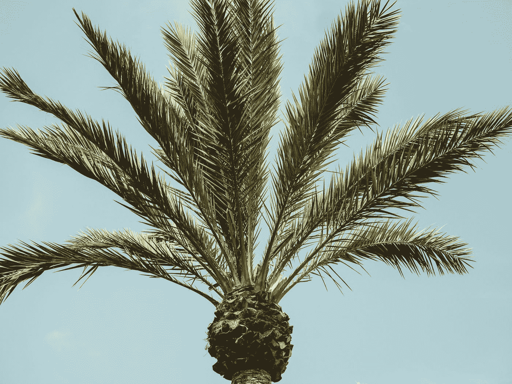

Photo by [Alexander Naglestad](https://unsplash.com/@alexandernaglestad?utm_source=medium&utm_medium=referral) on [Unsplash](https://unsplash.com?utm_source=medium&utm_medium=referral)

数据科学领域的妇女与其合作伙伴共同发起了 WiDS 数据马拉松。面临的挑战是创建一个模型来预测卫星图像中油棕种植园的存在。*行星*和*八字*慷慨地提供了一组由*行星的*卫星最近拍摄的卫星图像的注释数据集。数据集影像的空间分辨率为 3 米，每个影像都根据影像中是否存在油棕种植园进行标注(0 表示无种植园，1 表示有种植园)。任务是训练一个模型，该模型将卫星图像作为输入，并输出图像包含油棕榈种植园的可能性预测。[竞赛创建者](https://www.widsconference.org/datathon.html)为模型开发提供了带标签的训练和测试数据集。更多[**此处**](https://www.kaggle.com/c/widsdatathon2019) 阅读。

我和我的队友([阿卜迪沙库尔](https://medium.com/u/d4284ce02aec?source=post_page-----644adcc143c8--------------------------------)、[哈利玛](https://www.linkedin.com/in/halimah-oladosu-50680385/)和[伊欧马·奥科](https://medium.com/u/2f29addd85ff?source=post_page-----644adcc143c8--------------------------------))在这次挑战中使用了 [fast.ai](https://www.fast.ai/) 框架。非常感谢托马斯·卡佩勒🤗对于他在 [kaggle](https://www.kaggle.com/tcapelle) 上的入门内核，它提供了关于如何解决这个问题的如此多的见解，也为 fast.ai 团队创造了一个令人惊叹的[深度学习课程](https://course.fast.ai/)，简化了许多困难的深度学习概念。深度学习的初学者现在可以赢得游戏比赛😁。

## 让我们开始吧:一个简单易用的深度学习教程

不要担心理解所有的东西，这需要大量的练习。这个教程就是想让你看看 fast.ai 对于初学深度学习的人来说有多酷。我假设你了解一些 python，并且对 ML 有所涉猎。如果那是你；那我们就走上正轨了。

> 这里显示的所有代码都可以在[谷歌合作实验室](https://colab.research.google.com/notebooks/welcome.ipynb)获得；一个免费的 Jupyter 笔记本环境，不需要设置，完全在云中运行。借助 Colaboratory，您可以编写和执行代码、保存和共享您的分析，以及访问强大的计算资源，所有这些都可以从浏览器中免费获得。点击[这里](https://colab.research.google.com/drive/1PVaRPY1XZuPLtm01V2XxIWqhLrz3_rgX)访问我们将要使用的代码。

## 导入 fast.ai 和我们将使用的其他库

Import libraries

## 获取比赛[数据](https://www.kaggle.com/c/widsdatathon2019/data)

为了尽可能直截了当，阿卜迪沙库尔上传了比赛数据文件给 dropbox.com。你可以在比赛网页[这里](https://www.kaggle.com/c/widsdatathon2019/data)找到它们。你需要接受比赛规则并加入才能访问数据。

```
# Get the data from dropbox link
!wget [https://www.dropbox.com/s/6kltw0kqynlijxv/widsdatathon2019.zip](https://www.dropbox.com/s/6kltw0kqynlijxv/widsdatathon2019.zip)

# The downloaded competition data is zipped, let us unzip it
!unzip widsdatathon2019.zip# The training and testing data have already been seperated, Unzip them as well
!unzip train_images.zip
!unzip leaderboard_holdout_data.zip
!unzip leaderboard_test_data.zip
```

## 看着这些数据

当我们着手解决一个问题时，首先要做的是看一看现有的数据。我们需要了解问题和数据是什么样的，然后才能找到解决方法。查看数据意味着了解数据目录的结构，标签是什么，以及一些示例图像是什么样子。

Use the pandas library to read the data

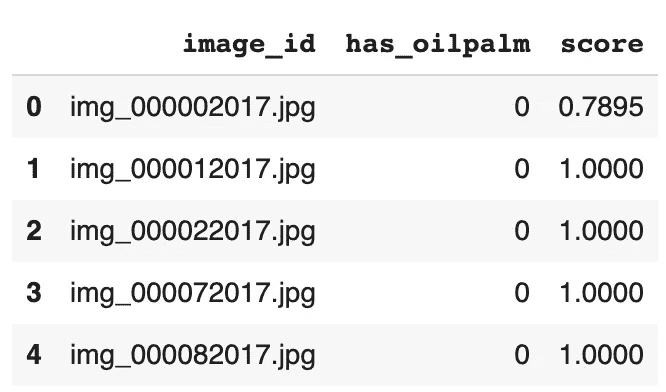

The labels of the data we’ll use to train our models

处理影像分类数据集和表格数据集的主要区别在于标注的存储方式。这里的标签指的是图像中的内容。在这个特定的数据集中，标签存储在 CSV 文件中。

要了解更多关于如何计算**分数**栏的信息，请点击 [**此处**](https://success.figure-eight.com/hc/en-us/articles/201855939-How-to-Calculate-a-Confidence-Score) 。

我们将使用 seaborn 的`countplot` 函数来查看我们的训练数据的分布。从该图中，我们可以看到大约 14，300 幅图像中没有油棕榈种植园，而只有 942 幅图像中有。这被称为[不平衡数据集](/deep-learning-unbalanced-training-data-solve-it-like-this-6c528e9efea6)，这是一个深度学习问题，我们不打算在这里讨论；目前我们正在慢慢地走👶🏽。

Count of the two classes

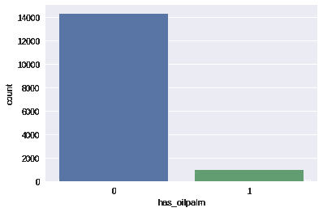

Distribution of the training dataset

# 准备数据

提供的测试数据位于两个独立的文件夹中，分别是*排行榜维持数据、*和*排行榜测试数据。*我们将把两者结合起来，因为比赛要求提交对两者的预测。我们组合了`6534`个图像。

Combine *leaderboard holdout data* and *leaderboard test data*

我们将使用 fast.ai 的[数据块 API](https://github.com/fastai/fastai/blob/master/docs_src/data_block.ipynb) 来构建数据，这是一种将数据集呈现给模型的便捷方式。

Creating an ImageList to hold the data

*   我们将使用一个`ImageList`来保存我们的训练数据，并使用`from_df`方法。我们这样做是因为我们将关于训练集的信息存储在一个名为`df`的数据帧中。我们告诉它在哪里可以找到我们的训练图像，`path`以及保存图像的文件夹的名称，`train_images`。
*   接下来，我们使用随机拆分来拆分我们的训练集。我们希望留出 20%的数据来监控模型在训练期间的表现。我们选择了一个种子，以确保我们再次检查时得到相同的结果。我们需要知道什么可行，什么不可行。
*   我们告诉`ImageList`在哪里可以找到我们训练集中数据的标签，`has_oilpalm`并添加我们刚刚合并的数据作为测试数据。
*   最后，我们对数据执行转换。用`flip_vert = True`翻转图像有助于模型识别图像，不管它们的方向如何。我们将使用`imagenet_stats`来标准化图像。 ***注意:这是一种迁移学习技巧，为了尽可能简单起见，这就是我要说的。*🤐**

# 图像预览

以下是有或没有油棕榈种植园的卫星图像:

Show 2 batches of images

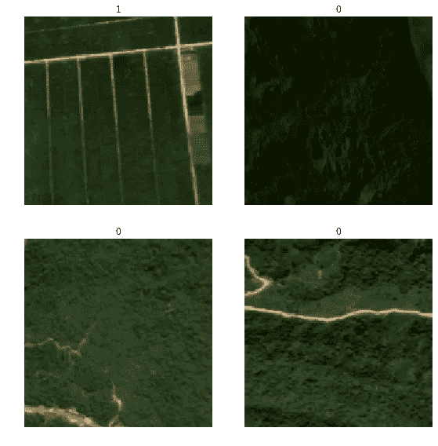

Images with oil palms are labeled 1, those without are 0

# 训练我们的模型

现在我们训练我们的模型。我们将使用一个[卷积神经网络](http://cs231n.github.io/convolutional-networks/)主干，并使用来自 resnet 模型的预训练权重，该模型已被训练用于对各种图像进行分类。不要管这具体是什么意思。目前，我们正在建立一个模型，该模型以卫星图像为输入，输出两个类别的预测概率。

Convolutional neural network

Find an optimal model learning rate

接下来，我们使用`lr_find()`找到一个理想的学习率，并使用`recorder.plot()`将其可视化。

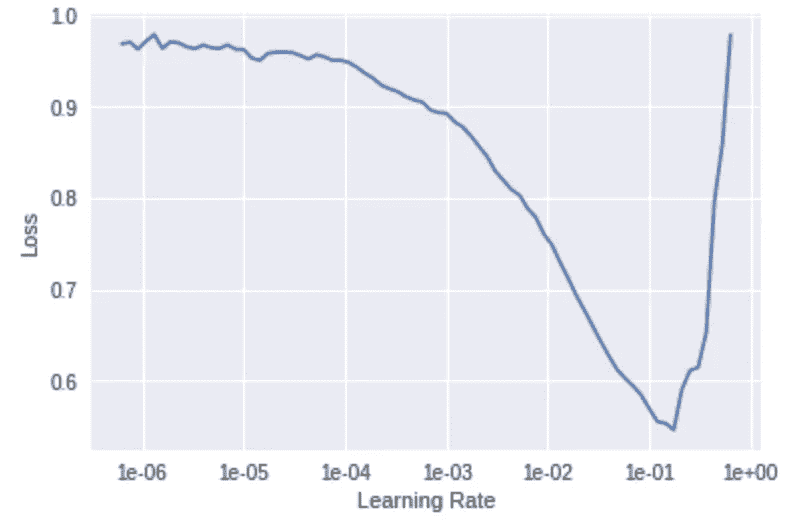

Find an optimal model learning rate

我们将选择一个接近斜率最陡的学习率，在我们的例子中是`1e-2`。

Train model for 5 cycles with learning rate = 1e-2

我们将使用`fit_one_cycle`函数为我们的模型训练 5 个时期(通过所有数据的 5 个周期)。

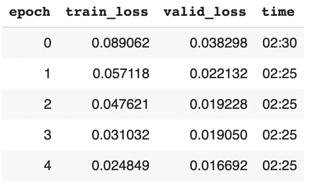

Training and validation losses

注意显示的`metrics`即`training_loss`和`valid_loss`？我们用它们来监控模型随时间的改进。

我们最好的模型是在第四纪元获得的。

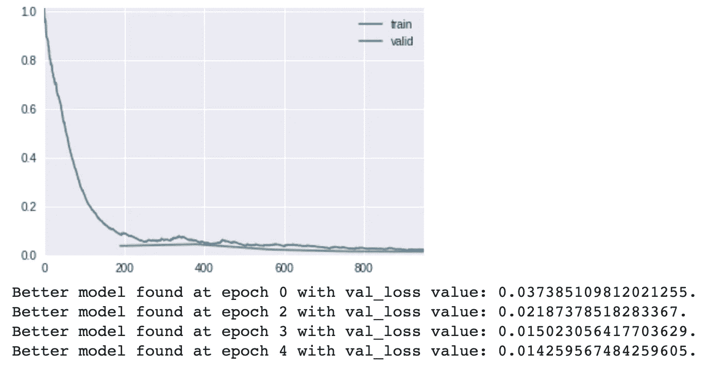

The output of training our model; the progression of training and validation losses

当你运行训练和验证数据集时，fast.ai 在内部只挑选和保存你的最佳模型。

# 评估我们的模型

根据预测概率和观察目标`has_oilpalm`之间的接收器工作特性曲线下的面积，对提交的竞赛进行评估。在这个[开发者速成班](https://developers.google.com/machine-learning/crash-course/classification/roc-and-auc)、这个[视频](https://www.dataschool.io/roc-curves-and-auc-explained/)或这个 [Kaggle 学习论坛](https://www.kaggle.com/learn-forum/53782)帖子中了解更多关于 AUC 的信息。Fast.ai 默认情况下没有这个指标，所以我们将使用 scikit-learn 库。

Print out validation metrics

使用预训练模型和 fast.ai 的好处在于，你可以获得非常好的预测精度，`99.44%`在我们的情况下，无需做最多的事情。

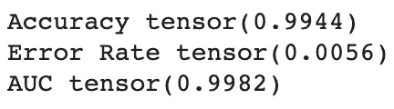

The metrics for the first stage of training

让我们保存我们的模型，并绘制一个关于预测的混淆矩阵。

```
learn.save('resnet50-stg1')
```

# 使用混淆矩阵查看结果

Plot confusion matrix

混淆矩阵是查看模型准确或不准确预测的图像数量的图形方式。

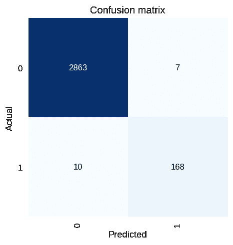

Confusion matrix for the first stage of training

从该图中，我们可以看到，该模型准确预测了 2，863 幅图像中没有油棕榈种植园，168 幅图像中有油棕榈种植园被正确分类。包含油棕种植园的 10 幅图像被分类为没有，而不包含油棕种植园的 7 幅图像被分类为有。

对于一个简单的模型🥳.来说还不错

接下来，我们为这个训练迭代找到一个理想的学习率。

Find an ideal learning rate

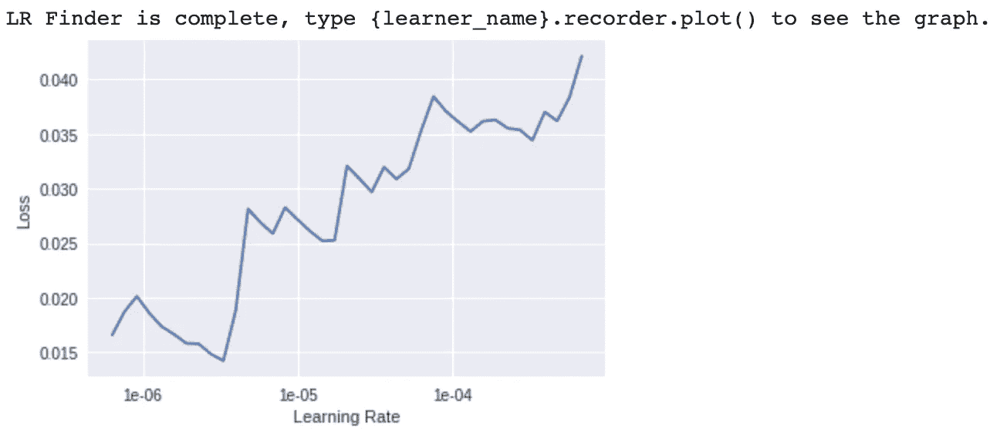

We choose a learning rate that’s between `1e-6` and `1e-4`

使用 7 个时期内`1e-6`和`1e-4`之间的最大学习速率来拟合模型。

Train model for 7 cycles, the learning rate shouldn’t exceed the range of 1e-6 and 1e-4

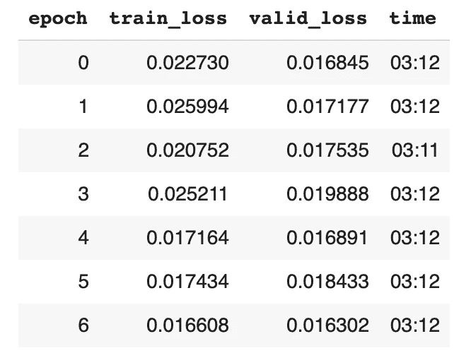

Training and validation losses

以图形方式观察训练指标，以在每个训练周期后监控模型的性能。

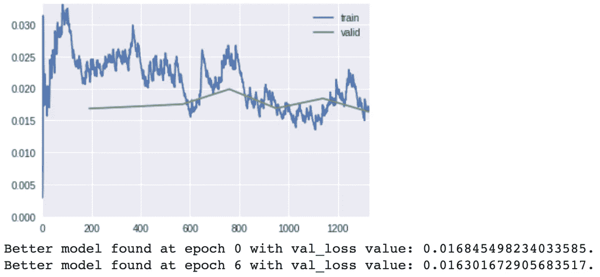

The output of training our model; the progression of training and validation losses

省去第二阶段的模型训练。

```
learn.save('resnet50-stg2')
```

Accuracy, error rate and AUC score

打印出模型的精确度、误差率和曲线下面积。

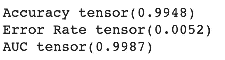

The metrics for the second stage of training

你会注意到模型的精确度从`99.44%`提高到`99.48%`。错误率从`0.0056`降低到`0.0052`。AUC 也有所改善，从`99.82%`到`99.87%.`

Plot confusion matrix

与我们绘制的上一个混淆矩阵相比，你会注意到这个模型做出了更好的预测。

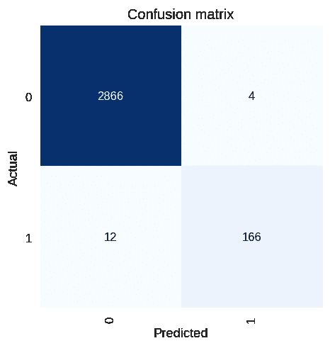

Confusion matrix for the second stage of training

以前 7 张没有油棕榈种植园的图片被错误分类，现在我们减少到 3 张。这就是进步。

你会注意到我们在训练中一直遵循一个模式，并在这个过程中调整了一些参数。我们一直在做的叫做调谐。大多数深度学习实验都遵循类似的迭代模式。

## 图像转换

我们将对数据执行更多的图像转换。这应该会改进我们的模型。每个转换的详细描述可以在 fast.ai [文档](https://docs.fast.ai/vision.transform.html)中找到:

Applying different transforms to improve our model

*   `max_lighting`:如果不是`None`，则以概率 p_lighting 应用由 max_lighting 控制的随机闪电和对比度变化
*   `max_zoom`:如果不是`1.`或更小，则以概率 p_affine 应用`1.`和 max_zoom 之间的随机缩放
*   `max_warp`:如果不是`None`，则以概率 p_affine 应用在`-max_warp`和`max_warp`之间的大小的随机对称扭曲

我们又找到了一个最优学习率。

Find an ideal learning rate

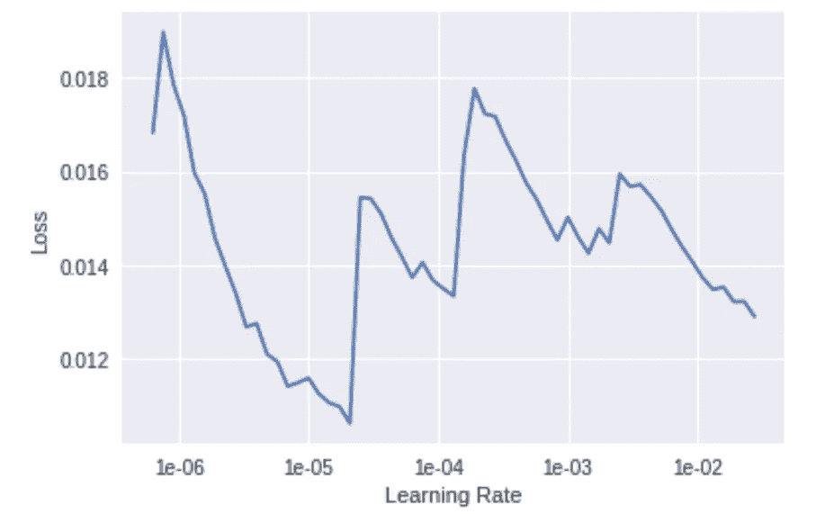

We chose a learning rate of 1e-6

5 个周期的训练模型。

Train for 5 cycles

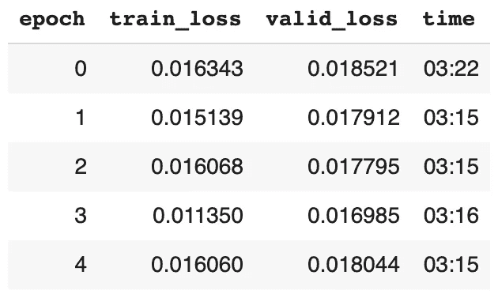

Training and validation losses

比较培训指标，并与过去的指标进行比较。我们的模型在这次迭代中`0.0169`比`0.0163`稍差。不要绝望。

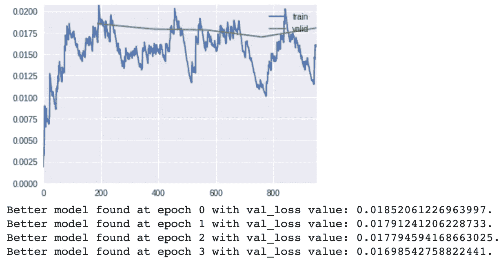

The output of training our model; the best model is at epoch 3

保存模型培训的第三阶段，并打印出指标。你会注意到，模型的精度现在是`99.38%`，在前一阶段是`99.48%`。AUC 得分从`99.87%`提高到`99.91%`，这是对竞争进行评级的指标。

```
learn.save('resnet50-stg3')
```

Accuracy, error rate and AUC score

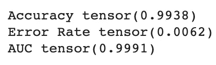

The metrics for the third stage of training

# 最终培训阶段

如果你注意到我们从有`size = 164`的图像开始，我们逐渐建立，直到我们到达下面的`size = 256`。我们这样做是为了利用 fast.ai 的渐进式图像大小调整进行分类，即在训练开始时使用小图像，并随着训练的进行逐渐增加大小。这样，当模型在早期非常不准确时，它可以快速看到大量图像并取得快速进展，然后在训练中，它可以看到更大的图像以了解更精细的区别。点击[这里](https://www.fast.ai/2018/08/10/fastai-diu-imagenet/)阅读更多相关内容。

Applying different transforms to improve model, increased image sizes to 256

我们又找到了一个最优学习率。

Find an ideal learning rate

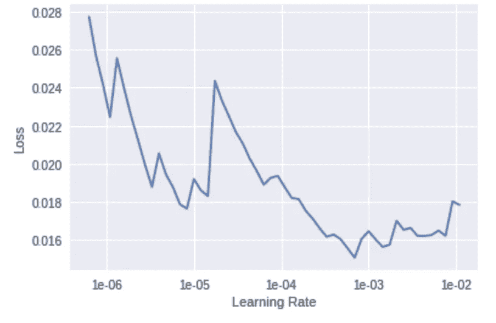

Find an ideal learning rate

使用 5 个时期的学习率`1e-4`拟合模型。

Train model for 5 cycles, the learning rate is set to 1e-4

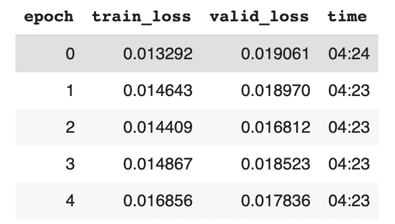

Training and validation losses

观察培训指标，并与过去的指标进行比较。我们的模型做了一点改进，从`0.0169`到`0.0168`。

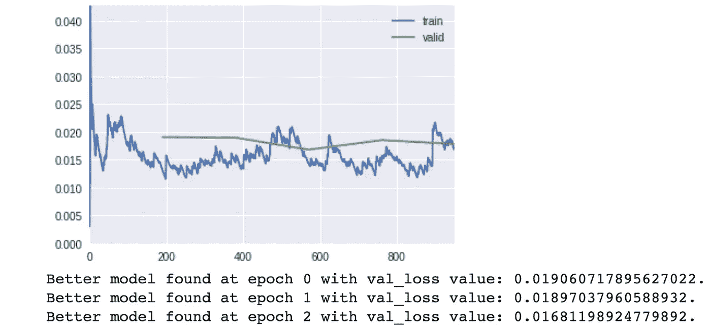

The output of training our model; the best model is at epoch 2

保存模型训练的最后阶段并打印出指标。

```
learn.save('resnet50-stg4')
```

Accuracy, error rate and AUC score

正如你所注意到的，模型的精度现在是`99.44%`，这比上次训练阶段`99.38%`有所提高。

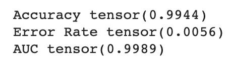

The metrics for the fourth stage of training

# 准备竞赛提交文件

现在我们可以看到我们的模型对尚未看到的数据的预测有多好。

Prepare a CSV submission file

# 向 WiDS Datathon 提交一份材料

您仍然可以参加 WiDS 竞赛，并提交一份迟交的材料。为此，请点击进入竞赛页面[，点击**加入竞赛**并接受竞赛规则。现在你可以提交一份申请，看看如果你参加的话，你的排名会是多少。](https://www.kaggle.com/c/widsdatathon2019)

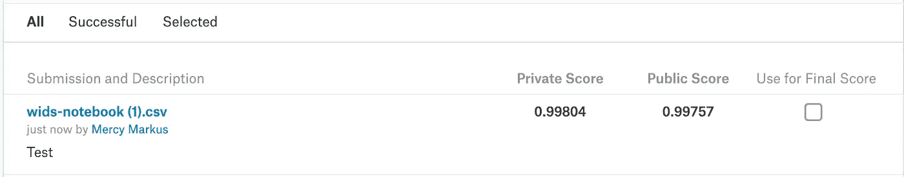

Private and Public Scores for the submission I made from our model’s predictions.

声明:文章中的说明不会像我们一样把你放在第三位，我想尽可能保持简单。要弄清楚这一点，请查看 [Abdishakur](https://medium.com/u/d4284ce02aec?source=post_page-----644adcc143c8--------------------------------) 关于它的帖子[这里](https://www.kaggle.com/c/widsdatathon2019/discussion/82252)。

好奇想了解更多？看看这个由杰瑞米·霍华德和 fast.ai 团队策划的惊人的 7 部分系列讲座。