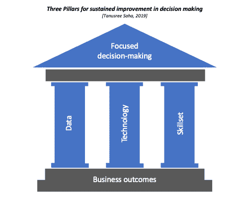

# 人工智能如何将“丢失的 80%”数据带回决策中？

> 原文：<https://towardsdatascience.com/how-ai-can-bring-back-the-lost-80-data-into-decision-making-de786ad8c208?source=collection_archive---------24----------------------->

Photo by [Omid Armin](https://unsplash.com/@omidarmin?utm_source=medium&utm_medium=referral) on [Unsplash](https://unsplash.com?utm_source=medium&utm_medium=referral)

一家物流公司的业务负责人曾告诉我，他的公司正在亏损，因为它无法有效优化承运商的运力。运营无法应对货物交付的波动；这个问题在高峰期更为突出。不优化运力会产生进一步的连锁效应:物流公司无法分配成本开销，进而无法提供有吸引力的价格，因此失去了客户。

这种情况引发了一次诊断演习；分析师们重新审视了存储在大型关系数据库中的销售数据，看它们是否能揭开消费者需求模式波动的神秘面纱。经过彻底调查后，分析师得出结论，大量销售数据(存储为发票图像)无法得到有效分析。这导致需求的非代表性观点，因此导致收入损失。

上述情况以及我从事分析咨询工作期间的其他多种情况表明，图像、语音记录、电子邮件、文本、社交媒体、网页等形式的数据(被称为“非结构化数据”)正日益成为企业洞察的重要来源。Gartner 估计超过 80%的企业数据是非结构化的。然而，*(其中大部分)数据并未被企业用于决策，即“丢失 80%”的数据*，从而导致盲点并影响业务成果。此外，这也让企业付出了代价:IDC 预测，到 2020 年，能够分析所有相关数据并提供可操作信息的组织将比不太注重分析的同行多获得 4300 亿美元的生产力收益。

因此，将“丢失的 80%”数据带回日常决策变得极其重要。这就是 AI 可以发挥关键作用的地方，这将是我这篇文章的重点。

# 导致“丢失 80%”数据的原因

> R “非结构化数据未被用于决策”即“丢失 80%”数据的原因是:对现状的错误安全感，技术限制了实验和扩展的能力，机构记忆是默认的。

对于上述物流公司，以下是大量销售数据未得到有效分析的原因:

## 短视的见解造成了现状可以维持的错觉:

大多数分析师都接受过用于收集数据的关系数据库以及用于切片、切块和分析数据的商业智能(BI)工具的培训。这些分析师非常依赖 IT 提供的精选数据。反过来，它根据分析师经常遇到的业务问题定义数据库模式和查询。它将提取—转换—加载回答重复出现的业务问题所需的数据；并丢弃或存档其余的数据。鉴于反复出现的业务问题主要集中在大型企业客户上，这一细分市场的销售数据在数据库中组织得井井有条。然而，通过发票图像获取的许多中小企业的数据并没有填充到数据库中。

结果是，业务分析师产生的见解是基于可用的数据，而不是必要的数据(包括中小企业的销售数据)；导致 ***目光短浅，受限于数据可用性。*** 性情温和的商业智能分析师让他们的业务利益相关者了解最新的销售需求预测，但不知不觉中忘记了提醒客户群的界限。

## 传统技术阻碍了可扩展性:

具有统计学和高级分析知识的数据科学家相对有限，他们处理高价值的业务问题，这些问题在 BI 报告中没有得到回答。这些数据科学家通常与 IT 团队合作，从关系数据库之外获取数据。在这种情况下，数据科学家分析了他们沙盒环境中的销售图像数据，并推断中小型企业的需求特征不同于大型客户。然而，这些见解并没有及时在整个客户群中推广。

鉴于对高杠杆 IT 团队的依赖，扩展见解极其耗时且昂贵，该团队试图用传统技术来实现收支平衡，而传统技术并不是为管理如此大量和多种数据而设计的。

## 机构知识被困在筒仓中，无法为决策过程提供信息:

在孤岛中运行的一个副产品是，这些见解经常被困在这些数据科学家的头脑中或他们的沙盒环境中。商业领袖不容易获得这些见解；即它们成为了 ***隐性知识，不可搜索、不具信息性*** 。

这意味着数据科学家发现的方向性洞察不会给业务利益相关者带来任何风险。

上述所有挑战意味着物流公司无法主动发现会降低其收入的触发因素。细想一下，这种情况对于当今许多企业来说并不少见。日常的商业洞察力是短视的；而这导致了未知的风险。高价值资产优先考虑高价值问题；事实证明，技术是扩展推断洞察力的限制因素。见解没有民主化；因此，研究努力付诸东流。最后，在揭露潜在的黑天鹅方面努力有限；随时可能出现的未知问题。

简而言之，企业严重瘫痪，无法从“丢失的 80%”数据中获得任何真正的价值。

# 需要什么来把“失去的 80%”带回来考虑？

> “代表性数据——可扩展技术——技能组合”的支柱，基于业务目标设计，目标是加强重点决策。

Source: Image by Author

为了从这种“损失 80%”的数据中吸取教训，企业需要首先促进正确的基础模块，如下所示:

## 代表性数据世界:

他们必须根据优先的业务成果不断识别现有的和新的用例；并通过引入缺失的非结构化数据来构建真实业务环境的数字表示。这将是未来的一个重要支柱，届时人工智能等工具将利用这些数据来增强洞察力。

## 可扩展技术:

与此同时，他们需要灵活、开放和敏捷地添加或升级到更合适的大数据技术，这是完成业务任务所必需的。提示:找到适合您的技术堆栈。谷歌、脸书、亚马逊、网飞都有不同的技术栈，每一个都基于他们的业务需求、发展、他们拥有的技能和他们想要去的地方。

## 调整技能组合:

最后，也是最重要的一点，企业需要不断提升技能和/或引进相关技能，例如数据工程师、数据科学家、技术架构师，以充分利用新的数据和下一代技术组合，实现所需的业务成果。

这家自上而下的物流公司踏上了“持续变革”之旅，在这一过程中，它始终专注于*代表性数据的三大支柱——可扩展技术——在技能组合*中调整，按业务目标划分优先级，目标是改善数据驱动的决策。

# 人工智能将如何通过使用“失去的 80%”来增强决策？

> 人工智能可以帮助发现更深层次的见解，优先考虑那些呼吁采取行动的人；同时也便于用户利用机构记忆，从而最大限度地减少盲点。

随着*代表性数据的三大支柱——可扩展技术——在 skillset* 中调整为基础模块，人工智能可以开始发挥关键作用。这里是人工智能可以使用“丢失的 80%”数据增强决策的方式:

## 人工智能可以实现更深入的见解，从而最大限度地减少盲点

随着企业开始使用海量的非结构化数据，深度学习等复杂的人工智能算法将变得相关。深度学习和其他机器学习方法非常擅长从非结构化数据中揭示复杂模式，将有助于触发新的诊断并产生有价值的见解。这将有助于商业利益相关者最大限度地减少他们的盲点，从而最大限度地降低他们的业务风险；帮助他们对所处的环境有更好的直觉。

## 人工智能可以通过个性化的行动号召来扩展洞察力:

人工智能工具通常建立在大数据环境上，大数据环境具有快速扩展的能力。人工智能工具的解决方案管理通常是分散的——更接近用户组，因此最大限度地减少了对低带宽 IT 资源的依赖。这些运营转变意味着数据科学家现在可以学习新的见解，并更快地扩展这些见解，以支持日常决策。

鉴于数据收缩的半衰期，人工智能将在优先考虑各种用户角色的洞察力方面发挥重要作用；此外，触发个性化的行动号召消息，以实现及时的行动。

## 人工智能可以使机构记忆民主化，并提高生产率:

利用人工智能的一个结果将是，公司现在将收获一个被动的见解库。这些见解，加上人工智能支持的搜索和检索能力，将成为企业如何将其隐性知识转化为机构记忆的基石。洞察力的搜索能力将帮助分析师和数据科学家在重复和多余的工作上花费更少的时间。人工智能中的自然语言处理技术可以帮助非技术和非分析业务用户实现民主化。

总之，人工智能将有可能通过利用“丢失的 80%”数据来增强数据驱动的决策。然而，人工智能有多成功和有效，将取决于企业如何继续专注于巩固*代表性数据——技术——技能组合*的基础模块。

至于物流公司，它成功地引入了 AI(高级机器学习算法)来揭开决策中的盲点；并逐渐为个性化行动号召和见解搜索能力奠定基础。

*原载于 2019 年 7 月 26 日*[*http://hawkaiblog.wordpress.com*](https://hawkaiblog.wordpress.com/2019/07/26/how-the-lost-80-data-is-changing-analytics/)*。*