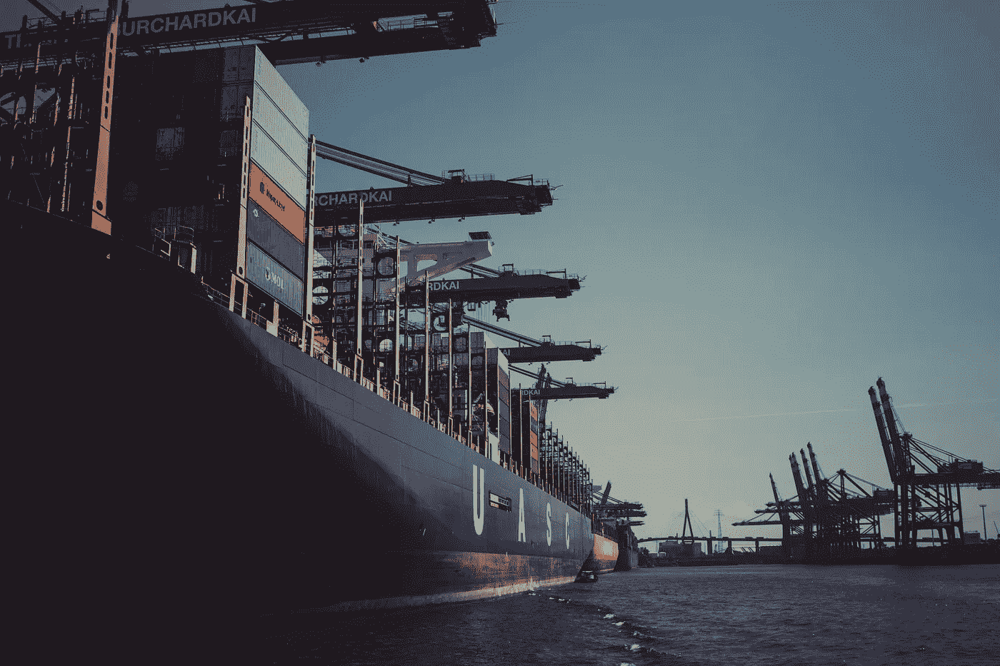
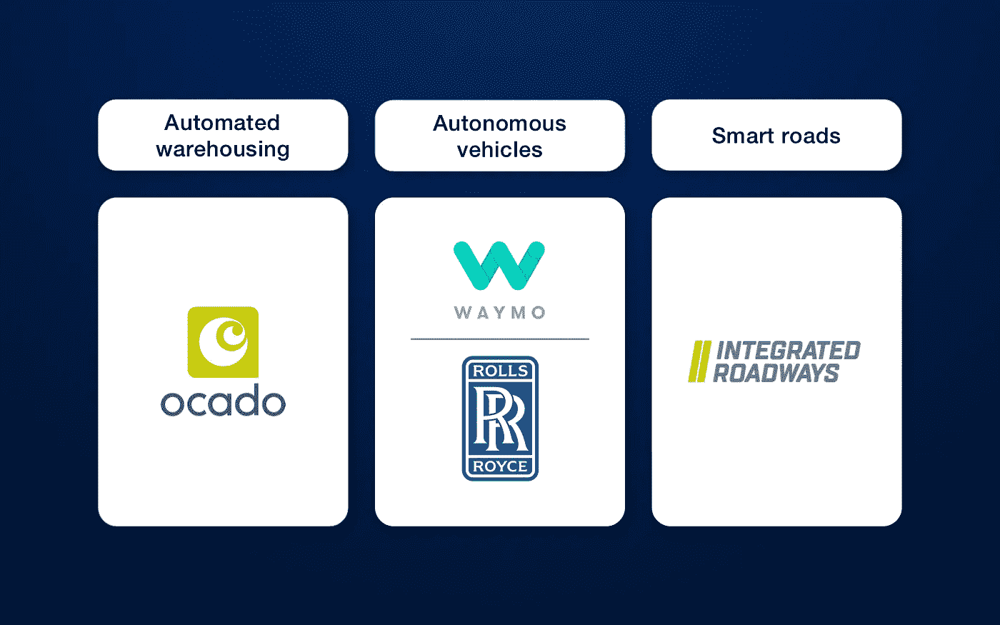
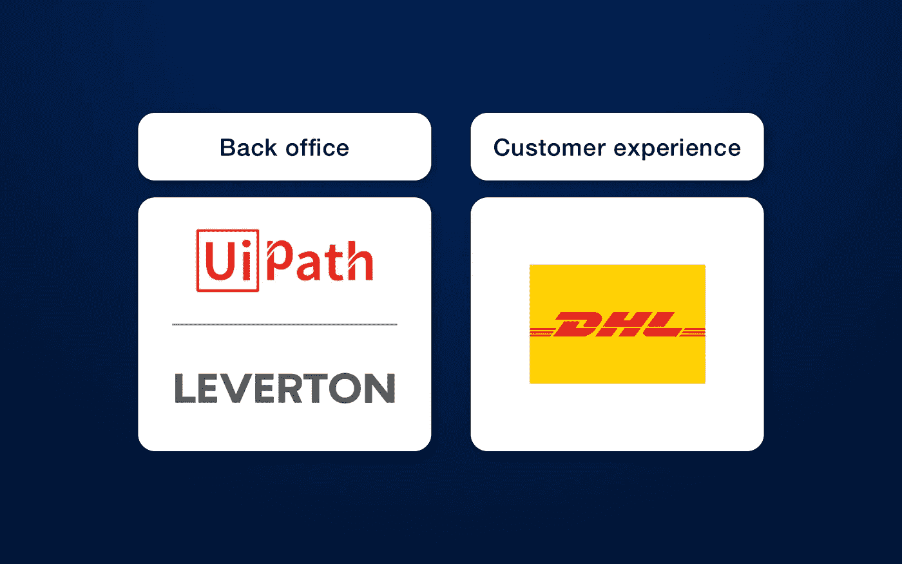
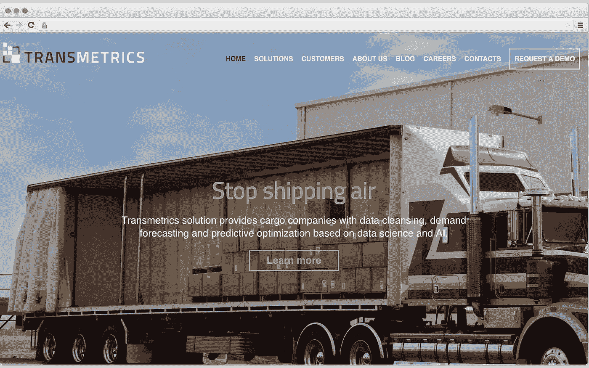
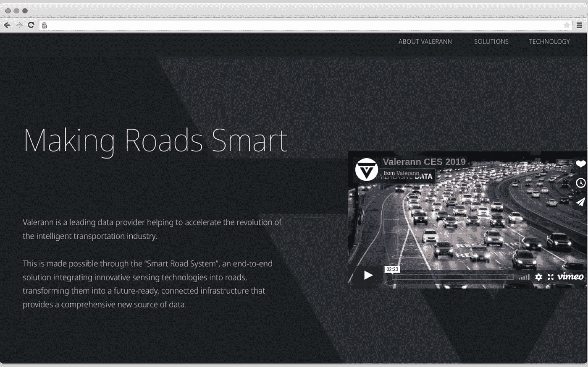
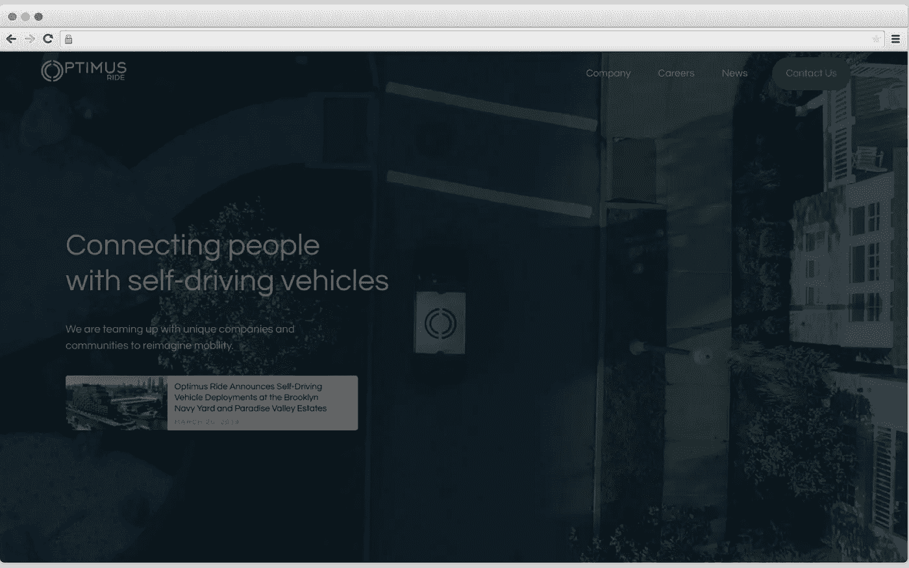

# 人工智能如何改变物流行业

> 原文：<https://towardsdatascience.com/how-ai-changes-the-logistic-industry-3d55401778d?source=collection_archive---------11----------------------->

## 了解人工智能用例、有前途的初创公司等

由于人工智能或人工智能的发展，物流行业和供应链发生了很多变化。这项强大的技术带来了预测分析、自动驾驶汽车和智能道路等变革。

因此，我们决定讨论人工智能在物流领域可以解决的 5 大问题。此外，有几个实施人工智能的创业公司。

# 物流中的人工智能用例

由于最近的[研究](https://www.economist.com/special-report/2018/03/28/how-ai-is-spreading-throughout-the-supply-chain?FEATURE_ARTICLES_V1=0)，在供应链中实施人工智能可以让公司每年获得 1.3 万亿到 2 万亿美元的收益。

谷歌、亚马逊、英特尔等很多企业开始将资源投入到人工智能领域。实际上，这项技术可以节省时间和金钱，因为它提供了各种耗时过程的自动化。

现在是时候来看看人工智能在物流领域的用例，以及讨论已经定期使用这项技术的公司了。

## #1.自动化仓储

如今，人工智能有转变仓储业务的趋势，如收集和分析信息或库存处理。因此，人工智能有助于提高效率和获得利润。它是如何工作的？人工智能用于预测某些产品的需求。之后，该公司将需要的物品运送到地区仓库，降低了运输成本。

据 [Vero Solutions](https://www.warehousinglogisticsinternational.com/how-will-ai-transform-the-smart-warehouse/) 称，未来几年，公司可以自动化 30%的仓储任务。

此外，具有人工智能的系统可以管理工作以及完成各种日常任务。我们准备了一个公司的例子，该公司已经将人工智能应用到仓储系统中，并获得了一些利润。

> [奥卡多](https://www.ocado.com/webshop/startWebshop.do)。这是一家位于英国的网上超市。这家公司开发了一个自动化仓库。有一种叫做“蜂巢网格机器”的机器人完成订单的速度比工人快得多。这些数字是疯狂的。在一周内，“蜂巢网格机器”可以完成 65，000 份订单或替换 350 万件杂货。这些机器人帮助搬运、举起和分类东西。之后，Ocado 的员工打包并发送订单。因此，发送订单所需的时间减少了。

自动化仓库倾向于使用计算机视觉。这项技术允许识别和组织项目。此外，在未来，计算机视觉将有助于在没有人监督的情况下管理质量控制。如果供应链中有几个仓库，人工智能会将它们连接起来，以便找到运输库存的最佳方式。

## #2.自动驾驶汽车

人工智能对交通有利可图。自动驾驶汽车给供应链带来了变化，并有助于降低物流费用。当然，我们知道无人驾驶汽车，但人工智能允许更多的车辆自动化。例如，卡车、货车或公共汽车等运输工具也可以实现自动化，以便运输货物。这种车辆可以单独工作，也可以与人合作。然而，在许多国家，政府认为驾驶员必须在车内才能完全控制道路上的情况并分析可能的风险。当然，这种说法未来可能会有所改变。

> [Waymo](https://waymo.com/) 。2018 年 12 月，这家公司已经集成了一项利用自动驾驶汽车的出租车服务。这项服务在亚利桑那州凤凰城的郊区运作。如今，Waymo 试图制造无人驾驶卡车。该公司想让卡车运输更安全。该公司的收入预计到 2030 年将达到 1140 亿美元。
> 
> [劳斯莱斯](https://www.rolls-royce.com/)。这家企业与英特尔合作开发自主船。自 2010 年以来，罗尔斯·罗伊斯一直在创造这项技术。于是，情报意识在 2018 年发布。这个工具有几个有趣的特性。例如，它可以识别和定义水中的物体，监控发动机状况，并选择最佳路线。因此，交货速度变得更快。

无人驾驶技术可以给物流带来很多好处。例如，利用自动驾驶汽车，人们有机会减少燃料使用，优化路线以及避免人为错误。

## #3.智能道路

除了无人驾驶汽车，AI 在物流领域还有一个用例。几家公司正在致力于建设智能道路。这些公司倾向于创建各种解决方案，以满足地区需求。

例如，有用太阳能电池板和 LED 灯开发的道路。物流部门的利润是什么？这种高速公路可以发电或使用彩色灯来提醒司机注意不断变化的路况。另一个好处是太阳能电池板的加热能力。因此，冬天路面不会滑。

所有提到的好处导致智能道路对物流领域有用的结论。因为在供应链中没有由于不适当的天气条件造成的交货延迟。

> [综合巷道](http://integratedroadways.com/)。该公司因创造智能路面系统而闻名。为了测试这项技术，Integrated Roadways 的所有者已经与科罗拉多州交通部签署了一项协议。智能路面系统有几个有用的特点。首先，它能够将路上的汽车连接到互联网。因此，驾驶员可以获得关于交通堵塞、事故等的实时信息。此外，创造者认为他们的系统可以“感觉”每辆车的位置，并为司机提供详细的导航。

Image by Author

## #4.后台操作的人工智能

后台运作对物流部门至关重要。人工智能和机器人流程自动化(RPA)等技术可以让员工加快工作流程。例如，有一些数据相关的任务每天都在重复。它们可以自动化。由于后台办公自动化，拥有供应链的公司可以节省时间和金钱。

人工智能和 RPA 的结合创造了一种叫做**认知自动化**的技术。因此，公司有机会节省时间，提高生产率和准确性。这项技术的主要目的是取代某些类别的员工，如会计、人力资源等。由于这种替换，人为错误的数量将会减少。

> [UiPath](https://www.uipath.com/) 。这家公司专门生产机器人设备。据老板称，如果员工要求，机器人可以完成 99%的任务。这是因为 UiPath 的机器人可以“看到”屏幕元素。

最新的[研究](https://www.mckinsey.com/business-functions/digital-mckinsey/our-insights/four-fundamentals-of-workplace-automation)声称机器人可以管理 22%的律师工作。当然，阅读协议和识别风险条款等任务是很费时间的。**人工智能支持的合同管理软件**是一个节省时间和提高准确性的机会。LawGeex 声称人工智能应用程序显示出 94%的准确率，而人类律师只有 85%。此外，该系统审查合同的速度更快。根据同一项研究，软件只需要 26 秒，而人却要花 92 秒。

> 勒弗顿。这家公司开发人工智能软件。例如，有一款合同分析软件可以管理协议并支持大约 30 种语言。此外，可以教这个工具从文档中提取必要的信息。Leverton 声称这项技术可以节省 30%到 50%的工作时间。

## #5.人工智能预测需求并改善客户体验

物流领域的人工智能有一个非常明显的用例。这项技术可以帮助预测需求。

当然，公司需要预测货物的大概数量，以加快交货速度。在另一种情况下，如果商品数量有限，但需求很高，企业将会损失一些钱。

有一些算法可以预测趋势。根据最近的[研究](https://www2.deloitte.com/insights/us/en/deloitte-review/issue-19/art-of-forecasting-human-in-the-loop-machine-learning.html)，基于人工智能的工具往往比人类专家预测得更好。
人工智能允许跟踪必要的因素，以提高需求预测的准确性。之后，这些信息可以使仓库管理更容易。

此外，人工智能改善了客户体验。由于这项技术的实施，客户可以获得更加个性化的体验，从而更加信任公司。

> [DHL](https://www.dhlparcel.nl/en) 。亚马逊和 DHL 包裹已经签署协议。他们合作是为了增加客户体验。因此，亚马逊创建了一个名为 Alexa 的语音服务。它被教会回答关于包裹的问题，例如装运细节、去向等等。Alexa 使用起来相当简单。这个人可以问 Alexa，我的包裹在哪里？’并接收所有必要的细节。

Image by Author

正如你所看到的，在物流领域有大量的人工智能用例。如今，这项强大的技术正在发展，以改善物流和供应链。人工智能允许自动化需要大量时间的常规任务。

# 物流领域基于人工智能的初创公司

创业公司带来很多创新。因此，我们创建了一个列表，列出了几家尝试将人工智能集成到物流中的有前途的初创公司。

## 6 个河流系统

6 河流系统在[仓库自动化](https://www.cleveroad.com/blog/warehouse-automation-technology)上工作。该公司创造了一个名为查克的机器人。创造者使用了类似于自动驾驶车辆的技术。恰克连接到了管理系统。这个机器人可以完成诸如收拾东西、计数甚至分类等任务。

而且，Chuck 是无线的，可移动的。因此，它很容易在箱子之间转移，甚至可能在员工或设备上路时减速。

## 轨迹机器人学

又一家想自动化仓库的创业公司。Locus Robotics 制造移动机器人，使电子商务运营变得更容易。该公司的机器人名为 LocusBot。

该机器人有一个集成的触摸板为基础的用户界面。因此，培训员工与 LocusBot 合作所花费的时间减少了。

## 轮回学

Transmetrics 帐篷，为交通和物流行业打造 AI 解决方案。该公司为客户提供现代技术，如预测优化、高级预测等。因此，公司的运营效率更高。

Image by Author

## 瓦莱伦

运输领域需要现代技术解决方案。瓦勒兰开发了一套智能道路系统。这是一个收集高分辨率信息的无线网络。这些数据存储在云中并进行分析。因此，基于人工智能的算法为跟踪路况和预测高速公路上的情况提供了机会。

Image by Author

## 擎天柱骑行

有许多创业公司致力于创造无人驾驶汽车。Optimus Ride 构建软件和硬件解决方案，可与任何车辆类型配合使用。该公司的领导声称，他们的解决方案适用于许多场所，如住宅社区、工业园区、机场等。

Image by Author

## 希波

这家公司专门为市场、仓库以及电子商务公司开发解决方案。初创公司的最终目标是创建一个技术解决方案，为用户提供最合适的交付选项。因此，运输过程将变得轻松舒适。Shippo 已经创造了一些解决方案，例如，客户可以获得个性化的跟踪数据，定制交付等。

Image by Author

所以，我们刚刚讨论了六家在物流领域和供应链中集成人工智能的有前途的初创公司。每个公司都使用一种独特的方法来实现人工智能。当然，这个列表并不完整，可以扩展到更多的创业公司。

人工智能可以为物流部门带来好处。首先，这项技术提高了任何物流操作的有效性和准确性。其次，AI 允许自动化耗时的任务，并降低最终成本。