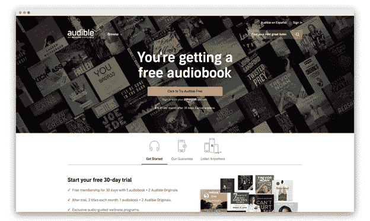
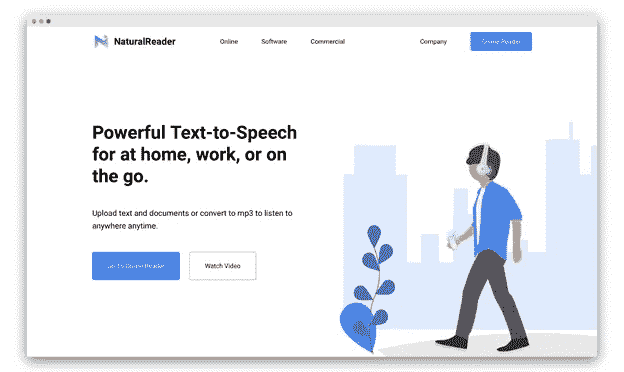
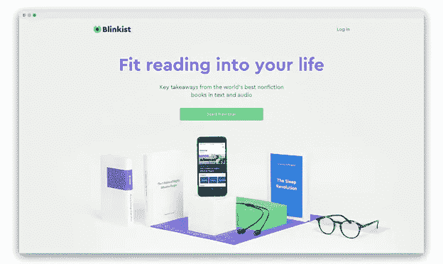
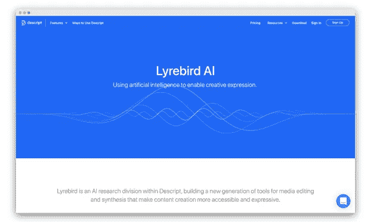

# 人工智能如何促进有声读物行业的繁荣

> 原文：<https://towardsdatascience.com/how-ai-contributes-to-the-audiobook-industry-boom-2cc5406331eb?source=collection_archive---------18----------------------->

有声读物的销量近年来一直在飙升，音频出版商协会(APA) [报告](https://www.forbes.com/sites/adamrowe1/2019/07/16/us-audiobook-sales-neared-1-billion-in-2018-growing-25-year-over-year#ca96b8b6050d)称，2018 年，美国出版商销售了约 9.4 亿美元的有声读物，比 2017 年增长了 24.5%。APA 还指出，2018 年 91.4%的收入来自数字格式销售。这显示了数字媒体对有声读物行业增长的巨大影响。

多亏了 Audible 这样的平台，有声读物现在变得更加容易获得。用户可以在手机上听有声读物，将其连接到汽车上，在平板电脑、笔记本电脑和智能扬声器上听。它甚至会自动记住用户在有声读物中的位置，并通过他们的所有设备进行同步。

# 人工智能在当今有声读物行业的应用

最近,[因其人工智能功能而陷入困境。美国五大出版商起诉 Audible 的字幕功能。公司](https://www.engadget.com/2019/08/23/book-publishers-sue-audible-ai-transcription)[今年夏天宣布的功能](https://www.audible.com/about/newsroom/audible-captions-a-demonstration/)使用机器学习将有声读物转录成文本。因为有声读物许可证与电子书许可证是分开的，出版商声称这是侵犯版权。考虑到版权限制，人工智能在有声读物中的这个用例似乎有争议，但如果双方能够达成版权协议，它可能会在不久的将来成为有声读物平台的一个合法部分。

*Audible needs no introduction; it’s the most popular audiobook platform owned by Amazon.*

字幕功能可能对使用有声读物学习语言的用户特别有用。据路透社报道，语言学习行业本身就有巨大的收入，预计到 2024 年，英语学习的全球市场规模将达到 220 亿美元。

Audible 利用人工智能的另一种方式是对有声读物的个性化推荐。就像所有主流流媒体平台一样，该平台使用用户的有声读物收听历史来提供更好的建议，以便他们总是有东西可听，并尽可能长时间地订阅。

虽然[网飞](https://becominghuman.ai/how-netflix-uses-ai-and-machine-learning-a087614630fe)在电影和节目中使用自动生成的个性化缩略图，但我们还没有在有声读物平台上看到这种用例。但是谁知道呢，也许对于那些以貌取人的人来说也是如此。

# 人工智能为您带来有声读物的新机遇

## 自动化有声读物旁白

虽然人工智能还远未达到人类表演的质量，但它已经能够模仿人类的语言。人工智能有助于推进文本到语音转换技术，听起来像自然语音记录。NaturalReader 是一款免费的在线文本到语音转换器，它是制作听起来很自然的语音记录的工具之一。 [Animaker](https://www.animaker.com/voice) 甚至允许用户定制人工智能生成的语音记录，通过插入短暂的停顿和呼吸，使其听起来像真人说话。

*NaturalReader is a text-to-speech tool that can create natural-sounding voice recordings.*

让人工智能文本到语音转换听起来像人类已经被科技巨头解决了一段时间。苹果、谷歌、微软和亚马逊都在努力让他们的人工智能私人助理的声音听起来更像人类。正如《科学美国人》的[文章](https://www.scientificamerican.com/article/new-ai-tech-can-mimic-any-voice/)所述，这些系统通过连接预先录制的文件中的单词和短语来工作。但这不足以让它们听起来很自然。没有人类说话的细微差别，比如我们说话时的停顿和呼吸，这些系统听起来像机器人。这就是深度学习进入场景的地方。通过分析不同的人类语音记录，AI 可以学习模仿细微差别，使语音听起来更自然。

## 创建有声读物的简短摘要

随着 Blinkist 这样的应用程序(所谓的浓缩阅读平台)越来越受欢迎，人工智能在有声读物市场上迎来了新的机遇。有了人工智能，亚马逊和 Audible 这样的平台可以使用人工智能为不想在一本书上投入时间的人创建书籍的简短摘要和关键要点。像 Blinkist 这样的平台的存在，最近[筹集了 1880 万美元的资金](https://techcrunch.com/2018/06/20/blinkist-raises-18-8m-for-its-condensed-reading-platform-for-non-fiction-books/)，表明人们对书籍的短版有需求，这可能是有声读物的绝佳机会。

*Blinkist is a book summary platform that offers key takeaways from non-fiction books.*

毫不奇怪，已经有工具试图使用人工智能来做到这一点。AISummarizer 是一个免费的在线工具，你可以粘贴你的文本并得到一个摘要版本。它让用户根据百分比选择文本应该减少多少。

## 讲述人口音和声音调整

TechCrunch [报道](https://techcrunch.com/2018/08/02/amazon-patents-a-real-time-accent-translator/)近日，亚马逊申请了一项音频系统的专利，该系统可以检测说话者的口音，并根据听者的口音进行调整。这项技术对有声读物行业也有潜力。想象一下，听一本有声读物，有一个功能，你可以选择叙述者的口音。虽然听起来有些牵强，但当您发现一本有趣的有声读物，但讲述者的口音让您很难听下去时，这个功能会很方便。

或者如果你想要一个熟悉的声音给你读这本书呢？这也有人工智能的解决方案。彭博[最近采访了 Lyrebird 的团队](https://www.youtube.com/watch?v=VnFC-s2nOtI)，这是一家利用人工智能克隆人类声音的初创公司。为了实现这一目标，他们正在使用上述深度学习技术来分析一分钟的语音记录，并创建一个人工智能版本，可以操纵它说出你输入的任何类型的文本。它甚至保留了口音。在错误的人手中，像这样的工具可能会产生破坏性的后果，而另一方面，它也可能有伤感的用途，比如怀旧和听妈妈给你读童话。

*Lyrebird AI is an AI tool that lets users create a voice clone by just using a one-minute voice recording.*

有声读物现在正在兴起，很快竞争对手就会希望以独特的功能脱颖而出。无论是呈现享受有声读物的新方式，还是仅仅改进生产流程，AI 都可以为这个行业提供很多东西。现在，我们只能等着看有声读物的下一步。

*By*[***Max Kalmykov***](https://www.linkedin.com/in/mkalmykov/)*VP，媒体&娱乐* [***数据艺术***](https://www.dataart.com/industry/media-and-entertainment?utm_source=medium.com&utm_medium=referral&utm_campaign=m-regular&utm_content=mkalmykov-tds-aiaudiobook)