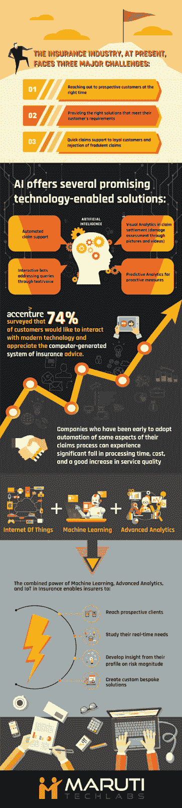

# 人工智能如何实现更智能的索赔处理和欺诈检测？

> 原文：<https://towardsdatascience.com/how-ai-enables-smarter-claims-processing-fraud-detection-e65a8b2997a6?source=collection_archive---------9----------------------->

人工智能技术已经很好地真正改革了信息系统，使它们更适应人类，同时显著改善了人类和计算机系统之间的交互。

凭借这一点，保险业内的人工智能通过使索赔管理过程更快、更好、更少的错误而彻底改革了索赔管理过程。保险公司现在可以选择通过以下方式利用该技术来实现更好的索赔管理:

*   *促成实时 Q & A 服务第一时间通知丢失情况。*
*   *自动执行损失评估流程的同时，对索赔进行预评估。*
*   *通过丰富的数据分析自动检测索赔欺诈。*
*   *预测理赔量模式。*
*   *增加损失分析。*

从全天候提供快速客户服务的智能聊天机器人，到通过自动化功能改善任何工作场所运作的一系列机器学习技术，人工智能在保险领域不断扩大的潜力已经在许多方面得到应用。

随着对人工智能在保险行业中改变游戏规则的影响的认识和资源的增加，最初的犹豫和围绕其实施的浅层不适现在正在迅速消退，因为它开始相信人工智能和机器学习带来的能力和无数机会。唯一的问题是——我们能把它的能力推进到什么程度？

**AI 在保险行业的角色**

2017 年，人工智能通过快速创建受控的数字化增强自动化环境来实现最大生产力，在各种商业垂直领域展现了其实质。

显然，特别是保险公司，可以从投资人工智能技术中受益匪浅，这种技术不仅可以自动安排执行层面的任务，还可以通过帮助代理人做出正确的决策和无可辩驳的判断来提高服务质量。

**人工智能支持的创新和解决方案一瞥**

如今，保险公司面临三大挑战:

1.  在正确的时间接触潜在客户。

2.提供适合客户需求的合适产品。

3.为忠诚客户提供最快的索赔支持，拒绝虚假索赔。

保险公司正在努力开发一种技术先进的系统，帮助所有员工保持同步。这些员工从代理人、经纪人、理赔调查员到市场和支持团队不等。这些员工加上冗余的流程在保险生态系统中产生了层层混乱。

为了使系统更加完善和高效，他们应该选择稳定和一致的人工智能解决方案，这些解决方案可以穿透混乱的层面，并向客户提出明确的价值主张。[保险行业的人工智能](https://www.marutitech.com/ai-in-the-insurance-industry/)提供了几种有前途的技术支持解决方案:

*   **不间断的商业信息流**

许多行业已经适应了不断变化的数字技术环境，并创造性地整合了自动化和机器人技术，以重塑其生产渠道和非同步结构。一些已经体验并利用了人工智能力量的行业有[酒店业](https://www.marutitech.com/artificial-intelligence-in-hotels/)、[医疗业](https://www.marutitech.com/artificial-intelligence-in-healthcare/)、[客户服务](https://www.marutitech.com/artificial-intelligence-for-customer-service-2/)、[电子商务](https://www.marutitech.com/what-chatbots-can-do-for-e-commerce-industry/)等等。

保险公司和保险公司被成堆的数据和许多其他分散的管理部门包围的事实并不新鲜。

利用人工智能的数据处理能力，保险公司可以建立一个战略性的复杂环境，在这个环境中，与业务和客户交互有关的信息可以在一个公共平台上从一个特定部门流向另一个部门，而没有任何连锁中断。因此，保险公司不仅为他们的员工组织任务管理，而且在许多方面，它有助于提高端到端信息管理系统的质量。

*   **自动化索赔支持**

可以实施基于人工智能的聊天机器人来改善由多个员工运行的索赔流程的当前状态。在人工智能的驱动下，[无接触保险索赔流程](https://www.lexisnexis.com/risk/downloads/whitepaper/touchless-claims-white-paper.pdf)可以消除过多的人工干预，并可以自行报告索赔、捕获损失、更新系统和与客户沟通。这样一个轻松的过程会让客户毫不费力地提交索赔。

例如，[人工智能支持的索赔聊天机器人](https://app.wotnot.io/preview/interact?url=&themeColor=%23F44336&alignment=right&templateKey=insurance)可以审查索赔，核实保单细节，并在向银行发送电汇指令以支付索赔结算之前通过欺诈检测算法。

这是一个最好的例子，说明使用标准文档的索赔可以最大限度地减少人工工作，并可以由机器人审查，从而为保险巨头节省劳动力并提供即时客户援助。此外，人工智能支持的自动化索赔支持系统可以通过识别索赔报告中的数据模式，将公司从昂贵的欺诈性索赔、人为错误和由此产生的不准确性中解放出来。

*   **保险聊天机器人的互动能力**

由于冗长的文件，复杂的政策和繁琐的指示，客户往往会产生恐惧症，并感到困惑和气馁的想法解决保险政策。他们需要类似人类的互动，既能进行顺畅的交易，又能接受教育。

[智能聊天机器人](https://www.marutitech.com/make-intelligent-chatbot/)超越了保险代理人的能力，在客户设备上的消息应用程序中充当虚拟助手。为了深入了解客户的查询，聊天机器人应该有 NLP 支持以及情感分析，以评估客户的反应并相应地解决问题。

客户可以输入或使用他们的声音来传达他们对不同政策的关注，聊天机器人可以处理这些政策以提供个性化的解决方案。从与索赔相关的基本问题开始，聊天机器人可以做更多的事情，如产品推荐、促销、线索挖掘或客户保留。这些机器人可以与你选择的渠道(网站、脸书、Slack、Twitter 等)整合。)为客户提供报价、保单解释和购买保险的指导。

*   **提前承保**

物联网和跟踪设备会产生大量有价值的数据，这些数据可用于使确定保险费的流程变得合理和规范。健康和汽车保险领域的健身和车辆跟踪系统产生了动态、智能的承保算法，这些算法巧妙地控制了保费的确定方式。使用人工智能和机器学习，保险公司可以节省大量核保过程中涉及的时间和资源以及繁琐的问题和调查，并使这一过程自动化。

保险机器人可以自动探索客户的总体经济和社会概况，以确定他们的生活模式、生活方式、风险因素和财务稳定性。金融模式更有规律的客户有资格通过低保费感到安全。由于人工智能更有能力严格审查收集的数据，它可以预测所涉及的风险金额，保护公司免受欺诈，并向客户提供合理的保险金额。

总部位于美国的初创公司 MetroMile 已经建立了一个名为“每英里付费”的动态核保系统，根据该系统，汽车的使用情况决定保险费。在这里，该公司安装在车辆上的一个基于人工智能的设备使用一种特殊的算法来监控英里数、颠簸、碰撞和摩擦、速度模式和其他汽车在路上的挣扎，它收集详细的数据，这些数据对于决定司机是否应该获得低保费至关重要。

*   **前瞻性措施的预测分析**

[由机器学习支持的预测分析](https://www.marutitech.com/machine-learning-predictive-analytics/)现在可能是许多采用人工智能解决方案的垂直商业领域智能服务的核心。然而，这种智能功能不仅仅旨在推动对客户偏好的未来洞察并定制相关产品。健康保险公司正在推出奖励性的先发制人的护理，重点是鼓励客户照顾好自己的个人健康。如果一个人保持健康，公司不需要在索赔支付和管理过程中投资。

例如， [Aditya Birla 健康保险](https://www.adityabirlacapital.com/healthinsurance/#!/get-active)计划了健康福利，鼓励客户保持健康。人工智能的预测算法扫描过去一年的索赔活动和住院数据，以激励客户改善健康状况。这样，健康风险将被最小化，公司的资源也将被最小化。

因此，如今，初创企业利用人工智能的独特潜力来搜索成堆的索赔数据和覆盖模式，以更加积极主动地预测个人层面的健康风险，以免它们实际发生。

*   **营销及相关产品**

营销是保险公司的另一个行动工具，他们希望扩大自己的覆盖范围，确保获得更多的客户。作为竞争市场的一部分，保险公司需要利用一种重要的营销策略，这种策略超越了传统的电话推销方法。

旧的一揽子方法濒临灭绝，因为数字颠覆已经动摇了保险领域的基础。如今，客户寻求复杂、奢华和极具个性化的定制销售策略服务。在保险行业中使用预测分析、NLP 和 AI 的组合能力，代理可以获得客户和潜在客户的完整资料。可以对这些数据进行进一步分析，以产生成熟的洞察力，准确预测客户偏好，以及在他们的营销活动中应该添加哪些确切的产品或服务。

**今日保险行业 AI 一瞥**

根据埃森哲的一项调查，截至今天，74%的客户愿意与现代技术互动，并欣赏[电脑生成的保险系统](https://www.accenture.com/us-en/insight-ai-reshaping-insurance)的建议。

那些较早采用索赔流程某些方面自动化的公司可以体验到处理时间和成本的显著下降，以及服务质量的良好提高。

谈到早期采用者，[好事达商业保险公司最近也与 EIS 合作开发了 ABIe](http://ww1.prweb.com/prfiles/2016/01/07/13154986/EIS-Case-Study-ABI-Intelligent-Assistant.pdf) 。ABIe(陈细洁)是一个基于人工智能的虚拟助理应用程序，旨在满足好事达保险代理人寻找 ABI 商业保险产品信息的需求。希望随着时间的推移，我们将听到更多保险公司人工智能投资的突破。

机器学习、高级分析和物联网传感器的强大组合使保险公司能够接触到潜在客户，研究他们的实时需求，从他们对风险大小的描述中获得洞察力，并最终创建定制的解决方案。

**AI 在保险行业的未来**

虽然挑战似乎让目前的市场感到沮丧，但保险公司仍然喜欢用乐观的眼光看待人工智能在保险业的潜力。为了获得全方位的好处，保险公司需要设计一个企业级战略来实施人工智能，使其提供的不仅仅是客户体验。

在[马鲁蒂技术实验室](https://www.marutitech.com/)，我们已经在研究人工智能在保险行业的多种应用，涉及索赔管理、通过图像识别进行损失分析、自动化自助服务指导等。

当谈到图像识别时，整体损失分析、成本估计和索赔结算将由扫描图片和视频的机器人来执行。这样，随着时间的推移，公司可以完全依靠图像识别技术实现一级索赔自动化，随后自动解决索赔或解决保险中的[欺诈检测。通过致力于现有工作流程的智能自动化，我们旨在减少管理或监控索赔所花费的时间和资源，提高流程效率并改善客户体验。](https://www.marutitech.com/machine-learning-fraud-detection/)

随着新的人工智能工具不断改造索赔管理，回报必然包括更智能的欺诈检测、更快的结算和更好的客户服务。

未来 10 年技术的快速进步将导致保险业发生颠覆性的变化。采用新时代技术开发创新产品、利用来自无数数据点的认知学习见解、简化流程以及更重要的是个性化整个客户体验的公司将成为人工智能主导的保险领域的赢家。