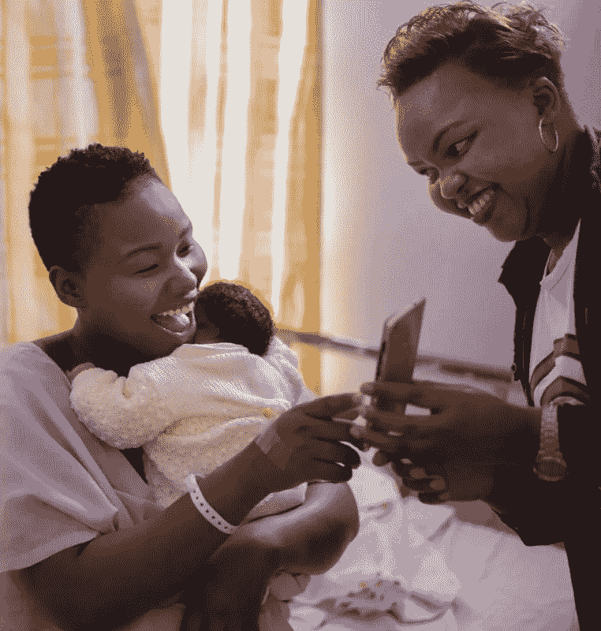
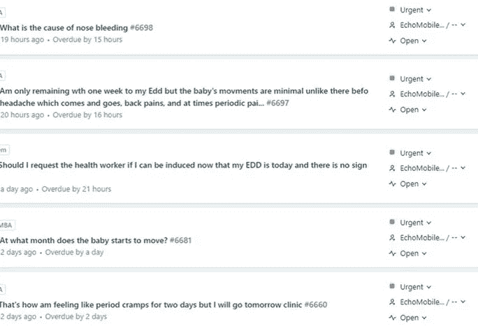

# 人工智能如何帮助肯尼亚的母亲更快地获得她们需要的护理

> 原文：<https://towardsdatascience.com/how-ai-helps-mothers-in-kenya-get-the-care-they-need-faster-eb4f05b34732?source=collection_archive---------11----------------------->

每个母亲在怀孕期间和之后都会有疑问。我应该多久感受一次宝宝的踢腿？我应该什么时候去医院？我如何知道我的新生儿是否吃饱了？在世界各地的许多地方，母亲们会与她们的提供者、朋友取得联系，或者在网上搜索这些答案。但是对于一个只受过小学教育，生活在肯尼亚农村社区，与外界的联系只是简单的功能手机的母亲来说呢？

[蓝花楹健康中心](http://jacarandahealth.org)正在努力寻找解决方案，以改善在公立医院寻求护理的低收入母亲的健康状况。我们推出了名为 PROMPTS 的短信服务，为孕妇和新妈妈提供重要信息。在很短的时间内，超过 11，000 名母亲注册了这项服务。我们最初的目标是向母亲们发送一系列经过严格测试的信息，以“提示”她们寻求护理。我们很快意识到，母亲们有她们想要答案的问题——很多问题！几乎一半的用户会对文本提示提出三到五个问题，一小部分人会提出超过 20 个问题。我们设立了一个服务台来回答这些问题(通过短信)。这些问题大多是一般性的(*“怀孕期间可以吃鳄梨吗？”*)，但我们收到的问题中至少有 30%可能需要紧急回复(*)“我在流血，我该怎么办？”*)。随着 PROMPTS 迅速扩展到全国成千上万的母亲，我们面临着一个伦理挑战:我们如何准确地回答成千上万的问题，并迅速回应紧急问题？

**使用聊天机器人？几年前，聊天机器人风靡一时，并预示着客户服务的一场革命。一个私人助理，帮你订购杂货，帮你的孩子做作业，帮你报税。大多数聊天机器人是流量机器人，或基于菜单，在寻找答案时“选择你自己的冒险”。客户服务台长期以来一直使用基于菜单的选项来指引客户找到信息来源(如果您丢失了银行卡，请按 2)。Flowbots 通过道歉和表情符号来“人性化”这种方式。最近，人工智能和聊天机器人被认为是应对全球健康挑战的解决方案(在此[进行了广泛回顾](https://www.usaid.gov/cii/ai-in-global-health))。有几种机器人解决方案可以解决妇女的生殖健康问题(Nivi、怀孕机器人、Sophie Bot、Lily)。生和阿达)。我们构建并测试了 flowbot，看看它是否能够支持我们在支持孕妇的数千个问题方面的挑战，但遇到了一些根本性的挑战，如下面的聊天机器人交互所示:**

> 用户:“一个人怎么能在不吃很多食物的情况下增加牛奶供应呢？我不想增加太多的体重，因为我已经超重了
> 
> Bot:“对不起，请回答“是”或“否”来接收关于您第一次母乳的信息

挑战 1:人类没有共同的信息组织方式。上述问题的答案应归入“体重增加/减少”还是“母乳喂养”类别？(谁没有在一系列菜单选项中迷失过，才反复按 0 找一个接线员)。

*挑战 2:流量机器人不是以客户为中心的:*记住，我们的大多数用户都有一些迫切的问题需要解答。流量机器人希望你按照预先设定的路径找到答案——这不是一个好的客户体验。

*挑战三:语言输入难以‘理解’。*我们的服务台接收英语和斯瓦希里语的问题，其中很大一部分问题是这两种语言的混合，包括含有俚语的信息。

*挑战 4:背景在客户服务中很重要，但在医疗保健中也很关键。*如果这个特定用户先问了一个关于怀孕减肥的问题，随后又透露了对母乳供应的挑战，会怎么样？为了方便而组织起来的信息很少能为良好的健康建议提供足够的上下文细节。

帮助服务台代理的人工智能。我们相信人类的存在对我们的用户来说是至关重要的，因此我们寻找一种方法来提高人类工作负载的效率。我们设计了一个“分类机器人”，它使用自然语言处理(NLP)对数千个用户问题的意图进行分类。NLP 使用机器学习以人类的方式“理解”语言。例如，疼痛可以被描述为“疼痛”、“我的一侧正在疼痛”、“一侧紧张”。一个基于 NLP 的机器人通过模式识别学习这些区别，我们的分类机器人还为意图增加了一个优先级。关于疼痛的问题被确定为高度紧急，而关于营养的问题优先级较低。

分流机器人现已整合到我们的服务台流程中。该机器人读取每个传入的问题，分配一个优先级并建议一个响应，以便我们的服务台代理可以更快、更有效地做出响应。我们不断训练分诊机器人来改进它的意图分类，但它已经在我们帮助母亲的能力方面发挥了作用。自从集成了 bot 后，我们的帮助台对紧急或高优先级问题的响应时间减少了以前的 50%，总体响应时间减少了 40%。

**经验教训。使用正确的用例，人工智能可以变得非常强大。在我们的用例中，我们发现人工智能增强了人类的活动，而不是取代人类的存在。也许有一天，分诊机器人将升级到回答关于鳄梨的问题，这样我们的服务台代理就可以更好地支持迫切需要与人接触的母亲们。**