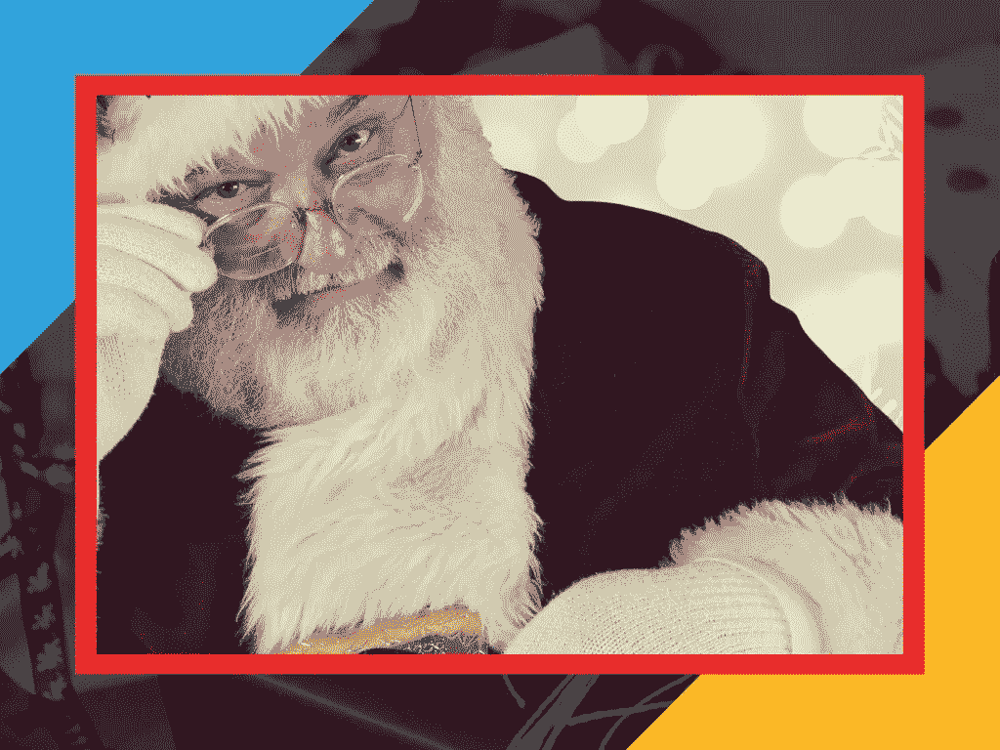
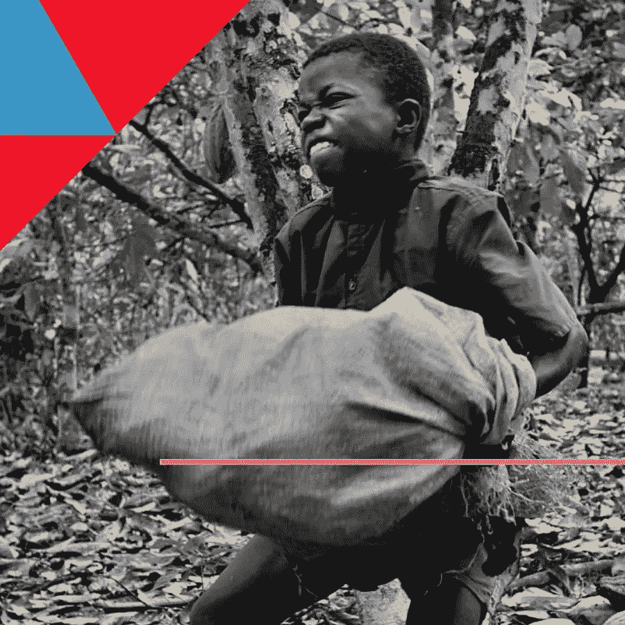
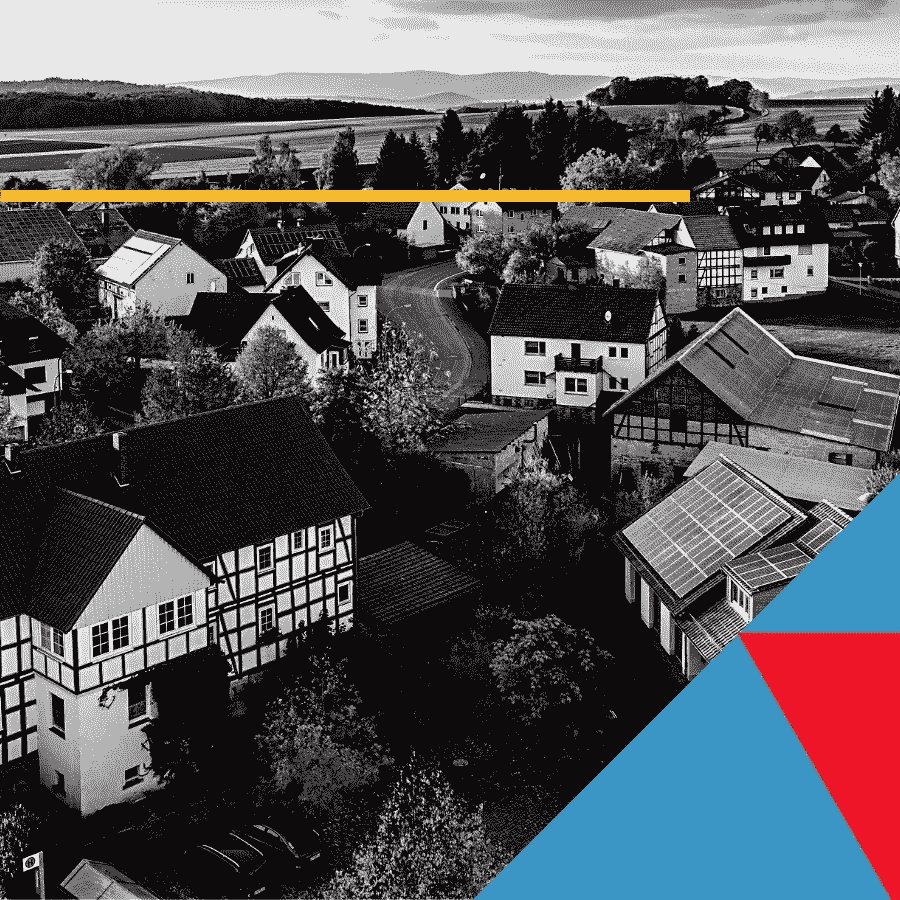
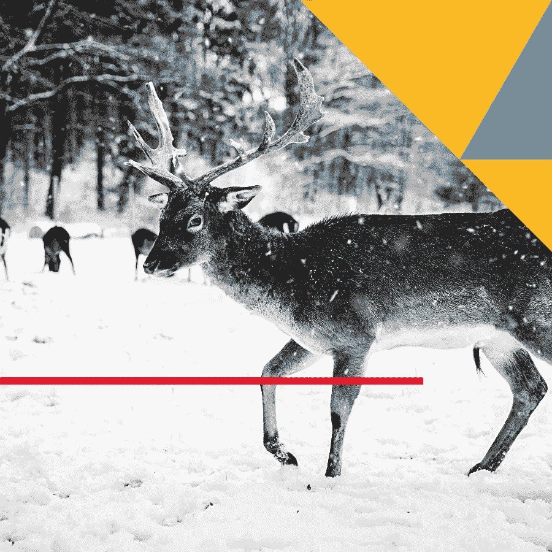
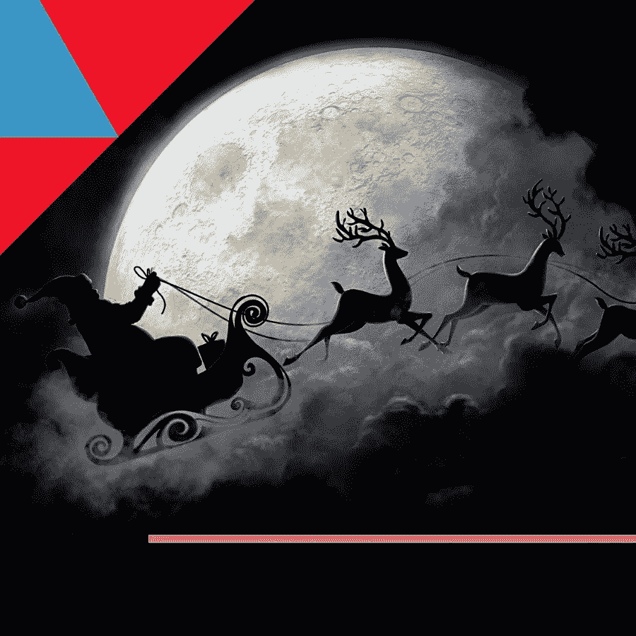

# 人工智能如何在这个假期彻底改变圣诞老人的工作室

> 原文：<https://towardsdatascience.com/how-ai-is-revolutionizing-santas-workshop-this-holiday-season-4bed707bfa48?source=collection_archive---------41----------------------->

## 当 North Pole 创始人兼首席执行官圣诞老人寻求优化其全球制造和包裹递送组织时，这位创始人转向人工智能，以在供应链中实现各种成功。

如果你有机会采访北极创始人兼首席执行官圣诞老人，不要提亚马逊。当我提到这家总部位于西雅图的在线零售巨头时，圣诞老人忍不住嘲笑了我。“请，”他说。"在杰菲还没有换尿布的时候，我就已经在送包裹了！"

虽然季节性组织可能不像亚马逊那样消耗所有的资源，但这个留着白胡子的胖子说得有道理。从中世纪开始，北极就一直在履行使命，给全世界的孩子送包裹。

> *“我们是首批获得 IBM 165 的公司之一，就在美国人口普查局之后。”—圣诞老人，北极的首席执行官。*

那么，一个有数百年历史的组织如何继续创新呢？
好吧，克劳斯先生会是第一个告诉你老公司不能总是用老方法做事的人，这就是为什么北极一直致力于与时俱进——将最新的技术解决方案引入他们的运营中，以确保他们实现目标。

“我们看到的是一个非常小的(交付)窗口。”克劳斯先生解释道。“你可以在晚上 9 点到早上 6 点之间进去，拿到树下的包裹，然后出来，如果孩子还小的话，可能是 7 点。世界各地。这是一场物流噩梦。”

起初，该组织完全是模拟的，依靠一个名副其实的簿记员和会计大军来跟踪每个包裹、每个收件人和数以千计的其他细节，以使圣诞节——嗯，*平安夜*——发生。

但随着世界的变化和技术的发展，克劳斯先生坚持尽可能高效地运营。

“我们是首批获得 IBM 165 的公司之一，就在美国人口普查局之后，”他告诉我们，他指的是首批投放市场的商用计算机之一。“它占据了一个房间的大小，但我太太不想让它呆在房子里，所以在最初的几个冬天，我们把它放在一个空的驯鹿海湾。我们的工程师冻得要死，但这让我们的 DCR 降低了 5%。”

DCR 是“失望儿童率”的北极代表——在任何给定的圣诞节都没有得到他们想要的东西的儿童的百分比。虽然克劳斯先生拒绝告诉我们他们目前的 DCR 比率是多少，但几家研究公司估计它在低位。对于一个一晚上递送超过 80 亿个包裹的组织来说，这已经不错了。

技术采用的浪潮仍在继续。80 年代是个人电脑。在 90 年代，是互联网。最近，北极开始涉足人工智能。

2017 年，该组织推出了第一个人工智能倡议，名为 ONE HORSE OPEN SL-A.I。最初的计划是部署几个系统，以便更容易地将淘气鬼从好人中分类出来(见下文)；然而，这种努力一直持续到现在。

现在，从供应链管理到人力资源，北极几乎在所有的业务中都看到了人工智能。所以，无论你想要一个官方的红色莱德，卡宾枪行动，200 射程模型气步枪还是同样疯狂的东西，人工智能都有助于从北极带给你最好的东西。

请继续阅读，了解北极如何利用人工智能完美地递送数十亿个包裹——全部在一个晚上完成。

# 人工智能预测消费者趋势

过去，北极会自己制造所有的玩具，但近年来，情况发生了变化。“你不能只是教一个小精灵做一个任天堂，”克劳斯先生解释说，这就是为什么，今天，该组织主要转向外部供应商的大部分库存。

无论是在内部生产还是在其他地方生产，北极知道今年哪些玩具会畅销是绝对必要的。“当电子鸡浪潮在 90 年代末袭来时，我们完全没有准备。“胳肢我吧，埃尔莫，”克劳斯说。但是去年，我们的人工智能很早就发现了坐立不安者的崛起。这是足够的警告，让我们有数以百万计的这些小杂种随时准备来到平安夜。"

“我们利用各种消费者数据来预测流行玩具，”圣诞老人说。“你不会想跑出去的。”

通过训练玩具趋势的预测模型，圣诞老人团队可以提前了解哪些玩具开始走俏。

# 人工智能区分好的和坏的

团队不再可能单独评估地球上每个孩子的行为，这就是为什么北极的人们现在将大部分决策留给 AI。

通过在淘气和乖孩子的数据集上训练人工智能算法，北极利用强大的 ML 分类器全年自动标记孩子。

# 人工智能将淘气的(供应商)与善良的分类

去年，圣诞老人团队推出了一个类似的淘气鬼/好人分类器，以改善他们对供应商的选择。通过分析公开可用的数据，如审计、信用评分和其他评估，North Pole 能够在与供应商签订合同之前对其进行审查。

# 人工智能跟踪仓库中的包裹

北极仓库可能是地球上最复杂的地方之一。我们谈论的是一个递送中心，其中数十亿包装好的礼物几乎没有可识别的信息。毕竟，大多数圣诞标签只有四个字:

> *给吉米，*
> 
> *爱圣诞老人。*

没有地址。没有条形码。他们怎么可能保持一切正常？

答案是 PERT[钢笔背书表示转换器]，这是一个能够在超过 990 种语言中识别手写涂鸦所有者的模型，准确率超过 97.9%。今年早些时候，谷歌开源了 PERT，并收集了大量的每个人的手写样本。

遍布仓库的摄像头在整个订单履行过程中跟踪包裹。首先，一个精灵收到物品和物品接收者的详细信息。然后，摄像机看着小精灵抓起物品，完美包装，填写礼物标签，最后将包装好的包裹放在货架上，直到平安夜。

通过监控精灵的动作并将这些动作与计算机上的原始读数联系起来，精灵能够将每个包裹与最终打开它的保罗或葆拉完美地配对。

# 我想知道你什么时候睡着了，什么时候醒着

这些歌曲让整件事看起来像魔术一样，但事实远没有那么神秘。圣诞老人团队可以以近 98%的准确率确定您的孩子是否舒适地躺在床上，只需通过旨在处理图像的机器学习算法运行您所在城镇的无人机镜头。

该系统寻找各种线索，从你房子的照明程度(比利的卧室灯亮着吗？)到有多少烟从烟囱里冒出来，然后将这些结果输入导航器。

# 人工智能保持驯鹿健康

当你的公司在偏僻的地方时，很少有外部兽医可以寻求第二意见，这就是为什么当 Dasher 或 Dancer 生病时，圣诞老人团队会求助于 AI 来帮助我们进行诊断。当现场兽医使用人工智能训练的模型时，他们会做出更好的决定，从而带来更好的结果。

# 用于路线优化的人工智能

去年，北极首次使用人工智能来帮助他们的导航员绘制圣诞老人的平安夜路线，优化他跨越时区、海洋和天气系统的路线。结果令人震惊。
通过访问关于天气、风速等的综合历史数据集。，圣诞老人团队能够完全避免不可预见的天气系统，并从他们的总旅行时间中节省了近 45 分钟。

这是一个惊人的记录——他们希望在几周内打破它。🎄

这个故事最初由曼斯普斯在 T2 出版。Manceps 帮助企业组织大规模部署 AI 解决方案。

想把人工智能带到你的运营中？下载我们的免费资源:[人工智能就绪讨论问题](https://www.manceps.com/resources/discussion-questions-for-ai-readiness?utm_source=Medium&utm_medium=Article&utm_campaign=Inbound&utm_content=Manufacturing)。该指南包含几十个发人深省的问题，将帮助你和你的团队在尝试人工智能时很好地了解可能发生的事情。